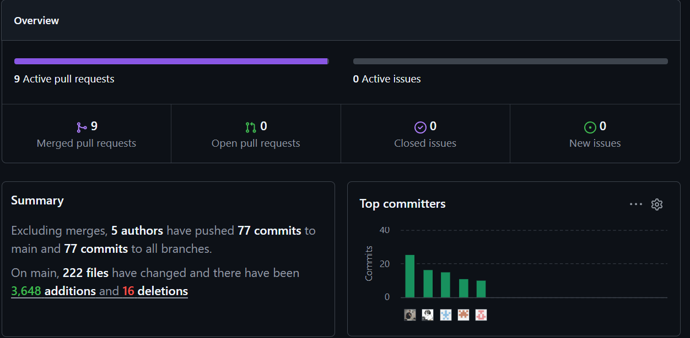

# **Project Report Collaboration Insights**

**Primera Entrega (AV1)**

El equipo elaboró el Project Report mediante un trabajo coordinado, distribuyendo las distintas secciones entre los integrantes. Cada participante aportó activamente en la redacción de contenidos, el diseño y ajuste de diagramas, la recopilación de evidencias, el control de formato y la revisión integral del documento previo a la entrega.

En paralelo, se avanzó con el diseño y construcción de la *landing page* de **StockIA**. Dicha labor quedó registrada en el informe y respaldada en su respectivo repositorio, incorporando pruebas de su implementación, despliegue técnico y alineación con la propuesta de valor de la solución.

Para la gestión colaborativa se empleó **GitHub**, plataforma que facilitó el seguimiento de modificaciones mediante *commits*, la estructuración de las tareas y el respaldo cronológico del avance, tanto del reporte como de la página web. De igual forma, las métricas de colaboración y el historial de versiones sirven como constancia de la participación de cada integrante.

Los respaldos incluidos en este apartado guardan total coherencia con el Registro de Versiones del informe, reflejando de forma precisa las actualizaciones y cambios reportados en cada iteración.

