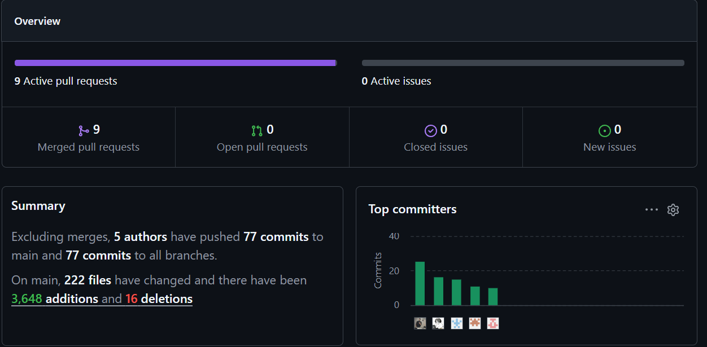
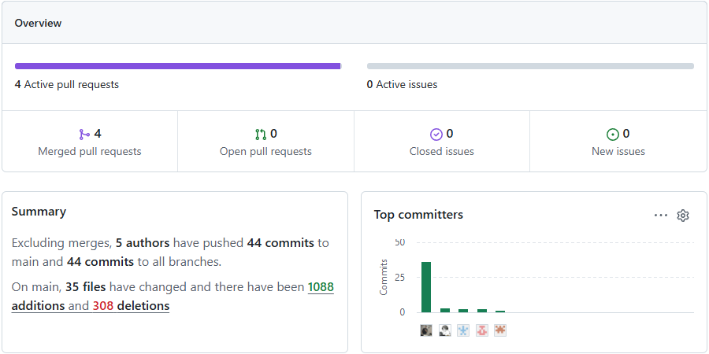

# **Project Report Collaboration Insights**

**Primera Entrega (AV1)**

El equipo elaboró el Project Report mediante un trabajo coordinado, distribuyendo las distintas secciones entre los integrantes. Cada participante aportó activamente en la redacción de contenidos, el diseño y ajuste de diagramas, la recopilación de evidencias, el control de formato y la revisión integral del documento previo a la entrega.

En paralelo, se avanzó con el diseño y construcción de la *landing page* de **StockIA**. Dicha labor quedó registrada en el informe y respaldada en su respectivo repositorio, incorporando pruebas de su implementación, despliegue técnico y alineación con la propuesta de valor de la solución.

Para la gestión colaborativa se empleó **GitHub**, plataforma que facilitó el seguimiento de modificaciones mediante *commits*, la estructuración de las tareas y el respaldo cronológico del avance, tanto del reporte como de la página web. De igual forma, las métricas de colaboración y el historial de versiones sirven como constancia de la participación de cada integrante.

Los respaldos incluidos en este apartado guardan total coherencia con el Registro de Versiones del informe, reflejando de forma precisa las actualizaciones y cambios reportados en cada iteración.

**Segunda Entrega (TB1)**

El equipo desarrolló la segunda entrega (TB1) mediante un trabajo colaborativo y coordinado, organizando las actividades y distribuyendo las responsabilidades entre los integrantes para cumplir con los objetivos establecidos. Durante esta etapa, se realizó el seguimiento de los avances, la revisión de los entregables y la consolidación de los resultados obtenidos, procurando mantener la coherencia entre la documentación, los requerimientos del proyecto y la solución propuesta.

Asimismo, se llevó a cabo el **Sprint 2**, en el cual se continuó con la planificación, implementación y mejora de las funcionalidades de StockIA. A través de esta iteración, el equipo trabajó en el desarrollo progresivo de la solución, atendiendo los requerimientos identificados y buscando fortalecer la estructura, funcionalidad y experiencia de usuario de la aplicación. Las actividades realizadas permitieron dar continuidad al trabajo iniciado en la entrega anterior y avanzar hacia una versión más completa e integrada del sistema.

De igual manera, se realizó el desarrollo de la **Web Application de StockIA**, trasladando los avances de diseño y planificación a una solución funcional. Este trabajo comprendió la implementación de los componentes de la interfaz, la organización de las vistas y la incorporación progresiva de las funcionalidades previstas para el sistema, manteniendo la alineación con la propuesta de valor del proyecto. Los avances obtenidos representan un paso importante en la construcción de la plataforma y en la consolidación de sus principales características.

Para gestionar el trabajo colaborativo y mantener un registro ordenado del desarrollo, se continuó utilizando GitHub como herramienta de control de versiones. Mediante el uso de ramas, commits y la integración de cambios, fue posible realizar un seguimiento de las modificaciones efectuadas durante el Sprint 2, conservar el historial de desarrollo y facilitar la coordinación entre los integrantes. Asimismo, el repositorio constituye un respaldo del trabajo realizado y permite evidenciar la evolución progresiva de la aplicación web.

Finalmente, las evidencias recopiladas para esta entrega respaldan las actividades desarrolladas, los avances del Sprint 2 y la implementación de la Web Application. Estos registros mantienen coherencia con el historial de versiones y la documentación del proyecto, permitiendo demostrar la continuidad del proceso de desarrollo, la participación colaborativa del equipo y el cumplimiento de los objetivos correspondientes a la segunda entrega (TB1).

