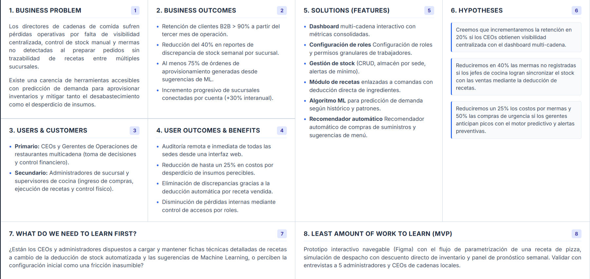

# **Chapter I: Introduction**
## **1.1. Startup Profile**

### **1.1.1. Startup Description**
DataBite Corp es una startup tecnológica innovadora que aunque su creacion es reciente su enfoque está en liderar la transformación digital del sector gastronómico en el país y Latinoamérica. Nuestro enfoque principal radica en el desarrollo de soluciones de software as a Service (SaaS) que integran analítica predictiva asistida por Machine Learning (ML) y tecnologías de Internet de las Cosas (IoT).

Nacemos con el propósito de democratizar el acceso a herramientas tecnológicas avanzadas para pequeñas y medianas cadenas de restaurantes, permitiendo optimizar sus operaciones y tomar decisiones basadas en datos en tiempo real. A través de nuestro producto estrella, "StockIA", buscamos resolver problemas críticos de la industria como el descontrol de inventarios, los quiebres de stock y las mermas financieras. Nos motiva generar un impacto directo tanto económico como ambiental, ayudando a las empresas a reducir el desperdicio de alimentos y a maximizar sus márgenes de rentabilidad, todo centralizado en un ecosistema web unificado, accesible y altamente escalable.

### **1.1.2. Team Member Profiles**

<table width="100%">
  <tbody>
    <tr>
      <td width="30%" align="center" valign="middle">
        
         
        <i></i>
      </td>
      <td width="70%" valign="top" style="padding-left: 20px;">
        <h3>Alonso Enrique Higa Kohatsu</h3>
        
<b>Código de estudiante:</b> u202416276

        
<b>Edad:</b> 20 años

        
<b>Carrera:</b> Ingeniería de Software

         
        
<b>Sobre mí:</b>

        
Me apasiona la tecnología y aprender cosas nuevas. Tengo conocimientos en C++ y un poco de Python y actualmente estoy enfocado en el aprendizaje de desarrollo web con Spring Boot. Me considero una persona curiosa, en constante aprendizaje y firmemente comprometido con el logro de mis objetivos profesionales y personales.

      </td>
    </tr>
    <tr>
      <td width="30%" align="center" valign="middle">
        
         
        <i></i>
      </td>
      <td width="70%" valign="top" style="padding-left: 20px;">
        <h3></h3>
        
<b>Código de estudiante: u202416272</b> 

        
<b>Edad: 19 </b> 

        
<b>Carrera: Ingeniería de Software </b> 

         
        
<b>Sobre mí:</b>

        
Soy Martin Alejandro Asmat Alminco, estudiante de quinto ciclo de la carrera de Ingeniería de Software. Cuento con experiencia en lenguajes de programación como Python y C++ para proyectos enfocados en el desarrollo de habilidades computacionales, las cuales apliqué en proyectos académicos enfocados en solucionar un problema a través de procesos de documentación de Ingeniería de software.
        Dentro del equipo, cumplo el rol de un full stack al realizar actividades de documentación y programación a un nivel medio. Considero que soy una persona responsable y adaptable a distintas situaciones con buen time-management.

      </td>
    </tr>
    <tr>
      <td width="30%" align="center" valign="middle">
        
         
        <i></i>
      </td>
      <td width="70%" valign="top" style="padding-left: 20px;">
        <h3>Kiara Lucia Tuesta Girón</h3>
        
<b>Código de estudiante: u20251i477</b> 

        
<b>Edad: 21</b> 

        
<b>Carrera: Ingeniería de Software</b> 

         
        
<b>Sobre mí:</b>  Me llamo Kiara Lucia Tuesta Girón, estudio Ingeniería de Software y me apasiona la tecnología y aprender cosas nuevas constantemente. Tengo conocimientos en C++, Python y muchas ganas de seguir aprendiendo. Me considero una persona curiosa, responsable, adaptable a los cambios y con una buena gestión del tiempo para cumplir mis metas. En los proyectos de la universidad disfruto involucrarme en todo el proceso, desde la documentación hasta la programación y búsqueda de soluciones en equipo.

        

      </td>
    </tr>
    <tr>
      <td width="30%" align="center" valign="middle">
        
         
        <i></i>
      </td>
      <td width="70%" valign="top" style="padding-left: 20px;">
        <h3></h3>
        
<b>Código de estudiante: </b> 

        
<b>Edad: </b> 

        
<b>Carrera: </b> 

         
        
<b>Sobre mí:</b>

        

      </td>
    </tr>
    <tr>
      <td width="30%" align="center" valign="middle">
        
         
        <i></i>
      </td>
      <td width="70%" valign="top" style="padding-left: 20px;">
        <h3></h3>
        
<b>Código de estudiante: </b> 

        
<b>Edad: </b> 

        
<b>Carrera: </b> 

         
        
<b>Sobre mí:</b>

        

      </td>
    </tr>
  </tbody>
</table>

## **1.2. Solution Profile**
### **1.2.1 Background and Problem Statement**
En el día a día, la gestión de restaurantes especialmente cuando el negocio crece y suma nuevas sucursales se ha convertido en un verdadero dolor de cabeza logístico. Hoy en día, la mayoría de los locales intentan resolver su operatividad usando sistemas de punto de venta que, si bien cumplen su función transaccional al momento de cobrar, operan de forma aislada y no se comunican con la gestión real del almacén. Es crucial destacar que la solución a este problema no pasa por reemplazar el POS actual ni crear un nuevo sistema de ventas, sino por aprovechar la información que estos ya generan.  

El desperdicio alimentario y la ineficiencia detrás de esta desconexión son problemas estadísticamente comprobados. Según el Programa de las Naciones Unidas para el Medio Ambiente (PNUMA, 2024), en América Latina se desperdician millones de toneladas de alimentos al año. En la industria restaurantera, diversos estudios revelan que los locales tiran a la basura entre el 4% y el 10% de todos los alimentos que compran (Gunders et al., 2017). A pesar de estas enormes pérdidas, los restaurantes se ven obligados a llevar el control en cuadernos o excels aislados porque no existe una "capa de inteligencia" accesible que reciba los datos de ventas de sus sistemas actuales, los procese mediante Machine Learning y les diga exactamente qué y cuándo comprar para evitar que falten ingredientes o se echen a perder.

**5Ws & 2Hs**

| Elemento | Preguntas | Definición |
|---|---|---|
| **(“Who?”) ¿Quién?** | ¿Quién sufre este problema? | Los administradores de los restaurantes y sucursales, quienes están en la "primera línea" administrando y lidiando con las compras, el inventario y el personal. |
| **(“What?”) ¿Qué?** | ¿Cuál es el problema exacto? | Sufren de pérdidas económicas porque las herramientas de ventas actuales no les dan una visión operativa real. Al depender de un control de stock manual, se enfrentan a mermas invisibles ya que no existe un ecosistema que reciba el dato de la venta y descuente automáticamente los ingredientes usados. |
| **(“Where?”) ¿Dónde?** | ¿Dónde ocurre el problema? | Nace en los almacenes y en el ajetreo de las cocinas de las sucursales, pero termina impactando directamente en la caja registradora y en la oficina de administración. |
| **(“When?”) ¿Cuándo?** | ¿Cuándo sucede el problema? | Ocurre todos los días cada vez que el sistema de ventas emite un ticket sin que el inventario se entere, y explota en los momentos de crisis cuando descubren que falta un insumo clave y tienen que salir a comprarlo de urgencia. |
| **(“Why?”) ¿Por qué?** | ¿Por qué ocurre este problema? | Porque las soluciones actuales se quedan solo en la transacción de la venta y mantienen el resto de los procesos logísticos desconectados. Los administradores no cuentan con una herramienta predictiva que se alimente de ese historial de ventas para recomendarles automáticamente su próxima compra. |
| **(“How?”) ¿Cómo?** | ¿Cómo se evidencia el problema? | Se nota rápidamente en el descontrol de los almacenes, en los errores humanos al llenar los reportes semanales y en la frustración del administrador al detectar pérdidas de insumos por la falta de roles y permisos digitales en la cocina. |
| **(“How Much?”) ¿Cuánto?** | ¿Cuánto impacto económico o de tiempo representa? | El impacto es enorme. Puede representar hasta un 25% en costos evitables solo por el desperdicio de comida perecible y las compras no planificadas. Además, un administrador llega a perder hasta el 15% de su jornada laboral tratando de cuadrar inventarios manualmente (Cullen, 2021). |

#### Objetivo del proyecto:
Nuestro objetivo principal es crear y lanzar una plataforma web (Web Application) respaldada por un API RESTful propio, diseñada para actuar como el "cerebro" operativo de los restaurantes. Nuestra plataforma está diseñada para recibir los datos de ventas, vincularlos con las recetas y descontar los ingredientes por sí sola. Adicionalmente, el sistema usará esa información histórica y modelos de Machine Learning para predecir la demanda futura.

### 1.2.2. **Lean UX Process**

#### 1.2.2.1. Lean UX Problem Statements.

##### Problem Statement:

The current state of  la gestión de restaurantes y la administración de servicios de alimentación multiunidad has focused mainly on los gerentes generales de restaurantes, supervisores de sucursales y personal administrativo, abordando puntos problemáticos como los registros manuales de inventario, las operaciones de punto de venta no integradas y la comunicación fragmentada entre sucursales mediante software de escritorio aislado o registros de cocina basados en papel.

What existing products/services fail to address is un mecanismo integrado y en tiempo real para regular la automatización de múltiples cadenas con trazabilidad centralizada del inventario, deducción automatizada de ingredientes de recetas por cada venta e inteligencia predictiva basada en la demanda histórica para prevenir quiebres de stock y desperdicio de alimentos entre distintas ubicaciones.

Our product/service will address this gap by ofreciendo un ecosistema web unificado de gestión multi-cadena que vincula el inventario de las sucursales con las recetas de los platos (deduciendo automáticamente los ingredientes al momento de crear una orden), aplica seguridad basada en roles de acceso, proporciona dashboards de monitoreo operativo y utiliza modelos de Machine Learning para pronosticar la demanda de los clientes y generar recomendaciones automatizadas de reposición de inventario.

Our initial focus will be los CEOs y gerentes generales de operaciones de cadenas de servicios de alimentación en crecimiento (2 o más ubicaciones) que buscan estandarización operativa, reducción de desperdicios y supervisión en tiempo real.

We’ll know we are successful when we see los siguientes comportamientos medibles en nuestro público objetivo:

1. Una reducción del 40% en los reportes semanales de discrepancias de inventario en todas las sucursales conectadas durante los primeros 60 días posteriores a la incorporación.
2. Al menos el 75% de las órdenes de compra de suministros programadas están siendo generadas directamente a partir de las recomendaciones automatizadas de reposición mediante ML.
3. Interacción semanal activa con los dashboards por parte de más del 85% de los CEOs/gerentes de operaciones de restaurantes inscritos.

---

#### 1.2.2.2. Lean UX Assumptions.

##### 1. Business Assumptions
- Creemos que existe una demanda creciente por parte de pequeñas y medianas cadenas de restaurantes que buscan transformar digitalmente sus operaciones para evitar mermas financieras causadas por el descontrol de inventario.  
- Creemos que nuestro modelo de negocio basado en suscripción mensual (SaaS B2B por sucursal conectada) es económicamente viable y atractivo para los directores y dueños de cadenas de comida.  
- Creemos que la ventaja competitiva clave frente a soluciones tradicionales radica en la incorporación de analítica predictiva asistida por Machine Learning sin requerir configuraciones complejas de software empresarial costoso.  
- Creemos que las cadenas de restaurantes están dispuestas a migrar sus recetas e inventarios a un entorno web seguro en la nube para obtener visibilidad centralizada.  

##### 2. Business Outcome Assumptions
- Creemos que lograremos una tasa de retención mensual (Gross Retention Rate) superior al 90% en clientes que utilicen el sistema durante al menos tres meses continuos.  
- Creemos que reduciremos el costo de adquisición de clientes (CAC) apalancándonos en el boca a boca y casos de estudio demostrables sobre reducción de desperdicio de comida.  
- Creemos que alcanzaremos una tasa de conversión de prueba piloto a contrato de pago del 25% al demostrar el impacto de las alertas predictivas de reabastecimiento.  
- Creemos que el valor de vida del cliente (LTV) se incrementará progresivamente a medida que cada cadena incorpore nuevas sucursales a la misma cuenta corporativa.  

##### 3. User Assumptions
- Creemos que nuestro usuario principal es el CEO / Gerente General de Cadena Gastronómica, quien toma decisiones estratégicas, supervisa la rentabilidad global y requiere auditoría remota en tiempo real.  
- Creemos que nuestro usuario secundario operativo es el Administrador / Jefe de Cocina de Sucursal, responsable de la recepción de insumos físicos, ejecución de recetas y validación de stocks en cocina.  
- Creemos que los CEOs valoran interfaces web ejecutables desde cualquier navegador moderno, con paneles visuales limpios, gráficos de tendencias y control estricto de roles para su personal.  

##### 4. User Outcome and Benefit Assumptions
- Creemos que los CEOs lograrán visibilidad integral e inmediata del estado de inventario, consumo de ingredientes y actividad del personal en todas las sucursales sin depender de llamadas o reportes manuales en hojas de cálculo.  
- Creemos que los restaurantes reducirán el desperdicio de alimentos perecibles hasta en un 25% al ajustar sus compras y producción a las proyecciones de demanda de comensales.  
- Creemos que los administradores eliminarán el margen de error humano en el control de mermas gracias a la deducción automática de ingredientes por receta vendida.  
- Creemos que los líderes del negocio mitigarán pérdidas financieras no autorizadas mediante la restricción de privilegios por roles de trabajo.

---

#### 1.2.2.3. Lean UX Hypothesis Statements.

- **Hipótesis 1:** Creemos que lograremos un aumento del 20% en la retención semanal de la plataforma por parte de los ejecutivos de restaurantes sii los CEOs y gerentes de operaciones de restaurantes Obtienen visibilidad instantánea y consolidada de los niveles de inventario y el rendimiento de las ventas en todas las sucursales Con un dashboard operativo interactivo para múltiples cadenas.
- **Hipótesis 2:** Creemos que lograremos una reducción del 30% en los incidentes de seguridad y los reportes de pérdidas internas si los CEOs de restaurantes y gerentes de tiendaObtienen delegación segura de tareas y control detallado sobre las operaciones críticas de inventario con un sistema de gestión de configuración de roles y permisos.
- **Hipótesis 3:** Creemos que lograremos una disminución del 35% en las discrepancias de las auditorías manuales de inventario si los gerentes de tienda y operadores de inventario Obtienen un seguimiento rápido y sin errores de las entradas, transferencias y modificaciones de materias primas con un módulo centralizado de gestión de inventario en tiempo real.

#### **1.2.2.4. Lean UX Canvas**

<td width="30%" align="center" valign="middle">
        
         
        <i>Gráfico 2. LEAN UX Process Canvas - Elaboración propia.</i>
      </td>

## **1.3. Target Segments**

Luego de aplicar el proceso de validación y empatizar con los dolores operativos del rubro gastronómico, StockIA ha delimitado su alcance para enfocarse en un único segmento objetivo. Hemos identificado que la verdadera transformación digital debe ocurrir en la "primera línea" operativa, es decir, en manos de quienes gestionan el negocio día a día. 

**Segmento Único: Administradores de Restaurante y Jefes de Sucursal** 

StockIA se enfoca exclusivamente en los administradores de restaurante y jefes de sucursal, profesionales dinámicos de 25 a 45 años que dependen de sus dispositivos para gestionar la operación diaria. Estos usuarios sufren un alto estrés operativo al invertir entre 8 y 10 horas semanales en conteos manuales de inventario y lidiar con un sector que desperdicia entre el 4% y el 10% de sus insumos (Lopez, 2025). Al no contar con una herramienta que deduzca automáticamente los ingredientes vendidos, se ven obligados a realizar compras basadas en la intuición (Lopez, 2025), lo que genera constantes quiebres de stock o mermas por excesos que impactan negativamente la rentabilidad financiera del negocio.  Para resolver estos dolores, estos administradores buscan en StockIA una plataforma que actúe como un asistente ágil y proactivo. Su expectativa principal es que el sistema reciba los datos de ventas y descuente automáticamente los insumos sin requerir intervención manual. Además, necesitan aprovechar la tecnología de Machine Learning para recibir alertas predictivas de reposición directamente en canales rápidos como WhatsApp, todo esto operando bajo un entorno digital seguro que les permita delegar responsabilidades en la cocina mediante una estricta configuración de roles y permisos.

| Característica | Descripción |
|---|---|
| **Edad** | Predominantemente entre los 25 y 45 años |
| **Ubicación** | Zonas urbanas del Perú |
| **Género** | Masculino y Femenino |
| **Nivel socioeconómico** | medio - alto |
| **Perfil tecnológico** | Intermedio - alto |
| **Dispositivos Utilizados** | Teléfonos inteligentes, ordenadores y dispositivos IOT |
| **Objetivo principal** | Monitorear y optimizar los procesos en los restaurantes o sitios de comida. |

