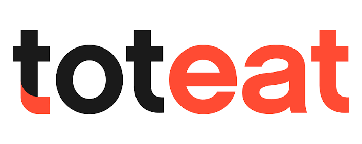
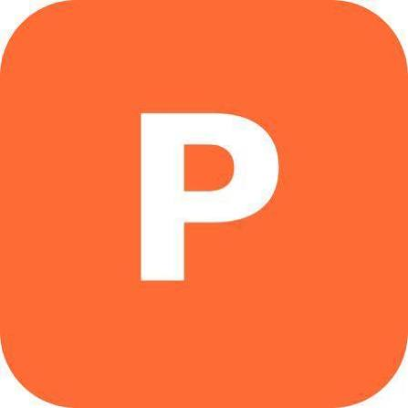
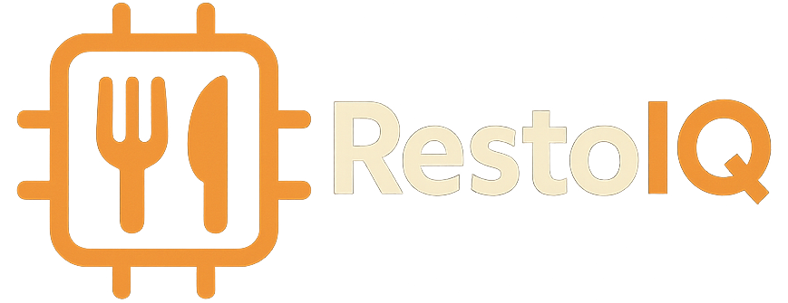
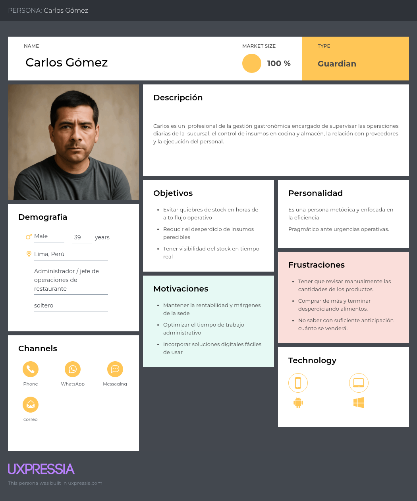
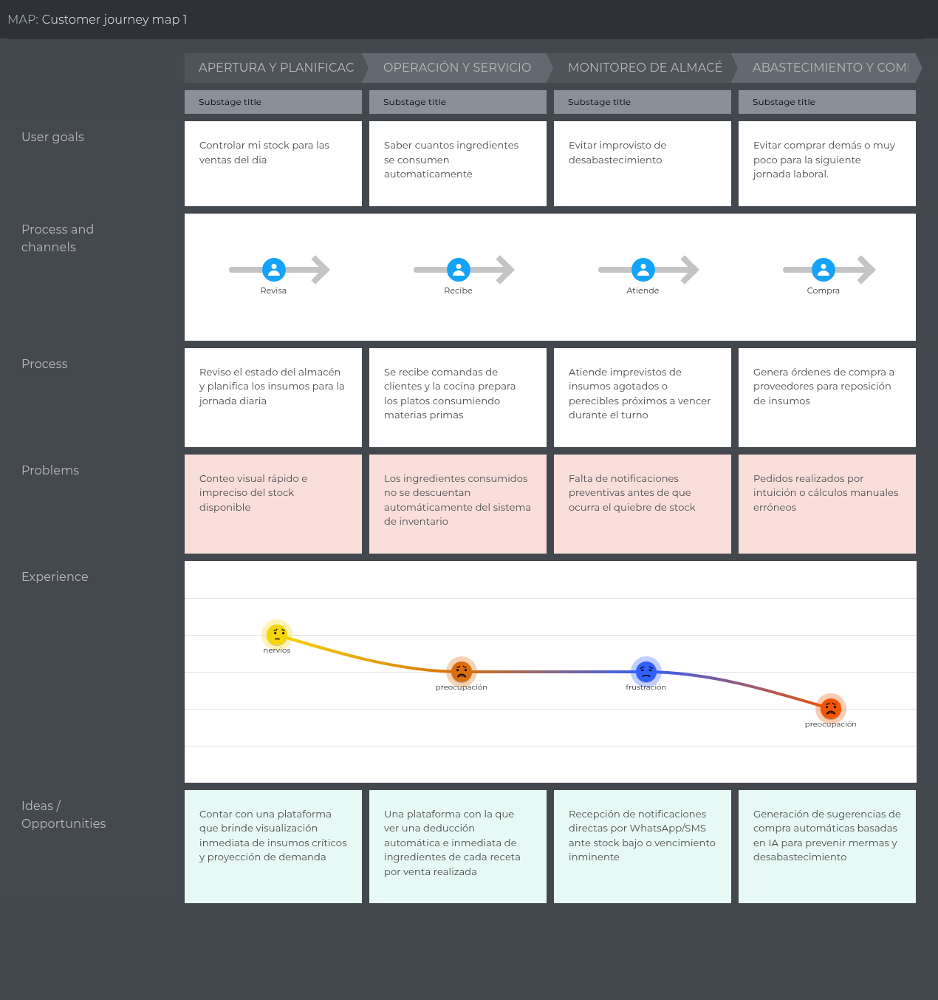
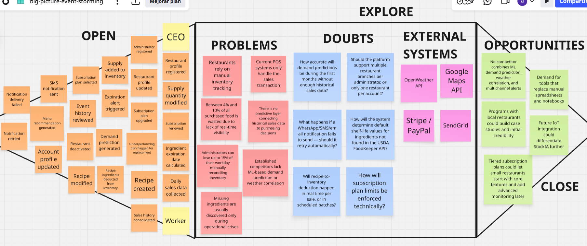

# **Chapter II: Requirements Elicitation & Analysis**
## **2.1. Competitors**
Esta sección tiene como objetivo que nuestra startup conozca mejor a sus competidores, en contraste con la idea inicial que se pudiera tener sobre ellos. Para ello se desarrolla el siguiente Landscape, comparando el perfil, la propuesta de valor y el perfil de marketing y producto de STOCKIA frente a Toteat, Panca Software y RestoIQ.

### **2.1.1. Competitive Analysis**

<table width="100%">
  <thead>
    <tr>
      <th align="left" width="100%">
        Competitive Analysis Landscape
      </th>
    </tr>
    <tr>
      <th align="left" width="20%">
        ¿Por qué llevar a cabo este análisis?
      </th>
      <th colspan="4" align="left">
        Este cuadro nos va a servir para identificar cómo se posicionan actualmente los principales competidores en el mercado de gestión de restaurantes, con el fin de reconocer sus fortalezas reales, detectar vacíos funcionales especialmente en predicción de demanda con Machine Learning, correlación con clima, monitoreo IoT de equipos y automatización de alertas vía WhatsApp y definir con evidencia la ventaja competitiva y la estrategia de diferenciación de nuestra startup.
      </th>
    </tr>
    <tr>
      <th align="left"></th>
      <th align="center">
        STOCKIA 
        
      </th>
      <th align="center">
        Toteat 
        
      </th>
      <th align="center">
        Panca Software 
        
      </th>
      <th align="center">
        RestoIQ 
        
      </th>
    </tr>
  </thead>
  <tbody>
    <tr>
      <th colspan="5" align="left">Perfil</th>
    </tr>
    <tr>
      <td><b>Overview</b></td>
      <td>Es una startup en etapa de desarrollo que ofrece una plataforma web de gestión inteligente de inventario para restaurantes, con predicción de demanda basada en Machine Learning, integración con clima, monitoreo IoT de equipos de cocina y ocupación, y alertas automáticas vía WhatsApp.</td>
      <td>Software SaaS todo-en-uno para restaurantes, de origen chileno, con fuerte presencia en Chile, México y LATAM. Cubre POS, KDS, delivery, reservas, inventario y facturación electrónica.</td>
      <td>Software de gestión para restaurantes de origen peruano, enfocado en pedidos, cocina, inventario y facturación electrónica SUNAT, pensado específicamente para la realidad tributaria y operativa local.</td>
      <td>Plataforma de gestión de inventario y reducción de desperdicio de alimentos con IA, dirigida a restaurantes, hoteles, bares y cafés, con fuerte enfoque en predicción de demanda y automatización de compras.</td>
    </tr>
    <tr>
      <td><b>Ventaja Competitiva ¿Qué valor ofrece a los clientes?</b></td>
      <td>Único que combina ML predictivo + variable climática + IoT físico (sensores de ocupación y de electrodomésticos) + notificaciones directas a WhatsApp del personal en una sola plataforma.</td>
      <td>Ecosistema todo-en-uno con alta adopción y reconocimiento de marca en LATAM.</td>
      <td>Adaptación total a la normativa peruana (SUNAT, IGV) y facilidad de implementación (5 minutos), con soporte 100% en español y precios muy accesibles.</td>
      <td>Pionero regional en IA aplicada específicamente a inventario y desperdicio, con modelo de forecasting propio (7-day forecast) y transparencia total de precios.</td>
    </tr>
    <tr>
      <th colspan="5" align="left">Perfil de Marketing</th>
    </tr>
    <tr>
      <td><b>Mercado Objetivo</b></td>
      <td>Restaurantes medianos y cadenas en Perú/LATAM que buscan optimizar compras e inventario con tecnología predictiva, con foco inicial en un segmento piloto local.</td>
      <td>Restaurantes, dark kitchens, cafeterías, bares y cadenas en toda Latinoamérica</td>
      <td>Restaurantes de todo tipo en Perú como pollerías, cevicherías, chifas, cafeterías, fast food.</td>
      <td>Restaurantes, hoteles, bares y cafés, con expansión hacia mercados de habla inglesa y mercado hotelero multi-outlet.</td>
    </tr>
    <tr>
      <td><b>Estrategias de Marketing</b></td>
      <td>Marketing de contenidos enfocado en ahorro cuantificable (mermas, compras de emergencia), demos gratuitas y casos de éxito locales.</td>
      <td>Demos gratuitas, casos de éxito con métricas, presencia en blog corporativo y campañas por país (México, Chile, Argentina, Colombia).</td>
      <td>Blog educativo (food cost, regímenes SUNAT), prueba gratuita de 14 días, testimonios de dueños de restaurantes peruanos, precios publicados abiertamente.</td>
      <td>Prueba gratuita de 14 días sin tarjeta, transparencia de precios como diferenciador frente a competidores que "esconden precios tras llamadas de ventas", marketing basado en ROI.</td>
    </tr>
    <tr>
      <th colspan="5" align="left">Perfil del producto</th>
    </tr>
    <tr>
      <td><b>Productos & Servicios</b></td>
      <td>Dashboard, gestión de stock y recetas con descuento automático, predicción de demanda con ML, recomendaciones automáticas de compra, alertas por WhatsApp, integración con clima, sensores IoT de ocupación y de electrodomésticos, gestión de roles y planes de pago.</td>
      <td>POS, KDS, Menú QR, gestión de mesas y reservas, integración con apps de delivery, control de inventario, facturación electrónica, reportes en tiempo real.</td>
      <td>POS/gestión de pedidos, carta digital, facturación electrónica SUNAT, control de inventario avanzado, food cost automático, reportes inteligentes.</td>
      <td>Predicción de demanda, automatización de órdenes de compra, registro de mermas, dashboards con 12+ gráficos, gestión multi-outlet para hoteles.</td>
    </tr>
    <tr>
      <td><b>Precios & Costos</b></td>
      <td>Modelo SaaS por suscripción mensual con planes escalonados.</td>
      <td>Precios no publicados abiertamente, requiere agendar demo/cotización personalizada.</td>
      <td>Desde S/99/mes (Plan Básico) hasta S/119/mes (Plan Profesional, incluye inventario avanzado).</td>
      <td>Desde $49/mes, precios publicados abiertamente sin costos de setup ocultos.</td>
    </tr>
    <tr>
      <td><b>Canales de distribución (Web y/o Mobile)</b></td>
      <td>Aplicación web</td>
      <td>Mobile application y web platform.</td>
      <td>Mobile application y web platform.</td>
      <td>Mobile application y web platform.</td>
    </tr>
    <tr>
      <th colspan="5" align="left">SWOT Analysis</th>
    </tr>
    <tr>
      <td><b>Fortalezas</b></td>
      <td>Único competidor que combina ML predictivo, variable climática (OpenWeather) e IoT físico en un solo producto.</td>
      <td>Alta adopción y reconocimiento de marca en LATAM (+5,000 restaurantes).</td>
      <td>Fuerte adaptación a la normativa peruana (SUNAT, IGV), un factor crítico de decisión de compra en el mercado local.</td>
      <td>Uso real y ya validado de IA (modelo propio de forecast a 7 días) para predicción de demanda y reducción de desperdicio.</td>
    </tr>
    <tr>
      <td><b>Debilidades</b></td>
      <td>Producto nuevo, sin base instalada de clientes ni casos de éxito.</td>
      <td>No cuenta con predicción de demanda basada en Machine Learning ni con modelos que consideren variables externas como el clima.</td>
      <td>Sin predicción de demanda basada en históricos de ventas ni en Machine Learning.</td>
      <td>No integra variables climáticas externas (OpenWeather) en su modelo predictivo.</td>
    </tr>
    <tr>
      <td><b>Oportunidades</b></td>
      <td>Ningún competidor identificado integra simultáneamente clima + IoT + ML + WhatsApp; existe un vacío claro de mercado.</td>
      <td>Podría integrar módulos de IA en el futuro apalancándose en su gran volumen de datos históricos de +5,000 restaurantes.</td>
      <td>Podría expandir su módulo de inventario hacia analítica predictiva, dado que ya tiene base de datos de ventas e inventario de sus +150 clientes.</td>
      <td>Podría integrar IoT y clima en próximas versiones dado que ya cuenta con un modelo de ML funcionando en producción.</td>
    </tr>
    <tr>
      <td><b>Amenazas</b></td>
      <td>Competidores establecidos (Toteat, Panca) podrían incorporar módulos de ML o IoT en el corto plazo, dado que ya cuentan con base de clientes y datos históricos.</td>
      <td>Startups especializadas (como la nuestra) que ofrezcan predicción inteligente de inventario podrían captar clientes que buscan ir más allá del POS/facturación.</td>
      <td>Clientes que buscan optimización avanzada de compras (no solo control básico de stock) podrían migrar hacia soluciones con IA, como la nuestra.</td>
      <td>Una startup local (como la nuestra) con adaptación regional, integración IoT y WhatsApp podría desplazarlo en mercados LATAM donde RestoIQ aún no tiene presencia ni localización.</td>
    </tr>
  </tbody>
</table>

### **2.1.2. Strategies and Tactics Against Competitors**
## Fortalezas

- **Predicción de demanda con Machine Learning y clima**

  A diferencia de Toteat y Panca, que se enfocan principalmente en reportes históricos y alertas sobre el inventario, StockIA analiza las ventas, la asistencia y las condiciones climáticas para predecir la demanda. Esto permite que el administrador pueda anticipar sus necesidades de insumos y evitar problemas de falta o exceso de stock.

- **Notificaciones automáticas por diferentes canales**

  StockIA busca diferenciarse mediante el envío de alertas por WhatsApp, SMS y correo electrónico. Las recomendaciones operativas pueden enviarse por WhatsApp, mientras que las alertas de mayor prioridad pueden enviarse mediante SMS. El correo permite mantener un registro de las notificaciones recibidas. De esta manera, el personal no necesita ingresar constantemente al sistema para revisar el estado del inventario.

## Debilidades

- **Poca presencia en el mercado**

  Al ser una startup nueva, StockIA todavía no cuenta con una base de clientes ni con el reconocimiento que tienen empresas como Toteat y Panca. Para reducir esta desventaja, se pueden realizar pilotos gratuitos con algunos restaurantes. Esto permitiría obtener resultados reales y demostrar cómo la solución puede ayudar a reducir el desperdicio y los problemas de stock.

- **Dependencia de datos históricos para el modelo de Machine Learning**

  El modelo de predicción de StockIA necesita información sobre las ventas del restaurante para generar resultados más precisos. Durante las primeras etapas puede existir poca información disponible. Para solucionar esto, el sistema puede utilizar reglas básicas relacionadas con los niveles de stock y los patrones de venta mientras recopila suficientes datos para mejorar sus predicciones.

## Oportunidades

- **Integración de IoT y datos climáticos**

  Existe una oportunidad para diferenciar StockIA mediante la integración de sensores IoT con información climática y predicción de demanda. Esto permitiría obtener información más completa sobre el funcionamiento del restaurante y mejorar la toma de decisiones relacionadas con el inventario.

- **Creciente digitalización del sector gastronómico**

  Cada vez más restaurantes están reemplazando métodos manuales como cuadernos y hojas de Excel por sistemas digitales de gestión. Esta situación representa una oportunidad para StockIA, especialmente en restaurantes que ya utilizan sistemas de venta pero todavía realizan la gestión de inventario y compras de manera manual o reactiva.

## Amenazas

- **Competidores establecidos que incorporen IA o IoT**

  Empresas como Toteat y Panca ya cuentan con una gran cantidad de clientes y datos históricos. Esto podría facilitar que desarrollen funciones de predicción de demanda utilizando inteligencia artificial. Frente a esta situación, StockIA debe enfocarse en desarrollar rápidamente su producto y mantener una especialización en la gestión predictiva del inventario.

- **Resistencia al cambio y costo del hardware IoT**

  Algunos restaurantes pequeños pueden considerar que la instalación de sensores IoT representa un costo adicional o una implementación complicada. Para reducir esta barrera, StockIA puede ofrecer las funciones principales de predicción y notificaciones desde el plan básico. La integración de sensores puede mantenerse como una opción adicional para los restaurantes que necesiten un mayor nivel de monitoreo.

## **2.2. Interviews**
### **2.2.1. Interview Design**
Con el fin de contrastar los supuestos planteados en el Lean UX Canvas y evitar construir sobre hipótesis no verificadas, se diseñó un conjunto de preguntas de entrevista dirigidas al segmento objetivo definido en el Needfinding, que sería administradores, dueños o CEOs de restaurantes que gestionan de manera directa el inventario, las compras y las mermas de su negocio. El propósito de estas entrevistas no es validar la solución tecnológica en sí misma, sino profundizar en el problema real que enfrentan estos usuarios en su operación diaria —el descontrol de inventario, los quiebres de stock y el desperdicio de insumos perecibles—, así como comprender sus procesos actuales, las herramientas que ya utilizan y el nivel de frustración o impacto económico que perciben frente a estas dificultades. 

**Segmento #1: Administradores o CEOs de restaurantes**

1) ¿Cómo controlan actualmente la cantidad de insumos disponibles en el restaurante y cómo saben cuándo necesitan reponerlos?
2) ¿Qué problemas suelen tener con el inventario, como falta de insumos, exceso de productos, desperdicios o vencimientos?
3) ¿Con qué frecuencia necesitan agregar, modificar o retirar productos e insumos del inventario?
4) ¿Qué información sobre el inventario considera más importante tener disponible para tomar decisiones rápidamente?
5) ¿Cómo registran actualmente las recetas de los platos y las cantidades de cada ingrediente que utiliza cada uno?
6) Cuando se vende un plato, ¿cómo se registra actualmente el consumo de los ingredientes utilizados para prepararlo?
7) Cuando cambia una receta o la cantidad de alguno de sus ingredientes, ¿cómo gestionan actualmente ese cambio?
8) ¿Cómo determinan actualmente cuánto preparar de cada plato antes de comenzar una jornada de trabajo?
9) ¿Existen días, horarios, temporadas o eventos en los que la demanda de determinados platos aumente o disminuya? ¿Cómo lo identifican?
10) ¿Han tenido situaciones en las que prepararon demasiado o muy poco de algún plato? ¿Qué consecuencias tuvo para el restaurante?
11) ¿Qué información de las ventas anteriores utilizan actualmente para planificar la cantidad de alimentos e insumos que necesitarán en los próximos días?
12) ¿Cómo deciden qué insumos comprar y en qué cantidad para los próximos días o semanas?
13) ¿Qué decisiones relacionadas con el menú o el inventario le gustaría que un sistema pudiera recomendarle automáticamente?
14) Si tuviera un sistema que analizara el historial de ventas, el inventario y los patrones de demanda, ¿qué tipo de información o alertas le gustaría recibir para ayudarle a tomar decisiones?

### **2.2.2. Interview Recording**

<table width="100%">
  <thead>
    <tr>
      <th colspan="2" align="center"><h2>Entrevista #1</h2></th>
    </tr>
  </thead>
  <tbody>
    <tr>
      <th colspan="2" align="left">Datos del entrevistado</th>
    </tr>
    <tr>
      <td width="30%"><b>Nombre completo</b></td>
      <td>Carlos Marcelo Mansilla Rivero</td>
    </tr>
    <tr>
      <td><b>Edad</b></td>
      <td>24 años</td>
    </tr>
    <tr>
      <td><b>Ocupación</b></td>
      <td>Administra un chifa</td>
    </tr>
    <tr>
      <td><b>Distrito donde trabaja</b></td>
      <td>Surquillo</td>
    </tr>
    <tr>
      <th colspan="2" align="left">Datos del video</th>
    </tr>
    <tr>
      <td><b>Link</b></td>
      <td><a href="https://upcedupe-my.sharepoint.com/:v:/g/personal/u202416276_upc_edu_pe/IQB-osWrC_H7T6R5T7-N7eaXAZtcDu1Qq2xMipHLdc0nJas?nav=eyJyZWZlcnJhbEluZm8iOnsicmVmZXJyYWxBcHAiOiJPbmVEcml2ZUZvckJ1c2luZXNzIiwicmVmZXJyYWxBcHBQbGF0Zm9ybSI6IldlYiIsInJlZmVycmFsTW9kZSI6InZpZXciLCJyZWZlcnJhbFZpZXciOiJNeUZpbGVzTGlua0NvcHkifX0&e=wZCxnN">Entrevista</a></td>
    </tr>
    <tr>
      <td><b>Duración</b></td>
      <td>9:46 minutos</td>
    </tr>
    <tr>
      <td><b>Tiempo de inicio</b></td>
      <td>0:00</td>
    </tr>
    <tr>
      <th colspan="2" align="center">Screenshot</th>
    </tr>
    <tr>
      <td colspan="2" align="center">
        
      </td>
    </tr>
    <tr>
      <th colspan="2" align="center">Resumen descriptivo</th>
    </tr>
    <tr>
      <td colspan="2" align="left">
        La entrevista con el señor Carlos Mansilla permitió identificar que el restaurante gestiona actualmente su inventario y planificación de compras de forma manual, basándose principalmente en la experiencia del personal y en las ventas anteriores. Esto genera problemas como falta o exceso de insumos, desperdicios y vencimientos. También se evidenció que las recetas no están completamente estandarizadas y que el consumo de ingredientes no se descuenta automáticamente al realizar una venta. Por ello, existe interés en contar con un sistema que permita predecir la demanda, recomendar compras, controlar el stock y generar alertas para facilitar la toma de decisiones.
      </td>
    </tr>
  </tbody>
</table>

<table width="100%">
  <thead>
    <tr>
      <th colspan="2" align="center"><h2>Entrevista #2</h2></th>
    </tr>
  </thead>
  <tbody>
    <tr>
      <th colspan="2" align="left">Datos del entrevistado</th>
    </tr>
    <tr>
      <td width="30%"><b>Nombre completo</b></td>
      <td>Ian Kimi Sevastian San Martín Cauti</td>
    </tr>
    <tr>
      <td><b>Edad</b></td>
      <td>24 años</td>
    </tr>
    <tr>
      <td><b>Ocupación</b></td>
      <td>Administrador</td>
    </tr>
    <tr>
      <td><b>Distrito donde trabaja</b></td>
      <td>Santiago de Surco</td>
    </tr>
    <tr>
      <th colspan="2" align="left">Datos del video</th>
    </tr>
    <tr>
      <td><b>Link</b></td>
      <td><a href="https://upcedupe-my.sharepoint.com/:v:/g/personal/u20251i477_upc_edu_pe/IQBWZVhQuuENSJBt-5G44fTeAQ_862C3f6Sg2PX4aJMNPyY?nav=eyJyZWZlcnJhbEluZm8iOnsicmVmZXJyYWxBcHAiOiJPbmVEcml2ZUZvckJ1c2luZXNzIiwicmVmZXJyYWxBcHBQbGF0Zm9ybSI6IldlYiIsInJlZmVycmFsTW9kZSI6InZpZXciLCJyZWZlcnJhbFZpZXciOiJNeUZpbGVzTGlua0NvcHkifX0&e=T1eWzl">Entrevista</a></td>
    </tr>
    <tr>
      <td><b>Duración</b></td>
      <td>6:25 minutos</td>
    </tr>
    <tr>
      <td><b>Tiempo de inicio</b></td>
      <td>9:47</td>
    </tr>
    <tr>
      <th colspan="2" align="center">Screenshot</th>
    </tr>
    <tr>
      <td colspan="2" align="center">
        
      </td>
    </tr>
    <tr>
      <th colspan="2" align="center">Resumen descriptivo</th>
    </tr>
    <tr>
      <td colspan="2" align="left">
        La entrevista con el señor Ian Kimi Sevastian San Martín Cauti permitió identificar que el restaurante gestiona actualmente su inventario y planificación de compras mediante una combinación de hojas de Excel y revisiones físicas de almacén, basándose principalmente en el historial de ventas anteriores, reservas y la experiencia del personal. Esto genera problemas operativos como la falta de insumos durante picos de demanda, exceso de productos, desperdicios, vencimientos y descuadres entre el stock registrado y el físico. Aunque cuentan con fichas de recetas y registran las ventas, el descuento de ingredientes no es automático, sino que se calcula manualmente al finalizar la jornada, lo que facilita la aparición de errores. Por ello, existe interés en contar con un sistema que proyecte la demanda, recomiende qué y cuánto comprar o preparar, y genere alertas sobre productos próximos a vencer, bajo stock y discrepancias en el inventario para optimizar la toma de decisiones.
      </td>
    </tr>
  </tbody>
</table>

### **2.2.3. Interview Analysis**

**Entrevista 1:** Lo que se pudo sacar de esta entrevista es de que el principal problema del restaurante se encuentra en la gestión manual del inventario y la planificación de la producción, ya que las decisiones dependen principalmente de la experiencia del personal y de una revisión aproximada de las ventas. Esto puede generar compras innecesarias, falta de insumos durante las horas de mayor demanda, desperdicio de alimentos y pérdidas por vencimiento. También, destaca la falta de estandarización de las recetas y la ausencia de un descuento automático de ingredientes al registrar una venta, lo que dificulta conocer el stock real. Por otro lado, se identifican patrones de demanda relacionados con fines de semana, feriados, horarios de almuerzo y determinados platos de mayor salida. Lo más importante es que existe una necesidad clara de contar con información más precisa para anticiparse a la demanda, controlar mejor los insumos y reducir pérdidas, por lo que un sistema que genere predicciones, alertas y recomendaciones de compra podría apoyar directamente la toma de decisiones del restaurante.

**Entrevista 2:** A partir de la entrevista con el administrador Ian Kimi Sevastian San Martín Cauti, se evidencia que el restaurante enfrenta desajustes significativos al gestionar su stock mediante revisiones físicas y hojas de Excel, basando la proyección de compras en estimaciones empíricas e historiales de ventas. Esta falta de automatización deriva en picos de desabastecimiento, merma por productos vencidos y descuadres entre el inventario registrado y el real. Además, aunque las recetas se encuentran documentadas en fichas, el consumo de ingredientes no se descuenta en tiempo real al vender un plato, sino que se calcula manualmente al cierre del día, favoreciendo el margen de error. Para solucionar esta brecha operativa, el negocio requiere una herramienta tecnológica que no solo organice el stock, sino que ayude a anticipar la demanda de almuerzos y feriados mediante alertas de reabastecimiento y vencimiento, así como sugerencias automatizadas sobre qué insumos priorizar y en qué cantidad comprar o preparar para reducir pérdidas.

## **2.3. Needfinding**
Esta parte del trabajo nos permitirá conocer de manera más cercana las necesidades, problemas y dificultades que enfrentan los responsables de la gestión de un restaurante en sus actividades diarias. A partir de las entrevistas y la información recopilada, podremos identificar oportunidades de mejora y definir qué funcionalidades debería ofrecer nuestra solución para responder a problemas reales.

### **2.3.1. User Personas**

**Segmento 1:** Administradores y dueños de restaurantes que sufren por las pérdidas financieras generadas por el descontrol de sus inventarios y el desperdicio de insumos perecibles. 

Carlos Gómez representa al administrador o jefe de operaciones de un restaurante quien se encarga de supervisar el funcionamiento diario, controlar los insumos y coordinar con proveedores y personal. Su principal necesidad es tener un mayor control del inventario y anticiparse a la demanda, evitando quiebres de stock, desperdicios y compras innecesarias. Busca soluciones digitales que sean fáciles de utilizar y que le permitan ahorrar tiempo, mejorar la eficiencia y mantener la rentabilidad del restaurante.

### **2.3.2. User Task Matrix**
El User Task Matrix nos ayudará a organizar las principales actividades que realiza Carlos en la gestión del restaurante, teniendo en cuenta la frecuencia con la que las realiza y el nivel de importancia que tienen para su trabajo, ya sea Baja, Media o Alta. Esto ayuda a identificar cuáles son las tareas que requieren mayor atención y en cuáles nuestra solución puede generar un mayor impacto.

<table>
  <tr>
    <th rowspan="2">User task</th>
    <th colspan="2">Carlos Gomez</th>
  </tr>
  <tr>
    <th>Frecuencia</th>
    <th>Importancia</th>
  </tr>
  <tr>
    <td>Revisar inventario</td>
    <td>Diaria</td>
    <td>Alta</td>
  </tr>
  <tr>
    <td>Registrar nuevos insumos</td>
    <td>Según necesidad</td>
    <td>media</td>
  </tr>
  <tr>
    <td>Revisar productos por vencer y stock bajo</td>
    <td>Diaria</td>
    <td>Alta</td>
  </tr>
  <tr>
    <td>Planificación de compras de suministros</td>
    <td>Varias veces por semana</td>
    <td>Alta</td>
  </tr>
  <tr>
    <td>Analizar demanda</td>
    <td>No tan frecuente</td>
    <td>Media</td>
  </tr>
  <tr>
    <td>Controlar mermas</td>
    <td>Diaria/semanal</td>
    <td>Alta</td>
  </tr>
</table>

El cuadro muestra que las tareas más importantes para Carlos están relacionadas principalmente con el control y disponibilidad de los insumos. Revisar el inventario, detectar productos próximos a vencer o con stock bajo, planificar las compras y controlar las mermas son actividades de alta importancia y varias se realizan diariamente o durante la semana. En cambio, registrar nuevos insumos y analizar la demanda tienen una frecuencia menor o variable. Esto evidencia que existe una oportunidad para automatizar y facilitar las tareas de mayor frecuencia e importancia, especialmente mediante alertas de stock, vencimientos, control de mermas y recomendaciones para la planificación de compras.

### **2.3.3. User Journey Mapping**

El User Journey Mapping nos ayudará en alinear las metas del usuario con los procesos operativos reales, permitiendo evidenciar no solo las tareas y canales involucrados, sino también la curva emocional, los puntos de fricción y las oportunidades actuales para optimizar la experiencia global.

Se evidencia una curva emocional negativa constante y descendente, que va de los nervios a la preocupación y la frustración, provocada por la dependencia de procesos manuales, ya sea por conteos visuales imprecisos, falta de deducción automática de insumos por comanda y compras basadas en la intuición. Ante estas fricciones operativas, el mapa identifica oportunidades de alto impacto tecnológico, tales como plataformas en tiempo real para visibilidad y descarga automática de ingredientes, alertas proactivas multicanal frente a mermas o quiebres de stock y algoritmos de inteligencia artificial para sugerir compras automatizadas que prevengan sobrecostos y desabastecimiento.

### **2.3.4. Empathy Mapping**

En esta parte se busca profundizar en la comprensión emocional, cognitiva y conductual de un arquetipo o persona específica, en este caso el user persona. Al desglosar lo que la persona piensa, siente, ve, oye, dice y hace, este artefacto permite ir más allá de los datos demográficos básicos para identificar sus motivaciones profundas, frustraciones subyacentes y necesidades reales, asegurando que las decisiones de producto respondan a problemas humanos auténticos.

El entorno cotidiano de Carlos está marcado por la tensión operativa, donde observa desperdicio constante en la cocina y escucha reclamos de insumos faltantes de última hora o advertencias de proveedores sobre alzas de precios. Esto detona una conducta agotadora, obligándolo a realizar compras de emergencia a sobreprecio y a invertir horas no remuneradas contando ingredientes al cierre del turno. También experimenta una constante ansiedad por tirar productos vencidos, perder dinero y enfrentar descuadres en auditorías, sumado al estrés de revisar múltiples registros manuales. Como contraparte, sus ganancias esperadas apuntan a la rentabilidad y el alivio operativo, donde ahí entraría un inventario automatizado y confiable que minimice el error humano, le permita tomar decisiones de abastecimiento predictivas y devuelva el control financiero a su negocio.

## **2.4. Big Picture Event Storming**

Se elaboró un Big Picture Event Storming con el objetivo de visualizar de manera colaborativa el flujo completo de eventos del negocio, así como los problemas, dudas, sistemas externos y oportunidades asociados a la plataforma. Esta técnica nos permitió representar en una sola vista la secuencia cronológica de eventos desde el registro del administrador hasta la generación de recomendaciones basadas en Machine Learning.

El resultado evidencia que el flujo de eventos de StockIA gira en torno a el CEO del restaurante y el trabajador, mientras que un segundo bloque de eventos corresponde a procesos internos ejecutados automáticamente por el sistema, como la consolidación del historial de ventas, el entrenamiento del modelo de Machine Learning y el envío de notificaciones multicanal, sin intervención directa de una persona adicional. En la columna de problemas se confirma que el dolor principal de los restaurantes es la desconexión entre el sistema de ventas y el control real de inventario, lo que se traduce en pérdidas económicas cuantificables (hasta 15% del tiempo laboral y entre 4% y 10% de los alimentos comprados). Las dudas identificadas apuntan principalmente a riesgos técnicos y de negocio que deberán resolverse durante el diseño detallado, donde la precisión del modelo predictivo en etapas tempranas con poca data histórica, la confiabilidad de las notificaciones externas y la definición de los límites técnicos de cada plan de suscripción. Por su parte, los sistemas externos (OpenWeather, Google Maps, Stripe/PayPal, SendGrid, Twilio) confirman la naturaleza altamente integrada de la plataforma, mientras que las oportunidades reafirman la ventaja competitiva detectada en el análisis de competidores, donde ningún competidor combina actualmente predicción de demanda con ML, correlación climática y alertas multicanal en una sola solución, lo cual posiciona a StockIA con una propuesta diferenciada frente a Toteat, Panca Software y RestoIQ.
## **2.5. Ubiquitous Language**