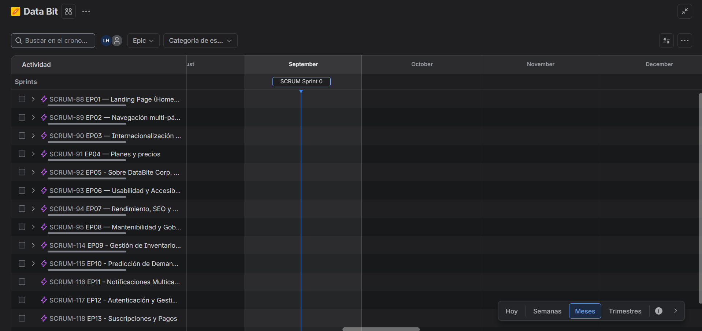

# **Chapter III: Requirements Specification**
## **3.1. User Stories**
<table>
<tr><th>Story ID</th><th>Título</th><th>Descripción</th><th>Criterios de Aceptación</th><th>Relacionado con Epic ID</th></tr>

<tr>
<td><strong>US01</strong></td>
<td>Conocer la propuesta de valor de StockIA</td>
<td>Como visitante del sitio, quiero ver de inmediato de qué trata StockIA y qué problema resuelve, para decidir en pocos segundos si es relevante para mi restaurante.</td>
<td>
<strong>Escenario 1: Visualización del mensaje principal</strong> 
Dado que un visitante ingresa a index.html 
Cuando la página carga 
Entonces el sistema muestra en el hero un título con la propuesta de valor, una descripción y el nombre de la startup. 

<strong>Escenario 2: Llamados a la acción visibles</strong> 
Dado que el visitante revisa el hero 
Cuando observa los botones disponibles 
Entonces el sistema presenta un botón principal y uno secundario que lleva a features.html. 

<strong>Escenario 3: Coherencia del CTA con el flujo de demo</strong> 
Dado que el visitante hace clic en "Optimiza tu inventario" 
Cuando el sistema procesa el clic 
Entonces lo dirige a la sección de solicitud de demo, no a un dashboard interactivo (aún no implementado).
</td>
<td>EP01 — Landing Page</td>
</tr>

<tr>
<td><strong>US02</strong></td>
<td>Ver una vista previa del dashboard de StockIA</td>
<td>Como visitante, quiero ver una representación visual del futuro dashboard, para entender cómo luciría el producto antes de solicitar una demo.</td>
<td>
<strong>Escenario 1: Mockup visible en escritorio</strong> 
Dado que un visitante accede desde escritorio 
Cuando la página del Home carga 
Entonces el sistema muestra un mockup ilustrativo del dashboard. 

<strong>Escenario 2: Mockup oculto en móvil</strong> 
Dado que el ancho de pantalla es menor a 768px 
Cuando la página carga 
Entonces el sistema oculta el mockup para priorizar el texto.
</td>
<td>EP01 — Landing Page</td>
</tr>

<tr>
<td><strong>US03</strong></td>
<td>Conocer estadísticas e indicadores de impacto de StockIA</td>
<td>Como visitante, quiero ver cifras sobre el desperdicio y el impacto económico de usar StockIA, para dimensionar el beneficio potencial en mi negocio.</td>
<td>
<strong>Escenario 1: Barra de estadísticas</strong> 
Dado que el visitante se desplaza por el Home 
Cuando llega a la barra de estadísticas 
Entonces el sistema presenta cuatro indicadores de impacto. 

<strong>Escenario 2: Transparencia sobre cifras de ejemplo</strong> 
Dado que las cifras son referenciales 
Cuando el visitante las revisa 
Entonces el sistema indica que son cifras de ejemplo pendientes de validar. 

<strong>Escenario 3: Indicadores de impacto económico y ambiental</strong> 
Dado que el visitante quiere entender el beneficio concreto 
Cuando revisa indicadores como "-25% desperdicio" 
Entonces interpreta en segundos el impacto esperado.
</td>
<td>EP01 — Landing Page</td>
</tr>

<tr>
<td><strong>US04</strong></td>
<td>Identificar si StockIA es para mi rol dentro del restaurante</td>
<td>Como dueño/CEO o administrador/jefe de cocina, quiero identificar contenido dirigido a mi rol, para reconocer que StockIA entiende mis necesidades particulares.</td>
<td>
<strong>Escenario 1: Segmento dueños y CEOs</strong> 
Dado que el visitante es dueño o CEO 
Cuando revisa "¿Para quién es StockIA?" 
Entonces ve una tarjeta orientada a inventario, mermas y rentabilidad. 

<strong>Escenario 2: Segmento administradores y jefes de cocina</strong> 
Dado que el visitante administra la operación diaria 
Cuando revisa la misma sección 
Entonces ve una tarjeta orientada a recetas, stock y alertas.
</td>
<td>EP01 — Landing Page</td>
</tr>

<tr>
<td><strong>US05</strong></td>
<td>Conocer las funcionalidades principales desde el Home</td>
<td>Como visitante, quiero ver un resumen de las funcionalidades clave sin salir del Home, para evaluar rápidamente el alcance del producto.</td>
<td>
<strong>Escenario 1: Visualización de las seis funcionalidades</strong> 
Dado que el visitante llega a la sección de funcionalidades 
Cuando la sección se renderiza 
Entonces el sistema muestra seis tarjetas de funcionalidades. 

<strong>Escenario 2: Acceso al detalle completo</strong> 
Dado que el visitante quiere más información 
Cuando hace clic en "Ver todas las características" 
Entonces el sistema lo redirige a features.html.
</td>
<td>EP01 — Landing Page</td>
</tr>

<tr>
<td><strong>US06</strong></td>
<td>Conocer los diferenciadores de StockIA</td>
<td>Como visitante, quiero entender qué hace distinto a StockIA de un simple control de inventario, para justificar por qué elegirlo.</td>
<td>
<strong>Escenario 1: Visualización de diferenciadores</strong> 
Dado que el visitante llega a "Más que un inventario" 
Cuando la sección se renderiza 
Entonces el sistema presenta tres tarjetas de diferenciadores.
</td>
<td>EP01 — Landing Page</td>
</tr>

<tr>
<td><strong>US07</strong></td>
<td>Conocer las integraciones externas en evaluación</td>
<td>Como visitante, quiero saber con qué otras herramientas podría integrarse StockIA, para entender qué tan conectado estará con servicios que ya uso.</td>
<td>
<strong>Escenario 1: Visualización de opciones de integración</strong> 
Dado que el visitante llega a "Integraciones" 
Cuando la sección se renderiza 
Entonces el sistema presenta cuatro tarjetas con la etiqueta "En evaluación". 

<strong>Escenario 2: Transparencia sobre la decisión pendiente</strong> 
Dado que ninguna integración fue elegida 
Cuando el visitante lee la introducción 
Entonces el sistema aclara que la decisión está pendiente.
</td>
<td>EP01 — Landing Page</td>
</tr>

<tr>
<td><strong>US08</strong></td>
<td>Explorar vistas ilustrativas de la plataforma</td>
<td>Como visitante, quiero ver ejemplos visuales de las pantallas de StockIA, para imaginar cómo sería usar el producto día a día.</td>
<td>
<strong>Escenario 1: Visualización del portafolio</strong> 
Dado que el visitante llega a "Portafolio" 
Cuando la sección se renderiza 
Entonces el sistema muestra cuatro vistas ilustrativas. 

<strong>Escenario 2: Cambio de pestaña visual</strong> 
Dado que el visitante hace clic en una pestaña 
Cuando la pestaña se selecciona 
Entonces el sistema resalta la pestaña activa.
</td>
<td>EP02 — Navegación</td>
</tr>

<tr>
<td><strong>US09</strong></td>
<td>Ver el video de presentación del producto</td>
<td>Como visitante, quiero ver un video que explique StockIA en acción, para comprender el producto más rápido que solo leyendo texto.</td>
<td>
<strong>Escenario 1: Video aún no disponible</strong> 
Dado que el video no ha sido grabado 
Cuando el visitante llega a la sección de video 
Entonces el sistema muestra un placeholder. 

<strong>Escenario 2: Reemplazo futuro del placeholder</strong> 
Dado que el equipo ya grabó el video 
Cuando se reemplaza el placeholder 
Entonces el visitante puede reproducirlo.
</td>
<td>EP01 — Landing Page</td>
</tr>

<tr>
<td><strong>US10</strong></td>
<td>Navegar entre las páginas del sitio</td>
<td>Como visitante, quiero moverme fácilmente entre Inicio, Características, Precios y Nosotros, para explorar el sitio según lo que me interese.</td>
<td>
<strong>Escenario 1: Navegación desde el menú superior</strong> 
Dado que el visitante está en cualquier página 
Cuando hace clic en un enlace del navbar 
Entonces el sistema lo lleva a la página correspondiente. 

<strong>Escenario 2: Identificación de la página actual</strong> 
Dado que el visitante está en una página específica 
Cuando el navbar se renderiza 
Entonces el sistema resalta el enlace activo.
</td>
<td>EP02 — Navegación</td>
</tr>

<tr>
<td><strong>US11</strong></td>
<td>Ver el detalle completo de las funcionalidades de StockIA</td>
<td>Como visitante interesado en profundizar, quiero ver una descripción extendida de cada funcionalidad, para evaluar si el producto cubre mis necesidades.</td>
<td>
<strong>Escenario 1: Grid completo de funcionalidades</strong> 
Dado que el visitante accede a features.html 
Cuando la página carga 
Entonces el sistema presenta las seis funcionalidades con descripción detallada.
</td>
<td>EP02 — Navegación</td>
</tr>

<tr>
<td><strong>US12</strong></td>
<td>Entender cómo empezar a usar StockIA</td>
<td>Como visitante interesado en adoptar StockIA, quiero conocer los pasos para comenzar a usarlo, para saber qué esperar antes de solicitar una demo.</td>
<td>
<strong>Escenario 1: Visualización de los pasos</strong> 
Dado que el visitante llega a "Cómo funciona" 
Cuando la sección se renderiza 
Entonces el sistema muestra cuatro pasos numerados.
</td>
<td>EP02 — Navegación</td>
</tr>

<tr>
<td><strong>US13</strong></td>
<td>Cambiar el idioma del sitio entre español e inglés</td>
<td>Como visitante que prefiere leer en inglés, quiero cambiar el idioma del sitio, para entender el contenido sin depender de traducción externa.</td>
<td>
<strong>Escenario 1: Cambio a inglés</strong> 
Dado que el visitante está en español 
Cuando hace clic en "EN" 
Entonces el sistema traduce todos los textos al inglés. 

<strong>Escenario 2: Regreso a español</strong> 
Dado que el sitio está en inglés 
Cuando hace clic en "ES" 
Entonces el sistema restaura los textos al español.
</td>
<td>EP03 — Internacionalización</td>
</tr>

<tr>
<td><strong>US14</strong></td>
<td>Mantener mi idioma preferido al navegar entre páginas</td>
<td>Como visitante que ya eligió un idioma, quiero que esa preferencia se mantenga al ir a otra página, para no reseleccionar el idioma en cada una.</td>
<td>
<strong>Escenario 1: Persistencia del idioma</strong> 
Dado que el visitante seleccionó inglés 
Cuando navega a otra página 
Entonces el sistema carga esa página ya traducida.
</td>
<td>EP03 — Internacionalización</td>
</tr>

<tr>
<td><strong>US15</strong></td>
<td>Consultar los planes disponibles y sus características</td>
<td>Como visitante interesado en el precio, quiero ver los planes de StockIA y qué incluye cada uno, para elegir la opción que mejor se ajuste a mi restaurante.</td>
<td>
<strong>Escenario 1: Visualización de los tres planes</strong> 
Dado que el visitante accede a pricing.html 
Cuando la página carga 
Entonces el sistema muestra los planes Esencial, Profesional e IoT Completo. 

<strong>Escenario 2: Transparencia sobre precios de ejemplo</strong> 
Dado que los precios son ilustrativos 
Cuando el visitante revisa la sección 
Entonces el sistema indica que son planes de ejemplo.
</td>
<td>EP04 — Planes y precios</td>
</tr>

<tr>
<td><strong>US16</strong></td>
<td>Comparar precios mensuales y anuales</td>
<td>Como visitante evaluando el costo, quiero alternar entre facturación mensual y anual, para comparar cuánto ahorraría pagando anualmente.</td>
<td>
<strong>Escenario 1: Cambio a facturación anual</strong> 
Dado que los planes muestran precio mensual 
Cuando el visitante activa "Anual" 
Entonces el sistema actualiza el monto con descuento anual. 

<strong>Escenario 2: Regreso a facturación mensual</strong> 
Dado que el interruptor está en "Anual" 
Cuando el visitante lo desactiva 
Entonces el sistema restaura los montos mensuales.
</td>
<td>EP04 — Planes y precios</td>
</tr>

<tr>
<td><strong>US17</strong></td>
<td>Resolver dudas frecuentes sobre los planes</td>
<td>Como visitante con dudas puntuales, quiero consultar preguntas frecuentes sobre los planes, para resolver objeciones antes de solicitar una demo.</td>
<td>
<strong>Escenario 1: Apertura de una pregunta</strong> 
Dado que el visitante llega al FAQ 
Cuando hace clic en una pregunta cerrada 
Entonces el sistema despliega la respuesta. 

<strong>Escenario 2: Solo una pregunta abierta a la vez</strong> 
Dado que una pregunta ya está desplegada 
Cuando el visitante abre otra 
Entonces el sistema cierra la anterior.
</td>
<td>EP04 — Planes y precios</td>
</tr>

<tr>
<td><strong>US18</strong></td>
<td>Conocer la misión, visión y valores de DataBite Corp</td>
<td>Como visitante, quiero conocer el propósito y los valores del equipo detrás de StockIA, para generar confianza antes de contactarlos.</td>
<td>
<strong>Escenario 1: Visualización de misión y visión</strong> 
Dado que el visitante accede a about.html 
Cuando la página carga 
Entonces el sistema muestra la misión, visión y valores destacados.
</td>
<td>EP01 — Landing Page</td>
</tr>

<tr>
<td><strong>US19</strong></td>
<td>Conocer al equipo detrás de StockIA</td>
<td>Como visitante, quiero ver quiénes conforman el equipo de DataBite Corp, para saber que hay personas reales respaldando el producto.</td>
<td>
<strong>Escenario 1: Visualización de fichas de equipo</strong> 
Dado que el visitante llega a "Equipo" 
Cuando la sección se renderiza 
Entonces el sistema muestra fichas con nombre, rol y código. 

<strong>Escenario 2: Transparencia sobre datos pendientes</strong> 
Dado que los datos no fueron completados 
Cuando el visitante revisa la sección 
Entonces el sistema muestra una nota de "fichas de ejemplo".
</td>
<td>EP05 — Sobre DataBite Corp</td>
</tr>

<tr>
<td><strong>US20</strong></td>
<td>Solicitar una demo mediante un formulario de contacto</td>
<td>Como visitante interesado en StockIA, quiero enviar mis datos y una breve descripción de mi restaurante, para que DataBite Corp se contacte conmigo.</td>
<td>
<strong>Escenario 1: Envío exitoso del formulario</strong> 
Dado que el visitante completa nombre y correo 
Cuando presiona "Enviar solicitud" 
Entonces el sistema muestra confirmación y limpia el formulario. 

<strong>Escenario 2: Campos obligatorios incompletos</strong> 
Dado que deja vacío el nombre o correo 
Cuando intenta enviar 
Entonces el navegador bloquea el envío. 

<strong>Escenario 3: Acceso al formulario desde cualquier página</strong> 
Dado que hace clic en cualquier botón "Solicitar demo" 
Cuando el clic se ejecuta 
Entonces el sistema lo dirige a la sección de contacto.
</td>
<td>EP05 — Sobre DataBite Corp</td>
</tr>

<tr>
<td><strong>US21</strong></td>
<td>Gestionar el inventario de insumos (alta, baja y modificación)</td>
<td>Como administrador, quiero agregar, eliminar y modificar insumos en el inventario, para mantener actualizado el stock de mi restaurante.</td>
<td>
<strong>Escenario 1: Registro de nuevo insumo</strong> 
Dado que el administrador está en el módulo de inventario 
Cuando agrega un nuevo insumo 
Entonces el sistema lo registra en la base de datos. 

<strong>Escenario 2: Eliminación de insumo</strong> 
Dado que un insumo ya no se usa 
Cuando lo elimina del inventario 
Entonces el sistema lo quita y ajusta reportes. 

<strong>Escenario 3: Actualización de cantidad tras pedido</strong> 
Dado que recibe un pedido de insumos 
Cuando modifica la cantidad 
Entonces el sistema actualiza el stock disponible. 

<strong>Escenario 4: Validación de datos obligatorios</strong> 
Dado que intenta registrar un insumo sin nombre o cantidad 
Cuando intenta guardar 
Entonces el sistema muestra un error.
</td>
<td>EP09 — Inventario y Recetas</td>
</tr>

<tr>
<td><strong>US22</strong></td>
<td>Vincular recetas al inventario con descuento automático de insumos</td>
<td>Como administrador, quiero guardar recetas con ingredientes vinculados al inventario, para que al venderse un plato se descuenten automáticamente los insumos.</td>
<td>
<strong>Escenario 1: Registro de receta con ingredientes</strong> 
Dado que registra la receta "Pizza Margarita" 
Cuando guarda la receta 
Entonces queda vinculada al inventario. 

<strong>Escenario 2: Descuento automático al vender un plato</strong> 
Dado que un cliente pide una Pizza Margarita 
Cuando se registra la venta 
Entonces el sistema descuenta los ingredientes. 

<strong>Escenario 3: Alerta por stock insuficiente</strong> 
Dado que un insumo no tiene stock suficiente 
Cuando se intenta registrar la venta 
Entonces el sistema alerta que no puede completar el descuento.
</td>
<td>EP09 — Inventario y Recetas</td>
</tr>

<tr>
<td><strong>US23</strong></td>
<td>Visualizar un dashboard operativo con alertas y métricas clave</td>
<td>Como administrador, quiero ver un dashboard con métricas de stock y alertas, para tomar decisiones rápidas sobre insumos críticos.</td>
<td>
<strong>Escenario 1: Insumos bajos y próximos a vencer</strong> 
Dado que accede al dashboard 
Cuando se muestran los insumos críticos 
Entonces puede priorizar compras. 

<strong>Escenario 2: Métricas de ahorro y predicciones</strong> 
Dado que está en el dashboard 
Cuando se muestran métricas y predicciones 
Entonces puede evaluar el rendimiento. 

<strong>Escenario 3: Vista simplificada para el rol Empleado</strong> 
Dado que un Empleado accede al sistema 
Cuando visualiza su panel 
Entonces ve una vista simplificada sin métricas financieras.
</td>
<td>EP09 — Inventario y Recetas</td>
</tr>

<tr>
<td><strong>US24</strong></td>
<td>Configurar roles  de los empleados</td>
<td>Como administrador, quiero asignar roles a empleados, para que cada uno tenga recomendaciones personalizadas y permisos adecuados dentro del sistema.</td>
<td>
<strong>Escenario 1: Asignación de rol "Empleado" con recomendaciones limitadas</strong> 
Given que el administrador está en la configuración de usuarios 
When asigna a una persona el rol "Empleado" 
Then el sistema le da los permisos limitados y muestra únicamente las recomendaciones relacionadas con las tareas básicas de cocina o servicio 

<strong>Escenario 2: Asignación de rol "Administrador" con recomendaciones completas</strong> 
Given que el administrador está en la configuración de usuarios 
When asigna a una persona el rol "Administrador" 
Then el sistema habilita todos los permisos y recomendaciones, incluyendo predicciones de demanda, alertas de insumos y configuración de inventario. 

<strong>Escenario 3: Asignación de rol especializado (ej. Cocinero)</strong> 
Given que el administrador asigna un rol específico como "Cocinero" 
When el sistema genera recomendaciones 
Then el usuario recibe sugerencias personalizadas sobre preparación de recetas y cantidades de insumos, sin ver información de pagos o gestión administrativa.
</td>
<td>EP11 — Notificaciones Multicanal</td>
</tr>

<tr>
<td><strong>US25</strong></td>
<td>Recibir predicción de demanda según históricos y clima</td>
<td>Como administrador, quiero que el sistema prediga la demanda según históricos de ventas y clima, para poder preparar insumos con anticipación.</td>
<td>
<strong>Escenario 1: Proyección según día de la semana</strong> 
Dado que es un día laboral 
Cuando el sistema analiza históricos 
Entonces predice la demanda de platos. 

<strong>Escenario 2: Proyección en feriados locales</strong> 
Dado que se acerca un feriado 
Cuando cruza datos de asistencia 
Entonces proyecta mayor afluencia. 

<strong>Escenario 3: Aprendizaje continuo del modelo</strong> 
Dado que se registran nuevas ventas 
Cuando ajusta sus predicciones 
Entonces reflejan el comportamiento del restaurante.
</td>
<td>EP10 — Predicción de Demanda con IA</td>
</tr>

<tr>
<td><strong>US26</strong></td>
<td>Recibir recomendaciones automáticas de ajuste de menú</td>
<td>Como administrador, quiero recibir sugerencias de menú según popularidad y estacionalidad, para ajustar la oferta de mi restaurante.</td>
<td>
<strong>Escenario 1: Sugerencia por temporada estacional</strong> 
Dado que inicia una nueva temporada 
Cuando analiza los platos más vendidos 
Entonces sugiere incluir el más popular. 

<strong>Escenario 2: Reemplazo por baja popularidad</strong> 
Dado que un plato pierde popularidad 
Cuando analiza ventas decrecientes 
Entonces sugiere reemplazarlo. 

<strong>Escenario 3: Reconocimiento por aplicar una recomendación</strong> 
Dado que aplica una recomendación 
Cuando la venta confirma la mejora 
Entonces otorga un logro de gamificación.
</td>
<td>EP10 — Predicción de Demanda con IA</td>
</tr>

<tr>
<td><strong>US27</strong></td>
<td>Recibir alertas de insumos por stock bajo o vencimiento próximo</td>
<td>Como administrador, quiero recibir alertas antes de que falten insumos, para poder comprar con tiempo y evitar quiebres de stock.</td>
<td>
<strong>Escenario 1: Alerta por nivel bajo de stock</strong> 
Dado que un producto está por agotarse 
Cuando el sistema detecta el nivel bajo 
Entonces genera una alerta. 

<strong>Escenario 2: Alerta por proximidad de vencimiento</strong> 
Dado que un producto está próximo a vencer 
Cuando detecta la fecha cercana 
Entonces genera una alerta. 

<strong>Escenario 3: Priorización de alertas</strong> 
Dado que hay múltiples alertas activas 
Cuando abre el dashboard 
Entonces las prioriza por urgencia.
</td>
<td>EP10 — Predicción de Demanda con IA</td>
</tr>

<tr>
<td><strong>US28</strong></td>
<td>Recibir alertas y recomendaciones por WhatsApp</td>
<td>Como empleado, quiero recibir sugerencias y alertas en mi WhatsApp, para poder actuar rápido sin necesidad de entrar al sistema.</td>
<td>
<strong>Escenario 1: Recepción de recomendaciones</strong> 
Dado que soy empleado 
Cuando el sistema genera una recomendación 
Entonces recibo la notificación en WhatsApp. 

<strong>Escenario 2: Recepción de alertas críticas</strong> 
Dado que ocurre una alerta crítica 
Cuando el sistema detecta la anomalía 
Entonces recibo un mensaje en WhatsApp. 

<strong>Escenario 3: Información fuera del sistema</strong> 
Dado que estoy fuera del dashboard 
Cuando ocurre un evento relevante 
Entonces recibo un mensaje que me mantiene informado.
</td>
<td>EP11 — Notificaciones Multicanal</td>
</tr>

<tr>
<td><strong>US29</strong></td>
<td>Registrarme como nuevo usuario en StockIA</td>
<td>Como nuevo usuario, quiero registrarme en StockIA con mis datos, para poder acceder al sistema y configurar mi restaurante.</td>
<td>
<strong>Escenario 1: Registro exitoso</strong> 
Dado que ingresa correo, contraseña y nombre del restaurante 
Cuando envía el formulario 
Entonces el sistema confirma la creación de la cuenta. 

<strong>Escenario 2: Acceso inicial al dashboard</strong> 
Dado que la cuenta fue creada 
Cuando inicia sesión por primera vez 
Entonces accede al dashboard inicial. 

<strong>Escenario 3: Error por correo duplicado</strong> 
Dado que el correo ya existe 
Cuando intenta registrarse de nuevo 
Entonces el sistema muestra un error.
</td>
<td>EP12 — Autenticación y Cuentas</td>
</tr>

<tr>
<td><strong>US30</strong></td>
<td>Iniciar sesión con mis credenciales</td>
<td>Como usuario registrado, quiero iniciar sesión con mis credenciales, para poder acceder a mi dashboard personalizado.</td>
<td>
<strong>Escenario 1: Inicio de sesión exitoso</strong> 
Dado que ingresa correo y contraseña correctos 
Cuando hace clic en "Iniciar sesión" 
Entonces el sistema valida y muestra el dashboard. 

<strong>Escenario 2: Error de inicio de sesión</strong> 
Dado que ingresa credenciales incorrectas 
Cuando intenta iniciar sesión 
Entonces el sistema muestra un error. 

<strong>Escenario 3: Recuperación de contraseña</strong> 
Dado que olvidó su contraseña 
Cuando hace clic en "Recuperar contraseña" 
Entonces el sistema envía un enlace de recuperación.
</td>
<td>EP12 — Autenticación y Cuentas</td>
</tr>

<tr>
<td><strong>US31</strong></td>
<td>Pagar o renovar mi suscripción con Stripe o PayPal</td>
<td>Como administrador, quiero pagar mi suscripción con Stripe o PayPal, para poder seguir usando StockIA sin interrupciones.</td>
<td>
<strong>Escenario 1: Elegir un plan</strong> 
Dado que está en la sección de suscripciones 
Cuando selecciona un plan y paga 
Entonces el sistema confirma la activación. 

<strong>Escenario 2: Renovar el plan</strong> 
Dado que la suscripción está próxima a vencer 
Cuando paga la renovación 
Entonces el sistema extiende la vigencia. 

<strong>Escenario 3: Error de transacción</strong> 
Dado que intenta pagar un plan 
Cuando ocurre un error en la transacción 
Entonces el sistema muestra un error y permite reintentar.
</td>
<td>EP13 — Suscripciones y Pagos</td>
</tr>

<tr>
<td><strong>US32</strong></td>
<td>Recibir historial de alertas críticas por correo electrónico</td>
<td>Como administrador, quiero recibir alertas críticas por correo vía SendGrid, para tener un historial documentado de los eventos importantes.</td>
<td>
<strong>Escenario 1: Registro de stock bajo</strong> 
Dado que un insumo llega a nivel crítico 
Cuando el sistema detecta la condición 
Entonces envía un correo con el detalle. 

<strong>Escenario 2: Registro de anomalía en equipos</strong> 
Dado que ocurre una alerta en la cocina 
Cuando el sistema la registra 
Entonces envía un correo al administrador. 

<strong>Escenario 3: Historial consolidado</strong> 
Dado que se generan múltiples alertas en un día 
Cuando el sistema las procesa 
Entonces envía un correo resumen.
</td>
<td>EP11 — Notificaciones Multicanal</td>
</tr>

<tr>
<td><strong>US33</strong></td>
<td>Recibir SMS urgentes ante emergencias operativas</td>
<td>Como administrador, quiero recibir SMS críticos vía Twilio, para poder reaccionar rápido ante emergencias en tiempo real.</td>
<td>
<strong>Escenario 1: Alerta de equipo crítico</strong> 
Dado que un equipo presenta una falla grave 
Cuando el sistema detecta la anomalía 
Entonces envía un SMS inmediato. 

<strong>Escenario 2: Alerta de insumo urgente</strong> 
Dado que un insumo esencial está por agotarse 
Cuando detecta el nivel crítico 
Entonces envía un SMS urgente. 

<strong>Escenario 3: Notificación de riesgo operativo</strong> 
Dado que ocurre una situación que afecta la operación 
Cuando el sistema lo detecta 
Entonces envía un SMS inmediato.
</td>
<td>EP11 — Notificaciones Multicanal</td>
</tr>

<tr>
<td><strong>US34</strong></td>
<td>Consultar la vida útil predeterminada de un insumo mediante una API externa</td>
<td>Como administrador, quiero que el sistema consulte una API externa de vida útil de alimentos, para asignar automáticamente un tiempo de conservación estándar a cada insumo.</td>
<td>
<strong>Escenario 1: Consulta exitosa a la API</strong> 
Dado que registra un insumo sin fecha de vencimiento 
Cuando el sistema consulta la API de vida útil 
Entonces asigna un valor predeterminado. 

<strong>Escenario 2: Producto no encontrado en la API</strong> 
Dado que registra un insumo no disponible en la API 
Cuando el sistema intenta la consulta 
Entonces solicita ingresar la vida útil manualmente.
</td>
<td>EP09 — Inventario y Recetas</td>
</tr>

<tr>
<td><strong>US35</strong></td>
<td>Editar la vida útil sugerida de un insumo</td>
<td>Como administrador, quiero poder modificar la vida útil sugerida por la API, para ajustarla a las condiciones reales de mi restaurante.</td>
<td>
<strong>Escenario 1: Ajuste manual del valor sugerido</strong> 
Dado que el sistema asignó una vida útil predeterminada 
Cuando el administrador edita el valor 
Entonces el sistema guarda la nueva configuración. 

<strong>Escenario 2: Registro de condiciones especiales</strong> 
Dado que el insumo se congela en lugar de refrigerarse 
Cuando cambia la condición de almacenamiento 
Entonces el sistema recalcula la vida útil.
</td>
<td>EP09 — Inventario y Recetas</td>
</tr>

<tr>
<td><strong>US36</strong></td>
<td>Calcular automáticamente la fecha límite de consumo de un insumo</td>
<td>Como administrador, quiero que el sistema calcule automáticamente la fecha límite de consumo según la vida útil registrada, para recibir alertas precisas de vencimiento.</td>
<td>
<strong>Escenario 1: Cálculo inicial de la fecha límite</strong> 
Dado que registra 50 kg de pollo con vida útil de 3 días 
Cuando guarda el insumo 
Entonces el sistema calcula y almacena la fecha límite.
</td>
<td>EP09 — Inventario y Recetas</td>
</tr>

<tr>
<td><strong>US37</strong></td>
<td>Recopilar automáticamente los datos de ventas diarias</td>
<td>Como administrador, quiero que el sistema recopile automáticamente los datos de ventas diarias, para que el modelo de Machine Learning pueda analizarlos y detectar patrones de consumo.</td>
<td>
<strong>Escenario 1: Registro automático de ventas</strong> 
Dado que se realiza una venta 
Cuando se confirma la transacción 
Entonces los datos se guardan para entrenamiento del modelo. 

<strong>Escenario 2: Consolidación de históricos</strong> 
Dado que existen múltiples ventas en un día 
Cuando el sistema procesa la información 
Entonces genera un registro consolidado.
</td>
<td>EP10 — Predicción de Demanda con IA</td>
</tr>

<tr>
<td><strong>US38</strong></td>
<td>Entrenar periódicamente el modelo de predicción de demanda</td>
<td>Como administrador, quiero que el sistema entrene periódicamente el modelo de Machine Learning con datos históricos, para que las predicciones sean cada vez más precisas.</td>
<td>
<strong>Escenario 1: Entrenamiento programado</strong> 
Dado que hay nuevos datos de ventas 
Cuando llega la fecha de entrenamiento programado 
Entonces el modelo se actualiza. 

<strong>Escenario 2: Mejora continua de la precisión</strong> 
Dado que el modelo se entrena con más datos 
Cuando se generan nuevas predicciones 
Entonces la precisión aumenta.
</td>
<td>EP10 — Predicción de Demanda con IA</td>
</tr>
<tr>
<td><strong>RNF01</strong></td>
<td>Experiencia responsiva en dispositivos móviles y tablets</td>
<td>Como visitante que navega desde el celular o una tablet, quiero que el sitio se adapte a mi pantalla, para poder leer y usar el sitio sin hacer zoom.</td>
<td>
<strong>Escenario 1: Colapso de columnas en pantallas medianas</strong> 
Cuando el visitante carga cualquier página 
Entonces el sistema reorganiza cuadrículas en menos columnas. 

<strong>Escenario 2: Diseño de una sola columna en móviles</strong> 
Cuando el visitante carga cualquier página 
Entonces el sistema apila en una sola columna.
</td>
<td>EP06 — Usabilidad</td>
</tr>

<tr>
<td><strong>RNF02</strong></td>
<td>Contraste y legibilidad accesible</td>
<td>Como visitante, incluyendo personas con baja visión, quiero que los textos tengan suficiente contraste con el fondo, para leer sin esfuerzo adicional.</td>
<td>
<strong>Escenario 1: Contraste en fondos claros</strong> 
Dado un texto sobre fondo claro 
Cuando el sistema aplica los estilos 
Entonces usa un color con contraste adecuado. 

<strong>Escenario 2: Contraste en fondos oscuros</strong> 
Dado un texto sobre fondo oscuro 
Cuando el sistema aplica los estilos 
Entonces el texto se muestra en blanco.
</td>
<td>EP06 — Usabilidad</td>
</tr>

<tr>
<td><strong>RNF03</strong></td>
<td>Navegación consistente y predecible entre páginas</td>
<td>Como visitante que recorre varias páginas, quiero encontrar siempre el mismo menú, pie de página y estilo visual, para no perder la orientación.</td>
<td>
<strong>Escenario 1: Mismo navbar y footer</strong> 
Dado que el visitante navega entre las cuatro páginas 
Cuando cada página carga 
Entonces el sistema muestra el mismo navbar y footer.
</td>
<td>EP06 — Usabilidad</td>
</tr>

<tr>
<td><strong>RNF04</strong></td>
<td>Carga rápida al ser un sitio estático sin dependencias pesadas</td>
<td>Como visitante con una conexión limitada, quiero que el sitio cargue rápido, para no abandonar la página mientras espera.</td>
<td>
<strong>Escenario 1: Sin frameworks pesados</strong> 
Dado que el sitio usa HTML/CSS/JS nativo 
Cuando cualquier página carga 
Entonces el sistema solo descarga sus propios archivos.
</td>
<td>EP07 — Rendimiento y compatibilidad</td>
</tr>

<tr>
<td><strong>RNF05</strong></td>
<td>Buen posicionamiento en buscadores</td>
<td>Como equipo de DataBite Corp, quiero que cada página tenga metadatos descriptivos, para mejorar la indexación de StockIA.</td>
<td>
<strong>Escenario 1: Metadatos presentes en cada página</strong> 
Dado que se inspecciona cualquier página 
Cuando se revisa su head 
Entonces el sistema incluye title y meta description.
</td>
<td>EP07 — Rendimiento y compatibilidad</td>
</tr>

<tr>
<td><strong>RNF06</strong></td>
<td>Compatibilidad con navegadores modernos de escritorio y móvil</td>
<td>Como visitante, quiero que el sitio se vea y funcione igual sin importar el navegador que use, para tener una experiencia confiable.</td>
<td>
<strong>Escenario 1: Uso de CSS estándar</strong> 
Dado que los estilos usan Flexbox y Grid 
Cuando el sitio se abre en un navegador moderno 
Entonces el sistema renderiza el layout correctamente.
</td>
<td>EP07 — Rendimiento y compatibilidad</td>
</tr>

<tr>
<td><strong>RNF07</strong></td>
<td>Animaciones de entrada que no bloquean la interacción</td>
<td>Como visitante, quiero que las animaciones de aparición sean sutiles y fluidas, para una experiencia moderna sin sentir la página lenta.</td>
<td>
<strong>Escenario 1: Aparición progresiva al hacer scroll</strong> 
Dado que el visitante se desplaza 
Cuando una tarjeta entra en el viewport 
Entonces el sistema aplica una transición de 0.5s.
</td>
<td>EP07 — Rendimiento y compatibilidad</td>
</tr>

<tr>
<td><strong>RNF08</strong></td>
<td>Identificación clara de contenido pendiente de completar</td>
<td>Como equipo de DataBite Corp, quiero que el contenido de ejemplo esté claramente señalizado, para no publicar por error información ficticia.</td>
<td>
<strong>Escenario 1: Señalización visible para el visitante</strong> 
Dado que existen datos de ejemplo 
Cuando el visitante revisa esas secciones 
Entonces el sistema muestra notas explícitas.
</td>
<td>EP02 — Navegación</td>
</tr>

<tr>
<td><strong>RNF09</strong></td>
<td>Sistema de diseño reutilizable y centralizado</td>
<td>Como equipo de desarrollo, quiero que colores, tipografías y espaciados estén centralizados en variables CSS, para actualizar la identidad visual desde un solo lugar.</td>
<td>
<strong>Escenario 1: Variables centralizadas en :root</strong> 
Dado que styles.css define variables en :root 
Cuando se necesita cambiar un color 
Entonces basta modificarlo una sola vez.
</td>
<td>EP02 — Navegación</td>
</tr>

<tr>
<td><strong>RNF10</strong></td>
<td>Textos traducibles centralizados en un solo archivo</td>
<td>Como equipo de desarrollo, quiero que todos los textos traducibles vivan en un único archivo, para actualizar el contenido sin editar cada página.</td>
<td>
<strong>Escenario 1: Único diccionario de traducciones</strong> 
Dado que i18n.js concentra los textos 
Cuando se necesita corregir un texto 
Entonces basta editar la llave correspondiente.
</td>
<td>EP03 — Internacionalización</td>
</tr>

<tr>
<td><strong>RNF11</strong></td>
<td>Protección de credenciales y datos de pago</td>
<td>Como usuario registrado, quiero que mis credenciales y datos de pago se manejen de forma segura, para confiar en la plataforma al usar mi tarjeta o PayPal.</td>
<td>
<strong>Escenario 1: Cifrado de contraseñas</strong> 
Dado que un usuario se registra o inicia sesión 
Cuando el sistema almacena su contraseña 
Entonces la guarda cifrada, nunca en texto plano. 

<strong>Escenario 2: Datos de pago gestionados por el proveedor externo</strong> 
Dado que un usuario realiza un pago 
Cuando ingresa los datos de su tarjeta 
Entonces son procesados directamente por Stripe o PayPal.
</td>
<td>EP14 — Seguridad y Confiabilidad</td>
</tr>

<tr>
<td><strong>RNF12</strong></td>
<td>Confiabilidad y trazabilidad de las notificaciones multicanal</td>
<td>Como administrador que depende de alertas por WhatsApp, correo y SMS, quiero que las notificaciones se envíen de forma confiable y quede registro de ellas.</td>
<td>
<strong>Escenario 1: Reintento ante falla de envío</strong> 
Dado que un envío falla por un problema de conexión 
Cuando el sistema detecta el error 
Entonces reintenta el envío o registra la falla. 

<strong>Escenario 2: Registro histórico de notificaciones</strong> 
Dado que el sistema envía cualquier alerta 
Cuando la notificación se entrega 
Entonces guarda un registro con fecha, canal y contenido.
</td>
<td>EP14 — Seguridad y Confiabilidad</td>
</tr>
</table>

## **3.2. Impact Mapping**
## **3.3. Product Backlog**
| # Orden | User Story ID | Título | Descripción | Story Points(1/2/3/5/8) |
| :---: | :--- | :--- | :--- | :---: |
| 1 | **US01** | Conocer la propuesta de valor de StockIA | Como visitante del sitio, quiero ver de inmediato de qué trata StockIA y qué problema resuelve, para decidir en pocos segundos si es relevante para mi restaurante. | 8 |
| 2 | **US20** | Solicitar una demo mediante un formulario de contacto | Como visitante interesado en StockIA, quiero enviar mis datos y una breve descripción de mi restaurante, para que DataBite Corp se contacte conmigo. | 8 |
| 3 | **US21** | Gestionar el inventario de insumos (alta, baja y modificación) | Como administrador, quiero agregar, eliminar y modificar insumos en el inventario, para mantener actualizado el stock de mi restaurante. | 8 |
| 4 | **US25** | Recibir predicción de demanda según históricos y clima | Como administrador, quiero que el sistema prediga la demanda según históricos de ventas y clima, para poder preparar insumos con anticipación. | 8 |
| 5 | **US37** | Recopilar automáticamente los datos de ventas diarias | Como administrador, quiero que el sistema recopile automáticamente los datos de ventas diarias, para que el modelo de Machine Learning pueda analizarlos y detectar patrones de consumo. | 8 |
| 6 | **US38** | Entrenar periódicamente el modelo de predicción de demanda | Como administrador, quiero que el sistema entrene periódicamente el modelo de Machine Learning con datos históricos, para que las predicciones de demanda sean cada vez más precisas. | 8 |
| 7 | **US31** | Pagar o renovar mi suscripción con Stripe o PayPal | Como administrador, quiero pagar mi suscripción con Stripe o PayPal, para poder seguir usando StockIA sin interrupciones. | 8 |
| 8 | **US03** | Conocer estadísticas e indicadores de impacto de StockIA | Como visitante, quiero ver cifras sobre el desperdicio y el impacto económico de usar StockIA, para dimensionar el beneficio potencial en mi negocio. | 5 |
| 9 | **US04** | Identificar si StockIA es para mi rol dentro del restaurante | Como dueño/CEO o administrador/jefe de cocina, quiero identificar contenido dirigido a mi rol, para reconocer que StockIA entiende mis necesidades particulares. | 5 |
| 10 | **US15** | Consultar los planes disponibles y sus características | Como visitante interesado en el precio, quiero ver los planes de StockIA y qué incluye cada uno, para elegir la opción que mejor se ajuste a mi restaurante. | 5 |
| 11 | **US22** | Vincular recetas al inventario con descuento automático de insumos | Como administrador, quiero guardar recetas con ingredientes vinculados al inventario, para que al venderse un plato se descuenten automáticamente los insumos. | 5 |
| 12 | **US23** | Visualizar un dashboard operativo con alertas y métricas clave | Como administrador, quiero ver un dashboard con métricas de stock y alertas, para tomar decisiones rápidas sobre insumos críticos. | 5 |
| 13 | **US26** | Recibir recomendaciones automáticas de ajuste de menú | Como administrador, quiero recibir sugerencias de menú según popularidad y estacionalidad, para ajustar la oferta de mi restaurante. | 5 |
| 14 | **US27** | Recibir alertas de insumos por stock bajo o vencimiento próximo | Como administrador, quiero recibir alertas antes de que falten insumos, para poder comprar con tiempo y evitar quiebres de stock. | 5 |
| 15 | **US28** | Recibir alertas y recomendaciones por WhatsApp | Como empleado, quiero recibir sugerencias y alertas en mi WhatsApp, para poder actuar rápido sin necesidad de entrar al sistema. | 5 |
| 16 | **US29** | Registrarme como nuevo usuario en StockIA | Como nuevo usuario, quiero registrarme en StockIA con mis datos, para poder acceder al sistema y configurar mi restaurante. | 5 |
| 17 | **US30** | Iniciar sesión con mis credenciales | Como usuario registrado, quiero iniciar sesión con mis credenciales, para poder acceder a mi dashboard personalizado. | 5 |
| 18 | **US34** | Consultar la vida útil predeterminada de un insumo mediante una API externa | Como administrador, quiero que el sistema consulte una API externa de vida útil de alimentos, para asignar automáticamente un tiempo de conservación estándar a cada insumo. | 5 |
| 19 | **US36** | Calcular automáticamente la fecha límite de consumo de un insumo | Como administrador, quiero que el sistema calcule automáticamente la fecha límite de consumo según la vida útil registrada, para recibir alertas precisas de vencimiento. | 5 |
| 20 | **RNF11** | Protección de credenciales y datos de pago | Como usuario registrado, quiero que mis credenciales y mis datos de pago se manejen de forma segura, para confiar en la plataforma al usar mi tarjeta o mi cuenta de PayPal. | 5 |
| 21 | **RNF12** | Confiabilidad y trazabilidad de las notificaciones multicanal | Como administrador que depende de alertas por WhatsApp, correo y SMS, quiero que las notificaciones se envíen de forma confiable y quede registro de ellas, para no perder información crítica de mi restaurante. | 5 |
| 22 | **US02** | Ver una vista previa del dashboard de StockIA | Como visitante, quiero ver una representación visual del futuro dashboard, para entender cómo luciría el producto antes de solicitar una demo. | 3 |
| 23 | **US05** | Conocer las funcionalidades principales desde el Home | Como visitante, quiero ver un resumen de las funcionalidades clave de StockIA sin salir del Home, para evaluar rápidamente el alcance del producto. | 3 |
| 24 | **US06** | Conocer los diferenciadores de StockIA | Como visitante, quiero entender qué hace distinto a StockIA de un simple control de inventario, para justificar por qué elegirlo. | 3 |
| 25 | **US07** | Conocer las integraciones externas en evaluación | Como visitante, quiero saber con qué otras herramientas podría integrarse StockIA, para entender qué tan conectado estará con servicios que ya uso. | 3 |
| 26 | **US09** | Ver el video de presentación del producto | Como visitante, quiero ver un video que explique StockIA en acción, para comprender el producto más rápido que solo leyendo texto. | 3 |
| 27 | **US13** | Cambiar el idioma del sitio entre español e inglés | Como visitante que prefiere leer en inglés, quiero cambiar el idioma del sitio, para entender el contenido sin depender de traducción externa. | 3 |
| 28 | **US16** | Comparar precios mensuales y anuales | Como visitante evaluando el costo, quiero alternar entre facturación mensual y anual, para comparar cuánto ahorraría pagando anualmente. | 3 |
| 29 | **US17** | Resolver dudas frecuentes sobre los planes | Como visitante con dudas puntuales, quiero consultar preguntas frecuentes sobre los planes, para resolver objeciones antes de solicitar una demo. | 3 |
| 30 | **US24** | Configurar roles y permisos de los empleados | Como administrador, quiero asignar roles a empleados, para que cada uno tenga permisos adecuados dentro del sistema. | 3 |
| 31 | **US32** | Recibir historial de alertas críticas por correo electrónico | Como administrador, quiero recibir alertas críticas por correo vía SendGrid, para tener un historial documentado de eventos importantes. | 3 |
| 32 | **US33** | Recibir SMS urgentes ante emergencias operativas | Como administrador, quiero recibir SMS críticos vía Twilio, para poder reaccionar rápido ante emergencias en tiempo real. | 3 |
| 33 | **US35** | Editar la vida útil sugerida de un insumo | Como administrador, quiero poder modificar la vida útil sugerida por la API, para ajustarla a las condiciones reales de mi restaurante. | 3 |
| 34 | **RNF01** | Experiencia responsiva en dispositivos móviles y tablets | Como visitante que navega desde el celular o una tablet, quiero que el sitio se adapte a mi pantalla, para poder leer y usar el sitio sin hacer zoom ni desplazamiento horizontal. | 3 |
| 35 | **RNF04** | Carga rápida al ser un sitio estático sin dependencias pesadas | Como visitante con una conexión limitada, quiero que el sitio cargue rápido, para no abandonar la página mientras espera que termine de cargar. | 3 |
| 36 | **RNF05** | Buen posicionamiento en buscadores | Como equipo de DataBite Corp, quiero que cada página tenga metadatos descriptivos, para mejorar la indexación de StockIA en motores de búsqueda. | 3 |
| 37 | **US08** | Explorar vistas ilustrativas de la plataforma | Como visitante, quiero ver ejemplos visuales de las pantallas de StockIA, para imaginar cómo sería usar el producto día a día. | 2 |
| 38 | **US10** | Navegar entre las páginas del sitio | Como visitante, quiero moverme fácilmente entre Inicio, Características, Precios y Nosotros, para explorar el sitio según lo que me interese. | 2 |
| 39 | **US11** | Ver el detalle completo de las funcionalidades de StockIA | Como visitante interesado en profundizar, quiero ver una descripción extendida de cada funcionalidad, para evaluar si el producto cubre mis necesidades. | 2 |
| 40 | **US12** | Entender cómo empezar a usar StockIA | Como visitante interesado en adoptar StockIA, quiero conocer los pasos para comenzar a usarlo, para saber qué esperar antes de solicitar una demo. | 2 |
| 41 | **US14** | Mantener mi idioma preferido al navegar entre páginas | Como visitante que ya eligió un idioma, quiero que esa preferencia se mantenga al ir a otra página, para no reseleccionar el idioma en cada una. | 2 |
| 42 | **US18** | Conocer la misión, visión y valores de DataBite Corp | Como visitante, quiero conocer el propósito y valores del equipo detrás de StockIA, para generar confianza antes de contactarlos. | 2 |
| 43 | **US19** | Conocer al equipo detrás de StockIA | Como visitante, quiero ver quiénes conforman el equipo de DataBite Corp, para saber que hay personas reales respaldando el producto. | 2 |
| 44 | **RNF02** | Contraste y legibilidad accesible | Como visitante, incluyendo personas con baja visión, quiero que los textos tengan suficiente contraste con el fondo, para poder leer el contenido sin esfuerzo adicional. | 2 |
| 45 | **RNF03** | Navegación consistente y predecible entre páginas | Como visitante que recorre varias páginas, quiero encontrar siempre el mismo menú, pie de página y estilo visual, para no perder la orientación. | 2 |
| 46 | **RNF06** | Compatibilidad con navegadores modernos de escritorio y móvil | Como visitante, quiero que el sitio se vea y funcione igual sin importar el navegador que use, para tener una experiencia confiable. | 2 |
| 47 | **RNF07** | Animaciones de entrada que no bloquean la interacción | Como visitante, quiero que las animaciones de aparición sean sutiles y fluidas, para una experiencia moderna sin sentir la página lenta. | 1 |
| 48 | **RNF08** | Identificación clara de contenido pendiente de completar | Como equipo de DataBite Corp, quiero que el contenido de ejemplo esté claramente señalizado, para no publicar por error información ficticia como definitiva. | 1 |
| 49 | **RNF09** | Sistema de diseño reutilizable y centralizado | Como equipo de desarrollo, quiero que colores, tipografías y espaciados estén centralizados en variables CSS, para actualizar la identidad visual desde un solo lugar. | 1 |
| 50 | **RNF10** | Textos traducibles centralizados en un solo archivo | Como equipo de desarrollo, quiero que todos los textos traducibles vivan en un único archivo, para actualizar el contenido sin editar cada página. | 1 |

 

  
   <i>Artefacto: Jira para Epics</i>

  
   <i>Artefacto: Jira para User Storys</i>

  
   <i>Artefacto: Jira para Backlog Priorizado</i>

>Acceso a artefacto Jira para el desarrollo de Backlog
<https://laplaceho-22.atlassian.net/jira/software/projects/SCRUM/boards/1?filter=&groupBy=none&atlOrigin=eyJpIjoiOGVhOTM0YjRkNzZkNGEzZWExMmY0ZmQ4MTU1NTcyYmQiLCJwIjoiaiJ9>