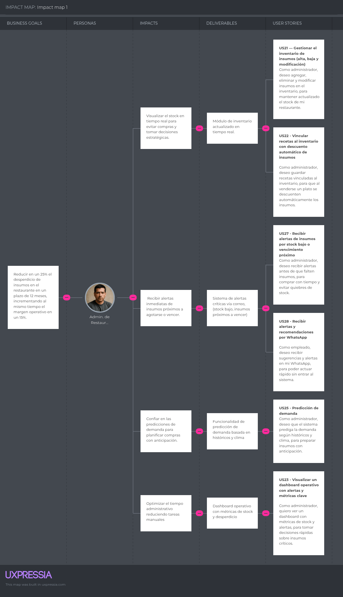
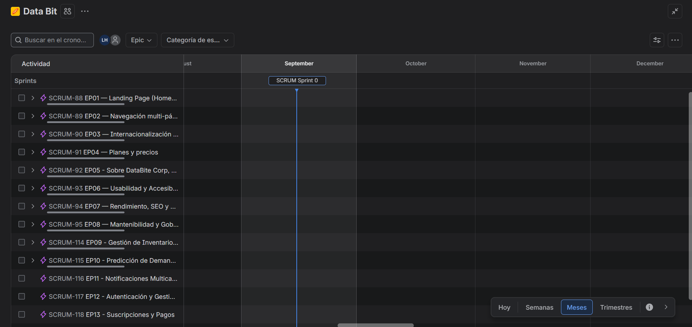
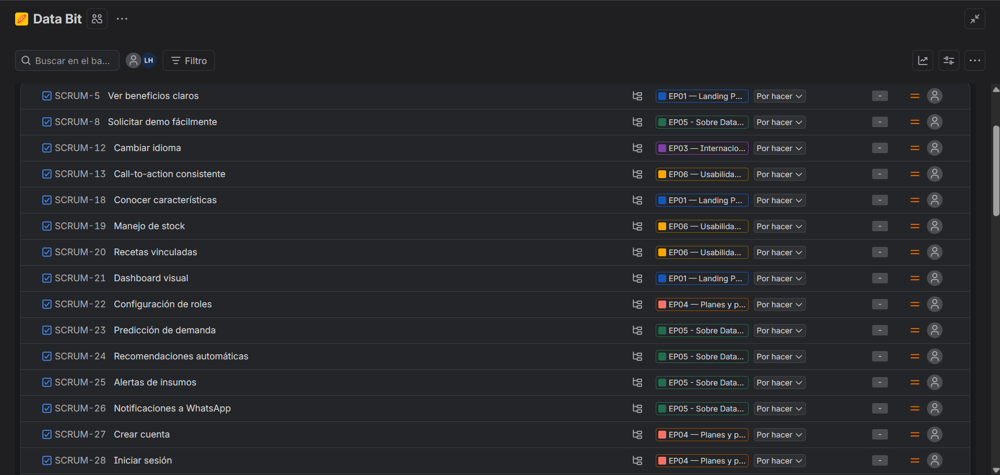
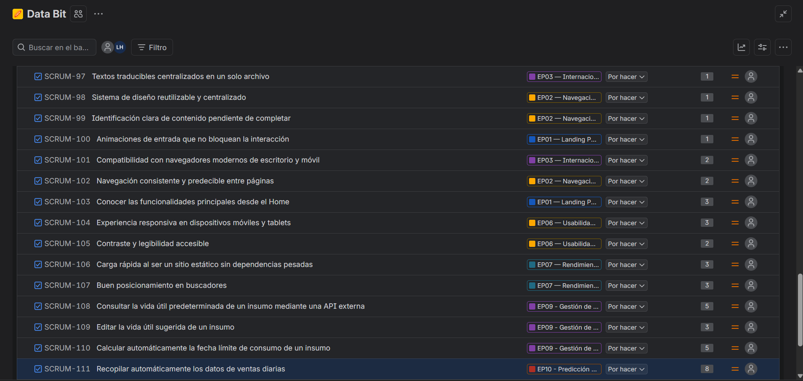

# **Chapter III: Requirements Specification**
## **3.1. User Stories**
### Objetivos estratégicos de StockIA
 
| ID | Objetivo estratégico | Métrica (KPI) |
| :---: | :--- | :--- |
| **OE1** | Reducir las mermas de insumos | Valor de insumos desechados ÷ valor de insumos comprados (%) |
| **OE2** | Reducir los quiebres de stock | Insumos agotados durante el servicio por semana |
| **OE3** | Reducir el tiempo de control de inventario | Horas semanales de conteo y cuadre; % de discrepancia entre stock registrado y conteo físico |
| **OE4** | Captar restaurantes interesados desde la Landing Page | Solicitudes de demo ÷ visitas al sitio (%) |
| **OE5** | Lograr la activación de las cuentas nuevas | % de cuentas que registran su primer insumo y su primera receta dentro de las primeras 24 h |
| **OE6** | Asegurar ingresos recurrentes | % de restaurantes con plan activo; % de renovaciones exitosas |
| **OE7** | Proteger la información y el control interno del restaurante | Accesos sin sesión o sin rol permitido = 0; % de acciones administrativas restringidas por rol |

### Epics
 
| Epic ID | Título | Descripción | Objetivo estratégico | Métrica de la épica (KPI) | Ítems relacionados |
| :---: | :--- | :--- | :---: | :--- | :--- |
| **EP01** | Propuesta de valor en la Landing Page | Como dueño o administrador de un restaurante que visita StockIA, quiero entender qué problema resuelve el producto, para quién es y cómo funciona, para decidir en una sola visita si solicito una demo. | OE4 | Clics en un CTA de conversión ÷ visitas al Home (%) | US01, US02, US03 |
| **EP02** | Conversión a demo: planes, confianza y contacto | Como dueño o administrador interesado, quiero comparar planes, conocer al equipo y dejar mis datos de contacto, para pasar de la evaluación a una demo sin llamar a ventas. | OE4, OE6 | Solicitudes de demo ÷ visitas a pricing.html y about.html (%) | US04, US05, US06 |
| **EP03** | Experiencia web bilingüe, accesible y performante | Como visitante o usuario, quiero un sitio y una aplicación que carguen rápido, se adapten a mi dispositivo, estén en mi idioma y puedan usarse con teclado y lector de pantalla, para recorrerlos completos sin abandonarlos. | OE4 | Tasa de rebote del sitio; puntajes Lighthouse de Performance, Accessibility y SEO ≥ 90 | US07, US08, RNF01, RNF02, RNF03, RNF04, RNF05, RNF06, RNF07, RNF10, RNF11 |
| **EP04** | Acceso seguro y cuenta del restaurante | Como dueño o administrador, quiero crear mi cuenta, iniciar sesión y mantener mis datos actualizados, para empezar a usar StockIA el mismo día con la información protegida. | OE5, OE7 | % de registros que llegan al dashboard en el primer intento; accesos sin sesión = 0 | US09, US10, RNF08 |
| **EP05** | Gestión del equipo y permisos | Como administrador, quiero incorporar a mi personal y asignarle un rol, para delegar el registro diario sin perder el control de la gestión del restaurante. | OE7 | % de rutas administrativas restringidas por rol (meta: 100 %); equipos con al menos un administrador (meta: 100 %) | US11 |
| **EP06** | Control de inventario de insumos | Como administrador, quiero registrar mis insumos y ver su estado de stock y vencimiento, para que el inventario del sistema coincida con el físico sin conteos diarios. | OE3, OE1 | % de discrepancia entre stock registrado y conteo físico; insumos vencidos detectados antes de usarse | US12 |
| **EP07** | Recetas y ventas con descuento automático | Como administrador, quiero que cada plato vendido descuente sus insumos según su receta, para eliminar el registro manual del consumo. | OE3, OE2 | % de ventas que actualizan el stock sin registro manual (meta: 100 %) | US13, US14, US15, US20 |
| **EP08** | Dashboard operativo | Como administrador, quiero un resumen diario de mi inventario y mis alertas, para decidir qué reponer o usar antes del servicio. | OE2, OE1 | Tiempo para identificar los insumos críticos del día (meta: ≤ 10 s); quiebres por semana | US16 |
| **EP09** | Alertas y notificaciones | Como administrador, quiero recibir y atender alertas de stock bajo, vencimiento y fallas por los canales que uso, para actuar antes de un quiebre o una merma. | OE2, OE1 | % de alertas críticas entregadas por todos sus canales requeridos; tiempo entre alerta y atención | US17, US21 |
| **EP10** | Predicción de demanda y recomendaciones | Como administrador, quiero anticipar la demanda de los próximos días y aplicar recomendaciones de compra y de menú, para comprar lo necesario antes de los días de mayor venta. | OE2, OE1 | % de recomendaciones aplicadas; quiebres de stock en días pico | US18 |
| **EP11** | Suscripción y planes | Como administrador, quiero elegir, cambiar y pagar mi plan, para mantener el servicio activo según el tamaño de mi restaurante. | OE6 | % de restaurantes con plan activo; % de renovaciones exitosas | US19, US22 |
| **EP12** | Base técnica y despliegue continuo | Como Developer, quiero una base de código organizada, versionada y desplegada automáticamente, para entregar cada incremento verificable en una URL pública. | Habilitador de OE4 a OE7 | % de despliegues exitosos desde la rama de producción; tiempo desde el merge hasta la publicación | TS01, TS02, TS03, TS04, TS05, TS06, TS07, TS08, TS09, TS10, TS11, TS12, TS13, TS14, TS15, TS16, RNF09 |

### User Stories
 
<table>
<tr><th>Story ID</th><th>Título</th><th>Descripción</th><th>Criterios de Aceptación</th><th>Relacionado con Epic ID</th></tr>
<tr>
<td><strong>US01</strong></td>
<td>Comprender la propuesta de valor y el impacto de StockIA desde el Home</td>
<td>Como visitante del segmento dueños y administradores de restaurantes, quiero entender en el primer pantallazo qué problema de inventario resuelve, cuánto le cuesta hoy el desperdicio a un restaurante y cuál es el siguiente paso, para decidir en menos de 30 segundos si continúo hacia la solicitud de demo.</td>
<td>
<strong>Scenario 1: Mensaje principal visible al cargar</strong> 
<strong>Given</strong> que el visitante abre index.html en una pantalla de escritorio 
<strong>When</strong> la página termina de cargar 
<strong>Then</strong> el hero muestra el título con la propuesta de valor, la descripción del producto y el nombre StockIA sin necesidad de hacer scroll  
<strong>Scenario 2: CTA principal hacia la conversión</strong> 
<strong>Given</strong> que el visitante está en el hero 
<strong>When</strong> hace clic en "Optimiza tu inventario →" 
<strong>Then</strong> el sitio lo lleva al banner final "Empieza a optimizar tu inventario hoy" 
<strong>And</strong> ese banner ofrece el botón que abre el formulario de contacto en about.html#contacto  
<strong>Scenario 3: CTA secundario hacia el detalle del producto</strong> 
<strong>Given</strong> que el visitante quiere saber cómo funciona StockIA antes de contactar 
<strong>When</strong> hace clic en "Ver cómo funciona" 
<strong>Then</strong> el sitio abre features.html  
<strong>Scenario 4: Indicadores clave del hero identificados como referenciales</strong> 
<strong>Given</strong> que el visitante revisa el hero 
<strong>When</strong> observa los indicadores debajo de los botones 
<strong>Then</strong> el hero muestra tres indicadores: "−25 % desperdicio de alimentos*", "+18 % margen operativo estimado*" y "&lt;5 s descuento de insumos por venta" 
<strong>And</strong> los indicadores con asterisco se identifican como cifras referenciales  
<strong>Scenario 5: Vista previa del dashboard según el ancho de pantalla</strong> 
<strong>Given</strong> que el visitante abre el Home 
<strong>When</strong> el ancho de la pantalla es mayor a 768 px 
<strong>Then</strong> el hero muestra el mockup ilustrativo del dashboard junto al texto 
<strong>And</strong> con un ancho de 768 px o menos el mockup se oculta y el texto ocupa todo el ancho  
<strong>Scenario 6: Barra de cuatro indicadores</strong> 
<strong>Given</strong> que el visitante se desplaza por el Home 
<strong>When</strong> llega a la barra de estadísticas 
<strong>Then</strong> el sitio muestra cuatro indicadores: "30 %*" de insumos desperdiciados, "1 de 3*" restaurantes sin sistema predictivo, "−20 %*" de pérdidas evitables y "24/7" de monitoreo  
<strong>Scenario 7: Nota de transparencia visible</strong> 
<strong>Given</strong> que los indicadores con asterisco son referenciales 
<strong>When</strong> el visitante lee la barra 
<strong>Then</strong> debajo de los indicadores aparece una nota que los identifica como cifras referenciales en el idioma seleccionado
</td>
<td>EP01 — Propuesta de valor en la Landing Page</td>
</tr>
<tr>
<td><strong>US02</strong></td>
<td>Identificar si StockIA es para mi rol y explorar sus funcionalidades</td>
<td>Como visitante del segmento dueños o jefes de cocina de restaurantes, quiero ver un mensaje dirigido a mi rol, el detalle de cada módulo y los pasos para empezar, para confirmar en una sola visita que StockIA cubre inventario, recetas y alertas antes de contactar al equipo.</td>
<td>
<strong>Scenario 1: Tarjeta para dueños y CEOs</strong> 
<strong>Given</strong> que el visitante es dueño del restaurante 
<strong>When</strong> revisa la sección "¿Para quién es StockIA?" 
<strong>Then</strong> encuentra una tarjeta que describe el control de inventario, mermas y rentabilidad  
<strong>Scenario 2: Tarjeta para administradores y jefes de cocina</strong> 
<strong>Given</strong> que el visitante dirige la operación diaria 
<strong>When</strong> revisa la misma sección 
<strong>Then</strong> encuentra una tarjeta que describe recetas, stock de insumos y alertas de vencimiento  
<strong>Scenario 3: Resumen de funcionalidades en el Home</strong> 
<strong>Given</strong> que el visitante llega a la sección "Todo lo que necesita tu restaurante" 
<strong>When</strong> la sección se muestra 
<strong>Then</strong> el sitio presenta seis tarjetas de funcionalidades 
<strong>And</strong> ofrece el botón "Ver todas las características →" que abre features.html  
<strong>Scenario 4: Detalle completo en features.html</strong> 
<strong>Given</strong> que el visitante abre features.html 
<strong>When</strong> la página termina de cargar 
<strong>Then</strong> el sitio presenta los seis módulos con su descripción extendida  
<strong>Scenario 5: Pasos de adopción</strong> 
<strong>Given</strong> que el visitante quiere saber qué esfuerzo implica empezar 
<strong>When</strong> llega a la sección "Empieza en minutos" 
<strong>Then</strong> el sitio muestra cuatro pasos numerados desde el registro del restaurante hasta la recepción de alertas  
<strong>Scenario 6: Cierre hacia la conversión</strong> 
<strong>Given</strong> que el visitante terminó de revisar features.html 
<strong>When</strong> hace clic en el botón del banner final 
<strong>Then</strong> el sitio abre el formulario de contacto en about.html#contacto
</td>
<td>EP01 — Propuesta de valor en la Landing Page</td>
</tr>
<tr>
<td><strong>US03</strong></td>
<td>Evaluar diferenciadores, integraciones y vistas del producto</td>
<td>Como visitante del segmento dueños y administradores que compara alternativas, quiero ver qué diferencia a StockIA, con qué servicios se integrará y cómo lucen sus pantallas, para justificar el cambio desde mi cuaderno o Excel sin reunirme todavía con el equipo.</td>
<td>
<strong>Scenario 1: Diferenciadores</strong> 
<strong>Given</strong> que el visitante llega a la sección "Más que un inventario" 
<strong>When</strong> la sección se muestra 
<strong>Then</strong> el sitio presenta tres tarjetas con los diferenciadores de StockIA  
<strong>Scenario 2: Integraciones identificadas como en evaluación</strong> 
<strong>Given</strong> que el visitante llega a "Se conecta con el ecosistema que ya usas" 
<strong>When</strong> revisa las integraciones 
<strong>Then</strong> el sitio muestra cuatro tarjetas con la etiqueta "En evaluación" 
<strong>And</strong> una nota aclara que la integración definitiva aún no ha sido elegida  
<strong>Scenario 3: Pestañas del portafolio</strong> 
<strong>Given</strong> que el visitante está en "La plataforma en acción" 
<strong>When</strong> hace clic en una pestaña 
<strong>Then</strong> esa pestaña queda resaltada como activa y las demás dejan de estarlo  
<strong>Scenario 4: Espacio del video del producto</strong> 
<strong>Given</strong> que el video del producto aún no ha sido publicado 
<strong>When</strong> el visitante llega a la sección de video 
<strong>Then</strong> el sitio muestra el bloque "Video demostrativo próximamente" sin enlaces rotos
</td>
<td>EP01 — Propuesta de valor en la Landing Page</td>
</tr>
<tr>
<td><strong>US04</strong></td>
<td>Comparar planes y resolver dudas antes de contratar</td>
<td>Como visitante del segmento dueños y administradores, quiero comparar los planes, alternar entre pago mensual y anual y resolver mis dudas frecuentes, para estimar el costo frente a lo que pierdo en mermas y decidir sin contactar a soporte.</td>
<td>
<strong>Scenario 1: Planes con precios en soles</strong> 
<strong>Given</strong> que el visitante abre pricing.html 
<strong>When</strong> la página termina de cargar 
<strong>Then</strong> el sitio muestra los planes Esencial (S/ 0), Profesional (S/ 39) e IoT Completo (S/ 79) con sus características 
<strong>And</strong> el plan Profesional aparece con la etiqueta "Más popular" 
<strong>And</strong> una nota indica que son precios de ejemplo  
<strong>Scenario 2: Cambio a facturación anual</strong> 
<strong>Given</strong> que los planes muestran el precio mensual 
<strong>When</strong> el visitante activa el interruptor "Anual" 
<strong>Then</strong> los precios cambian a S/ 0, S/ 27 y S/ 55 sin recargar la página  
<strong>Scenario 3: Regreso a facturación mensual</strong> 
<strong>Given</strong> que el interruptor está en "Anual" 
<strong>When</strong> el visitante lo desactiva 
<strong>Then</strong> los precios vuelven a S/ 0, S/ 39 y S/ 79  
<strong>Scenario 4: Apertura de una pregunta frecuente</strong> 
<strong>Given</strong> que el visitante llega a "Preguntas frecuentes" 
<strong>When</strong> hace clic en una pregunta cerrada 
<strong>Then</strong> el sitio despliega su respuesta  
<strong>Scenario 5: Una sola pregunta abierta a la vez</strong> 
<strong>Given</strong> que una pregunta ya está desplegada 
<strong>When</strong> el visitante abre otra pregunta 
<strong>Then</strong> el sitio cierra la anterior y muestra solo la nueva respuesta
</td>
<td>EP02 — Conversión a demo: planes, confianza y contacto</td>
</tr>
<tr>
<td><strong>US05</strong></td>
<td>Conocer a DataBite Corp y a su equipo</td>
<td>Como visitante del segmento dueños y administradores, quiero conocer la misión, la visión, los valores y las personas detrás de StockIA, para confiar en el producto antes de compartir los datos de mi restaurante.</td>
<td>
<strong>Scenario 1: Propósito de la startup</strong> 
<strong>Given</strong> que el visitante abre about.html 
<strong>When</strong> la página termina de cargar 
<strong>Then</strong> el sitio muestra el mensaje principal y las tarjetas de misión y visión  
<strong>Scenario 2: Valores de DataBite Corp</strong> 
<strong>Given</strong> que el visitante llega a "Sobre DataBite Corp" 
<strong>When</strong> la sección se muestra 
<strong>Then</strong> el sitio presenta la descripción de la startup y sus valores  
<strong>Scenario 3: Fichas del equipo</strong> 
<strong>Given</strong> que el visitante llega a "El equipo detrás de StockIA" 
<strong>When</strong> la sección se muestra 
<strong>Then</strong> el sitio presenta una ficha por integrante 
<strong>And</strong> si una ficha contiene datos de ejemplo, el sitio lo indica en una nota visible  
<strong>Scenario 4: Espacio del video del equipo</strong> 
<strong>Given</strong> que el video del equipo aún no ha sido publicado 
<strong>When</strong> el visitante llega a la sección de video 
<strong>Then</strong> el sitio muestra un bloque que indica que el video estará disponible próximamente
</td>
<td>EP02 — Conversión a demo: planes, confianza y contacto</td>
</tr>
<tr>
<td><strong>US06</strong></td>
<td>Solicitar una demo desde el formulario de contacto</td>
<td>Como visitante del segmento dueños y administradores interesado en StockIA, quiero dejar mis datos y los de mi restaurante en un formulario, para que DataBite Corp me contacte y coordinar una demo en una sola interacción.</td>
<td>
<strong>Scenario 1: Acceso al formulario desde cualquier página</strong> 
<strong>Given</strong> que el visitante está en index.html, features.html o pricing.html 
<strong>When</strong> hace clic en el botón del banner "Empieza a optimizar tu inventario hoy" 
<strong>Then</strong> el sitio abre about.html en la sección de contacto  
<strong>Scenario 2: Campos obligatorios incompletos</strong> 
<strong>Given</strong> que el visitante deja vacío el nombre o el correo 
<strong>When</strong> presiona "Enviar solicitud" 
<strong>Then</strong> el navegador bloquea el envío e indica el campo obligatorio  
<strong>Scenario 3: Correo con formato inválido</strong> 
<strong>Given</strong> que el visitante escribe un correo sin "@" 
<strong>When</strong> presiona "Enviar solicitud" 
<strong>Then</strong> el navegador bloquea el envío y señala el formato del correo  
<strong>Scenario 4: Confirmación del envío simulado</strong> 
<strong>Given</strong> que el visitante completó nombre y correo válidos 
<strong>When</strong> presiona "Enviar solicitud" 
<strong>Then</strong> el botón cambia a "✓ Enviado" y se deshabilita durante 3 segundos 
<strong>And</strong> luego el formulario se limpia 
<strong>And</strong> en esta versión el envío es simulado en el navegador y no transmite datos a un servidor
</td>
<td>EP02 — Conversión a demo: planes, confianza y contacto</td>
</tr>
<tr>
<td><strong>US07</strong></td>
<td>Navegar entre las páginas del sitio</td>
<td>Como visitante, quiero un menú y un pie de página consistentes en las cuatro páginas, para llegar a precios o al formulario de demo en máximo dos clics desde cualquier página.</td>
<td>
<strong>Scenario 1: Menú común en las cuatro páginas</strong> 
<strong>Given</strong> que el visitante está en cualquier página del sitio 
<strong>When</strong> observa la barra de navegación 
<strong>Then</strong> encuentra los enlaces Inicio, Características, Precios y Nosotros, el selector ES/EN y el botón "Solicitar demo"  
<strong>Scenario 2: Página actual resaltada</strong> 
<strong>Given</strong> que el visitante abre pricing.html 
<strong>When</strong> la barra de navegación se muestra 
<strong>Then</strong> el enlace "Precios" aparece resaltado como página activa  
<strong>Scenario 3: Regreso al inicio desde el logo</strong> 
<strong>Given</strong> que el visitante está en una página interna 
<strong>When</strong> hace clic en el logo de StockIA 
<strong>Then</strong> el sitio abre index.html  
<strong>Scenario 4: Pie de página común</strong> 
<strong>Given</strong> que el visitante llega al final de cualquier página 
<strong>When</strong> el pie de página se muestra 
<strong>Then</strong> presenta las columnas Producto, Empresa y Legal con los mismos enlaces en las cuatro páginas
</td>
<td>EP03 — Experiencia web bilingüe, accesible y performante</td>
</tr>
<tr>
<td><strong>US08</strong></td>
<td>Leer el sitio en inglés o en español</td>
<td>Como visitante, quiero leer el sitio en inglés, su idioma por defecto, o cambiarlo a español y que mi elección se mantenga entre páginas, para evaluar StockIA sin barreras de idioma y sin repetir la selección en cada página.</td>
<td>
<strong>Scenario 1: Inglés como idioma por defecto</strong> 
<strong>Given</strong> que el visitante abre el sitio por primera vez y no tiene un idioma guardado 
<strong>When</strong> la página termina de cargar 
<strong>Then</strong> todos los textos marcados para traducción se muestran en inglés (en_US) 
<strong>And</strong> el botón "EN" queda resaltado  
<strong>Scenario 2: Cambio a español</strong> 
<strong>Given</strong> que el sitio está en inglés 
<strong>When</strong> el visitante hace clic en "ES" 
<strong>Then</strong> todos los textos marcados para traducción cambian a español latinoamericano (es_419) sin recargar la página  
<strong>Scenario 3: Regreso a inglés</strong> 
<strong>Given</strong> que el sitio está en español 
<strong>When</strong> el visitante hace clic en "EN" 
<strong>Then</strong> todos los textos vuelven a inglés  
<strong>Scenario 4: Idioma conservado entre páginas</strong> 
<strong>Given</strong> que el visitante eligió español en index.html 
<strong>When</strong> navega a pricing.html 
<strong>Then</strong> la página se carga directamente en español  
<strong>Scenario 5: Idioma conservado en una nueva visita</strong> 
<strong>Given</strong> que el visitante eligió español y cerró la pestaña 
<strong>When</strong> vuelve a abrir el sitio en el mismo navegador 
<strong>Then</strong> el sitio se muestra en español
</td>
<td>EP03 — Experiencia web bilingüe, accesible y performante</td>
</tr>
<tr>
<td><strong>US09</strong></td>
<td>Registrar mi restaurante y crear mi cuenta de administrador</td>
<td>Como dueño o administrador de un restaurante, quiero crear mi cuenta con los datos de mi restaurante, para empezar a registrar mi inventario en menos de 5 minutos sin depender de soporte.</td>
<td>
<strong>Scenario 1: Registro exitoso</strong> 
<strong>Given</strong> que el usuario está en /auth/sign-up 
<strong>When</strong> completa nombre, restaurante, correo y contraseña válidos y presiona "Crear cuenta" 
<strong>Then</strong> el sistema crea la cuenta con el rol Administrador 
<strong>And</strong> inicia su sesión y lo lleva a /app/dashboard  
<strong>Scenario 2: Datos inválidos</strong> 
<strong>Given</strong> que el usuario escribe un nombre de menos de 3 caracteres, un correo inválido o una contraseña de menos de 4 caracteres 
<strong>When</strong> presiona "Crear cuenta" 
<strong>Then</strong> el sistema marca los campos inválidos y no envía el formulario  
<strong>Scenario 3: Correo ya registrado</strong> 
<strong>Given</strong> que existe una cuenta con el correo ingresado 
<strong>When</strong> el usuario presiona "Crear cuenta" 
<strong>Then</strong> el sistema muestra "Ya existe una cuenta con este correo" y no crea una cuenta duplicada  
<strong>Scenario 4: Falla del servicio</strong> 
<strong>Given</strong> que la API no responde 
<strong>When</strong> el usuario presiona "Crear cuenta" 
<strong>Then</strong> el sistema muestra "No se pudo crear la cuenta. Intenta nuevamente." y conserva los datos escritos
</td>
<td>EP04 — Acceso seguro y cuenta del restaurante</td>
</tr>
<tr>
<td><strong>US10</strong></td>
<td>Iniciar sesión y mantener actualizada mi cuenta</td>
<td>Como administrador o empleado registrado, quiero iniciar y cerrar sesión de forma segura y mantener actualizados mis datos y los de mi restaurante, para que nadie acceda sin sesión a la información de mi restaurante y el 100 % de las notificaciones llegue a un contacto vigente.</td>
<td>
<strong>Scenario 1: Inicio de sesión exitoso</strong> 
<strong>Given</strong> que el usuario tiene una cuenta 
<strong>When</strong> ingresa su correo y contraseña correctos y presiona "Iniciar sesión" 
<strong>Then</strong> el sistema abre /app/dashboard con su nombre y su rol en la barra superior  
<strong>Scenario 2: Credenciales incorrectas</strong> 
<strong>Given</strong> que el usuario escribe un correo o una contraseña incorrectos 
<strong>When</strong> presiona "Iniciar sesión" 
<strong>Then</strong> el sistema muestra "Correo o contraseña incorrectos." y permanece en la pantalla de inicio de sesión  
<strong>Scenario 3: Acceso sin sesión</strong> 
<strong>Given</strong> que no hay una sesión iniciada 
<strong>When</strong> alguien intenta abrir una ruta bajo /app 
<strong>Then</strong> el sistema lo redirige a /auth/sign-in  
<strong>Scenario 4: Sesión conservada al recargar</strong> 
<strong>Given</strong> que el usuario inició sesión 
<strong>When</strong> recarga el navegador 
<strong>Then</strong> el sistema mantiene su sesión y su rol  
<strong>Scenario 5: Cierre de sesión</strong> 
<strong>Given</strong> que el usuario está dentro de la aplicación 
<strong>When</strong> presiona "Salir" 
<strong>Then</strong> el sistema elimina la sesión guardada y muestra /auth/sign-in  
<strong>Scenario 6: Cambios guardados</strong> 
<strong>Given</strong> que el usuario abre /app/profile con su nombre, restaurante y correo precargados 
<strong>When</strong> modifica datos válidos y presiona "Guardar cambios" 
<strong>Then</strong> el sistema muestra "✓ Perfil actualizado" 
<strong>And</strong> la barra superior muestra el nombre actualizado  
<strong>Scenario 7: Contraseña opcional</strong> 
<strong>Given</strong> que el usuario deja vacío el campo de nueva contraseña 
<strong>When</strong> guarda los cambios 
<strong>Then</strong> el sistema conserva su contraseña actual  
<strong>Scenario 8: Datos inválidos</strong> 
<strong>Given</strong> que el usuario escribe un correo inválido o un nombre de menos de 3 caracteres 
<strong>When</strong> intenta guardar 
<strong>Then</strong> el sistema muestra el mensaje del campo y no guarda
</td>
<td>EP04 — Acceso seguro y cuenta del restaurante</td>
</tr>
<tr>
<td><strong>US11</strong></td>
<td>Gestionar el equipo y sus roles</td>
<td>Como administrador, quiero invitar a mi personal, asignarle el rol Administrador o Empleado y dar de baja a quien ya no trabaja conmigo, para delegar el registro de inventario sin exponer la gestión del equipo y mantener el 100 % de las rutas administrativas restringidas por rol.</td>
<td>
<strong>Scenario 1: Invitación exitosa</strong> 
<strong>Given</strong> que el administrador está en /app/roles 
<strong>When</strong> completa nombre, correo y rol del integrante y presiona "Enviar invitación" 
<strong>Then</strong> el integrante aparece en la lista del equipo con el rol elegido 
<strong>And</strong> la pantalla informa que la cuenta se crea con una contraseña temporal  
<strong>Scenario 2: Invitación con datos inválidos</strong> 
<strong>Given</strong> que el administrador deja el nombre vacío o escribe un correo inválido 
<strong>When</strong> presiona "Enviar invitación" 
<strong>Then</strong> el sistema no crea la cuenta y marca los campos  
<strong>Scenario 3: Baja de un integrante</strong> 
<strong>Given</strong> que el administrador presiona "Eliminar" en un integrante 
<strong>When</strong> confirma la acción 
<strong>Then</strong> el integrante desaparece de la lista y pierde el acceso  
<strong>Scenario 4: Intento de eliminar la propia cuenta</strong> 
<strong>Given</strong> que el administrador presiona "Eliminar" en su propia fila 
<strong>When</strong> el sistema evalúa la acción 
<strong>Then</strong> muestra "No puedes eliminar tu propia cuenta desde aquí." y no elimina nada  
<strong>Scenario 5: Cambio de rol</strong> 
<strong>Given</strong> que el administrador está en la lista del equipo 
<strong>When</strong> elige otro rol para un integrante 
<strong>Then</strong> el sistema guarda el nuevo rol y lo muestra en la lista  
<strong>Scenario 6: Último administrador protegido</strong> 
<strong>Given</strong> que el equipo tiene un solo administrador 
<strong>When</strong> se intenta eliminarlo o cambiarlo a Empleado 
<strong>Then</strong> el sistema muestra "Debe quedar al menos un Administrador en el equipo." y conserva su cuenta y su rol  
<strong>Scenario 7: Menú del empleado</strong> 
<strong>Given</strong> que un usuario con rol Empleado inicia sesión 
<strong>When</strong> revisa el menú lateral 
<strong>Then</strong> no aparece la opción "Roles y permisos"  
<strong>Scenario 8: Ruta administrativa protegida</strong> 
<strong>Given</strong> que un Empleado escribe /app/roles en el navegador 
<strong>When</strong> intenta abrir la ruta 
<strong>Then</strong> el sistema lo redirige a /app/dashboard
</td>
<td>EP05 — Gestión del equipo y permisos</td>
</tr>
<tr>
<td><strong>US12</strong></td>
<td>Registrar y monitorear los insumos del inventario</td>
<td>Como administrador, quiero registrar, editar y eliminar insumos y ver el estado de stock y vencimiento de cada uno, para que el stock del sistema coincida con el físico y detectar en menos de 10 segundos los insumos vencidos, agotados o bajo el mínimo.</td>
<td>
<strong>Scenario 1: Alta de un insumo</strong> 
<strong>Given</strong> que el administrador está en /app/inventory 
<strong>When</strong> completa los datos de un insumo nuevo y presiona "Guardar" 
<strong>Then</strong> el insumo aparece en la tabla 
<strong>And</strong> su fecha de vencimiento se calcula como la fecha actual más su vida útil en días  
<strong>Scenario 2: Datos inválidos</strong> 
<strong>Given</strong> que el administrador deja el nombre vacío, escribe una cantidad, un stock mínimo o un costo negativos, o una vida útil menor a 1 día 
<strong>When</strong> presiona "Guardar" 
<strong>Then</strong> el sistema marca los campos inválidos y no guarda  
<strong>Scenario 3: Edición de un insumo</strong> 
<strong>Given</strong> que el administrador presiona "Editar" en un insumo 
<strong>When</strong> cambia sus datos y guarda 
<strong>Then</strong> la tabla muestra los valores actualizados  
<strong>Scenario 4: Eliminación confirmada</strong> 
<strong>Given</strong> que el administrador presiona "Eliminar" en un insumo 
<strong>When</strong> confirma la acción 
<strong>Then</strong> el insumo desaparece de la tabla 
<strong>And</strong> si cancela, el insumo se conserva  
<strong>Scenario 5: Insumo vencido</strong> 
<strong>Given</strong> que la fecha de vencimiento de un insumo es anterior a la fecha actual 
<strong>When</strong> se muestra el inventario 
<strong>Then</strong> el insumo aparece con el estado "Vencido" en rojo, aunque tenga cantidad disponible  
<strong>Scenario 6: Insumo agotado</strong> 
<strong>Given</strong> que un insumo vigente tiene cantidad 0 
<strong>When</strong> se muestra el inventario 
<strong>Then</strong> el insumo aparece con el estado "Crítico" en rojo  
<strong>Scenario 7: Insumo bajo el mínimo</strong> 
<strong>Given</strong> que la cantidad de un insumo vigente es mayor a 0 y menor o igual a su stock mínimo 
<strong>When</strong> se muestra el inventario 
<strong>Then</strong> el insumo aparece con el estado "Stock bajo" en amarillo  
<strong>Scenario 8: Estado actualizado tras una venta</strong> 
<strong>Given</strong> que una venta descuenta un insumo por debajo de su stock mínimo 
<strong>When</strong> el administrador vuelve al inventario 
<strong>Then</strong> el estado del insumo cambia a "Stock bajo" sin intervención manual
</td>
<td>EP06 — Control de inventario de insumos</td>
</tr>
<tr>
<td><strong>US13</strong></td>
<td>Vincular recetas a los insumos del inventario</td>
<td>Como administrador, quiero registrar la receta de cada plato con las cantidades de insumo que consume, para que el 100 % de las ventas de ese plato descuente el stock sin registro manual.</td>
<td>
<strong>Scenario 1: Receta registrada</strong> 
<strong>Given</strong> que el administrador está en /app/recipes 
<strong>When</strong> escribe el nombre del plato, agrega al menos un insumo con su cantidad y presiona "Guardar receta" 
<strong>Then</strong> la receta aparece en la lista con sus ingredientes  
<strong>Scenario 2: Línea de ingrediente inválida</strong> 
<strong>Given</strong> que el administrador no seleccionó un insumo o escribió una cantidad de 0 o menos 
<strong>When</strong> presiona "Agregar" 
<strong>Then</strong> el sistema no agrega la línea a la receta  
<strong>Scenario 3: Quitar un ingrediente</strong> 
<strong>Given</strong> que la receta en edición tiene varias líneas 
<strong>When</strong> el administrador presiona "Quitar" en una línea 
<strong>Then</strong> la línea desaparece del borrador de la receta  
<strong>Scenario 4: Receta incompleta</strong> 
<strong>Given</strong> que el plato no tiene nombre o la receta no tiene ingredientes 
<strong>When</strong> el administrador intenta guardar 
<strong>Then</strong> el sistema no guarda la receta  
<strong>Scenario 5: Edición y eliminación</strong> 
<strong>Given</strong> que el administrador edita o elimina una receta y confirma la acción 
<strong>When</strong> el sistema procesa el cambio 
<strong>Then</strong> la lista de recetas refleja la receta actualizada o eliminada
</td>
<td>EP07 — Recetas y ventas con descuento automático</td>
</tr>
<tr>
<td><strong>US14</strong></td>
<td>Registrar una venta con descuento automático de insumos</td>
<td>Como administrador o empleado, quiero registrar la venta de un plato y que el sistema valide y descuente sus insumos, para que el 100 % de las ventas actualice el stock sin digitación adicional.</td>
<td>
<strong>Scenario 1: Venta con stock suficiente</strong> 
<strong>Given</strong> que todos los insumos de la receta tienen stock suficiente 
<strong>When</strong> el usuario presiona "Simular venta" en el plato 
<strong>Then</strong> el sistema registra una venta confirmada en el historial 
<strong>And</strong> descuenta de cada insumo la cantidad indicada en la receta  
<strong>Scenario 2: Venta rechazada por stock insuficiente</strong> 
<strong>Given</strong> que al menos un insumo de la receta no alcanza 
<strong>When</strong> el usuario presiona "Simular venta" 
<strong>Then</strong> el sistema muestra "Stock insuficiente para vender" con la lista de insumos faltantes 
<strong>And</strong> no registra la venta ni modifica el inventario  
<strong>Scenario 3: Stock nunca negativo</strong> 
<strong>Given</strong> que una venta consume exactamente el stock disponible de un insumo 
<strong>When</strong> se registra la venta 
<strong>Then</strong> el insumo queda en 0 y pasa al estado "Crítico"  
<strong>Scenario 4: Confirmación visual</strong> 
<strong>Given</strong> que una venta se registró 
<strong>When</strong> el sistema termina de procesarla 
<strong>Then</strong> el plato vendido se resalta durante 2 segundos
</td>
<td>EP07 — Recetas y ventas con descuento automático</td>
</tr>
<tr>
<td><strong>US15</strong></td>
<td>Consultar el historial de ventas y anular ventas erróneas</td>
<td>Como administrador, quiero consultar las ventas registradas con su total y anular las ventas registradas por error, para que el historial que alimenta la proyección de demanda refleje solo ventas reales.</td>
<td>
<strong>Scenario 1: Historial de ventas</strong> 
<strong>Given</strong> que existen ventas registradas 
<strong>When</strong> el administrador abre /app/sales 
<strong>Then</strong> el sistema muestra cada venta con fecha, canal, platos, total en S/ y estado  
<strong>Scenario 2: Ingresos del período</strong> 
<strong>Given</strong> que hay ventas confirmadas y anuladas 
<strong>When</strong> el administrador revisa el resumen 
<strong>Then</strong> "Ingresos totales del período" suma solo las ventas confirmadas  
<strong>Scenario 3: Anulación confirmada</strong> 
<strong>Given</strong> que el administrador presiona "Anular" en una venta confirmada 
<strong>When</strong> confirma la acción 
<strong>Then</strong> la venta pasa al estado "Anulada" y deja de mostrar el botón "Anular"  
<strong>Scenario 4: Historial vacío</strong> 
<strong>Given</strong> que aún no hay ventas 
<strong>When</strong> el administrador abre el historial 
<strong>Then</strong> el sistema indica que use "Simular venta" en Recetas para generar la primera
</td>
<td>EP07 — Recetas y ventas con descuento automático</td>
</tr>
<tr>
<td><strong>US16</strong></td>
<td>Visualizar el resumen operativo en el dashboard</td>
<td>Como administrador, quiero ver en una sola pantalla los indicadores del inventario, los insumos críticos, las alertas recientes y la última proyección, para identificar en menos de 10 segundos qué debo reponer o usar hoy.</td>
<td>
<strong>Scenario 1: Indicadores del inventario</strong> 
<strong>Given</strong> que el administrador abre /app/dashboard 
<strong>When</strong> la pantalla carga 
<strong>Then</strong> el sistema muestra insumos registrados, insumos con stock bajo o crítico, insumos por vencer en 3 días o menos y el valor del inventario en S/  
<strong>Scenario 2: Insumos críticos</strong> 
<strong>Given</strong> que hay insumos con stock bajo, crítico o vencidos 
<strong>When</strong> el administrador revisa el dashboard 
<strong>Then</strong> la tabla "Insumos críticos" los lista con su cantidad y estado 
<strong>And</strong> si no hay ninguno, muestra "Sin insumos en estado crítico."  
<strong>Scenario 3: Alertas recientes</strong> 
<strong>Given</strong> que existen alertas registradas 
<strong>When</strong> el administrador revisa el dashboard 
<strong>Then</strong> el sistema muestra las cinco alertas más recientes con su severidad  
<strong>Scenario 4: Resumen de la última proyección</strong> 
<strong>Given</strong> que existe al menos una proyección de demanda 
<strong>When</strong> el administrador revisa el dashboard 
<strong>Then</strong> el sistema muestra el resumen de la proyección más reciente  
<strong>Scenario 5: Saludo personalizado</strong> 
<strong>Given</strong> que el usuario inició sesión 
<strong>When</strong> abre el dashboard 
<strong>Then</strong> el encabezado lo saluda por su nombre y muestra el nombre de su restaurante
</td>
<td>EP08 — Dashboard operativo</td>
</tr>
<tr>
<td><strong>US17</strong></td>
<td>Gestionar y entregar las alertas operativas</td>
<td>Como administrador, quiero registrar, atender y eliminar alertas de stock bajo, vencimiento o fallas, y asegurar que cada alerta crítica se entregue por WhatsApp y por correo, para que ninguna alerta quede sin responsable y el 100 % de las alertas críticas llegue por todos sus canales requeridos.</td>
<td>
<strong>Scenario 1: Alerta registrada o editada</strong> 
<strong>Given</strong> que el administrador está en /app/alerts 
<strong>When</strong> elige tipo, severidad y canal, escribe un mensaje de al menos 5 caracteres y presiona "Crear alerta" 
<strong>Then</strong> la alerta aparece en la lista 
<strong>And</strong> el contador de pendientes aumenta en uno cuando la alerta es nueva 
<strong>And</strong> al editar una alerta, la lista muestra los datos actualizados  
<strong>Scenario 2: Mensaje inválido</strong> 
<strong>Given</strong> que el mensaje tiene menos de 5 caracteres 
<strong>When</strong> el administrador intenta crear la alerta 
<strong>Then</strong> el sistema muestra "Mínimo 5 caracteres." y no la registra  
<strong>Scenario 3: Alerta atendida</strong> 
<strong>Given</strong> que una alerta ya fue entregada por todos sus canales 
<strong>When</strong> el administrador presiona "Marcar atendida" 
<strong>Then</strong> la alerta se atenúa en la lista 
<strong>And</strong> el contador de pendientes disminuye en uno  
<strong>Scenario 4: Eliminación confirmada</strong> 
<strong>Given</strong> que el administrador presiona "Eliminar" en una alerta 
<strong>When</strong> confirma la acción 
<strong>Then</strong> la alerta desaparece de la lista  
<strong>Scenario 5: Canales requeridos por severidad</strong> 
<strong>Given</strong> que una alerta tiene severidad CRITICAL 
<strong>When</strong> el sistema evalúa su entrega 
<strong>Then</strong> exige WhatsApp y correo como canales requeridos 
<strong>And</strong> una alerta de otra severidad solo exige su canal principal  
<strong>Scenario 6: Reintento del canal pendiente</strong> 
<strong>Given</strong> que a una alerta crítica le falta el canal de correo 
<strong>When</strong> el administrador presiona "Reintentar entrega" 
<strong>Then</strong> el sistema registra la entrega por ese canal y la alerta pasa a "Entregada"  
<strong>Scenario 7: Atención bloqueada hasta la entrega</strong> 
<strong>Given</strong> que una alerta tiene un canal pendiente 
<strong>When</strong> el administrador revisa la alerta 
<strong>Then</strong> "Marcar atendida" aparece deshabilitado con el motivo  
<strong>Scenario 8: Entrega simulada</strong> 
<strong>Given</strong> que el frontend usa la API simulada 
<strong>When</strong> se registra una entrega 
<strong>Then</strong> el sistema actualiza solo el estado de entrega y no envía mensajes reales
</td>
<td>EP09 — Alertas y notificaciones</td>
</tr>
<tr>
<td><strong>US18</strong></td>
<td>Anticipar la demanda y aplicar recomendaciones</td>
<td>Como administrador, quiero generar la proyección de unidades por plato de los próximos siete días y aplicar las recomendaciones de compra y de menú, para planificar mis compras antes de los días de mayor demanda y medir qué porcentaje de recomendaciones se convierte en acciones.</td>
<td>
<strong>Scenario 1: Sin proyecciones previas</strong> 
<strong>Given</strong> que el restaurante no tiene proyecciones 
<strong>When</strong> el administrador abre /app/forecast 
<strong>Then</strong> el sistema indica que use el botón de generación  
<strong>Scenario 2: Generación de la proyección</strong> 
<strong>Given</strong> que el administrador presiona "Generar nueva predicción" 
<strong>When</strong> el sistema procesa la solicitud 
<strong>Then</strong> el botón muestra "Generando…" y queda deshabilitado hasta terminar  
<strong>Scenario 3: Resultado de la proyección</strong> 
<strong>Given</strong> que la proyección se generó 
<strong>When</strong> el administrador revisa la pantalla 
<strong>Then</strong> el sistema muestra siete días con unidades proyectadas y plato, el nivel de confianza en %, la condición climática y la fecha de generación  
<strong>Scenario 4: Proyección identificada como simulada</strong> 
<strong>Given</strong> que el modelo de predicción aún no está conectado al backend 
<strong>When</strong> el administrador revisa la proyección 
<strong>Then</strong> la pantalla indica que los valores son simulados  
<strong>Scenario 5: Lista de recomendaciones</strong> 
<strong>Given</strong> que existen recomendaciones 
<strong>When</strong> el administrador abre /app/recommendations 
<strong>Then</strong> el sistema muestra cada una con su tipo, su mensaje y su impacto esperado  
<strong>Scenario 6: Recomendación aplicada</strong> 
<strong>Given</strong> que una recomendación está pendiente 
<strong>When</strong> el administrador presiona "Aplicar" 
<strong>Then</strong> la recomendación pasa a "Aplicada" y deja de mostrar el botón  
<strong>Scenario 7: Sin recomendaciones</strong> 
<strong>Given</strong> que no hay recomendaciones 
<strong>When</strong> el administrador abre la pantalla 
<strong>Then</strong> el sistema muestra "No hay recomendaciones por ahora."
</td>
<td>EP10 — Predicción de demanda y recomendaciones</td>
</tr>
<tr>
<td><strong>US19</strong></td>
<td>Elegir o cambiar el plan de suscripción</td>
<td>Como administrador, quiero elegir o cambiar mi plan desde la aplicación, para mantener el servicio activo sin interrupciones y subir de plan cuando mi restaurante lo necesite.</td>
<td>
<strong>Scenario 1: Planes disponibles</strong> 
<strong>Given</strong> que el administrador abre /app/plans 
<strong>When</strong> la pantalla carga 
<strong>Then</strong> el sistema muestra cada plan con su precio mensual en S/, sus características y la etiqueta "Más popular" cuando corresponde 
<strong>And</strong> un aviso indica que el pago es simulado  
<strong>Scenario 2: Activación con Stripe simulado</strong> 
<strong>Given</strong> que el administrador no tiene plan activo 
<strong>When</strong> presiona "Pagar con Stripe" en un plan 
<strong>Then</strong> el botón muestra "Procesando…" 
<strong>And</strong> luego el plan muestra "✓ Suscripción activada" y aparece como plan activo  
<strong>Scenario 3: Activación con PayPal simulado</strong> 
<strong>Given</strong> que el administrador elige un plan 
<strong>When</strong> presiona "Pagar con PayPal" 
<strong>Then</strong> el sistema activa la suscripción con el método PayPal  
<strong>Scenario 4: Cambio de plan</strong> 
<strong>Given</strong> que el administrador ya tiene un plan activo 
<strong>When</strong> paga otro plan 
<strong>Then</strong> el sistema actualiza la suscripción existente sin crear una segunda
</td>
<td>EP11 — Suscripción y planes</td>
</tr>
<tr>
<td><strong>US20</strong></td>
<td>Importar las ventas diarias desde el sistema de ventas</td>
<td>Como administrador, quiero importar el archivo CSV de ventas del día exportado de mi punto de venta, para que el stock se descuente sin volver a digitar ninguna venta.</td>
<td>
<strong>Scenario 1: Importación válida</strong> 
<strong>Given</strong> que el administrador sube un CSV con fecha, plato y cantidad 
<strong>When</strong> el sistema procesa el archivo 
<strong>Then</strong> registra las ventas y descuenta los insumos de cada plato con receta  
<strong>Scenario 2: Plato sin receta</strong> 
<strong>Given</strong> que una fila corresponde a un plato sin receta 
<strong>When</strong> el sistema procesa el archivo 
<strong>Then</strong> omite esa fila y la reporta al final de la importación  
<strong>Scenario 3: Archivo inválido</strong> 
<strong>Given</strong> que el archivo no tiene las columnas esperadas 
<strong>When</strong> el administrador lo sube 
<strong>Then</strong> el sistema rechaza el archivo e indica las columnas requeridas  
<strong>Scenario 4: Importación duplicada</strong> 
<strong>Given</strong> que las ventas de esa fecha ya fueron importadas 
<strong>When</strong> el administrador sube el mismo archivo 
<strong>Then</strong> el sistema advierte la duplicidad y no registra ventas repetidas
</td>
<td>EP07 — Recetas y ventas con descuento automático</td>
</tr>
<tr>
<td><strong>US21</strong></td>
<td>Recibir las alertas críticas en mi correo electrónico</td>
<td>Como administrador, quiero recibir por correo las alertas críticas, para enterarme aunque no tenga la aplicación abierta y atenderlas dentro del mismo turno.</td>
<td>
<strong>Scenario 1: Correo enviado</strong> 
<strong>Given</strong> que se genera una alerta crítica 
<strong>When</strong> el sistema la procesa 
<strong>Then</strong> envía un correo mediante SendGrid a cada administrador con el insumo afectado y la acción sugerida  
<strong>Scenario 2: Reintentos ante falla</strong> 
<strong>Given</strong> que el envío del correo falla 
<strong>When</strong> el sistema lo reintenta 
<strong>Then</strong> realiza hasta 3 intentos y, si todos fallan, registra la notificación como fallida  
<strong>Scenario 3: Registro de notificaciones</strong> 
<strong>Given</strong> que se envía cualquier notificación 
<strong>When</strong> el envío termina 
<strong>Then</strong> el sistema guarda fecha, canal, destinatario y estado de entrega
</td>
<td>EP09 — Alertas y notificaciones</td>
</tr>
<tr>
<td><strong>US22</strong></td>
<td>Pagar la suscripción con tarjeta mediante Stripe</td>
<td>Como administrador, quiero pagar mi plan con tarjeta en un checkout seguro, para activar o renovar mi suscripción en un solo paso sin entregar los datos de mi tarjeta a StockIA.</td>
<td>
<strong>Scenario 1: Pago aprobado</strong> 
<strong>Given</strong> que el administrador elige un plan y paga con una tarjeta válida en Stripe (modo de prueba) 
<strong>When</strong> Stripe confirma el cobro 
<strong>Then</strong> el sistema activa o renueva la suscripción y muestra la nueva fecha de renovación  
<strong>Scenario 2: Pago rechazado</strong> 
<strong>Given</strong> que la tarjeta es rechazada 
<strong>When</strong> Stripe responde con error 
<strong>Then</strong> el sistema muestra el motivo y conserva la suscripción sin cambios  
<strong>Scenario 3: Datos de tarjeta protegidos</strong> 
<strong>Given</strong> que el administrador ingresa su tarjeta 
<strong>When</strong> Stripe la procesa 
<strong>Then</strong> el API de StockIA solo recibe un token y nunca el número de la tarjeta
</td>
<td>EP11 — Suscripción y planes</td>
</tr>
</table>

### Technical Stories
 
Las Technical Stories describen el trabajo técnico que habilita las User Stories y se redactan con el rol Developer. Su «para» expresa el resultado verificable que obtiene el equipo. Las Technical Stories del RESTful API (TS09 y TS11 a TS16) usan como criterios de aceptación los escenarios de request y response.
 
<table>
<tr><th>Story ID</th><th>Título</th><th>Descripción</th><th>Criterios de Aceptación</th><th>Relacionado con Epic ID</th></tr>
<tr>
<td><strong>TS01</strong></td>
<td>Configurar el repositorio de la Landing Page con GitFlow</td>
<td>Como Developer, quiero un repositorio con estructura base y ramas main y develop protegidas por Pull Request, para que el 100 % de los cambios de la Landing Page se integre con revisión y con autor identificable.</td>
<td>
<strong>Scenario 1: Estructura base del proyecto</strong> 
<strong>Given</strong> que el repositorio de la Landing Page fue creado en la organización 
<strong>When</strong> un integrante lo clona 
<strong>Then</strong> encuentra index.html, features.html, pricing.html, about.html y las carpetas css, js y assets  
<strong>Scenario 2: Integración por Pull Request</strong> 
<strong>Given</strong> que un integrante terminó una tarea en una rama feature/* 
<strong>When</strong> abre un Pull Request hacia develop 
<strong>Then</strong> el cambio solo se integra después de la revisión de otro integrante  
<strong>Scenario 3: Publicación desde develop</strong> 
<strong>Given</strong> que develop contiene un incremento revisado 
<strong>When</strong> el equipo prepara la publicación 
<strong>Then</strong> el cambio llega a main mediante un Pull Request desde develop
</td>
<td>EP12 — Base técnica y despliegue continuo</td>
</tr>
<tr>
<td><strong>TS02</strong></td>
<td>Implementar el sistema de diseño centralizado en CSS</td>
<td>Como Developer, quiero colores, tipografías, espaciados y componentes definidos como variables y clases reutilizables, para cambiar la identidad visual editando un solo archivo y sin colores repetidos fuera de :root.</td>
<td>
<strong>Scenario 1: Tokens de diseño en :root</strong> 
<strong>Given</strong> que styles.css define las variables de color, tipografía, espaciado y radios en :root 
<strong>When</strong> un integrante revisa el archivo 
<strong>Then</strong> ningún color hexadecimal aparece fuera de :root  
<strong>Scenario 2: Componentes reutilizables</strong> 
<strong>Given</strong> que una página necesita un botón, una tarjeta o un campo de formulario 
<strong>When</strong> el integrante lo maqueta 
<strong>Then</strong> usa las clases .btn, .feat-card, .price-card o .form-input sin estilos en línea  
<strong>Scenario 3: Cambio de identidad en un solo lugar</strong> 
<strong>Given</strong> que el equipo decide cambiar el color primario 
<strong>When</strong> modifica --primary en :root 
<strong>Then</strong> el nuevo color se aplica en las cuatro páginas
</td>
<td>EP12 — Base técnica y despliegue continuo</td>
</tr>
<tr>
<td><strong>TS03</strong></td>
<td>Implementar el motor de internacionalización de la Landing Page</td>
<td>Como Developer, quiero que todos los textos traducibles vivan en un único diccionario aplicado mediante atributos data-i18n, para traducir el 100 % del contenido visible sin editar cada página.</td>
<td>
<strong>Scenario 1: Traducción por atributo</strong> 
<strong>Given</strong> que un elemento tiene el atributo data-i18n con una clave del diccionario 
<strong>When</strong> se aplica el idioma seleccionado 
<strong>Then</strong> el elemento muestra el texto de esa clave en el idioma elegido  
<strong>Scenario 2: Clave sin traducción en inglés</strong> 
<strong>Given</strong> que una clave existe en español pero no en inglés 
<strong>When</strong> el visitante cambia a inglés 
<strong>Then</strong> el elemento conserva el texto en español en lugar de quedar vacío  
<strong>Scenario 3: Placeholders traducidos</strong> 
<strong>Given</strong> que un campo del formulario tiene data-i18n 
<strong>When</strong> se aplica el idioma 
<strong>Then</strong> su placeholder se muestra en el idioma elegido
</td>
<td>EP12 — Base técnica y despliegue continuo</td>
</tr>
<tr>
<td><strong>TS04</strong></td>
<td>Desplegar la Landing Page en Vercel con despliegue continuo</td>
<td>Como Developer, quiero publicar la Landing Page en Vercel conectada al repositorio, para que cada cambio aprobado esté en línea en menos de 5 minutos sin pasos manuales.</td>
<td>
<strong>Scenario 1: Despliegue automático</strong> 
<strong>Given</strong> que el proyecto de Vercel está vinculado al repositorio 
<strong>When</strong> se integra un cambio en la rama de producción 
<strong>Then</strong> Vercel publica la nueva versión sin intervención manual  
<strong>Scenario 2: Cuatro páginas disponibles</strong> 
<strong>Given</strong> que el despliegue terminó 
<strong>When</strong> un integrante abre index.html, features.html, pricing.html y about.html en el dominio público 
<strong>Then</strong> las cuatro páginas cargan con sus estilos, scripts y traducciones  
<strong>Scenario 3: Vista previa de cambios</strong> 
<strong>Given</strong> que un integrante abre un Pull Request 
<strong>When</strong> Vercel procesa la rama 
<strong>Then</strong> genera una URL de vista previa para revisar el cambio antes de integrarlo
</td>
<td>EP12 — Base técnica y despliegue continuo</td>
</tr>
<tr>
<td><strong>TS05</strong></td>
<td>Estructurar la Web Application en Angular por Bounded Context</td>
<td>Como Developer, quiero organizar la Web Application en contextos con capas domain, application, infrastructure y presentation, para que cada integrante trabaje un contexto sin conflictos y ningún componente dependa de HttpClient.</td>
<td>
<strong>Scenario 1: Capas por contexto</strong> 
<strong>Given</strong> que se revisa src/app 
<strong>When</strong> se abre cualquier contexto (iam, product-inventory, sales-order, alerts, demand-forecasting, subscription) 
<strong>Then</strong> el contexto contiene las capas domain, application, infrastructure y presentation  
<strong>Scenario 2: Acceso HTTP aislado</strong> 
<strong>Given</strong> que un componente de presentation necesita datos 
<strong>When</strong> los solicita 
<strong>Then</strong> lo hace a través de un servicio de application y solo infrastructure usa HttpClient  
<strong>Scenario 3: Shell y rutas diferidas</strong> 
<strong>Given</strong> que el usuario inicia sesión 
<strong>When</strong> navega entre módulos 
<strong>Then</strong> el shell con menú lateral y barra superior se mantiene y cada pantalla se carga con loadComponent
</td>
<td>EP12 — Base técnica y despliegue continuo</td>
</tr>
<tr>
<td><strong>TS06</strong></td>
<td>Implementar y desplegar la API simulada de la Web Application</td>
<td>Como Developer, quiero una API REST simulada y desplegada con las colecciones del dominio, para desarrollar y demostrar el frontend con datos persistentes mientras se construye el backend real.</td>
<td>
<strong>Scenario 1: Servicio disponible</strong> 
<strong>Given</strong> que la API simulada está desplegada en Render 
<strong>When</strong> se consulta /api/v1/health 
<strong>Then</strong> responde con estado "ok"  
<strong>Scenario 2: Colecciones del dominio</strong> 
<strong>Given</strong> que el frontend consulta /api/v1/inventoryItems, /recipes, /sales, /alerts u otra colección 
<strong>When</strong> envía GET, POST, PUT, PATCH o DELETE 
<strong>Then</strong> la API responde con el comportamiento REST correspondiente  
<strong>Scenario 3: Cambio de API sin tocar componentes</strong> 
<strong>Given</strong> que el equipo necesita apuntar a otra API 
<strong>When</strong> cambia apiBaseUrl en environment.ts 
<strong>Then</strong> ningún componente ni servicio de application requiere cambios  
<strong>Scenario 4: Modo sin conexión</strong> 
<strong>Given</strong> que no hay acceso a la red 
<strong>When</strong> se activa useFakeApi en environment.ts 
<strong>Then</strong> la aplicación funciona con la API en memoria del navegador
</td>
<td>EP12 — Base técnica y despliegue continuo</td>
</tr>
<tr>
<td><strong>TS07</strong></td>
<td>Desplegar la Web Application en Vercel</td>
<td>Como Developer, quiero publicar la Web Application en Vercel conectada a la API simulada, para que el docente y los restaurantes del piloto accedan a la versión vigente desde una URL pública.</td>
<td>
<strong>Scenario 1: Build de producción</strong> 
<strong>Given</strong> que se integra un cambio en la rama de producción 
<strong>When</strong> Vercel ejecuta npm run build 
<strong>Then</strong> publica el contenido de dist/stockia-webapp/browser  
<strong>Scenario 2: Rutas internas sin error 404</strong> 
<strong>Given</strong> que el usuario recarga /app/inventory en el sitio publicado 
<strong>When</strong> Vercel atiende la solicitud 
<strong>Then</strong> la regla de reescritura entrega index.html y Angular muestra la pantalla  
<strong>Scenario 3: Conexión con la API simulada</strong> 
<strong>Given</strong> que la aplicación publicada inicia sesión 
<strong>When</strong> consulta datos 
<strong>Then</strong> obtiene la información de la API simulada desplegada en Render
</td>
<td>EP12 — Base técnica y despliegue continuo</td>
</tr>
<tr>
<td><strong>TS08</strong></td>
<td>Corregir los hallazgos de la revisión del AV1 en la Landing Page</td>
<td>Como Developer, quiero corregir los defectos y las notas internas señalados en la revisión del AV1, para que la Landing Page publicada no contenga placeholders, instrucciones de edición ni enlaces rotos, y lleve a cada segmento a su vista de la Web Application.</td>
<td>
<strong>Scenario 1: Botón "Solicitar demo" del menú</strong> 
<strong>Given</strong> que el visitante está en cualquiera de las cuatro páginas 
<strong>When</strong> presiona "Solicitar demo" en la barra de navegación 
<strong>Then</strong> el sitio abre about.html#contacto  
<strong>Scenario 2: Menú en móvil</strong> 
<strong>Given</strong> que el visitante usa una pantalla de 768 px o menos 
<strong>When</strong> presiona el botón de menú 
<strong>Then</strong> el sitio despliega los enlaces Inicio, Características, Precios y Nosotros  
<strong>Scenario 3: Equipo real sin notas internas</strong> 
<strong>Given</strong> que el visitante abre about.html 
<strong>When</strong> revisa "El equipo detrás de StockIA" 
<strong>Then</strong> encuentra las fichas reales de los cinco integrantes con nombre, rol y código 
<strong>And</strong> ninguna nota pide completar o reemplazar datos  
<strong>Scenario 4: Portafolio filtrable</strong> 
<strong>Given</strong> que el visitante presiona la pestaña "Inventario" o "IA &amp; IoT" 
<strong>When</strong> el portafolio se actualiza 
<strong>Then</strong> solo se muestran las vistas de esa categoría  
<strong>Scenario 5: Enlaces legales operativos</strong> 
<strong>Given</strong> que el visitante presiona "Términos" en el pie de página 
<strong>When</strong> el sitio procesa el clic 
<strong>Then</strong> abre la página de términos y condiciones en lugar de un enlace vacío  
<strong>Scenario 6: CTA del segmento dueños hacia el registro</strong> 
<strong>Given</strong> que un visitante del segmento dueños de restaurantes está en la sección "¿Para quién es StockIA?" 
<strong>When</strong> presiona el call-to-action de su segmento 
<strong>Then</strong> el sitio abre /auth/sign-up de la Web Application en un solo clic  
<strong>Scenario 7: CTA del segmento jefes de cocina hacia el inicio de sesión</strong> 
<strong>Given</strong> que un visitante del segmento administradores o jefes de cocina ya fue invitado por su restaurante 
<strong>When</strong> presiona el call-to-action de su segmento o "Iniciar sesión" en la barra de navegación 
<strong>Then</strong> el sitio abre /auth/sign-in de la Web Application  
<strong>Scenario 8: Regreso a la Landing Page</strong> 
<strong>Given</strong> que el usuario está en la pantalla de inicio de sesión o de registro de la Web Application 
<strong>When</strong> presiona el logo de StockIA 
<strong>Then</strong> la Web Application abre index.html de la Landing Page
</td>
<td>EP12 — Base técnica y despliegue continuo</td>
</tr>
<tr>
<td><strong>TS09</strong></td>
<td>Estructurar el RESTful API de StockIA en ASP.NET Core por Bounded Context</td>
<td>Como Developer, quiero un RESTful API en ASP.NET Core con Entity Framework Core, MySQL, un módulo por Bounded Context y documentación OpenAPI, para reemplazar la API simulada sin cambiar los componentes del frontend.</td>
<td>
<strong>Scenario 1: Endpoints documentados</strong> 
<strong>Given</strong> que el API está desplegado 
<strong>When</strong> se abre Swagger UI 
<strong>Then</strong> se listan los endpoints de IAM, Inventory, Recipes, Sales, Alerts, Demand Forecasting y Subscriptions con sus esquemas de request y response en inglés  
<strong>Scenario 2: Solicitud sin token</strong> 
<strong>Given</strong> que un cliente envía una solicitud a un endpoint protegido sin un token JWT válido 
<strong>When</strong> el API procesa la solicitud 
<strong>Then</strong> responde 401 Unauthorized sin ejecutar la operación  
<strong>Scenario 3: Validación de datos</strong> 
<strong>Given</strong> que un cliente envía un body que no cumple las reglas del recurso 
<strong>When</strong> el API procesa la solicitud 
<strong>Then</strong> responde 400 Bad Request con el detalle de cada campo inválido  
<strong>Scenario 4: Ownership de datos por contexto</strong> 
<strong>Given</strong> que un contexto necesita datos de otro 
<strong>When</strong> los solicita 
<strong>Then</strong> los obtiene por la fachada del contexto dueño y nunca leyendo sus tablas
</td>
<td>EP12 — Base técnica y despliegue continuo</td>
</tr>
<tr>
<td><strong>TS10</strong></td>
<td>Conectar la Web Application al RESTful API real</td>
<td>Como Developer, quiero apuntar la Web Application al RESTful API real y enviar el token en cada solicitud, para pasar del entorno simulado a datos persistentes sin modificar la capa de presentación.</td>
<td>
<strong>Scenario 1: Cambio de entorno</strong> 
<strong>Given</strong> que el RESTful API está desplegado 
<strong>When</strong> se actualiza apiBaseUrl en environment.prod.ts 
<strong>Then</strong> todas las pantallas funcionan contra el API real  
<strong>Scenario 2: Token en cada solicitud</strong> 
<strong>Given</strong> que el usuario inició sesión 
<strong>When</strong> la aplicación consulta el API 
<strong>Then</strong> un interceptor agrega el token JWT a la cabecera Authorization  
<strong>Scenario 3: Sesión expirada</strong> 
<strong>Given</strong> que el token expiró 
<strong>When</strong> el API responde 401 
<strong>Then</strong> la aplicación cierra la sesión y muestra /auth/sign-in
</td>
<td>EP12 — Base técnica y despliegue continuo</td>
</tr>
<tr>
<td><strong>TS11</strong></td>
<td>Exponer los endpoints de registro e inicio de sesión</td>
<td>Como Developer, quiero endpoints de registro e inicio de sesión que emitan un token JWT, para que la Web Application autentique a administradores y empleados contra el RESTful API.</td>
<td>
<strong>Scenario 1: Registro exitoso</strong> 
<strong>Given</strong> que no existe un usuario con el correo enviado 
<strong>When</strong> se envía POST /api/v1/authentication/sign-up con fullName, restaurantName, email y password 
<strong>Then</strong> el API responde 201 Created con el id del usuario y el rol ADMIN, sin incluir la contraseña  
<strong>Scenario 2: Correo duplicado</strong> 
<strong>Given</strong> que ya existe un usuario con el correo enviado 
<strong>When</strong> se envía POST /api/v1/authentication/sign-up 
<strong>Then</strong> el API responde 409 Conflict con el mensaje "Email already registered"  
<strong>Scenario 3: Inicio de sesión</strong> 
<strong>Given</strong> un usuario registrado 
<strong>When</strong> se envía POST /api/v1/authentication/sign-in con credenciales válidas 
<strong>Then</strong> el API responde 200 OK con el token JWT y el rol del usuario 
<strong>And</strong> con credenciales inválidas responde 401 Unauthorized
</td>
<td>EP12 — Base técnica y despliegue continuo</td>
</tr>
<tr>
<td><strong>TS12</strong></td>
<td>Exponer los endpoints de insumos</td>
<td>Como Developer, quiero endpoints para listar, crear, actualizar y eliminar insumos con su estado de stock calculado, para que la Web Application administre el inventario del restaurante.</td>
<td>
<strong>Scenario 1: Creación de insumo</strong> 
<strong>Given</strong> un token válido 
<strong>When</strong> se envía POST /api/v1/inventory-items con name, unit, quantity, minThreshold, storageType, shelfLifeDays y unitCost 
<strong>Then</strong> el API responde 201 Created con el insumo, su expirationDate calculada como la fecha actual más shelfLifeDays y la cabecera Location  
<strong>Scenario 2: Datos inválidos</strong> 
<strong>Given</strong> un token válido 
<strong>When</strong> quantity, minThreshold o unitCost son negativos o shelfLifeDays es menor a 1 
<strong>Then</strong> el API responde 400 Bad Request indicando cada campo inválido  
<strong>Scenario 3: Estado de stock</strong> 
<strong>Given</strong> un insumo con quantity menor o igual a minThreshold 
<strong>When</strong> se envía GET /api/v1/inventory-items/{id} 
<strong>Then</strong> el API responde 200 OK con status LOW  
<strong>Scenario 4: Insumo inexistente</strong> 
<strong>Given</strong> un id que no existe 
<strong>When</strong> se envía GET, PUT o DELETE a /api/v1/inventory-items/{id} 
<strong>Then</strong> el API responde 404 Not Found
</td>
<td>EP12 — Base técnica y despliegue continuo</td>
</tr>
<tr>
<td><strong>TS13</strong></td>
<td>Exponer los endpoints de recetas</td>
<td>Como Developer, quiero endpoints de recetas que validen que cada ingrediente exista en el inventario, para mantener la integridad entre recetas e insumos.</td>
<td>
<strong>Scenario 1: Receta válida</strong> 
<strong>Given</strong> que todos los ingredientes referencian insumos existentes con quantityRequired mayor a 0 
<strong>When</strong> se envía POST /api/v1/recipes 
<strong>Then</strong> el API responde 201 Created con la receta y sus ingredientes  
<strong>Scenario 2: Ingrediente inexistente</strong> 
<strong>Given</strong> que un ingrediente referencia un insumo que no existe 
<strong>When</strong> se envía POST o PUT a /api/v1/recipes 
<strong>Then</strong> el API responde 400 Bad Request indicando el id del insumo inexistente  
<strong>Scenario 3: Receta sin ingredientes</strong> 
<strong>Given</strong> que la receta no tiene ingredientes 
<strong>When</strong> se envía POST /api/v1/recipes 
<strong>Then</strong> el API responde 400 Bad Request
</td>
<td>EP12 — Base técnica y despliegue continuo</td>
</tr>
<tr>
<td><strong>TS14</strong></td>
<td>Exponer los endpoints de registro y anulación de ventas</td>
<td>Como Developer, quiero un endpoint que registre ventas descontando los insumos en una sola transacción y otro que las anule, para que el stock nunca quede inconsistente.</td>
<td>
<strong>Scenario 1: Venta registrada</strong> 
<strong>Given</strong> que hay stock suficiente para todos los ingredientes de la receta 
<strong>When</strong> se envía POST /api/v1/sales con recipeId y quantity 
<strong>Then</strong> el API responde 201 Created con la venta en estado CONFIRMED 
<strong>And</strong> descuenta los insumos en la misma transacción  
<strong>Scenario 2: Stock insuficiente</strong> 
<strong>Given</strong> que al menos un ingrediente no tiene stock suficiente 
<strong>When</strong> se envía POST /api/v1/sales 
<strong>Then</strong> el API responde 409 Conflict con la lista de insumos faltantes y no modifica ningún insumo  
<strong>Scenario 3: Anulación</strong> 
<strong>Given</strong> una venta en estado CONFIRMED 
<strong>When</strong> se envía PATCH /api/v1/sales/{id}/void 
<strong>Then</strong> el API responde 200 OK con la venta en estado VOIDED 
<strong>And</strong> si la venta ya estaba anulada responde 409 Conflict
</td>
<td>EP12 — Base técnica y despliegue continuo</td>
</tr>
<tr>
<td><strong>TS15</strong></td>
<td>Exponer los endpoints de alertas</td>
<td>Como Developer, quiero endpoints para filtrar alertas por severidad y estado, registrar su entrega por canal y marcarlas como atendidas, para alimentar el dashboard y la pantalla de alertas.</td>
<td>
<strong>Scenario 1: Filtro de alertas</strong> 
<strong>Given</strong> un token válido 
<strong>When</strong> se envía GET /api/v1/alerts?severity=CRITICAL&acknowledged=false 
<strong>Then</strong> el API responde 200 OK solo con las alertas críticas no atendidas, de la más reciente a la más antigua  
<strong>Scenario 2: Entrega por canal</strong> 
<strong>Given</strong> una alerta crítica con el canal EMAIL pendiente 
<strong>When</strong> se envía POST /api/v1/alerts/{id}/deliveries con channel EMAIL 
<strong>Then</strong> el API responde 200 OK y agrega EMAIL a deliveredChannels sin duplicarlo  
<strong>Scenario 3: Atención bloqueada</strong> 
<strong>Given</strong> una alerta con al menos un canal requerido pendiente 
<strong>When</strong> se envía PATCH /api/v1/alerts/{id}/acknowledge 
<strong>Then</strong> el API responde 409 Conflict indicando el canal pendiente
</td>
<td>EP12 — Base técnica y despliegue continuo</td>
</tr>
<tr>
<td><strong>TS16</strong></td>
<td>Exponer el endpoint de proyección de demanda</td>
<td>Como Developer, quiero un endpoint que genere la proyección de siete días a partir del histórico de ventas y del clima de un servicio externo, para entregar a la Web Application predicciones basadas en datos reales.</td>
<td>
<strong>Scenario 1: Proyección generada</strong> 
<strong>Given</strong> que el restaurante tiene al menos 14 días de ventas confirmadas 
<strong>When</strong> se envía POST /api/v1/demand-forecasts 
<strong>Then</strong> el API responde 201 Created con 7 puntos de proyección (uno por día), un confidenceScore entre 0 y 1 y la condición climática consultada  
<strong>Scenario 2: Histórico insuficiente</strong> 
<strong>Given</strong> que el restaurante tiene menos de 14 días de ventas confirmadas 
<strong>When</strong> se envía POST /api/v1/demand-forecasts 
<strong>Then</strong> el API responde 422 Unprocessable Entity indicando cuántos días de ventas faltan  
<strong>Scenario 3: Servicio de clima no disponible</strong> 
<strong>Given</strong> que el servicio externo de clima no responde en 5 segundos 
<strong>When</strong> se envía POST /api/v1/demand-forecasts 
<strong>Then</strong> el API calcula la proyección solo con el histórico de ventas y lo indica en la respuesta
</td>
<td>EP12 — Base técnica y despliegue continuo</td>
</tr>
</table>

### RNF
 
Los requisitos no funcionales se especifican como atributos de calidad: qué se exige, a quién afecta, con qué umbral se acepta y cómo se verifica.
 
<table>
<tr><th>ID</th><th>Título</th><th>Atributo de calidad</th><th>Requisito y actor afectado</th><th>Criterio medible</th><th>Verificación</th><th>Escenario de aceptación</th><th>Relacionado con Epic ID</th></tr>
<tr>
<td><strong>RNF01</strong></td>
<td>Adaptabilidad de la Landing Page a móvil, tablet y escritorio</td>
<td>Adaptabilidad</td>
<td>La Landing Page se adapta a pantallas de teléfono, tablet y escritorio. <em>Actor afectado:</em> Visitante que navega desde un teléfono o tablet</td>
<td>Breakpoints en 1024, 768 y 480 px; sin scroll horizontal a 360 px; grids de una columna en móvil.</td>
<td>Prueba en DevTools a 360, 768, 1024 y 1440 px y en un teléfono real, con capturas.</td>
<td>
<strong>Scenario 1: Lectura sin scroll horizontal</strong> 
<strong>Given</strong> que el visitante abre cualquiera de las cuatro páginas en una pantalla de 360 px 
<strong>When</strong> recorre la página completa 
<strong>Then</strong> ningún bloque supera el ancho de la pantalla
</td>
<td>EP03 — Experiencia web bilingüe, accesible y performante</td>
</tr>
<tr>
<td><strong>RNF02</strong></td>
<td>Contraste legible según WCAG 2.1 AA</td>
<td>Accesibilidad</td>
<td>Los textos tienen contraste suficiente con su fondo. <em>Actor afectado:</em> Visitante con baja visión</td>
<td>Contraste ≥ 4.5:1 en texto normal y ≥ 3:1 en texto grande; 0 errores de contraste.</td>
<td>WebAIM Contrast Checker para cada par de colores y Lighthouse Accessibility.</td>
<td>
<strong>Scenario 1: Contraste verificado</strong> 
<strong>Given</strong> que la paleta define colores de texto y de fondo 
<strong>When</strong> se mide cada par usado en el sitio 
<strong>Then</strong> todos los textos normales alcanzan al menos 4.5:1
</td>
<td>EP03 — Experiencia web bilingüe, accesible y performante</td>
</tr>
<tr>
<td><strong>RNF03</strong></td>
<td>Carga rápida de la Landing Page</td>
<td>Rendimiento</td>
<td>El sitio carga rápido sin frameworks ni librerías externas. <em>Actor afectado:</em> Visitante con datos móviles</td>
<td>LCP ≤ 2.5 s y CLS ≤ 0.1; Lighthouse Performance móvil ≥ 90.</td>
<td>Lighthouse en modo móvil sobre la URL publicada, con captura del reporte.</td>
<td>
<strong>Scenario 1: Medición en móvil</strong> 
<strong>Given</strong> que la Landing Page está publicada 
<strong>When</strong> se ejecuta Lighthouse en modo móvil sobre index.html 
<strong>Then</strong> el reporte muestra Performance de 90 o más y LCP de 2.5 s o menos
</td>
<td>EP03 — Experiencia web bilingüe, accesible y performante</td>
</tr>
<tr>
<td><strong>RNF04</strong></td>
<td>Metadatos para posicionamiento en buscadores</td>
<td>Encontrabilidad</td>
<td>Cada página tiene metadatos descriptivos propios. <em>Actor afectado:</em> DataBite Corp (captación de leads)</td>
<td>title ≤ 60 y description ≤ 160 caracteres, únicos por página; Lighthouse SEO ≥ 90.</td>
<td>Inspección del &lt;head&gt; de cada página y Lighthouse SEO.</td>
<td>
<strong>Scenario 1: Metadatos únicos</strong> 
<strong>Given</strong> que se inspecciona el &lt;head&gt; de cualquiera de las cuatro páginas 
<strong>When</strong> se revisan title y meta description 
<strong>Then</strong> ambos existen, son propios de la página y respetan su longitud máxima
</td>
<td>EP03 — Experiencia web bilingüe, accesible y performante</td>
</tr>
<tr>
<td><strong>RNF05</strong></td>
<td>Compatibilidad con navegadores modernos</td>
<td>Compatibilidad</td>
<td>El sitio se ve y funciona igual en los navegadores más usados. <em>Actor afectado:</em> Visitante con cualquier navegador actual</td>
<td>Últimas dos versiones de Chrome, Edge, Firefox y Safari, más Chrome Android y Safari iOS; 0 errores de consola.</td>
<td>Matriz de pruebas manual por navegador con captura.</td>
<td>
<strong>Scenario 1: Funcionamiento cruzado</strong> 
<strong>Given</strong> que se abre el sitio en cada navegador de la matriz 
<strong>When</strong> se prueban navegación, idioma, interruptor de precios, FAQ y formulario 
<strong>Then</strong> todo funciona igual y la consola no muestra errores
</td>
<td>EP03 — Experiencia web bilingüe, accesible y performante</td>
</tr>
<tr>
<td><strong>RNF06</strong></td>
<td>Animaciones de aparición que no bloquean el contenido</td>
<td>Usabilidad</td>
<td>Las animaciones de entrada son breves y no ocultan contenido. <em>Actor afectado:</em> Visitante</td>
<td>Duración ≤ 500 ms; solo transform y opacity; contenido visible si el navegador no soporta IntersectionObserver.</td>
<td>Revisión de main.js y styles.css y prueba con IntersectionObserver deshabilitado.</td>
<td>
<strong>Scenario 1: Navegador sin soporte</strong> 
<strong>Given</strong> que el navegador no soporta IntersectionObserver 
<strong>When</strong> el visitante abre el Home 
<strong>Then</strong> todas las tarjetas se muestran sin animación y sin quedar ocultas
</td>
<td>EP03 — Experiencia web bilingüe, accesible y performante</td>
</tr>
<tr>
<td><strong>RNF07</strong></td>
<td>Identificación del contenido ilustrativo</td>
<td>Transparencia</td>
<td>Todo dato de ejemplo se identifica como tal en el sitio. <em>Actor afectado:</em> Visitante</td>
<td>100 % de cifras, precios y fichas de ejemplo con nota visible en ES/EN.</td>
<td>Revisión de las cuatro páginas en ambos idiomas.</td>
<td>
<strong>Scenario 1: Datos de ejemplo señalados</strong> 
<strong>Given</strong> que una sección muestra cifras, precios o fichas de ejemplo 
<strong>When</strong> el visitante la revisa en cualquier idioma 
<strong>Then</strong> una nota visible indica que el contenido es ilustrativo
</td>
<td>EP03 — Experiencia web bilingüe, accesible y performante</td>
</tr>
<tr>
<td><strong>RNF08</strong></td>
<td>Control de acceso por sesión y por rol en la Web Application</td>
<td>Seguridad</td>
<td>Ninguna pantalla interna se muestra sin sesión y las pantallas administrativas solo se muestran al rol Administrador. <em>Actor afectado:</em> Administrador y empleado</td>
<td>100 % de las rutas bajo /app protegidas por authGuard; 100 % de las rutas administrativas protegidas por adminGuard; 0 accesos sin sesión en las pruebas.</td>
<td>Prueba manual de cada ruta sin sesión, con rol Empleado y con rol Administrador.</td>
<td>
<strong>Scenario 1: Rutas protegidas</strong> 
<strong>Given</strong> que no hay sesión o el usuario tiene rol Empleado 
<strong>When</strong> se intenta abrir cada ruta de la aplicación 
<strong>Then</strong> solo se muestran las rutas permitidas para su estado y las demás redirigen
</td>
<td>EP04 — Acceso seguro y cuenta del restaurante</td>
</tr>
<tr>
<td><strong>RNF09</strong></td>
<td>Retroalimentación de estado y confirmaciones en la Web Application</td>
<td>Usabilidad</td>
<td>Cada pantalla informa cuándo está cargando, cuándo no hay datos y el resultado de cada acción; las acciones destructivas piden confirmación. <em>Actor afectado:</em> Administrador y empleado</td>
<td>100 % de las listas con estado vacío; 100 % de las eliminaciones y anulaciones con confirmación; mensaje de éxito o error en cada formulario.</td>
<td>Lista de verificación por pantalla con captura de cada estado.</td>
<td>
<strong>Scenario 1: Acción destructiva</strong> 
<strong>Given</strong> que el usuario presiona Eliminar o Anular en cualquier pantalla 
<strong>When</strong> el sistema recibe la acción 
<strong>Then</strong> pide confirmación antes de ejecutarla
</td>
<td>EP12 — Base técnica y despliegue continuo</td>
</tr>
<tr>
<td><strong>RNF10</strong></td>
<td>Internacionalización de la Web Application</td>
<td>Internacionalización</td>
<td>La Web Application muestra todos sus textos en inglés por defecto y permite cambiarlos a español latinoamericano. <em>Actor afectado:</em> Administrador y empleado</td>
<td>100 % de los textos de navegación, formularios, validaciones y mensajes en archivos de traducción en_US y es_419; inglés al primer ingreso; 0 textos fijos en las plantillas.</td>
<td>Recorrido de las 12 pantallas en ambos idiomas y búsqueda de textos fijos en las plantillas.</td>
<td>
<strong>Scenario 1: Idioma por defecto</strong> 
<strong>Given</strong> que un usuario abre la Web Application por primera vez 
<strong>When</strong> se muestra la pantalla de inicio de sesión 
<strong>Then</strong> todos los textos aparecen en inglés  
<strong>Scenario 2: Cambio de idioma</strong> 
<strong>Given</strong> que el usuario está en cualquier pantalla 
<strong>When</strong> elige español 
<strong>Then</strong> el 100 % de los textos cambia a español sin recargar la página y la elección se conserva al volver a ingresar
</td>
<td>EP03 — Experiencia web bilingüe, accesible y performante</td>
</tr>
<tr>
<td><strong>RNF11</strong></td>
<td>Accesibilidad de la Web Application con atributos ARIA</td>
<td>Accesibilidad</td>
<td>La Web Application puede usarse con teclado y lector de pantalla. <em>Actor afectado:</em> Usuario con discapacidad visual o motriz</td>
<td>100 % de los campos con etiqueta asociada; 100 % de los botones sin texto visible con aria-label; foco visible en el 100 % de los elementos interactivos; Lighthouse Accessibility ≥ 90.</td>
<td>Lighthouse Accessibility en cada pantalla y recorrido completo solo con teclado.</td>
<td>
<strong>Scenario 1: Navegación con teclado</strong> 
<strong>Given</strong> que el usuario navega solo con la tecla Tab 
<strong>When</strong> recorre el menú lateral y un formulario 
<strong>Then</strong> el foco sigue el orden visual y siempre es visible  
<strong>Scenario 2: Estados sin depender del color</strong> 
<strong>Given</strong> un insumo con estado Stock bajo, Crítico o Vencido 
<strong>When</strong> se muestra en el inventario o en el dashboard 
<strong>Then</strong> el estado se comunica con texto además del color
</td>
<td>EP03 — Experiencia web bilingüe, accesible y performante</td>
</tr>
</table>

## **3.2. Impact Mapping**
En la siguiente sección se presenta el Impact Mapping elaborado a partir del user persona principal: el administrador o dueño del restaurante. Este mapa asegura que se construya funcionalidades que realmente aporten valor al negocio y resuelvan los problemas más críticos de nuestro segmento objetivo.

**Business Goal de StockIA:** Gestión de stock y reducción de pérdidas

<i>Artefacto: Mapa de impacto orientado a la optimización del stock y reducción del desperdicio en restaurantes.</i>

## **3.3. Product Backlog**
El Product Backlog se ordena de mayor a menor según sus Story Points; ante el mismo puntaje, primero va el ítem de mayor valor de negocio: la Landing Page, que habilita la captación de restaurantes (OE4) y se planifica desde el primer Sprint; luego el flujo central de la Web Application, que conecta inventario, recetas y ventas (OE1, OE2 y OE3); y al final las integraciones externas y el RESTful API, que sustituyen las simulaciones sin cambiar la experiencia del usuario.
 
| # Orden | User Story ID | Título | Descripción | Story Points (1/2/3/5/8) |
| :---: | :--- | :--- | :--- | :---: |
| 1 | **TS14** | Exponer los endpoints de registro y anulación de ventas | Como Developer, quiero un endpoint que registre ventas descontando los insumos en una sola transacción y otro que las anule, para que el stock nunca quede inconsistente. | 8 |
| 2 | **TS16** | Exponer el endpoint de proyección de demanda | Como Developer, quiero un endpoint que genere la proyección de siete días a partir del histórico de ventas y del clima de un servicio externo, para entregar a la Web Application predicciones basadas en datos reales. | 8 |
| 3 | **US01** | Comprender la propuesta de valor y el impacto de StockIA desde el Home | Como visitante del segmento dueños y administradores de restaurantes, quiero entender en el primer pantallazo qué problema de inventario resuelve, cuánto le cuesta hoy el desperdicio a un restaurante y cuál es el siguiente paso, para decidir en menos de 30 segundos si continúo hacia la solicitud de demo. | 5 |
| 4 | **US02** | Identificar si StockIA es para mi rol y explorar sus funcionalidades | Como visitante del segmento dueños o jefes de cocina de restaurantes, quiero ver un mensaje dirigido a mi rol, el detalle de cada módulo y los pasos para empezar, para confirmar en una sola visita que StockIA cubre inventario, recetas y alertas antes de contactar al equipo. | 5 |
| 5 | **US12** | Registrar y monitorear los insumos del inventario | Como administrador, quiero registrar, editar y eliminar insumos y ver el estado de stock y vencimiento de cada uno, para que el stock del sistema coincida con el físico y detectar en menos de 10 segundos los insumos vencidos, agotados o bajo el mínimo. | 5 |
| 6 | **US17** | Gestionar y entregar las alertas operativas | Como administrador, quiero registrar, atender y eliminar alertas de stock bajo, vencimiento o fallas, y asegurar que cada alerta crítica se entregue por WhatsApp y por correo, para que ninguna alerta quede sin responsable y el 100 % de las alertas críticas llegue por todos sus canales requeridos. | 5 |
| 7 | **US10** | Iniciar sesión y mantener actualizada mi cuenta | Como administrador o empleado registrado, quiero iniciar y cerrar sesión de forma segura y mantener actualizados mis datos y los de mi restaurante, para que nadie acceda sin sesión a la información de mi restaurante y el 100 % de las notificaciones llegue a un contacto vigente. | 5 |
| 8 | **US18** | Anticipar la demanda y aplicar recomendaciones | Como administrador, quiero generar la proyección de unidades por plato de los próximos siete días y aplicar las recomendaciones de compra y de menú, para planificar mis compras antes de los días de mayor demanda y medir qué porcentaje de recomendaciones se convierte en acciones. | 5 |
| 9 | **US20** | Importar las ventas diarias desde el sistema de ventas | Como administrador, quiero importar el archivo CSV de ventas del día exportado de mi punto de venta, para que el stock se descuente sin volver a digitar ninguna venta. | 5 |
| 10 | **US21** | Recibir las alertas críticas en mi correo electrónico | Como administrador, quiero recibir por correo las alertas críticas, para enterarme aunque no tenga la aplicación abierta y atenderlas dentro del mismo turno. | 5 |
| 11 | **US22** | Pagar la suscripción con tarjeta mediante Stripe | Como administrador, quiero pagar mi plan con tarjeta en un checkout seguro, para activar o renovar mi suscripción en un solo paso sin entregar los datos de mi tarjeta a StockIA. | 5 |
| 12 | **TS09** | Estructurar el RESTful API de StockIA en ASP.NET Core por Bounded Context | Como Developer, quiero un RESTful API en ASP.NET Core con Entity Framework Core, MySQL, un módulo por Bounded Context y documentación OpenAPI, para reemplazar la API simulada sin cambiar los componentes del frontend. | 5 |
| 13 | **TS11** | Exponer los endpoints de registro e inicio de sesión | Como Developer, quiero endpoints de registro e inicio de sesión que emitan un token JWT, para que la Web Application autentique a administradores y empleados contra el RESTful API. | 5 |
| 14 | **TS12** | Exponer los endpoints de insumos | Como Developer, quiero endpoints para listar, crear, actualizar y eliminar insumos con su estado de stock calculado, para que la Web Application administre el inventario del restaurante. | 5 |
| 15 | **TS13** | Exponer los endpoints de recetas | Como Developer, quiero endpoints de recetas que validen que cada ingrediente exista en el inventario, para mantener la integridad entre recetas e insumos. | 5 |
| 16 | **US04** | Comparar planes y resolver dudas antes de contratar | Como visitante del segmento dueños y administradores, quiero comparar los planes, alternar entre pago mensual y anual y resolver mis dudas frecuentes, para estimar el costo frente a lo que pierdo en mermas y decidir sin contactar a soporte. | 3 |
| 17 | **US03** | Evaluar diferenciadores, integraciones y vistas del producto | Como visitante del segmento dueños y administradores que compara alternativas, quiero ver qué diferencia a StockIA, con qué servicios se integrará y cómo lucen sus pantallas, para justificar el cambio desde mi cuaderno o Excel sin reunirme todavía con el equipo. | 3 |
| 18 | **US05** | Conocer a DataBite Corp y a su equipo | Como visitante del segmento dueños y administradores, quiero conocer la misión, la visión, los valores y las personas detrás de StockIA, para confiar en el producto antes de compartir los datos de mi restaurante. | 3 |
| 19 | **TS02** | Implementar el sistema de diseño centralizado en CSS | Como Developer, quiero colores, tipografías, espaciados y componentes definidos como variables y clases reutilizables, para cambiar la identidad visual editando un solo archivo y sin colores repetidos fuera de :root. | 3 |
| 20 | **US13** | Vincular recetas a los insumos del inventario | Como administrador, quiero registrar la receta de cada plato con las cantidades de insumo que consume, para que el 100 % de las ventas de ese plato descuente el stock sin registro manual. | 3 |
| 21 | **US14** | Registrar una venta con descuento automático de insumos | Como administrador o empleado, quiero registrar la venta de un plato y que el sistema valide y descuente sus insumos, para que el 100 % de las ventas actualice el stock sin digitación adicional. | 3 |
| 22 | **US16** | Visualizar el resumen operativo en el dashboard | Como administrador, quiero ver en una sola pantalla los indicadores del inventario, los insumos críticos, las alertas recientes y la última proyección, para identificar en menos de 10 segundos qué debo reponer o usar hoy. | 3 |
| 23 | **US09** | Registrar mi restaurante y crear mi cuenta de administrador | Como dueño o administrador de un restaurante, quiero crear mi cuenta con los datos de mi restaurante, para empezar a registrar mi inventario en menos de 5 minutos sin depender de soporte. | 3 |
| 24 | **US11** | Gestionar el equipo y sus roles | Como administrador, quiero invitar a mi personal, asignarle el rol Administrador o Empleado y dar de baja a quien ya no trabaja conmigo, para delegar el registro de inventario sin exponer la gestión del equipo y mantener el 100 % de las rutas administrativas restringidas por rol. | 3 |
| 25 | **US19** | Elegir o cambiar el plan de suscripción | Como administrador, quiero elegir o cambiar mi plan desde la aplicación, para mantener el servicio activo sin interrupciones y subir de plan cuando mi restaurante lo necesite. | 3 |
| 26 | **TS05** | Estructurar la Web Application en Angular por Bounded Context | Como Developer, quiero organizar la Web Application en contextos con capas domain, application, infrastructure y presentation, para que cada integrante trabaje un contexto sin conflictos y ningún componente dependa de HttpClient. | 3 |
| 27 | **TS06** | Implementar y desplegar la API simulada de la Web Application | Como Developer, quiero una API REST simulada y desplegada con las colecciones del dominio, para desarrollar y demostrar el frontend con datos persistentes mientras se construye el backend real. | 3 |
| 28 | **TS08** | Corregir los hallazgos de la revisión del AV1 en la Landing Page | Como Developer, quiero corregir los defectos y las notas internas señalados en la revisión del AV1, para que la Landing Page publicada no contenga placeholders, instrucciones de edición ni enlaces rotos, y lleve a cada segmento a su vista de la Web Application. | 3 |
| 29 | **RNF10** | Internacionalización de la Web Application | Atributo de calidad: Internacionalización. Requisito: La Web Application muestra todos sus textos en inglés por defecto y permite cambiarlos a español latinoamericano. Actor afectado: Administrador y empleado. Criterio medible: 100 % de los textos en archivos de traducción en_US y es_419; inglés al primer ingreso; 0 textos fijos en las plantillas. | 3 |
| 30 | **TS15** | Exponer los endpoints de alertas | Como Developer, quiero endpoints para filtrar alertas por severidad y estado, registrar su entrega por canal y marcarlas como atendidas, para alimentar el dashboard y la pantalla de alertas. | 3 |
| 31 | **TS10** | Conectar la Web Application al RESTful API real | Como Developer, quiero apuntar la Web Application al RESTful API real y enviar el token en cada solicitud, para pasar del entorno simulado a datos persistentes sin modificar la capa de presentación. | 3 |
| 32 | **US06** | Solicitar una demo desde el formulario de contacto | Como visitante del segmento dueños y administradores interesado en StockIA, quiero dejar mis datos y los de mi restaurante en un formulario, para que DataBite Corp me contacte y coordinar una demo en una sola interacción. | 2 |
| 33 | **US07** | Navegar entre las páginas del sitio | Como visitante, quiero un menú y un pie de página consistentes en las cuatro páginas, para llegar a precios o al formulario de demo en máximo dos clics desde cualquier página. | 2 |
| 34 | **US08** | Leer el sitio en inglés o en español | Como visitante, quiero leer el sitio en inglés, su idioma por defecto, o cambiarlo a español y que mi elección se mantenga entre páginas, para evaluar StockIA sin barreras de idioma y sin repetir la selección en cada página. | 2 |
| 35 | **TS03** | Implementar el motor de internacionalización de la Landing Page | Como Developer, quiero que todos los textos traducibles vivan en un único diccionario aplicado mediante atributos data-i18n, para traducir el 100 % del contenido visible sin editar cada página. | 2 |
| 36 | **RNF01** | Adaptabilidad de la Landing Page a móvil, tablet y escritorio | Atributo de calidad: Adaptabilidad. Requisito: La Landing Page se adapta a pantallas de teléfono, tablet y escritorio. Actor afectado: Visitante que navega desde un teléfono o tablet. Criterio medible: Breakpoints en 1024, 768 y 480 px; sin scroll horizontal a 360 px; grids de una columna en móvil. | 2 |
| 37 | **US15** | Consultar el historial de ventas y anular ventas erróneas | Como administrador, quiero consultar las ventas registradas con su total y anular las ventas registradas por error, para que el historial que alimenta la proyección de demanda refleje solo ventas reales. | 2 |
| 38 | **RNF11** | Accesibilidad de la Web Application con atributos ARIA | Atributo de calidad: Accesibilidad. Requisito: La Web Application puede usarse con teclado y lector de pantalla. Actor afectado: Usuario con discapacidad visual o motriz. Criterio medible: 100 % de los campos con etiqueta; 100 % de los botones sin texto con aria-label; foco visible; Lighthouse Accessibility ≥ 90. | 2 |
| 39 | **TS01** | Configurar el repositorio de la Landing Page con GitFlow | Como Developer, quiero un repositorio con estructura base y ramas main y develop protegidas por Pull Request, para que el 100 % de los cambios de la Landing Page se integre con revisión y con autor identificable. | 1 |
| 40 | **TS04** | Desplegar la Landing Page en Vercel con despliegue continuo | Como Developer, quiero publicar la Landing Page en Vercel conectada al repositorio, para que cada cambio aprobado esté en línea en menos de 5 minutos sin pasos manuales. | 1 |
| 41 | **RNF02** | Contraste legible según WCAG 2.1 AA | Atributo de calidad: Accesibilidad. Requisito: Los textos tienen contraste suficiente con su fondo. Actor afectado: Visitante con baja visión. Criterio medible: Contraste ≥ 4.5:1 en texto normal y ≥ 3:1 en texto grande; 0 errores de contraste. | 1 |
| 42 | **RNF03** | Carga rápida de la Landing Page | Atributo de calidad: Rendimiento. Requisito: El sitio carga rápido sin frameworks ni librerías externas. Actor afectado: Visitante con datos móviles. Criterio medible: LCP ≤ 2.5 s y CLS ≤ 0.1; Lighthouse Performance móvil ≥ 90. | 1 |
| 43 | **RNF04** | Metadatos para posicionamiento en buscadores | Atributo de calidad: Encontrabilidad. Requisito: Cada página tiene metadatos descriptivos propios. Actor afectado: DataBite Corp (captación de leads). Criterio medible: title ≤ 60 y description ≤ 160 caracteres, únicos por página; Lighthouse SEO ≥ 90. | 1 |
| 44 | **RNF05** | Compatibilidad con navegadores modernos | Atributo de calidad: Compatibilidad. Requisito: El sitio se ve y funciona igual en los navegadores más usados. Actor afectado: Visitante con cualquier navegador actual. Criterio medible: Últimas dos versiones de Chrome, Edge, Firefox y Safari, más Chrome Android y Safari iOS; 0 errores de consola. | 1 |
| 45 | **RNF06** | Animaciones de aparición que no bloquean el contenido | Atributo de calidad: Usabilidad. Requisito: Las animaciones de entrada son breves y no ocultan contenido. Actor afectado: Visitante. Criterio medible: Duración ≤ 500 ms; solo transform y opacity; contenido visible si el navegador no soporta IntersectionObserver. | 1 |
| 46 | **RNF07** | Identificación del contenido ilustrativo | Atributo de calidad: Transparencia. Requisito: Todo dato de ejemplo se identifica como tal en el sitio. Actor afectado: Visitante. Criterio medible: 100 % de cifras, precios y fichas de ejemplo con nota visible en ES/EN. | 1 |
| 47 | **TS07** | Desplegar la Web Application en Vercel | Como Developer, quiero publicar la Web Application en Vercel conectada a la API simulada, para que el docente y los restaurantes del piloto accedan a la versión vigente desde una URL pública. | 1 |
| 48 | **RNF08** | Control de acceso por sesión y por rol en la Web Application | Atributo de calidad: Seguridad. Requisito: Ninguna pantalla interna se muestra sin sesión y las pantallas administrativas solo se muestran al rol Administrador. Actor afectado: Administrador y empleado. Criterio medible: 100 % de las rutas bajo /app protegidas por authGuard; 100 % de las rutas administrativas protegidas por adminGuard; 0 accesos sin sesión en las pruebas. | 1 |
| 49 | **RNF09** | Retroalimentación de estado y confirmaciones en la Web Application | Atributo de calidad: Usabilidad. Requisito: Cada pantalla informa cuándo está cargando, cuándo no hay datos y el resultado de cada acción; las acciones destructivas piden confirmación. Actor afectado: Administrador y empleado. Criterio medible: 100 % de las listas con estado vacío; 100 % de las eliminaciones y anulaciones con confirmación; mensaje de éxito o error en cada formulario. | 1 |
 
 

  
   <i>Artefacto: Jira para Epics</i>

  
   <i>Artefacto: Jira para User Stories</i>

  
   <i>Artefacto: Jira para Backlog Priorizado</i>

>Acceso a artefacto Jira para el desarrollo de Backlog
<https://laplaceho-22.atlassian.net/jira/software/projects/SCRUM/boards/1?filter=&groupBy=none&atlOrigin=eyJpIjoiOGVhOTM0YjRkNzZkNGEzZWExMmY0ZmQ4MTU1NTcyYmQiLCJwIjoiaiJ9>