# **Chapter IV: Product Design**
## **4.1. Style Guidelines**
En esta sección se documentan las decisiones de diseño visual e interacción adoptadas por el equipo StockIA, con el objetivo de mantener una experiencia consistente entre el Landing Page y la futura Web Application. Estas decisiones se traducen en un conjunto de variables y componentes reutilizables implementados directamente en el proyecto.

### **4.1.1. General Style Guidelines**
El equipo estableció un repositorio central de assets (logos, tipografías, paleta de colores e iconografía) mediante variables CSS (custom properties) definidas en `styles.css`, con el fin de mantener consistencia visual entre el Landing Page y la futura Web Application de StockIA.

La arquitectura de estilos reutiliza la estructura de un sistema de diseño previo del equipo (mismo patrón de variables y componentes), retomada con una paleta propia para StockIA.

---

## Branding

El branding de StockIA, producto de la startup DataBite Corp, se centra en transmitir tecnología aplicada a la sostenibilidad y precisión operativa.

El naming combina “Stock” (inventario) e “IA” (inteligencia artificial), reforzado por los valores de marca declarados en el sitio:

- **Innovación**
- **Precisión**
- **Sostenibilidad**
- **Confiabilidad**
- **Cercanía**

---

## Typography

Se definieron dos familias tipográficas provenientes de Google Fonts:

- **Inter:** tipografía base para todo el cuerpo de texto (`body`), seleccionada por su alta legibilidad en interfaces orientadas a datos.
- **Orbitron:** tipografía de acento (`.brand-font`), utilizada exclusivamente para el logotipo/nombre de marca y elementos que refuerzan la identidad tecnológica del producto, como la numeración de pasos en la sección “Cómo funciona”.

### Jerarquías tipográficas

| Elemento | Tipografía | Peso | Tamaño | Color |
|---|---|---:|---:|---|
| Heading 1/2/3/4 | Inter | 700 | Según jerarquía | `var(--primary)` |
| Body | Inter | 400 | 15px | `var(--text-muted)` |
| Caption / Labels | Inter | 400/700 | 11–13px | Según componente |

Las etiquetas y badges utilizan mayúsculas y `letter-spacing` para facilitar su identificación visual.

---

## Colors

### Colores principales

| Categoría | Variable | Valor | Uso |
|---|---|---|---|
| Primario | `--primary` | `#16332B` | Identidad tecnológica y sostenibilidad |
| Primario oscuro | `--primary-dark` | `#0E211B` | Estados oscuros y contraste |
| Primario hover | `--primary-hover` | `#1F4438` | Estado hover |
| Acento | `--accent` | `#E2673B` | CTAs y elementos destacados |
| Acento oscuro | `--accent-dark` | `#C6522A` | Estado active/hover |
| Gris | `--gray` | `#5B6B66` | Textos y elementos secundarios |
| Gris claro | `--gray-50` | `#F6F8F6` | Fondos suaves |
| Gris 100 | `--gray-100` | `#F1F4F2` | Fondos secundarios |
| Borde | `--gray-border` | `#E4E8E6` | Bordes y divisores |
| Blanco | `--white` | `#FFFFFF` | Fondos principales |
| Texto | `--text` | `#16211D` | Texto principal |

### Colores semánticos

Los colores semánticos se utilizan principalmente en alertas de inventario y funcionalidades relacionadas con IoT:

| Estado | Color | Uso |
|---|---|---|
| Éxito | `#22C55E` | Stock disponible / estado correcto |
| Advertencia | `#FACC15` | Stock bajo / situación preventiva |
| Peligro | `#EF4444` | Stock crítico / alerta importante |

Cada color semántico cuenta además con una variante `light` para utilizarse como fondo de badges y alertas.

 <br>

---

## Spacing

El sistema de espaciado y radios está definido mediante variables CSS reutilizable.

- Radios de borde escalonados desde 4px hasta 38px (`--r-xs` a `--r-xl`).
- Espaciado vertical estándar entre secciones: 5rem (`--section-y`).
- En dispositivos móviles, el espaciado vertical se reduce a 3.5rem para aprovechar mejor el espacio disponible.

---

## Tono de comunicación

| Característica | Definición |
|---|---|
| Formal / Casual | Tendencia a Formal |
| Serio / Divertido | Serio |
| Respetuoso / Irreverente | Respetuoso |
| Entusiasta / Sereno | Entusiasta, manteniendo un tono profesional |

El tono está orientado principalmente a dueños y administradores de restaurantes que toman decisiones operativas. Se priorizan datos concretos y beneficios medibles, por ejemplo:

- **“-35% desperdicio”**
- **“+18% margen operativo”**

---
### **4.1.2. Web Style Guidelines**
A partir de los principios generales definidos en la sección anterior, se establecieron los estándares visuales y de interacción específicos para las interfaces web responsivas de StockIA, aplicables tanto al Landing Page como a la futura Web Application.
## Componentes UI

Se desarrolló un sistema de componentes propio directamente en CSS. Entre los principales componentes se encuentran:

- **Botones:** `.btn-primary`, `.btn-accent`, `.btn-outline`, `.btn-ghost`
- **Cards:** `.feat-card`, `.price-card`, `.seg-card`
- **Badges / Tags:** `.section-tag`
- **Formularios:** `.form-input`, `.form-textarea`
- **Toggles:** `.toggle-switch`

Estos componentes permiten mantener una apariencia consistente y facilitan su reutilización en las diferentes vistas del producto.

---

## Breakpoints Responsive

El diseño utiliza tres rangos principales:

| Dispositivo | Breakpoint | Características |
|---|---|---|
| Desktop | `>1024px` | Layout completo mediante grids |
| Tablet | `768px–1024px` | Grids reducidos a 2 columnas |
| Mobile | `<768px` | Navegación colapsada y grids de 1 columna |

En Mobile, la navegación se transforma en un menú hamburguesa y el mockup del dashboard ubicado en el hero se oculta para priorizar el contenido principal.

---

## Estados de interacción

Los componentes contemplan diferentes estados para proporcionar retroalimentación visual:

- **Hover:** elevación sutil mediante `transform: translateY(-1px)` o `translateY(-2px)` acompañada de una sombra.
- **Focus:** anillo de color utilizando `--primary-alpha`.
- **Active:** cambio de fondo mediante `--primary-hover` o `--accent-dark`.

---

## Consistencia visual Landing–Dashboard

De acuerdo con la User Story 1 (Conocer la propuesta de valor de StockIA), al hacer clic en “Optimiza tu inventario”, el usuario debe reconocer la misma paleta y estilo visual entre el Landing Page y la demo del dashboard.

Esta coherencia se mantiene porque el mockup del dashboard integrado en el hero reutiliza las mismas variables de color empleadas en el resto del sitio:

- `var(--primary)`
- `var(--danger)`
- `var(--success)`

De esta manera, el flujo entre el Landing Page y la futura Web Application mantiene una identidad visual unificada.

---

## Accesibilidad visual

Para mejorar la accesibilidad visual se utiliza:

- Fondo `--white (#FFFFFF)` con texto principal `--text (#16211D)`.
- Texto secundario `--text-muted (#5B6B66)` para mantener una lectura clara.
- Los estados críticos utilizan color + texto + ícono simultáneamente, evitando depender únicamente del color para transmitir información.

 <br>


---

## **4.2. Information Architecture**
Esta sección establece las decisiones que dirigen la organización del contenido en el Landing Page y en la futura Web Application de StockIA.

El objetivo es que los diferentes perfiles de usuario —dueños/CEOs, administradores, jefes de cocina, cocineros y meseros— encuentren la información que necesitan de manera rápida y sin perder el contexto.

---
### **4.2.1. Organization Systems**
Esta sección explica en qué partes del producto se aplica cada esquema de organización de contenido y los criterios de categorización utilizados para facilitar la comprensión y localización de la información.

### Organización jerárquica (Visual Hierarchy)

Se aplica principalmente en el Dashboard (US02), donde se priorizan visualmente los insumos críticos y próximos a vencer sobre métricas secundarias de rendimiento.

Esto se refleja en el mockup del hero, donde las alertas en rojo y amarillo aparecen antes que el gráfico de demanda.

### Organización secuencial (Step-by-Step)

Se aplica en la sección “Cómo funciona” del Landing Page y en diferentes flujos de la aplicación.

Los cuatro pasos principales son:

1. **Registra tu restaurante**
2. **Carga tu inventario y recetas**
3. **La IA empieza a aprender**
4. **Recibe alertas y decide**

También se utiliza en los flujos:

- **Solicitar demo (US20)**
- **Registrarme como nuevo usuario en StockIA (US29)**

### Organización matricial

Se aplica principalmente en:

- **Módulo de Inventario (US08):** cruza insumo × estado de stock.
- **Product Portfolio del Landing Page:** organizado mediante pestañas:
  - Todas las vistas
  - Inventario
  - IA & IoT

---

## Categorización

### Categorización por tópicos

La sección “Características” (US05 / `features.html`) se organiza en seis módulos principales:

1. **Inventario Inteligente**
2. **Predicción de Demanda con IA**
3. **Recomendaciones Automáticas**
4. **Monitoreo IoT de Cocina**
5. **Roles y Permisos**
6. **Sostenibilidad y Gamificación**

### Categorización según audiencia (Rol)

El Landing Page distingue dos segmentos principales:

- **Dueños / CEOs**
- **Administradores / Jefes de cocina**

En la Web Application, el contenido se organiza según el rol asignado en **US24**:

- **Administrador:** acceso completo.
- **Empleado:** acceso limitado.

### Categorización cronológica

Se utiliza en:

- Las predicciones de demanda organizadas por día de la semana (US25).
- Las alertas ordenadas según urgencia y proximidad del vencimiento (US22 y US23).

 <br>


---
### **4.2.2. Labeling Systems**
Se definieron etiquetas para representar cada conjunto de información dentro del producto, priorizando términos simples y directos.

El objetivo es que el usuario pueda asociar rápidamente cada etiqueta con su contenido sin generar ambigüedad.

| Elemento | Etiqueta propuesta | Asociación esperada |
|---|---|---|
| Módulo de gestión de insumos | **Inventario** | Agregar, eliminar y modificar stock (US21) |
| Vínculo receta-insumos | **Recetas** | Composición de platos que descuenta stock automáticamente (US22) |
| Panel principal | **Dashboard** | Métricas de stock, alertas y ahorro semanal (US02) |
| Predicciones del sistema | **Predicción de Demanda con IA** | Proyección de ventas por plato (US25) |
| Sugerencias de compra/menú | **Recomendaciones Automáticas** | Alertas de compra y sugerencias de menú (US26) |
| Notificaciones críticas | **Alertas** | Alertas de insumos críticos y notificaciones multicanal (US27 / US28) |
| Sensores de cocina | **Monitoreo IoT de Cocina** | Puertas abiertas, fallas de equipo y flujo de clientes (US29) |
| Gestión de accesos | **Roles y Permisos** | Asignación de Administrador / Empleado (US24) |
| Planes de pago | **Planes / Precios** | Planes Esencial, Profesional e IoT Completo (US16) |
| Impacto ambiental | **Sostenibilidad y Gamificación** | Métricas de reducción de desperdicio y logros de equipo (US23) |

 <br>


---
### **4.2.3. SEO Tags and Meta Tags**
A continuación, se presentan los meta tags implementados en cada página principal del Landing Page, incluyendo **Title, Description, Keywords y Author**, con el objetivo de mejorar el posicionamiento en buscadores y la presentación del sitio al compartirse en otros medios.

## Landing Page — Inicio (`index.html`)

```html
<title>StockIA — Inventario Inteligente para Restaurantes</title>
<meta name="description" content="StockIA predice la demanda de tu restaurante con Inteligencia Artificial, controla tu inventario en tiempo real y monitorea tu cocina con sensores IoT.">
<meta name="keywords" content="gestión de inventario, restaurantes, inteligencia artificial, machine learning, IoT, predicción de demanda, DataBite, StockIA, Perú">
<meta name="author" content="DataBite Corp">
<meta name="copyright" content="Copyright DataBite Corp 2026">
```

## Landing Page — Características (`features.html`)
```html
<title>Características — StockIA</title>
<meta name="description" content="Descubre todas las funcionalidades de StockIA: inventario inteligente, predicción de demanda con IA, IoT, roles y más para tu restaurante.">
```

## Landing Page — Precios (`pircing.html`)
```html
<title>Precios — StockIA</title>
<meta name="description" content="Planes de StockIA para un restaurante. Desde funciones básicas hasta predicción con IA y monitoreo IoT completo.">
```

## Landing Page — Nosotros (`about.html`)
```html
<title>Nosotros — StockIA</title>
<meta name="description" content="Somos DataBite Corp, el equipo detrás de StockIA, inventario inteligente para restaurantes.">
```

### **4.2.4. Searching Systems**
Esta sección describe los medios de ayuda que se brindarán al usuario para localizar información dentro del producto, evitando que se sienta perdido frente al volumen de datos manejados en el módulo de inventario.

## Buscador de texto libre

Se implementará un buscador de texto libre en el módulo de Inventario (US21), permitiendo buscar insumos por nombre.

## Filtros combinables

Se podrán aplicar diferentes filtros según el módulo:

- **Estado de stock:** disponible, bajo y próximo a vencer, según US27.
- **Rol:** aplicado en la vista de Roles y Permisos (US24).
- **Tipo de vista:** aplicado en el Portfolio del Landing Page mediante las pestañas:
  - Todas las vistas
  - Inventario
  - IA & IoT

## Ordenamiento de resultados

Los resultados podrán ordenarse según:

- Cantidad de stock.
- Fecha de vencimiento.
- Relevancia o urgencia de la alerta.

Las alertas críticas tendrán prioridad sobre las alertas de nivel medio.

## Presentación de resultados

La presentación se adaptará al dispositivo:

- **Desktop:** mediante tablas.
- **Mobile:** mediante tarjetas.

Los niveles de criticidad utilizarán colores semánticos consistentes con los badges del Landing Page:

- **Rojo (`--danger`):** alerta crítica.
- **Amarillo (`--warning`):** alerta de advertencia.
- **Verde (`--success`):** estado correcto.

---
### **4.2.5. Navigation Systems**
En esta sección se explican las acciones y técnicas que guían al usuario a través del Landing Page y que posteriormente guiarán su recorrido dentro de la Web Application, buscando que pueda cumplir sus objetivos sin perder el contexto de dónde se encuentra.

## Landing Page

El Landing Page cuenta con una navbar superior fija (sticky) con acceso a:

- Inicio
- Características
- Precios
- Nosotros

Además, incluye:

- **Selector de idioma:** ES / EN (US14).
- **Botón “Solicitar demo”:** siempre visible en la esquina superior derecha.

El CTA principal del hero:

> **“Optimiza tu inventario →”**

ancla hacia la sección de demo del dashboard (US01).

El CTA del banner final:

> **“Solicitar demo”**

redirige hacia la sección de contacto ubicada en Nosotros.

## Web Application

La Web Application contará con una navegación adaptada al rol del usuario autenticado.

### Administrador

El Administrador tendrá acceso completo a los siguientes módulos:

- Dashboard
- Inventario
- Recetas
- Predicción de Demanda
- Recomendaciones
- Alertas / IoT
- Roles y Permisos
- Planes

### Empleado

El Empleado contará con una vista reducida y acceso únicamente a las funcionalidades correspondientes a su rol.

Esta organización se encuentra alineada con las funcionalidades presentadas en el Landing Page y con la **US24**.

## Footer como navegación secundaria

El footer se encuentra estructurado en tres grupos principales:

### Producto

- Características
- Precios

### Empresa

- Nosotros

### Legal

- Términos
- Privacidad

El footer está presente en todas las páginas del Landing Page e incluye un enlace directo a **Términos y Condiciones**, según lo establecido en el enunciado del curso (US18).

## Navegación Mobile

En dispositivos móviles:

- Los enlaces del navbar (`.navbar-links`) se ocultan.
- Se habilita un menú hamburguesa.
- Se priorizan los accesos rápidos a **Dashboard** y **Alertas**.

Esta decisión responde a la importancia de las notificaciones críticas, las cuales también pueden enviarse mediante **WhatsApp (US27 / US28)**.

 <br>


## **4.3. Landing Page UI Design**
### **4.3.1. Landing Page Wireframe**
<p align="center"></p>

<p align="center">
<br/><i>Artefacto: Figma</i></p>

<p align="center">
<br/><i>Artefacto: Figma</i></p>

<p align="center">
<br/><i>Artefacto: Figma</i></p>

<p align="center">
<br/><i>Artefacto: Figma</i></p>

### **4.3.2. Landing Page Mockup**
<p align="center"></p>

<p align="center">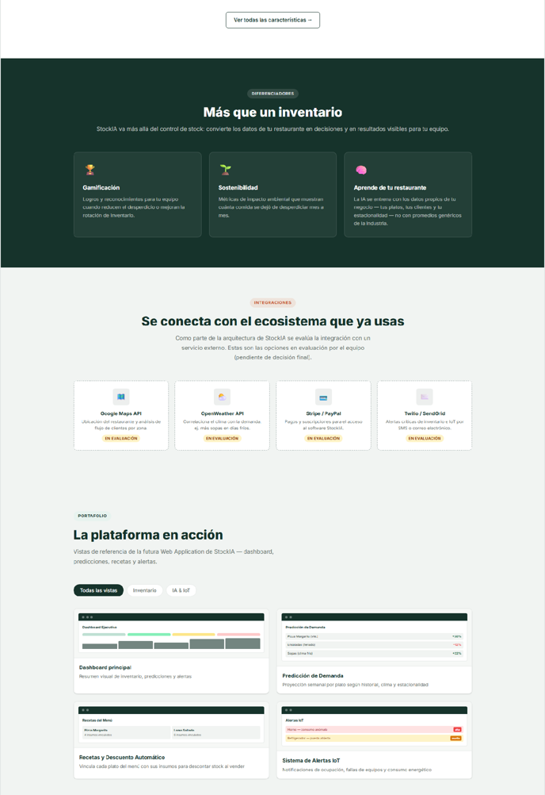
<br/><i>Artefacto: Figma</i></p>

<p align="center">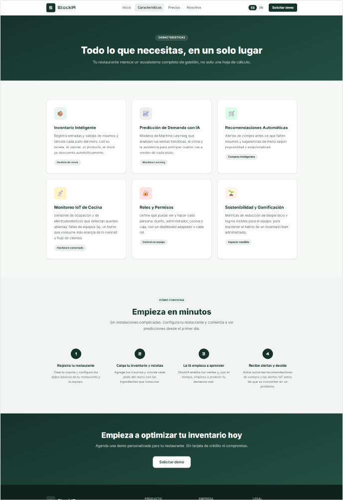
<br/><i>Artefacto: Figma</i></p>

<p align="center">
<br/><i>Artefacto: Figma</i></p>

<p align="center">
<br/><i>Artefacto: Figma</i></p>

<p align="center">
<br/><i>Artefacto: Figma</i></p>

## **4.4. Web Applications UX/UI Design**
Esta sección incluye secciones internas donde se presenta y explica la propuesta
visual y de interacción para las aplicaciones que constituyen la experiencia de
usuario con los productos digitales.

### 4.4.1. Web Applications Wireframes

1) **Wireframe 1:** 
**User Story relacionada:** US21 - Como administrador, quiero agregar, eliminar y modificar insumos en el inventario, para mantener actualizado el stock de mi restaurante.

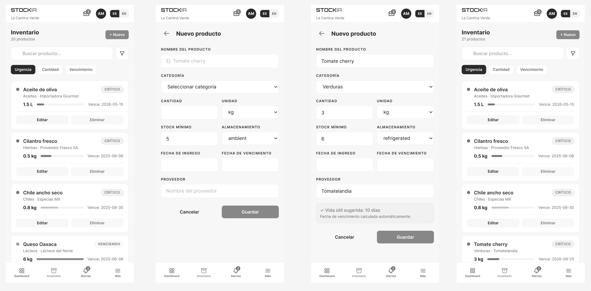


2) **Wireframe 2:** 
**User Story relacionada:** US22 - Como administrador, quiero guardar recetas con ingredientes vinculados al inventario, para que al venderse un plato se descuenten automáticamente los insumos.

3) **Wireframe 3:** 
**User Story relacionada:** US23 - Como administrador, quiero ver un dashboard con métricas de stock y alertas, para tomar decisiones rápidas sobre insumos críticos.


4) **Wireframe 4:** 
**User Story relacionada:** US24 - Como administrador, quiero asignar roles a empleados, para que cada uno tenga recomendaciones personalizadas y permisos adecuados dentro del sistema.

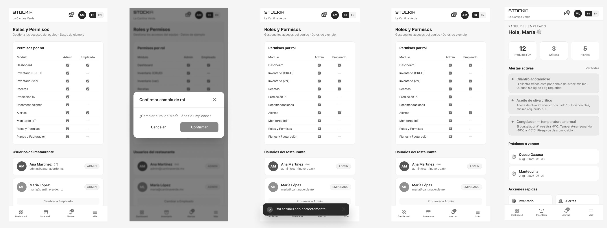


5) **Wireframe 5:** 
**User Story relacionada:** US25 - Como administrador, quiero que el sistema prediga la demanda según históricos de ventas y clima, para poder preparar insumos con anticipación.

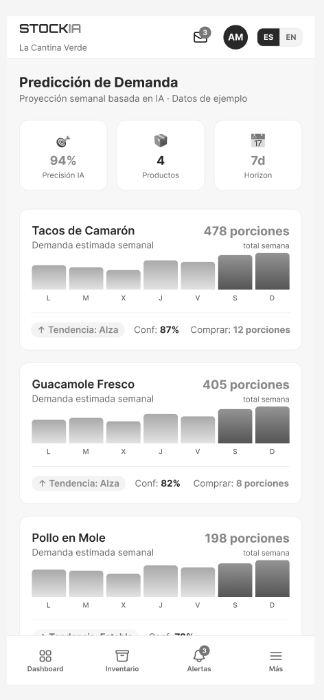


6) **Wireframe 6:** 
**User Story relacionada:** US26 - Como administrador, quiero recibir sugerencias de menú según popularidad y estacionalidad, para ajustar la oferta de mi restaurante.


7) **Wireframe 7:** 
**User Story relacionada:** US27 - Como administrador, quiero recibir alertas antes de que falten insumos, para poder comprar con tiempo y evitar quiebres de stock.

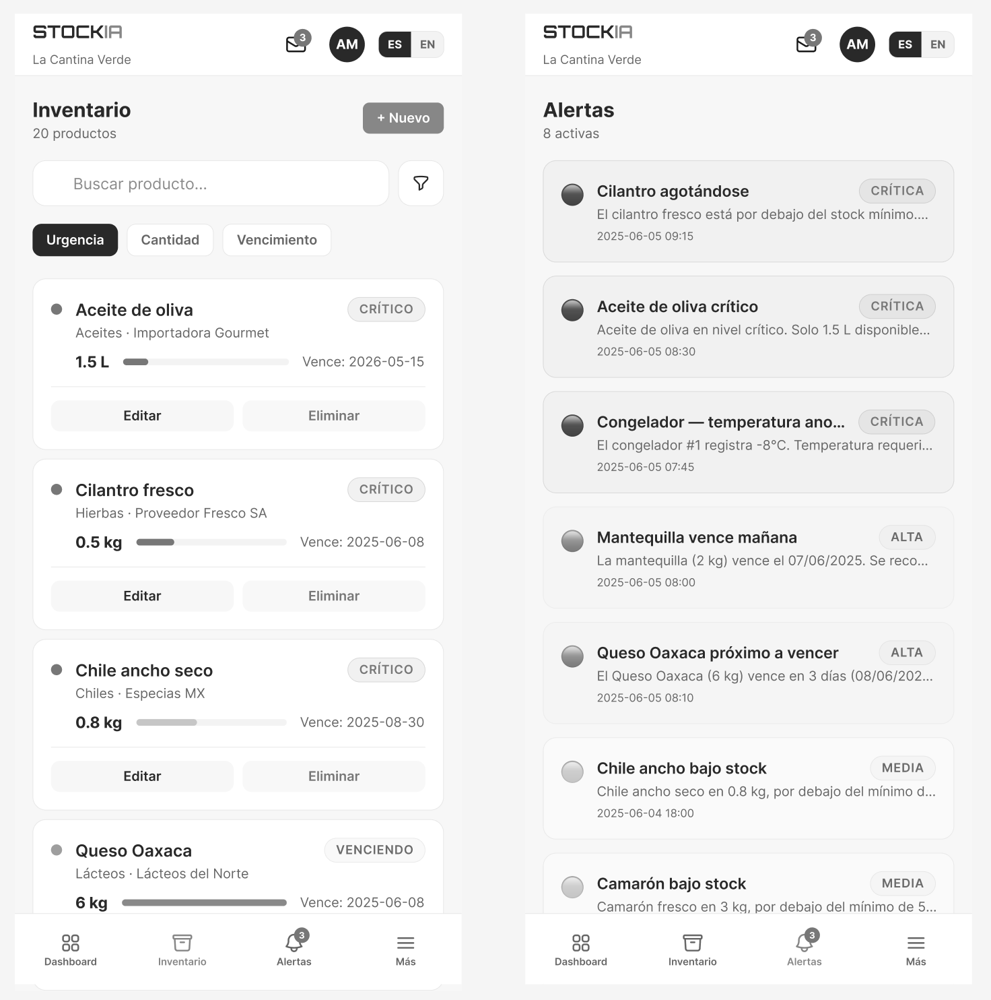


8) **Wireframe 8:** 
**User Story relacionada:** US28 - Como empleado, quiero recibir sugerencias y alertas en mi WhatsApp, para poder actuar rápido sin necesidad de entrar al sistema.

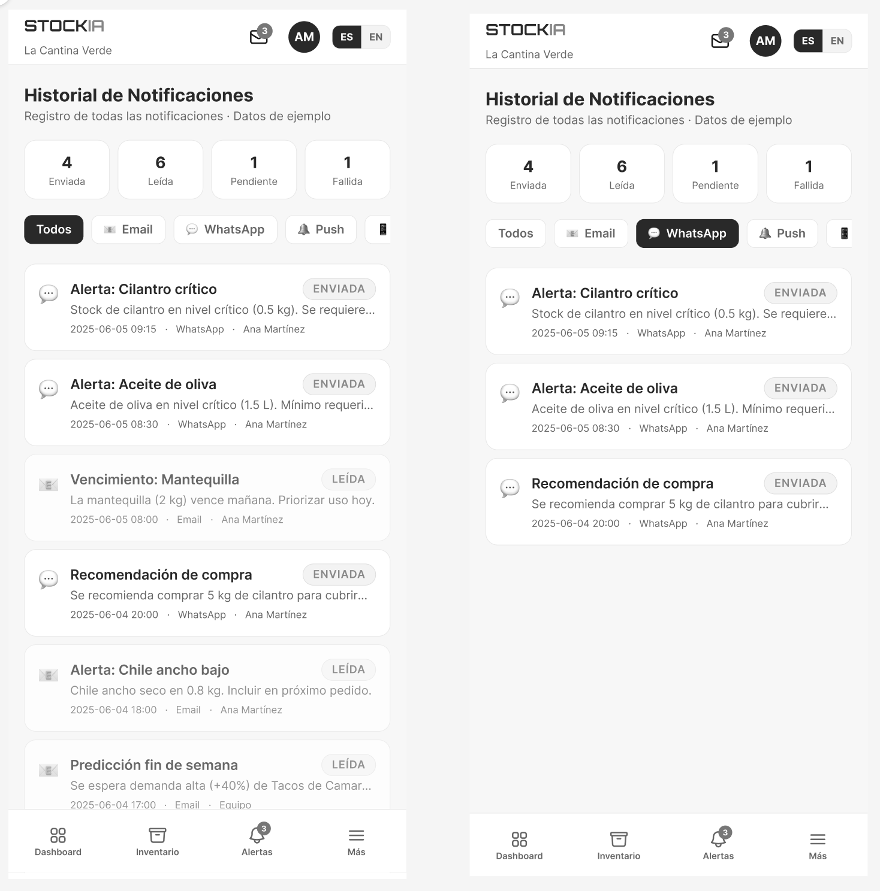


9) **Wireframe 9:** 
**User Story relacionada:** US29 - Como nuevo usuario, quiero registrarme en StockIA con mis datos, para poder acceder al sistema y configurar mi restaurante.


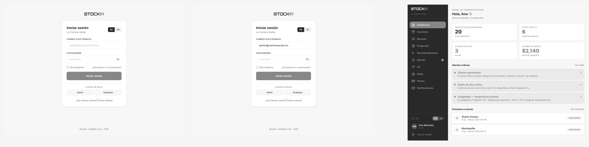

10) **Wireframe 10:** 
**User Story relacionada:** US30 - Como usuario registrado, quiero iniciar sesión con mis credenciales, para poder acceder a mi dashboard personalizado.


11) **Wireframe 11:** 
**User Story relacionada:** US31 - Como administrador, quiero pagar mi suscripción con Stripe o PayPal, para poder seguir usando StockIA sin interrupciones.


12) **Wireframe 12:** 
**User Story relacionada:** US32 - Como administrador, quiero recibir alertas críticas por correo vía SendGrid, para tener un historial documentado de los eventos importantes.


13) **Wireframe 13:** 
**User Story relacionada:** US33 - Como administrador, quiero recibir SMS críticos vía Twilio, para poder reaccionar rápido ante emergencias en tiempo real.


14) **Wireframe 14:** 
**User Story relacionada:** US34 - Como administrador, quiero que el sistema consulte una API externa de vida útil de alimentos, para asignar automáticamente un tiempo de conservación estándar a cada insumo.


15) **Wireframe 15:** 
**User Story relacionada:** US35 - Como administrador, quiero poder modificar la vida útil sugerida por la API, para ajustarla a las condiciones reales de mi restaurante.


16) **Wireframe 16:** 
**User Story relacionada:** US36 - Como administrador, quiero que el sistema calcule automáticamente la fecha límite de consumo según la vida útil registrada, para recibir alertas precisas de vencimiento.


17) **Wireframe 17:** 
**User Story relacionada:** US37 - Como administrador, quiero que el sistema recopile automáticamente los datos de ventas diarias, para que el modelo de Machine Learning pueda analizarlos y detectar patrones de consumo.


### **4.4.2. Web Applications Wireflow Diagrams**
1) **Wireflow 1:** 

- User goal: Como administrador, quiero agregar, eliminar y modificar insumos en el inventario

**User Story relacionada:** 
US21 - Como administrador, quiero agregar, eliminar y modificar insumos en el inventario, para mantener actualizado el stock de mi restaurante.

- mobile:
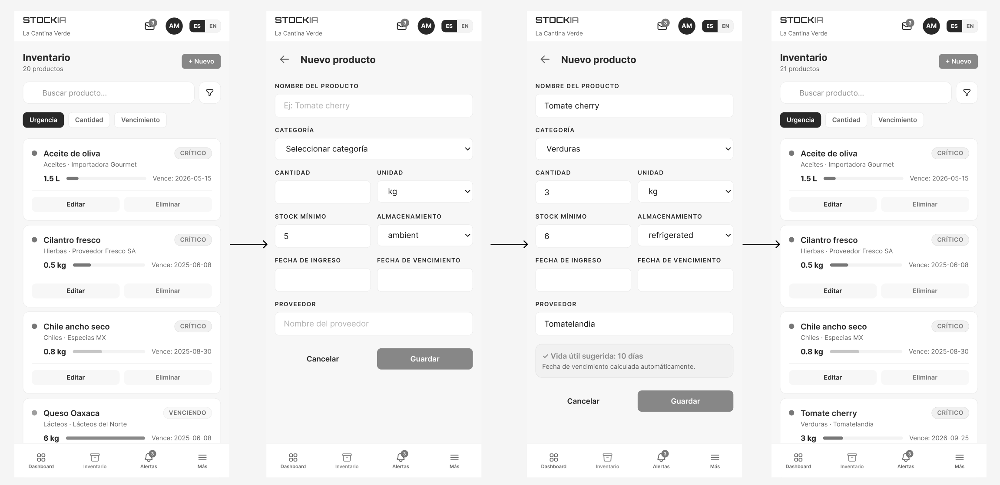

2) **Wireflow 2:** 

- User goal: Como administrador, quiero guardar recetas con ingredientes vinculados al inventario

**User Story relacionada:** US22 - Como administrador, quiero guardar recetas con ingredientes vinculados al inventario, para que al venderse un plato se descuenten automáticamente los insumos.

3) **Wireflow 3:** 

- User goal: Como administrador, quiero ver un dashboard con métricas de stock y alertas.

**User Story relacionada:** US23 - Como administrador, quiero ver un dashboard con métricas de stock y alertas, para tomar decisiones rápidas sobre insumos críticos.

- mobile: 
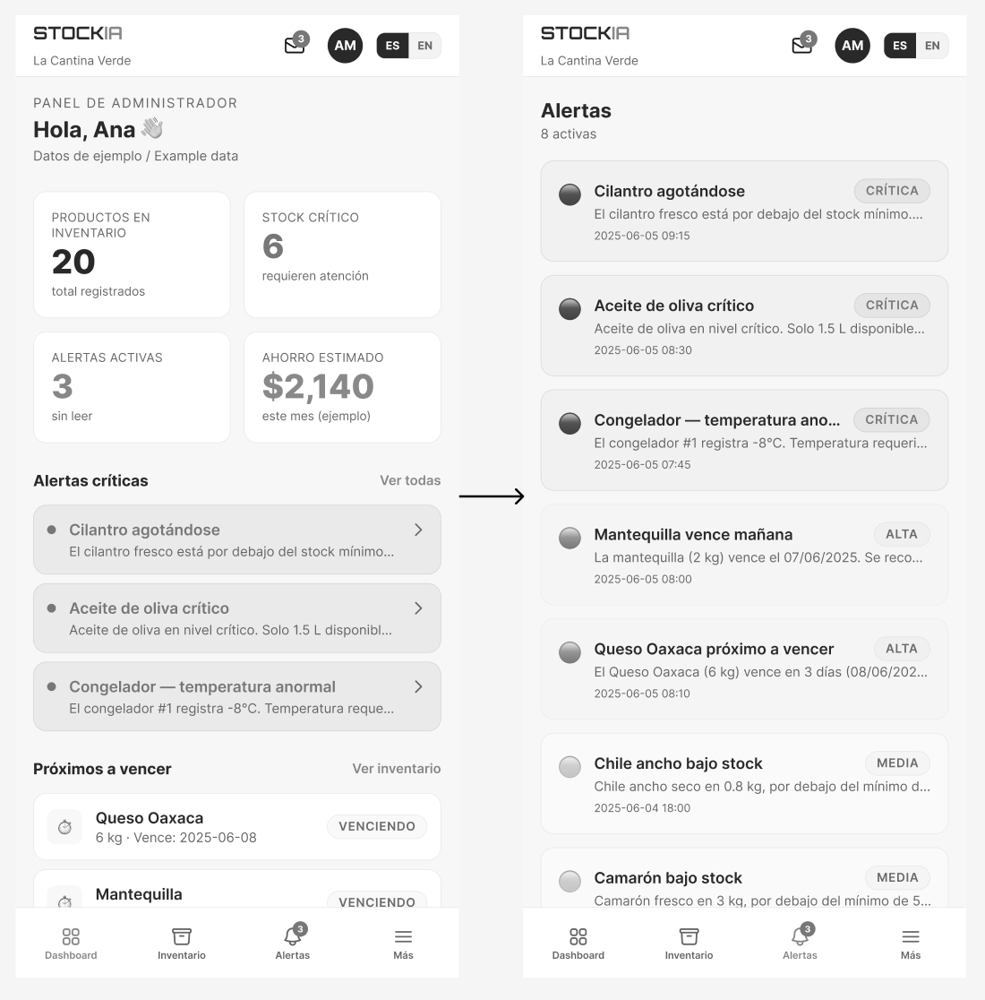

4) **Wireflow 4:** 

- User goal: Como administrador, quiero asignar roles a empleados.

**User Story relacionada:** US24 - Como administrador, quiero asignar roles a empleados, para que cada uno tenga recomendaciones personalizadas y permisos adecuados dentro del sistema.

- mobile: 


5) **Wireflow 5:** 

- User goal: Como administrador, quiero que el sistema prediga la demanda según históricos de ventas y clima.

**User Story relacionada:** US25 - Como administrador, quiero que el sistema prediga la demanda según históricos de ventas y clima, para poder preparar insumos con anticipación.

- mobile: 
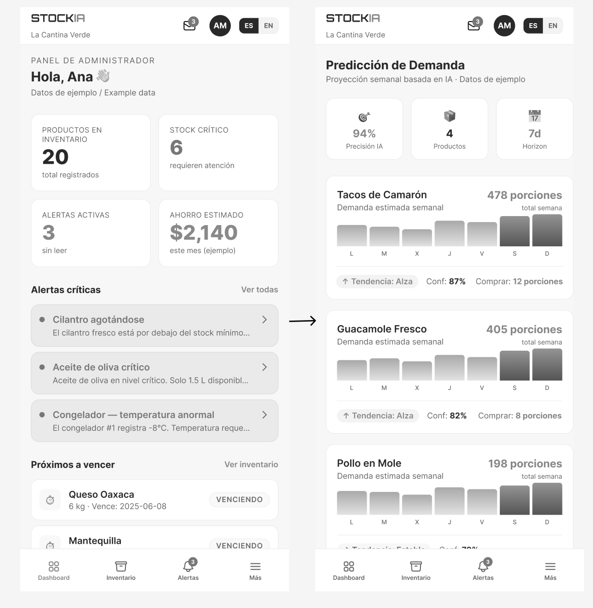

6) **Wireflow 6:** 

- User goal: Como administrador, quiero recibir sugerencias de menú según popularidad y estacionalidad.

**User Story relacionada:** US26 - Como administrador, quiero recibir sugerencias de menú según popularidad y estacionalidad, para ajustar la oferta de mi restaurante.


7) **Wireflow 7:**

- User goal: Como administrador, quiero recibir alertas antes de que falten insumos

**User Story relacionada:** US27 - Como administrador, quiero recibir alertas antes de que falten insumos, para poder comprar con tiempo y evitar quiebres de stock.

- mobile: 


8) **Wireflow 8:** 

- User goal: Como empleado, quiero recibir sugerencias y alertas en mi WhatsApp

**User Story relacionada:** US28 - Como empleado, quiero recibir sugerencias y alertas en mi WhatsApp, para poder actuar rápido sin necesidad de entrar al sistema.

- mobile: 


9) **Wireflow 9:**

- User goal: Como nuevo usuario, quiero registrarme en StockIA con mis datos.

**User Story relacionada:** US29 - Como nuevo usuario, quiero registrarme en StockIA con mis datos, para poder acceder al sistema y configurar mi restaurante.

- mobile: 
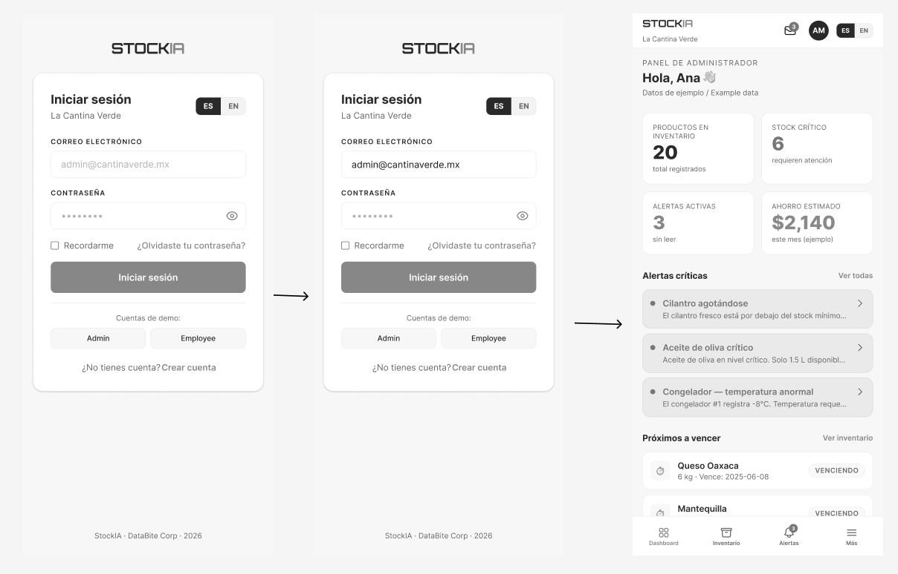

10) **Wireflow 10:**

- User goal: Como usuario registrado, quiero iniciar sesión con mis datos.

**User Story relacionada:** US30 - Como usuario registrado, quiero iniciar sesión con mis credenciales, para poder acceder a mi dashboard personalizado.

- mobile: 


11) **Wireflow 11:**

- User goal: Como administrador, quiero pagar mi suscripción.

**User Story relacionada:** US31 - Como administrador, quiero pagar mi suscripción con Stripe o PayPal, para poder seguir usando StockIA sin interrupciones.

- mobile: 


12) **Wireflow 12:**

- User goal: omo administrador, quiero recibir alertas críticas por correo.

**User Story relacionada:** US32 - Como administrador, quiero recibir alertas críticas por correo vía SendGrid, para tener un historial documentado de los eventos importantes.

- mobile: 


13) **Wireflow 13:**

- User goal: omo administrador, quiero que el sistema consulte la vida útil de alimentos

**User Story relacionada:** US34 - Como administrador, quiero que el sistema consulte una API externa de vida útil de alimentos, para asignar automáticamente un tiempo de conservación estándar a cada insumo.

- mobile: 


14) **Wireflow 14:**

- User goal: Como administrador, quiero poder modificar la vida útil sugerida.

**User Story relacionada:** US35 - Como administrador, quiero poder modificar la vida útil sugerida por la API, para ajustarla a las condiciones reales de mi restaurante.

- mobile: 


### **4.4.3. Web Applications Mock-ups**
1) **Mock-up 1:** 
**User Story relacionada:** US21 - Como administrador, quiero agregar, eliminar y modificar insumos en el inventario, para mantener actualizado el stock de mi restaurante.


2) **Mock-up 2:** 
**User Story relacionada:** US22 - Como administrador, quiero guardar recetas con ingredientes vinculados al inventario, para que al venderse un plato se descuenten automáticamente los insumos.


3) **Mock-up 3:** 
**User Story relacionada:** US23 - Como administrador, quiero ver un dashboard con métricas de stock y alertas, para tomar decisiones rápidas sobre insumos críticos.

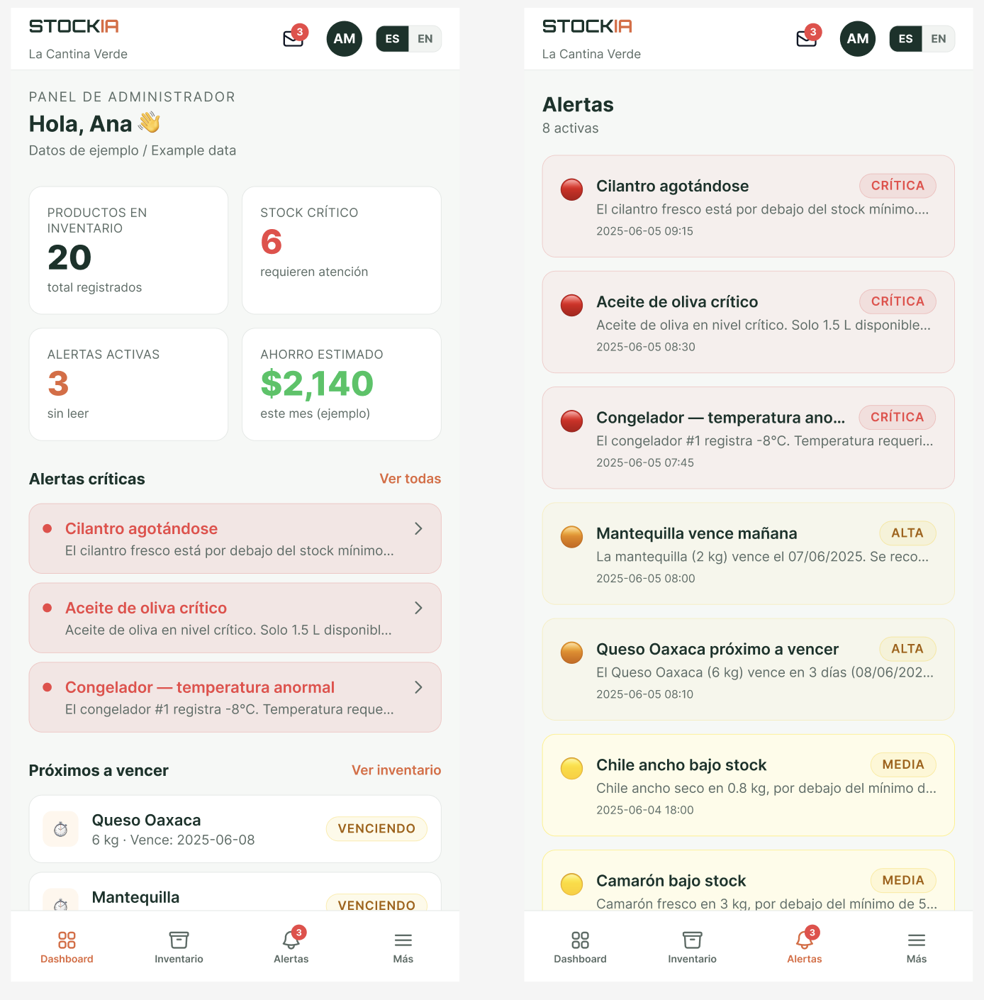


4) **Mock-up 4:** 
**User Story relacionada:** US24 - Como administrador, quiero asignar roles a empleados, para que cada uno tenga recomendaciones personalizadas y permisos adecuados dentro del sistema.

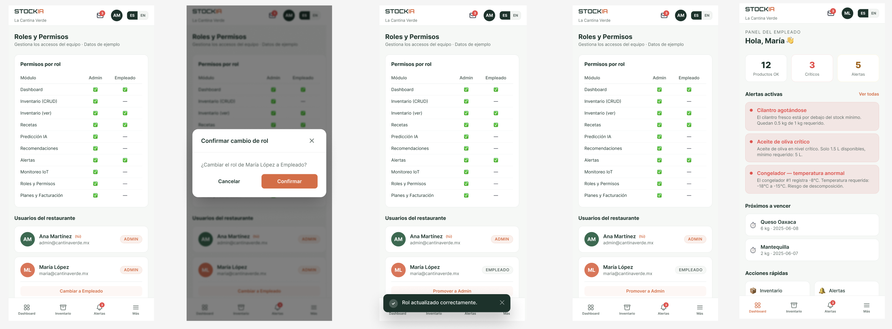


5) **Mock-up 5:** 
**User Story relacionada:** US25 - Como administrador, quiero que el sistema prediga la demanda según históricos de ventas y clima, para poder preparar insumos con anticipación.


6) **Mock-up 6:** 
**User Story relacionada:** US26 - Como administrador, quiero recibir sugerencias de menú según popularidad y estacionalidad, para ajustar la oferta de mi restaurante.


7) **Mock-up 7:** 
**User Story relacionada:** US27 - Como administrador, quiero recibir alertas antes de que falten insumos, para poder comprar con tiempo y evitar quiebres de stock.


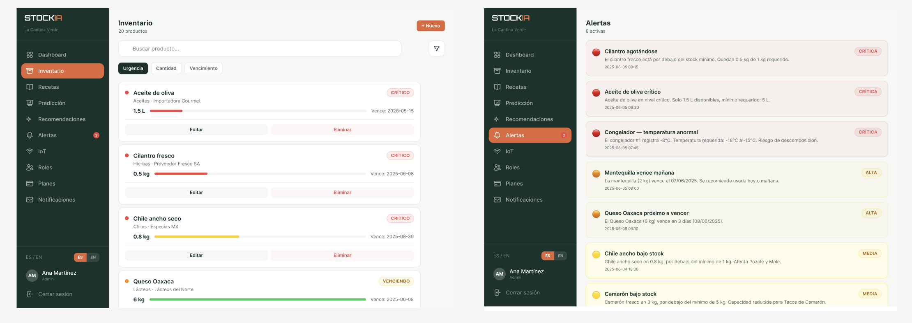

8) **Mock-up 8:** 
**User Story relacionada:** US28 - Como empleado, quiero recibir sugerencias y alertas en mi WhatsApp, para poder actuar rápido sin necesidad de entrar al sistema.

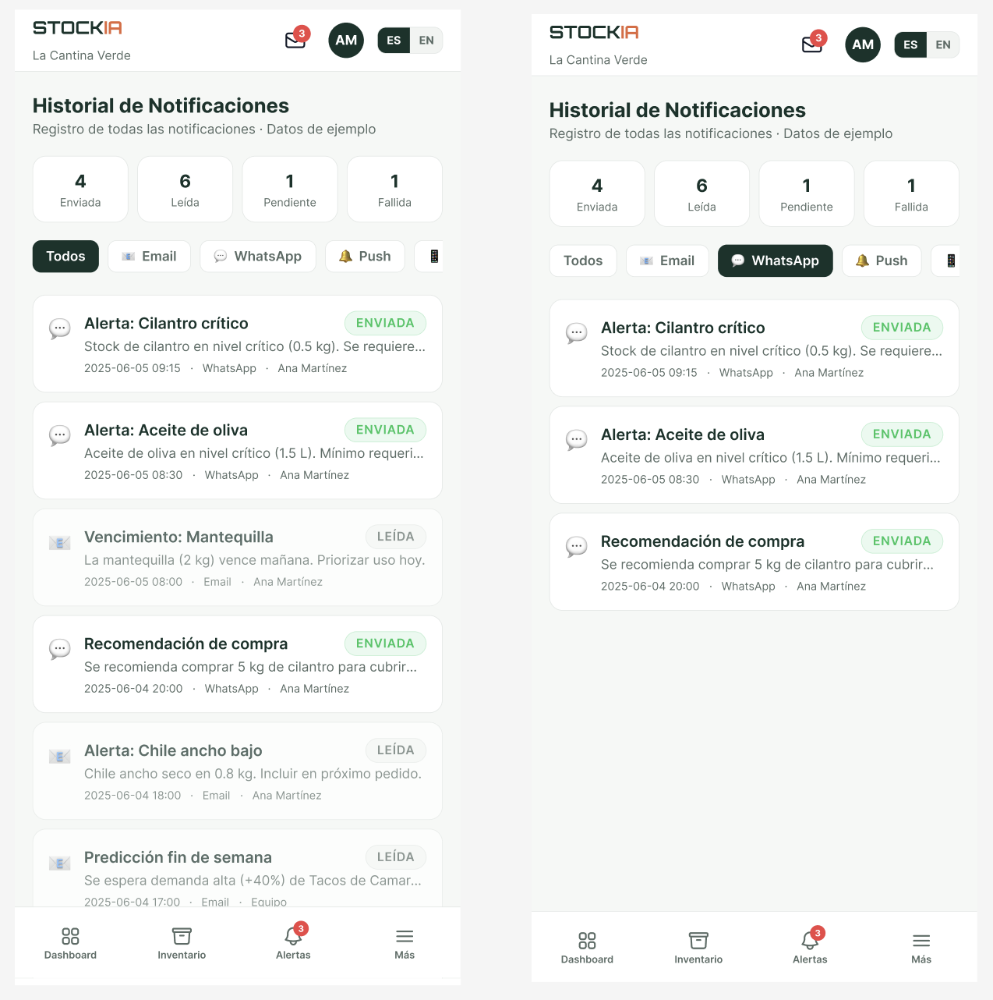
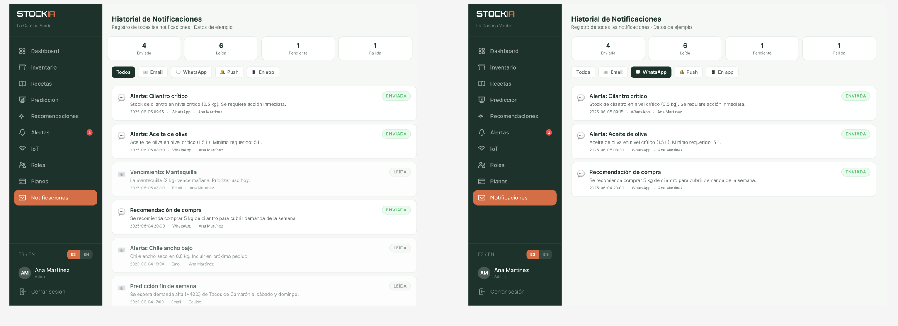
9) **Mock-up 9:** 
**User Story relacionada:** US29 - Como nuevo usuario, quiero registrarme en StockIA con mis datos, para poder acceder al sistema y configurar mi restaurante.

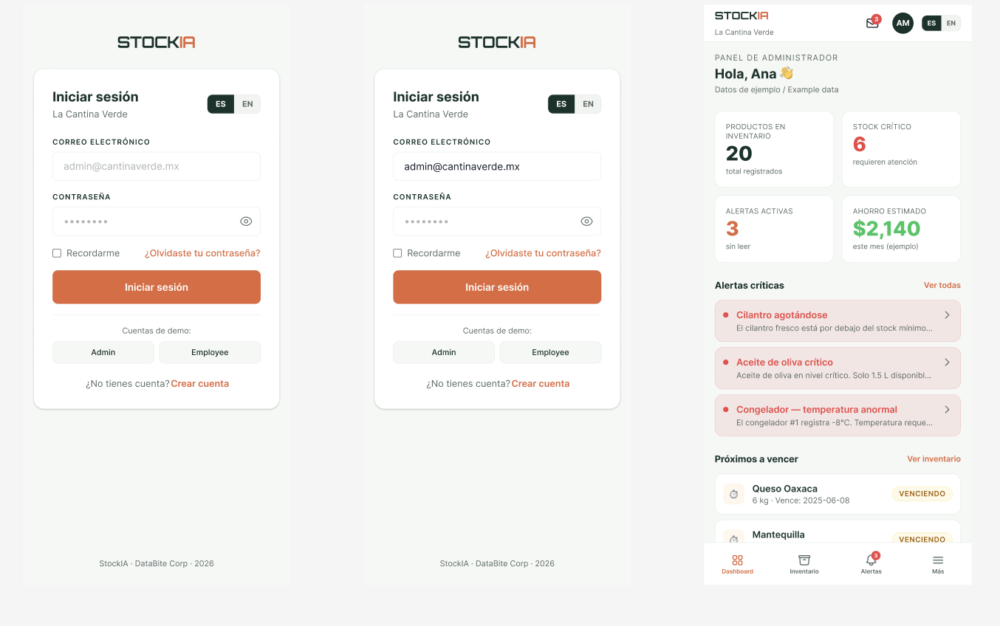


10) **Mock-up 10:** 
**User Story relacionada:** US30 - Como usuario registrado, quiero iniciar sesión con mis credenciales, para poder acceder a mi dashboard personalizado.

|  |  |  |
|---------------------------------------------|---------------------------------------------|---------------------------------------------|
|  |  |  |

|  |  |
|---------------------------------------------|---------------------------------------------|
|  |  |

11) **Mock-up 11:** 
**User Story relacionada:** US31 - Como administrador, quiero pagar mi suscripción con Stripe o PayPal, para poder seguir usando StockIA sin interrupciones.

|  |  |  |
|---------------------------------------------|---------------------------------------------|---------------------------------------------|

| |  |
|---------------------------------------------|---------------------------------------------|

| |  |
|---------------------------------------------|---------------------------------------------|

| |  |
|---------------------------------------------|---------------------------------------------|


12) **Mock-up 12:** 
**User Story relacionada:** US32 - Como administrador, quiero recibir alertas críticas por correo vía SendGrid, para tener un historial documentado de los eventos importantes.

|  |  |  |
|---------------------------------------------|---------------------------------------------|---------------------------------------------|

|  | |
|---------------------------------------------|---------------------------------------------|


13) **Mock-up 13:** 
**User Story relacionada:** US33 - Como administrador, quiero recibir SMS críticos vía Twilio, para poder reaccionar rápido ante emergencias en tiempo real.

|  |  | 
|---------------------------------------------|---------------------------------------------|
|  |  | 

14) **Mock-up 14:** 
**User Story relacionada:** US34 - Como administrador, quiero que el sistema consulte una API externa de vida útil de alimentos, para asignar automáticamente un tiempo de conservación estándar a cada insumo.

|  |  | 
|---------------------------------------------|---------------------------------------------|
|  |  |

15) **Mock-up 15:** 
**User Story relacionada:** US35 - Como administrador, quiero poder modificar la vida útil sugerida por la API, para ajustarla a las condiciones reales de mi restaurante.

|  |  | 
|---------------------------------------------|---------------------------------------------|
|  |  | 

16) **Mock-up 16:** 
**User Story relacionada:** US36 - Como administrador, quiero que el sistema calcule automáticamente la fecha límite de consumo según la vida útil registrada, para recibir alertas precisas de vencimiento.


17) **Mock-up 17:** 
**User Story relacionada:** US37 - Como administrador, quiero que el sistema recopile automáticamente los datos de ventas diarias, para que el modelo de Machine Learning pueda analizarlos y detectar patrones de consumo


### **4.4.4. Web Applications User Flow Diagrams**

1) **User flow 1:** 

- User goal: Como administrador, quiero agregar, eliminar y modificar insumos en el inventario.

**User Story relacionada:** 
US21 - Como administrador, quiero agregar, eliminar y modificar insumos en el inventario, para mantener actualizado el stock de mi restaurante.


#### Happy Path — Registro Exitoso de Nuevo Producto

1) El usuario ingresa a la sección "Inventario" de StockIA.
2) Hace clic en el botón "+ Nuevo".
3) El sistema muestra el formulario "Nuevo producto".
4) El usuario completa correctamente la información del producto:
   - Nombre del producto.
   - Categoría.
   - Cantidad.
   - Unidad.
   - Stock mínimo.
   - Almacenamiento.
   - Fecha de ingreso.
   - Fecha de vencimiento.
   - Proveedor.
5) Hace clic en el botón "Guardar".
6) El sistema valida la información ingresada.
7) ¿La información de la tarjeta está vacía? → No.
8) El sistema registra correctamente el nuevo producto.
9) El sistema redirige al usuario a la sección "Inventario".
10) El nuevo producto aparece correctamente en la lista de inventario.

#### Unhappy Path — Información incompleta o inválida
1) El usuario ingresa a la sección "Inventario" de StockIA.
2) Hace clic en el botón "+ Nuevo".
3) El sistema muestra el formulario "Nuevo producto".
4) El usuario deja uno o más campos obligatorios vacíos o introduce información inválida.
5) Hace clic en el botón "Guardar".
6) El sistema valida la información ingresada.
7) ¿La información de la tarjeta está vacía? → Sí.
8) El sistema no permite guardar el producto.
9) El sistema muestra los campos que presentan errores en color rojo.
10) El sistema muestra mensajes de validación, por ejemplo:
   - "Campo requerido".
   - "Cantidad inválida".
11) El usuario debe completar o corregir la información solicitada.
12) El usuario hace clic nuevamente en "Guardar".
13) El sistema vuelve a validar la información.
14) Si todos los campos son válidos, el sistema registra el nuevo producto y lo muestra en la sección "Inventario".


2. **User flow 2:**

- User goal: Como nuevo usuario, quiero registrarme en StockIA con mis datos.

**User Story relacionada:** US29 - Como nuevo usuario, quiero registrarme en StockIA con mis datos, para poder acceder al sistema y configurar mi restaurante.


#### Happy Path — Camino Feliz del Inicio de Sesión y Recuperación
1) El usuario abre la pantalla de inicio de sesión de StockIA.
2) Introduce su correo electrónico correcto y su contraseña correcta.
3) Hace clic en el botón "Iniciar sesión".
4) El sistema valida las credenciales correctamente.
5) El sistema redirige al usuario al Panel de Administrador (Dashboard) de StockIA.

#### Unhappy Path 1 — Credenciales erróneas en el Login
1) El usuario introduce un correo electrónico o una contraseña incorrectos.
2) Hace clic en el botón "Iniciar sesión".
3) El sistema valida las credenciales.
4) ¿La información ingresada es incorrecta? → Sí.
5) El sistema bloquea el acceso.
6) El sistema muestra una alerta en color rojo:
7) El usuario debe corregir sus datos e intentar iniciar sesión nuevamente.

#### Unhappy Path 2 — Fallo en la recuperación por correo no registrado o inválido
1) El usuario intenta iniciar sesión, pero no recuerda su contraseña.
2) Hace clic en "¿Olvidaste tu contraseña?".
3) El sistema muestra la pantalla de recuperación de contraseña.
4) El usuario introduce un correo electrónico que está registrado en el sistema.
5) Hace clic en "Enviar instrucciones".
6) El sistema valida el correo ingresado.
7) ¿El correo es válido y está registrado? → Sí.
8) El sistema acepta la solicitud.


3. **User flow 3:** 

- User goal: Como usuario registrado, quiero iniciar sesión con mis datos.

**User Story relacionada:** 
US30 - Como usuario registrado, quiero iniciar sesión con mis credenciales, para poder acceder a mi dashboard personalizado.


#### Happy Path - Inicio de Sesión exitoso
1) El usuario llega a la pantalla de **Iniciar sesión**.
2) Ingresa correo y contraseña (ej. `admin@cantinaverde.mx`).
3) El sistema valida: **¿Datos correctos?** → **Sí**
4) Accede al **Dashboard** con su panel de administrador (productos en inventario, stock crítico, alertas activas, ahorro estimado, etc.).

#### Unhappy path - Datos incorrectos al iniciar sesión
- **Credenciales incorrectas:** si los datos no son correctos, el sistema muestra el mensaje *"Credenciales incorrectas. Verifica tu email y contraseña"* y regresa al formulario de login.
- **Olvidó su contraseña:** desde el login, el usuario puede pulsar *"¿Olvidaste tu contraseña?"* → ingresa su correo → el sistema envía instrucciones → pantalla de confirmación *"¡Instrucciones enviadas!"* → botón *"Volver al Login"*.

4. **User flow 4:** 

- User goal: Como administrador, quiero pagar mi suscripción.

**User Story relacionada:** 
US31 - Como administrador, quiero pagar mi suscripción con Stripe o PayPal, para poder seguir usando StockIA sin interrupciones.


#### Happy path - Pago de plan exitoso
1) El usuario visualiza los **Planes de StockIA** y selecciona uno (ej. Starter).
2) Va al **Checkout**, completa los datos de la tarjeta y pulsa **"Pagar"**.
3) El pago se procesa correctamente → pantalla **"¡Suscripción activada!"** con resumen del plan.
4) En una renovación futura, el flujo es análogo → **"¡Suscripción renovada!"**.

#### Unhappy path - Error al realizar pago
- **Pago rechazado:** al intentar pagar, el sistema muestra el error *"Pago rechazado. Intenta con otro método"* dentro del mismo checkout.
- El usuario puede pulsar **"Reintentar"** para volver a intentar el pago o regresar a la selección de plan.

5. **User flow 5:** 

- User goal: Como administrador, quiero recibir alertas críticas por correo.

**User Story relacionada:** 
US32 - Como administrador, quiero recibir alertas críticas por correo vía SendGrid, para tener un historial documentado de los eventos importantes.


#### Happy path
1) Desde el Dashboard, el usuario **recibe alertas** (críticas, altas, medias).
2) Puede entrar al detalle de una alerta (ej. *"Cilantro agotándose"*) y **marcarla como resuelta** o **enviarla por WhatsApp**.
3) También puede consolidar el historial de alertas y pulsar **"Generar resumen"**.
4) El sistema confirma: *"Resumen generado y enviado al correo electrónico"*.

6. **User flow 6:** 

- User goal: Como administrador, quiero que el sistema consulte la vida útil de alimentos.

**User Story relacionada:** 
US34 - Como administrador, quiero que el sistema consulte una API externa de vida útil de alimentos, para asignar automáticamente un tiempo de conservación estándar a cada insumo.


#### Happy path
1) El usuario pulsa **"+ Nuevo"** en Inventario.
2) Llena el formulario **"Nuevo producto"** (nombre, categoría, cantidad, stock mínimo, etc.).
3) El sistema evalúa: **¿Producto encontrado en la API?** → **Sí**
4) Se autocompletan datos como categoría, stock mínimo sugerido y **"Vida útil sugerida"** (ej. 10 días).
5) El usuario guarda el producto.
#### Unhappy path
1) El sistema evalúa: **¿Producto encontrado en la API?** → **No**
2) Se muestra el mensaje *"No se encontró información de vida útil"* con la opción **"Ingresar manualmente"**.
3) El usuario completa los campos faltantes por su cuenta y guarda el producto igualmente.

7. **User flow 7:** 

- User goal: Como administrador, quiero poder modificar la vida útil sugerida.

**User Story relacionada:** 
US35 - Como administrador, quiero poder modificar la vida útil sugerida por la API, para ajustarla a las condiciones reales de mi restaurante.


#### Happy path
1) El usuario pulsa **"Editar"** sobre un producto existente (ej. Tomate cherry).
2) Se abre el formulario con los datos precargados.
3) Modifica algún campo, como el almacenamiento (de *"ambient"* a *"frozen"*).
4) El sistema recalcula automáticamente la **"Vida útil sugerida"** (de 10 a 30 días) según el nuevo dato.
5) El usuario pulsa **"Guardar"** y los cambios se aplican.

## **4.5. Web Applications Prototyping**
###### Desktop & Mobile Web Browser | Simulación de Interacción y Navegación

**Mobile Prototype**


[Click aquí...](https://upcedupe-my.sharepoint.com/:v:/g/personal/u202414970_upc_edu_pe/IQAeJ5En9ZXKQKKlsRmwBNEOAf4JqGZAxDCajfDW6xUogYo?e=FLUb7s&nav=eyJyZWZlcnJhbEluZm8iOnsicmVmZXJyYWxBcHAiOiJTdHJlYW1XZWJBcHAiLCJyZWZlcnJhbFZpZXciOiJTaGFyZURpYWxvZy1MaW5rIiwicmVmZXJyYWxBcHBQbGF0Zm9ybSI6IldlYiIsInJlZmVycmFsTW9kZSI6InZpZXcifX0%3D)


**Mobile**


**Desktop Prototype**

[Click aquí...](https://upcedupe-my.sharepoint.com/:v:/g/personal/u202414970_upc_edu_pe/IQDpE1STAw4TSqwn-sFXAO-ZAcpqo0nHY2u1g9JJ-eK467A?e=ifAiA8&nav=eyJyZWZlcnJhbEluZm8iOnsicmVmZXJyYWxBcHAiOiJTdHJlYW1XZWJBcHAiLCJyZWZlcnJhbFZpZXciOiJTaGFyZURpYWxvZy1MaW5rIiwicmVmZXJyYWxBcHBQbGF0Zm9ybSI6IldlYiIsInJlZmVycmFsTW9kZSI6InZpZXcifX0%3D)


**Desktop**


## **4.6. Domain-Driven Software Architecture**
### **4.6.1. Design-Level EventStorming**
### **4.6.2. Software Architecture Context Diagram**
### **4.6.3. Software Architecture Container Diagrams**

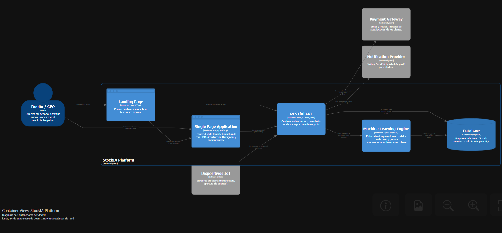 <br>

### **4.6.4. Software Architecture Components Diagrams**

#### Analytics and Dashboard 

 <br>

#### IAM 
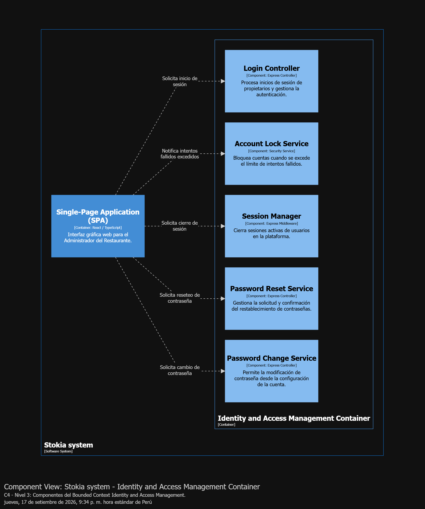 <br>

#### ML and Recommendations

 <br>

#### Notifications and messaging

 <br>

#### Recipes Management 

 <br>

#### Restaurant Registration 

 <br>

#### Stock Management 

 <br>


#### Subscription and Payments Management

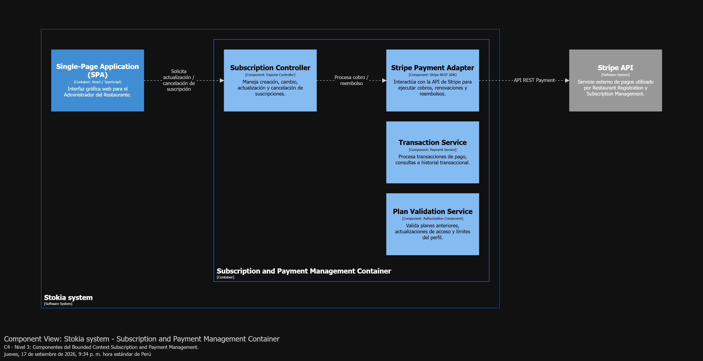 <br>


## **4.7. Object-Oriented Design Software**
### **4.7.1. Class Diagrams**

Los diagramas de clases presentados a continuación detallan la estructura interna de los componentes del Front-End para contextos clave de StockIA. Se ilustra la separación de responsabilidades entre la capa de Presentación (UI Components), la lógica de Aplicación y Estado (Controllers y Stores), los Modelos de Vista (View Models) y la Infraestructura (API Clients).

#### Notifications & Messaging (Front-End)
Este diagrama modela la estructura de componentes encargados de mostrar y gestionar las notificaciones y alertas críticas para el usuario (como stock bajo o vencimientos). Incluye componentes como `NotificationCenterView` y `NotificationBadgeComponent`, los cuales interactúan con `NotificationController` y `NotificationStore`.

**Consideraciones y restricciones de diseño:**
- **Seguridad e Integración:** El Front-End se comunica de forma exclusiva con el backend de StockIA. Las integraciones con servicios de mensajería (SendGrid, WhatsApp y SMS) deben mantenerse ocultas detrás de la API. Bajo ninguna circunstancia se deben exponer credenciales de estos proveedores en el navegador.
- **Sincronización de Contratos:** El enumerador `AlertType` refleja exactamente el contrato actual definido en la base de datos (`schema.sql`). Actualmente, el estado de entrega por destinatario no está disponible en la vista, funcionalidad que estará restringida hasta que el backend exponga los registros correspondientes de entrega y destinatario.

 <br>

#### Subscriptions & Payments (Front-End)
Este diagrama describe la arquitectura de clases del lado del cliente para la gestión de planes y pagos. Se compone de vistas como `SubscriptionStatusView` y `AvailablePlansView`, respaldadas por `SubscriptionController`, `PaymentController` y `SubscriptionStore`.

**Consideraciones y restricciones de diseño:**
- **Procesamiento de Pagos Seguros:** El navegador (Front-End) utiliza `Stripe.js` única y exclusivamente para *tokenizar* la información de pago. Todas las operaciones sensibles de cobro, renovación de suscripción y autorización de reembolsos están delegadas y aseguradas en el backend.
- **Limitaciones de Planes:** La vista `PlanLimitsView` requiere información sobre los límites de los planes. Dado que el esquema actual aún no cuenta con persistencia para los límites de planes, el contrato de la API deberá proveer estos datos provisionales antes de que el componente sea completamente funcional.

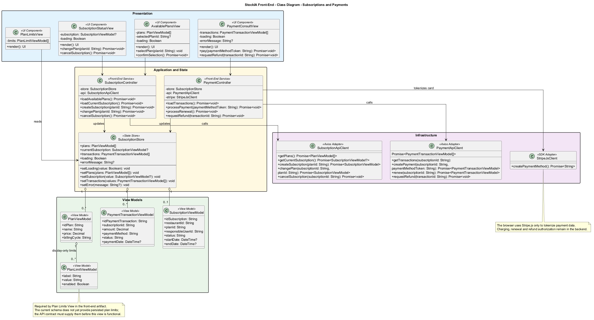 <br>

#### Identity & Access Management (Front-End)

Este diagrama modela la estructura de componentes encargados de la autenticación, gestión de sesión y administración de usuarios de StockIA, que ahora soporta dos roles por restaurante: Administrador (CEO/dueño) y Trabajador. Incluye componentes como `LoginFormComponent`, `AccountProfileView` y `UserManagementView`, los cuales interactúan con `AuthController` y `AuthStore`.

**Consideraciones y restricciones de diseño:**

- **Seguridad e Integración:** El Front-End se comunica de forma exclusiva con el backend de StockIA. El backend es la única fuente autoritativa de autorización: la verificación de rol en el front-end es solo una conveniencia de experiencia de usuario, no un mecanismo de seguridad.
- **Sincronización de Contratos:** El enumerador UserRole refleja exactamente el contrato de la tabla roles definida en la base de datos, con los valores `ADMINISTRATOR` y `WORKER`.

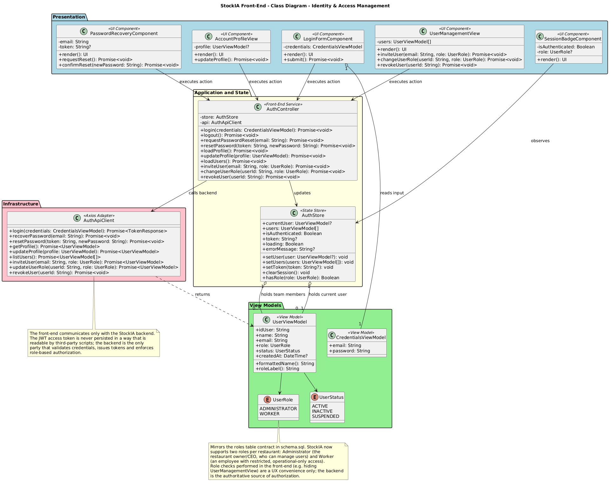 <br>

#### Restaurant Registration (Front-End)

Este diagrama modela la estructura de componentes encargados del registro y la gestión del perfil del restaurante asociado al único administrador de StockIA. Incluye componentes como `RestaurantRegistrationFormComponent` y `RestaurantProfileView`, los cuales interactúan con `RestaurantController` y `RestaurantStore`.

**Consideraciones y restricciones de diseño:**

- **Seguridad e Integración:** El Front-End se comunica de forma exclusiva con el backend de StockIA. Todos los endpoints de restaurante están protegidos: cada llamada requiere el JWT emitido por la sesión de Identity & Access, y el administratorId se deriva de ese token, nunca de un dato ingresado por el usuario.
- **Sincronización de Contratos:** Los enumeradores BusinessType y RestaurantStatus reflejan exactamente el contrato actual definido en la base de datos. Actualmente no se modelan campos de sucursal en la vista, ya que StockIA registra un único restaurante por administrador, sin soporte multi-sucursal.

 <br>

## **4.8. Database Design**
En esta sección se presentan los diagramas de base de datos diseñados para asegurar la persistencia de la información en StockIA. La base de datos sigue un enfoque relacional, y el diseño se ha estructurado dividiéndolo por cada Bounded Context identificado, de manera que cada módulo gestiona sus propias tablas, columnas y relaciones (llaves primarias y foráneas). Esto facilita el mantenimiento, la escalabilidad y mantiene la coherencia con la arquitectura orientada a dominios (Domain-Driven Design).
## **4.8. Database Design**
En esta sección se presentan los diagramas de base de datos diseñados para asegurar la persistencia de la información en StockIA. La base de datos sigue un enfoque relacional, y el diseño se ha estructurado dividiéndolo por cada Bounded Context identificado, de manera que cada módulo gestiona sus propias tablas, columnas y relaciones (llaves primarias y foráneas). Esto facilita el mantenimiento, la escalabilidad y mantiene la coherencia con la arquitectura orientada a dominios (Domain-Driven Design).

### **4.8.1. Database Diagrams**

#### Diagrama de Base de Datos General
Este diagrama presenta una vista global de todas las tablas de la base de datos de StockIA y cómo se relacionan los diferentes contextos entre sí, mostrando la estructura completa del sistema relacional.

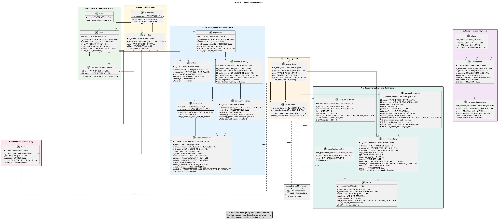 <br>

#### Identity & Access Management
Este diagrama modela la persistencia de los usuarios, credenciales, roles y permisos. Permite controlar quién tiene acceso al sistema y qué acciones puede realizar, garantizando la seguridad en el acceso de administradores y empleados.

 <br>

#### Restaurant Registration
Este diagrama se enfoca en la información fundamental de los restaurantes o negocios registrados en la plataforma. Guarda los detalles de configuración, ubicaciones y datos principales que identifican a cada cliente.

 <br>

#### Subscriptions & Payments
Aquí se detallan las tablas responsables de gestionar los planes de pago, suscripciones (Esencial, Profesional, IoT Completo) y el historial de transacciones o pagos de los restaurantes, permitiendo el control de la facturación.

<br>

#### Stock Management & Sales Intake
Es uno de los diagramas centrales, responsable de gestionar el inventario en tiempo real. Modela los insumos, lotes, movimientos de entrada y salida, así como el registro de las ventas que impactan directamente en la reducción de stock.

 <br>

#### Recipes Management
Este contexto gestiona la composición de los platos. El diagrama de base de datos muestra cómo se relacionan los platos del menú con los insumos del inventario (recetas), permitiendo el descuento automático de stock cuando se registra una venta.

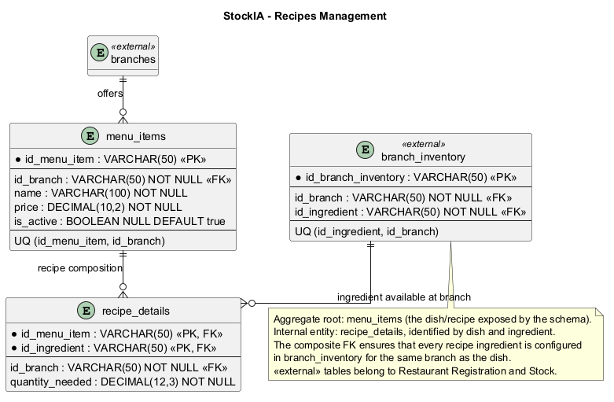 <br>

#### ML & Recommendations
Este diagrama estructura la información necesaria para los algoritmos de predicción de demanda e inteligencia artificial. Almacena el historial de predicciones, los patrones identificados y las recomendaciones de compras generadas para el restaurante.

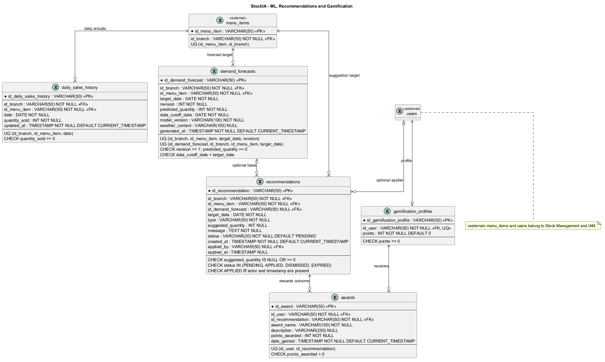 <br>

#### Notifications & Messaging
Diseñado para almacenar el historial de notificaciones y alertas críticas (stock bajo, productos por vencer, alertas IoT). Maneja el estado de entrega y los canales por los que fueron enviados (WhatsApp, Email, SMS).

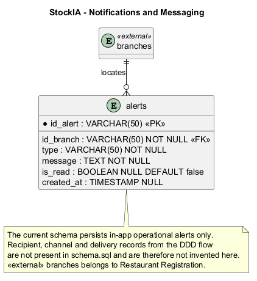 <br>

#### Analytics & Dashboard
Este diagrama soporta las consultas y métricas agregadas que se visualizan en el Dashboard principal. Almacena resúmenes estadísticos, reportes de mermas y ahorro, optimizando las consultas de lectura para una carga rápida de los gráficos.

 <br>