# **Chapter V: Product Implementation, Validation & Deployment**
## **5.1. Configuration Management Software**
### **5.1.1. Software Development Environment Configuration**
### **5.1.2. Source Code Management**
El equipo **DataBite Corp** utiliza **GitHub** como plataforma y sistema de control de versiones para todos los productos digitales de StockIA, lo que permite mantener un registro histórico de cambios, colaborar de forma estructurada y garantizar la trazabilidad durante todo el ciclo de desarrollo.

Para ello, se creó una organización pública que contiene los siguientes repositorios independientes:

| Solución | Nombre del repositorio | Enlace |
|---|---|---|
| Report (documentación en Markdown) | `stockia-report` | https://github.com/upc-pre-202620-1asi0730-16127-stockia/stockia-report.git |
| Website (Landing Page) | `stockia-website` | https://github.com/upc-pre-202620-1asi0730-16127-databit/stockia-website.git |
| WebApp (Frontend Web Application) | `stockia-webapp` | https://github.com/upc-pre-202620-1asi0730-16127-databit/stockia-webapp.git |
| Platform (RESTful Web Services) | `stockia-platform` | https://github.com/upc-pre-202620-1asi0730-16127-databit/stockia-platform-api.git |

En el caso del repositorio **`stockia-platform`**, este incluye tanto el proyecto principal del API como los archivos de pruebas, tanto unitarias como de integración / aceptación.

 <br>

---

## Implementación de GitFlow

El equipo adopta **GitFlow** como workflow de control de versiones, siguiendo el modelo propuesto por Vincent Driessen en *“A successful Git branching model”*.

Las ramas que se manejan en todos los repositorios son:

### `main`

Rama principal de producción. Solo recibe merges desde `release` o `hotfix`, y representa siempre el código estable y desplegado.

### `develop`

Rama de integración continua. Todas las features completadas se integran aquí antes de pasar a un release, y es la rama base para crear nuevos feature branches.

### `feature/<módulo>-<descripción-corta>`

Una rama por cada funcionalidad nueva.

Se crea desde `develop` y se integra nuevamente a `develop` mediante **Pull Request**, con revisión de al menos un miembro del equipo.

Ejemplos:

```text
feature/inventory-stock-management
feature/recipe-ingredient-linking
feature/demand-prediction
```

### `release/v<MAJOR>.<MINOR>.<PATCH>`
Rama para preparar una nueva versión de producción. Se crea desde `develop` cuando las features del Sprint están completas, permitiendo únicamente correcciones menores y actualización de versión. Se integra tanto a `main` como a `develop`.

**Ejemplo:**

```text
release/v1.2.0
```
### `hotfix/<descripción-corta>`
Rama para correcciones urgentes sobre producción. Se crea desde main y se integra gtanto a main como a develop.
**Ejemplo:**

```text
hotfix/stock-discount-error
```
Todas las ramas se nombran en inglés y aplicando kebab-case.

 <br>


## Semantic Versioning

El equipo aplica **Semantic Versioning 2.0.0** para el nombrado de releases, bajo el esquema `MAJOR.MINOR.PATCH`, donde **MAJOR** corresponde a cambios incompatibles con versiones anteriores del API, **MINOR** a nuevas funcionalidades compatibles con versiones anteriores, y **PATCH** a correcciones de errores compatibles. La primera versión funcional del producto será `v1.0.0`, correspondiente al entregable del Sprint 1.

## Conventional Commits

El equipo aplica la especificación **Conventional Commits** para todos los mensajes de commit, bajo la estructura `<tipo>(<alcance>): <descripción corta en inglés>`. Los tipos permitidos son:

| Tipo | Uso |
|---|---|
| `feat` | Nueva funcionalidad |
| `fix` | Corrección de error |
| `docs` | Cambios en documentación |
| `style` | Cambios de formato que no afectan la lógica |
| `refactor` | Refactorización sin nueva funcionalidad ni corrección |
| `test` | Adición o modificación de pruebas |
| `chore` | Tareas de mantenimiento, dependencias o configuración |

**Ejemplos aplicados al proyecto:**

```text
feat(inventory): add automatic ingredient deduction by recipe
fix(auth): correct expired token validation
docs(chapter-iv): add information architecture section
```
Este enfoque facilita la generación de historiales de cambios y mantiene un registro organizado y semántico del desarrollo.

 <br>


### **5.1.3. Source Code Style Guide & Conventions**
Como norma general, todo el código desarrollado en StockIA se redacta completamente en inglés, incluyendo nombres de variables, funciones, clases, archivos y comentarios, garantizando consistencia, mantenibilidad y alineación con estándares internacionales. Los nombres deben ser descriptivos y alineados al Ubiquitous Language del dominio (por ejemplo: `ingredient`, `recipe`, `stockLevel`, `demandForecast`, `expirationDate`), evitando ambigüedad.

## HTML

Se siguen el **HTML Style Guide and Coding Conventions (W3Schools)** y el **Google HTML/CSS Style Guide**:

- Etiquetas y atributos en minúsculas, con comillas dobles: `<section id="inventory-summary"></section>`
- Cierre correcto de todos los elementos.
- Inclusión de atributos de accesibilidad: ``
- Sangría de 2 espacios.

## CSS

Se sigue el **Google HTML/CSS Style Guide**:

- Clases e IDs en kebab-case: `.inventory-card`, `.alert-banner`
- Omitir unidades en valores cero: `margin: 0;`
- Uso de custom properties para colores y espaciado, evitando valores hardcodeados: `color: var(--primary);`
- Uso de unidades relativas (`rem`, `%`, `vh`) para responsive design.
- Evitar estilos inline; mantener la presentación en archivos `.css` separados.

## JavaScript

Se siguen el **Google JavaScript Style Guide**, las **MDN JavaScript Guidelines** y el **W3C JavaScript Style Guide**:

- camelCase para variables y funciones: `function calculateStockLevel() {}`
- Declaración con `const` y `let`, evitando `var`: `const stockThreshold = 10;`
- Uso de ES6+ (arrow functions, destructuring, template literals).
- Manejo de errores con `try/catch`.
- Evitar funciones excesivamente largas (máximo 20–30 líneas).

## Vue (Frontend Web Application)

Se sigue el **Vue Style Guide oficial**:

- Nombres de componentes en PascalCase: `InventoryDashboard`, `RecipeForm`
- Nombres de archivos de componente en PascalCase o kebab-case de forma consistente: `InventoryDashboard.vue`
- Uso de componentes en templates en kebab-case: `<inventory-dashboard />`
- Orden de bloques dentro de cada Single File Component: `<template>`, `<script>`, `<style>`
- Un componente por archivo, organizados por dominio funcional (`inventory`, `recipes`, `alerts`, `auth`).
- Props siempre con tipo definido y valor por defecto cuando aplique.

## C# (RESTful API con ASP.NET Core)

Se siguen las **C# Coding Conventions** y las **Microsoft ASP.NET Core Coding Guidelines**:

- PascalCase para clases, métodos y propiedades públicas: `public class InventoryService { public void DeductIngredients() { } }`
- camelCase para variables locales y parámetros: `int stockQuantity;`
- UPPER_SNAKE_CASE para constantes: `const int MAX_INGREDIENTS = 500;`
- Sangría de 4 espacios, sin tabulaciones.
- Aplicación de los principios de responsabilidad única y código modular, organizado por bounded context.
- Documentación de endpoints con OpenAPI mediante Swagger.

## Gherkin (criterios de aceptación y pruebas de aceptación)

Se siguen las **Gherkin Conventions for Readable Specifications**:

- Estructura obligatoria Given – When – Then.
- Escenarios en inglés, descriptivos, cortos y sin ambigüedad.
- Un escenario por comportamiento específico.
- Uso de Scenario Outline cuando corresponda.
- Archivos `.feature` nombrados por módulo: `inventory_management.feature`, `demand_prediction.feature`

### Ejemplo

```gherkin
Feature: Automatic ingredient deduction

Scenario: Stock is reduced when a dish is sold
    Given a recipe registered with its linked ingredients
    When a sale of that dish is recorded
    Then the system deducts the corresponding ingredient quantities from stock
```

### **5.1.4. Software Deployment Configuration**
A continuación se describe la configuración de despliegue de cada producto digital de StockIA, partiendo desde los repositorios de código fuente hasta su publicación.
#### Landing Page → Vercel

1. El código fuente del Landing Page (HTML, CSS y JavaScript estático) reside en el repositorio `stockia-website`, rama `main`.

2. Crear una cuenta en Vercel e iniciar sesión con la cuenta de GitHub de la organización del equipo, autorizando el acceso a los repositorios.

3. Importar el repositorio desde el panel de Vercel mediante **"Add New Project" → "Import Git Repository"**.

4. Configurar el proyecto con Framework Preset **"Other"**, al tratarse de un sitio estático sin proceso de build.

 <br>

5. Establecer `develop` como rama de producción. Cada push a `main` desencadena un redespliegue automático, y cada Pull Request hacia `develop` genera un preview deployment para revisión previa a la integración.

6. Verificar el despliegue accediendo a la URL pública asignada por Vercel y registrarla en la documentación del proyecto.


##### Evidencia del despliegue en Vercel

La siguiente imagen muestra el panel de Vercel con el **Production Deployment** del Landing Page, donde se observa el estado `Ready`, la rama utilizada y el dominio público asignado.

 <br>

##### Landing Page desplegada

La siguiente imagen muestra la **Landing Page de StockIA desplegada y disponible mediante el dominio público proporcionado por Vercel**.

 <br>

#### RESTful Web Services (ASP.NET Core + MySQL)

El RESTful API requiere un entorno de ejecución de servidor para aplicaciones .NET, por lo que se despliega en una plataforma compatible junto con su base de datos relacional.

La configuración prevista contempla:

1. Crear el servicio de base de datos MySQL.

2. Registrar las variables de entorno de conexión (host, puerto, nombre de base de datos, usuario y contraseña) en la plataforma de despliegue.

3. Referenciar dichas variables desde el archivo de configuración `appsettings.json` del proyecto en lugar de escribir las credenciales directamente en el código.

4. La documentación de los endpoints quedará disponible públicamente vía Swagger UI.

5. La configuración detallada y las URLs finales se documentarán en el Sprint correspondiente, una vez implementado el servicio.

##### Configuración de variables de entorno

La siguiente imagen muestra el apartado de **Environment Variables** de la plataforma de despliegue, utilizado para gestionar las variables de configuración del proyecto.

 <br>

## **5.2. Landing Page, Services & Applications Implementation**
### **5.2.1. Sprint 1**
Este primer ciclo de desarrollo se centró en establecer los pilares de la identidad digital de **StockIA**, integrando el esfuerzo colaborativo del equipo para entregar un sitio de marketing funcional inicial. Durante este Sprint, el equipo priorizó la captación de visitantes mediante una Landing Page de 4 páginas (`index.html`, `features.html`, `pricing.html`, `about.html`), completamente bilingüe (ES/EN) y responsiva, documentando cada fase desde la planificación hasta el despliegue final para validar la propuesta de valor frente al segmento elegido.

#### **5.2.1.1. Sprint Planning 1**
El Sprint Planning Meeting marcó el inicio formal del desarrollo del código de StockIA. Durante esta sesión, el equipo de desarrollo junto al Product Owner seleccionaron las Historias de Usuario más prioritarias del Product Backlog (correspondientes a los Epics EP01–EP08) para definir el objetivo central de la iteración. A continuación, se presenta el cuadro resumen con los detalles y acuerdos de esta reunión:

| **Sprint #** | Sprint 1 |
| :--- | :--- |
| **Sprint Planning Background** | |
| **Date** | 09/09/2026 |
| **Time** | 10:00 am |
| **Location** | Lima/Lima/Santiago de Surco/UPC |
| **Prepared By** | Huaman Oscco, Aldo Jesus (Jesusho22) |
| **Attendees (to planning meeting)** | Tuesta Girón, Kiara Lucia/ Huaman Oscco, Aldo Jesus/ Higa Kohatsu, Alonso Enrique/ Ortiz Laura, Leyla Alisson/ Asmat Alminco, Martin Alejandro |
| **Sprint Review Summary** | Al ser el primer Sprint, la revisión anterior corresponde a la fase de ideación: segmentos objetivo y propuesta de valor. Resultados alcanzados: Arquitectura C4 finalizada, modelado de base de datos diseñada y repositorios GitHub configurados para el uso de gitflow. El Product Owner brindó el feedback necesario para iniciar la codificación orientada al dominio y siguiendo como base las User Storys. |
| **Sprint Retrospective Summary** | Como retrospectiva inicial de la forma de trabajo, el equipo identificó como acierto el uso de programas de trabajo remoto, el uso de herramientas colaborativos como GitHub y Jira, pero reconoció como oportunidad de mejora establecer reglas más estrictas de GitFlow para evitar colisiones en los Pull Requests futuros. |
| **Sprint Goal & User Stories** | |
| **Sprint 1 Goal** | **Contexto:** El equipo prioriza establecer la identidad digital de StockIA y comunicar la propuesta de valor a el segmento objetivo, publicando un sitio de marketing de 4 páginas totalmente bilingüe (ES/EN), antes de invertir esfuerzo en la Web Application. <br><br> **Sprint Goal:**<br>*"Our focus is on building a trustworthy digital presence that clearly communicates StockIA's value proposition. We believe this will let visitors understand the product's benefits within seconds and request a demo with confidence. This will be confirmed when the four-page site is live, fully bilingual, responsive, and generating demo requests."* |
| **Sprint 1 Velocity** | 40 Story Points |
| **Sum of Story Points** | 88 Story Points |

#### **5.2.1.2. Aspect Leaders and Collaborators**
* En esta sección se presenta la **Leadership-and-Collaboration Matrix (LACX)**. Esta matriz detalla los líderes (L) y colaboradores (C) para cada aspecto clave del Sprint, asegurando una comunicación clara y una distribución de responsabilidades eficiente para el proyecto **StockIA**.

La organización de líderes y colaboradores está directamente relacionada con la selección de tareas (tasks) que se desarrollarán durante el Sprint. Dado que este Sprint se concentra únicamente en la Landing Page, se proponen los siguientes aspectos:

| Team Member | GitHub Username | Maquetación & UI/UX (L/C) | Contenido & Traducción (i18n) (L/C) | Responsive & Accesibilidad (L/C) | Despliegue & QA (L/C) |
| :--- | :--- | :---: | :---: | :---: | :---: |
| Higa Kohatsu, Alonso Enrique | AlonsoHiga | L | C | C | C |
| Huaman Oscco, Aldo Jesus | Jesusho22 | C | C | C | L |
| Asmat Alminco, Martin Alejandro | Alemarr2 | C | C | L | C |
| Ortiz Laura, Leyla Alisson | Leylaa-O | L | C | C | C |
| Tuesta Girón, Kiara Lucia | kitu05g | C | L | C | C |
---

> **Leyenda:**  </br>
> **L:** Líder (Líder del aspecto)  
> **C:** Colaborador (Colaborador y desarrollo)

#### **5.2.1.3. Sprint Backlog 1**
**Periodo:** Semana 1 – Semana 2  
**Objetivo del Sprint:** Tener la Landing Page de StockIA (4 páginas) completamente maquetada, traducida ES/EN, responsiva y con el formulario de demo funcional, lista para publicarse.

---

| **User Story Id** | **Título de la Historia** | **Task Id** | **Título de la Tarea** | **Descripción de la Tarea** | **Est. (Hrs)** | **Asignado** | **Status** |
| :--- | :--- | :--- | :--- | :--- | :---: | :--- | :---: |
| **US01** | Conocer la propuesta de valor | T-01-1 | Maquetado del Hero | Construir el layout del hero con título, descripción y botones CTA. | 5 | Alonso Enrique | Done |
|  |  | T-01-2 | Redacción y traducción del mensaje principal | Escribir el copy de la propuesta de valor en español e inglés. | 3 | Kiara Lucia | Done |
| **US02** | Ver una vista previa del dashboard | T-02-1 | Mockup ilustrativo del dashboard | Maquetar las tarjetas y el gráfico ilustrativos con CSS. | 6 | Martin Alejandro | Done |
|  |  | T-02-2 | Responsive del mockup | Ocultar el mockup en pantallas menores a 768px. | 2 | Leyla Alisson | Done |
| **US03** | Conocer estadísticas e indicadores | T-03-1 | Barra de estadísticas | Maquetar los cuatro indicadores de impacto del Home. | 4 | Aldo Jesus | Done |
|  |  | T-03-2 | Nota de transparencia | Redactar y traducir la nota de cifras de ejemplo. | 2 | Alonso Enrique | Done |
| **US04** | Identificar si StockIA es para mi rol | T-04-1 | Sección "¿Para quién es StockIA?" | Maquetar las tarjetas por segmento (dueños/CEOs y administradores). | 4 | Kiara Lucia | Done |
|  |  | T-04-2 | Redacción por segmento | Escribir el contenido diferenciado para cada rol. | 3 | Martin Alejandro | Done |
| **US05** | Conocer las funcionalidades principales | T-05-1 | Grid de seis funcionalidades | Maquetar las tarjetas de funcionalidades en el Home. | 5 | Leyla Alisson | Done |
|  |  | T-05-2 | Enlace a features.html | Implementar el botón "Ver todas las características". | 2 | Aldo Jesus | Done |
| **US06** | Conocer los diferenciadores | T-06-1 | Sección "Más que un inventario" | Maquetar las tres tarjetas de diferenciadores. | 3 | Alonso Enrique | Done |
|  |  | T-06-2 | Redacción y traducción | Escribir el contenido de cada diferenciador. | 2 | Kiara Lucia | Done |
| **US07** | Conocer las integraciones externas | T-07-1 | Sección de integraciones | Maquetar las cuatro tarjetas con la etiqueta "En evaluación". | 3 | Martin Alejandro | Done |
|  |  | T-07-2 | Nota de transparencia | Redactar el texto que aclara que la decisión está pendiente. | 2 | Leyla Alisson | Done |
| **US08** | Explorar vistas ilustrativas | T-08-1 | Sección de portafolio | Maquetar las cuatro vistas ilustrativas. | 5 | Aldo Jesus | Done |
|  |  | T-08-2 | Tabs de portafolio (JS) | Implementar el cambio de pestaña Inventario / IA & IoT. | 3 | Alonso Enrique | Done |
| **US09** | Ver el video de presentación | T-09-1 | Placeholder de video | Maquetar el bloque "Video demostrativo próximamente". | 2 | Kiara Lucia | Done |
|  |  | T-09-2 | Estructura para reemplazo futuro | Dejar preparado el iframe de YouTube comentado en el código. | 2 | Martin Alejandro | Done |
| **US10** | Navegar entre las páginas del sitio | T-10-1 | Navbar compartido | Implementar el menú superior en las 4 páginas. | 4 | Leyla Alisson | Done |
|  |  | T-10-2 | Estado activo del enlace | Resaltar visualmente la página actual en el navbar. | 2 | Aldo Jesus | Done |
| **US11** | Ver el detalle completo de funcionalidades | T-11-1 | Grid completo en features.html | Maquetar las seis funcionalidades con descripción extendida. | 5 | Alonso Enrique | Done |
| **US12** | Entender cómo empezar a usar StockIA | T-12-1 | Sección "Cómo funciona" | Maquetar los cuatro pasos numerados. | 4 | Kiara Lucia | Done |
| **US13** | Cambiar el idioma del sitio | T-13-1 | Selector de idioma (ES/EN) | Implementar los botones de idioma en el navbar. | 3 | Martin Alejandro | Done |
|  |  | T-13-2 | Motor de traducción (i18n.js) | Programar el reemplazo de textos mediante data-i18n. | 6 | Leyla Alisson | Done |
| **US14** | Mantener mi idioma preferido | T-14-1 | Persistencia en localStorage | Guardar y leer el idioma seleccionado entre páginas. | 3 | Aldo Jesus | Done |
| **US15** | Consultar los planes disponibles | T-15-1 | Maquetado de los 3 planes | Construir las tarjetas de Esencial, Profesional e IoT Completo. | 5 | Alonso Enrique | Done |
|  |  | T-15-2 | Nota de precios de ejemplo | Redactar la nota de transparencia sobre precios ilustrativos. | 2 | Kiara Lucia | Done |
| **US16** | Comparar precios mensuales y anuales | T-16-1 | Toggle mensual/anual (JS) | Implementar el interruptor y el recálculo de montos. | 4 | Martin Alejandro | Done |
| **US17** | Resolver dudas frecuentes | T-17-1 | Acordeón de preguntas frecuentes | Implementar la apertura/cierre exclusivo de preguntas. | 4 | Leyla Alisson | Done |
|  |  | T-17-2 | Redacción de preguntas y respuestas | Escribir el contenido del FAQ en español e inglés. | 3 | Aldo Jesus | Done |
| **US18** | Conocer misión, visión y valores | T-18-1 | Sección misión/visión/valores | Maquetar el bloque correspondiente en about.html. | 3 | Alonso Enrique | Done |
|  |  | T-18-2 | Redacción de contenido | Escribir la misión, visión y los cinco valores. | 2 | Kiara Lucia | Done |
| **US19** | Conocer al equipo detrás de StockIA | T-19-1 | Fichas de equipo | Maquetar las cuatro fichas placeholder con nombre, rol y código. | 3 | Martin Alejandro | Done |
|  |  | T-19-2 | Nota de datos pendientes | Redactar la nota de "fichas de ejemplo". | 1 | Leyla Alisson | Done |
| **US20** | Solicitar una demo mediante formulario | T-20-1 | Formulario de contacto | Maquetar el formulario con validación nativa de campos obligatorios. | 4 | Aldo Jesus | Done |
|  |  | T-20-2 | Confirmación visual de envío | Implementar el mensaje "✓ Enviado" y el reseteo del formulario. | 3 | Alonso Enrique | Done |
|  |  | T-20-3 | Accesos al formulario | Enlazar los botones "Solicitar demo" del navbar, banner y footer. | 2 | Kiara Lucia | Done |
| **RNF01** | Experiencia responsiva | T-R1-1 | Breakpoints de 1024px y 768px | Definir media queries para tablets y móviles. | 4 | Martin Alejandro | Done |
|  |  | T-R1-2 | Ajuste de cuadrículas | Reorganizar columnas y ocultar elementos no esenciales en móvil. | 4 | Leyla Alisson | Done |
| **RNF02** | Contraste y legibilidad accesible | T-R2-1 | Paleta de contraste | Definir colores de texto con contraste adecuado sobre fondos claros y oscuros. | 3 | Aldo Jesus | Done |
| **RNF03** | Navegación consistente | T-R3-1 | Navbar y footer compartidos | Reutilizar los mismos componentes en las 4 páginas. | 3 | Alonso Enrique | Done |
| **RNF04** | Carga rápida | T-R4-1 | Optimización de assets | Evitar frameworks y librerías pesadas innecesarias. | 3 | Kiara Lucia | Done |
| **RNF05** | Buen posicionamiento en buscadores | T-R5-1 | Metadatos por página | Agregar title y meta description a cada página. | 2 | Martin Alejandro | Done |
|  |  | T-R5-2 | Metadatos adicionales del Home | Agregar meta keywords, author y copyright en index.html. | 2 | Leyla Alisson | Done |
| **RNF06** | Compatibilidad con navegadores | T-R6-1 | CSS estándar (Flexbox/Grid) | Verificar compatibilidad en navegadores modernos. | 3 | Aldo Jesus | Done |
|  |  | T-R6-2 | Degradación de animaciones | Manejar el caso sin soporte de IntersectionObserver. | 2 | Alonso Enrique | Done |
| **RNF07** | Animaciones de entrada | T-R7-1 | Scroll reveal (JS) | Implementar la animación de aparición progresiva de tarjetas. | 4 | Kiara Lucia | Done |
| **RNF08** | Contenido pendiente señalizado | T-R8-1 | Notas visibles de contenido de ejemplo | Agregar notas junto a las secciones con datos ilustrativos. | 2 | Martin Alejandro | Done |
|  |  | T-R8-2 | Comentarios en el código | Documentar en HTML qué elementos deben reemplazarse. | 1 | Leyla Alisson | Done |
| **RNF09** | Sistema de diseño centralizado | T-R9-1 | Variables CSS en :root | Centralizar colores, tipografías y espaciados. | 4 | Aldo Jesus | Done |
| **RNF10** | Textos centralizados (i18n) | T-R10-1 | Diccionario único de traducciones | Concentrar todos los textos ES/EN en i18n.js. | 4 | Alonso Enrique | Done |
| **TOTAL** | | | | **Esfuerzo total estimado para el Sprint** | **162** | | |

---
<p align="center">
  
  <br/><i>Artefacto: Jira para Sprint 1 Priorizado</i>
</p>
<p align="center">
  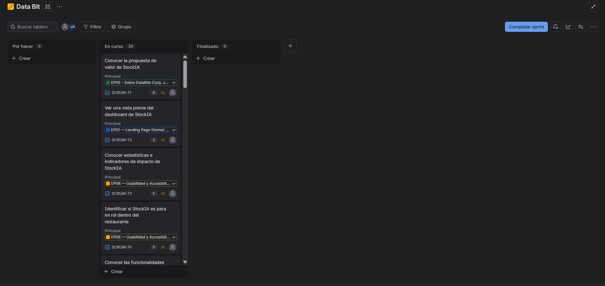
  <br/><i>Artefacto: Jira para demostrar el tablero Kanban - Proceso -</i>
</p>
<p align="center">
  
  <br/><i>Artefacto: Jira para demostrar el tablero Kanban - Finalizado —</i>
</p>

##### Resumen Técnico
- **Total de Horas:** 162 horas.
- **Distribución:** 2 semanas de desarrollo (considerando jornada laboral estándar).
- **Entregable Principal:** Landing Page de StockIA (4 páginas), bilingüe ES/EN, responsiva, con formulario de solicitud de demo funcional.

---

#### **5.2.1.4. Development Evidence for Sprint Review**
En esta sección se explica y presenta los avances en implementación con relación a los productos de la solución según el alcance del Sprint: Landing Page.

Primero, se mostrarán los commits más importantes para el Reporte, los cuales muestran el ciclo de vida del proyecto, y toda la información que se usó, usa y usará para el desarrollo del proyecto:

| **Repository** | **Branch** | **Commit Id** | **Commit Message** | **Commit Message Body** | **Committed on (Date)** |
| :--- | :--- | :--- | :--- | :--- | :---: |
| stockia-report | develop | `147c971` | chore: initialize report repository structure | Creación del repositorio del informe con la estructura inicial de carpetas (`docs/`). | 27/08/2026 |
| stockia-report | develop | `3f41c6d` | chore: create develop branch | Se crea la rama `develop` como base de integración de GitFlow para el equipo. | 10/09/2026 |
| stockia-report | feature/chapter-1 | `5715eee` | docs: add picture for team member profiles | Se agregan las fotografías de los integrantes para la sección de Startup Profile. | 10/09/2026 |
| stockia-report | develop | `043c2d6` | Merge pull request #1 from feature/chapter-1 | Integra a `develop` el Capítulo I completo (Startup Profile, Solution Profile, Segmentos objetivo) tras revisión vía Pull Request. | 16/09/2026 |
| stockia-report | feature/chapter-5 | `d4e06cc` | docs(chapter-5): add Aspect Leaders and Collaborators section | Se agrega la matriz de Líderes y Colaboradores (LACX) para el Sprint 1. | 18/09/2026 |
| stockia-report | feature/chapter-5 | `4d7211e` | docs: update source code management section | Se actualiza la sección de Source Code Management con las convenciones de GitFlow y Conventional Commits aplicadas. | 18/09/2026 |

<br/>

A continuación se presentan los commits más importantes para la Landing Page, los cuales muestran todo el contenido visual y las funcionalidades implementadas en el Sprint 1:

| **Repository** | **Branch** | **Commit Id** | **Commit Message** | **Commit Message Body** | **Committed on (Date)** |
| :--- | :--- | :--- | :--- | :--- | :---: |
| stockia-website | develop | `1a58474` | chore: set up project structure | Se sube la estructura base del sitio: `index.html`, `features.html`, `pricing.html`, `about.html`, hojas de estilo (`css/`) y scripts (`js/`). | 18/09/2026 |
| stockia-website | develop | `2efd03a` | feat: add about section | Se implementa el contenido de `about.html` (misión, visión, equipo y formulario de contacto). | 18/09/2026 |
| stockia-website | develop | `6e0d010` | feat: add index.html code | Se implementa el Home (`index.html`) con header, hero, estadísticas, segmentos, funcionalidades y footer. | 18/09/2026 |
| stockia-website | feature/pricing | `9ca1046` | feat(pricing): add footer section | Última sección de `pricing.html` (planes, toggle mensual/anual, FAQ y footer), cierre de la feature. | 18/09/2026 |
| stockia-website | develop | `0e54999` | Merge pull request #1 from feature/pricing | Integra a `develop` la página `pricing.html` completa tras revisión vía Pull Request. | 18/09/2026 |

*Nota: se listan los commits más representativos de cada rama; el detalle completo puede revisarse en el historial de GitHub de cada repositorio de la organización [upc-pre-202620-1asi0730-16127-databit](https://github.com/upc-pre-202620-1asi0730-16127-databit).*

<br/>

#### **5.2.1.5. Execution Evidence for Sprint Review**
En el Sprint 1 se busca implementar todas las secciones de las 4 páginas de la Landing Page de StockIA. A continuación, se explorarán los avances a través de imágenes que muestren el resultado obtenido *(capturas pendientes de reemplazo, tomadas ahora desde el repositorio `stockia-website` de la organización)*:
<br/>

1. **Sección header / navbar:** Barra de navegación compartida entre las 4 páginas del sitio, con selector de idioma (ES/EN).

<br/>
<p align="center">
  
  <br/><i>Sección header / navbar — StockIA</i>
</p>
<br/>

2. **Sección hero + mockup de dashboard:** Título con la propuesta de valor, descripción, botones CTA y un mockup ilustrativo del dashboard de StockIA.

<br/>
<p align="center">
  
  <br/><i>Sección hero + mockup de dashboard — StockIA</i>
</p>
<br/>

3. **Barra de estadísticas:** Los cuatro indicadores de impacto mostrados en el Home, con nota de transparencia sobre cifras de ejemplo.

<br/>
<p align="center">
  
  <br/><i>Barra de estadísticas — StockIA</i>
</p>
<br/>

4. **Sección "¿Para quién es StockIA?":** Tarjetas diferenciadas para los segmentos dueños/CEOs de restaurantes y administradores/jefes de cocina.

<br/>
<p align="center">
  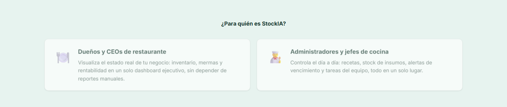
  <br/><i>Sección "¿Para quién es StockIA?" — StockIA</i>
</p>
<br/>

5. **Grid de funcionalidades:** Seis tarjetas de funcionalidades principales en el Home, con enlace al detalle completo en features.html.

<br/>
<p align="center">
  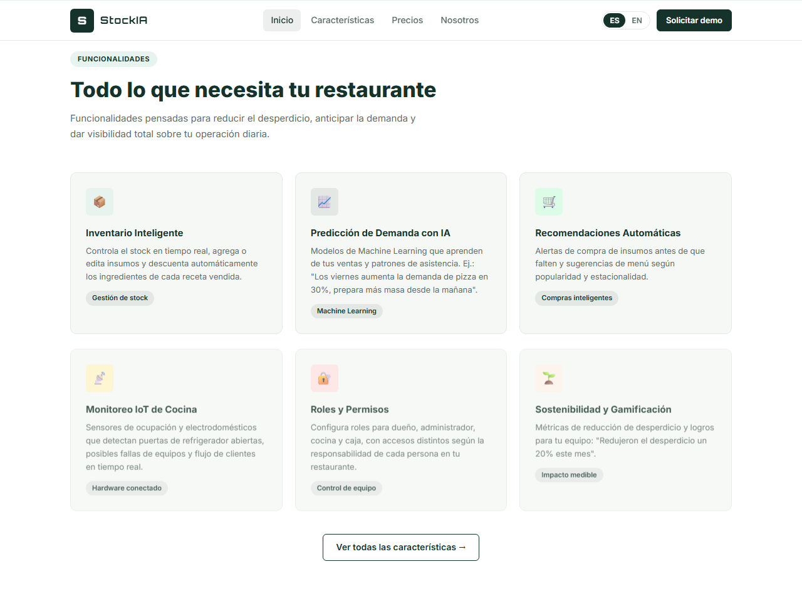
  <br/><i>Grid de funcionalidades — StockIA</i>
</p>
<br/>

6. **Sección "Más que un inventario" (diferenciadores):** Las tres tarjetas de diferenciadores de StockIA frente a otras soluciones.

<br/>
<p align="center">
  
  <br/><i>Sección "Más que un inventario" (diferenciadores) — StockIA</i>
</p>
<br/>

7. **Sección de integraciones externas:** Las cuatro tarjetas de integraciones en evaluación (Google Maps, OpenWeather, Stripe/PayPal, Twilio/SendGrid), con nota de decisión pendiente.

<br/>
<p align="center">
  
  <br/><i>Sección de integraciones externas — StockIA</i>
</p>
<br/>

8. **Sección de portafolio:** Vistas ilustrativas con tabs para alternar entre Inventario e IA & IoT.

<br/>
<p align="center">
  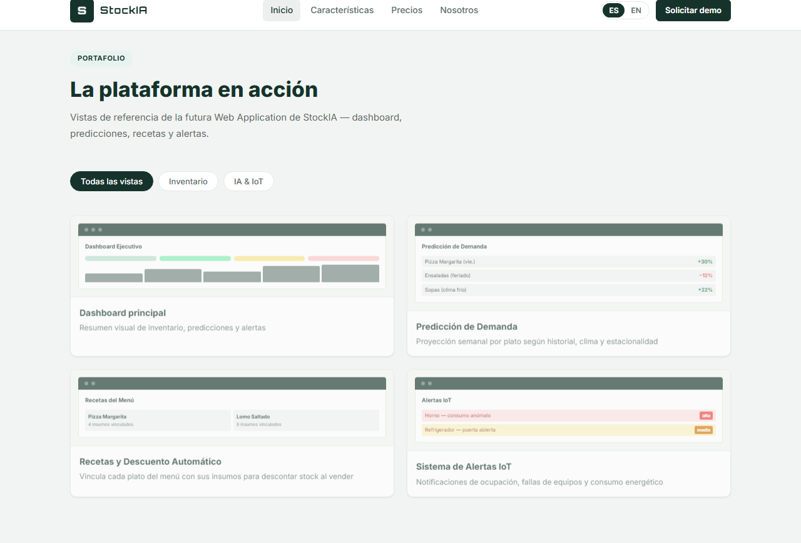
  <br/><i>Sección de portafolio — StockIA</i>
</p>
<br/>

9. **Placeholder de video demostrativo:** Bloque "Video demostrativo próximamente", con el iframe de YouTube ya preparado en el código para su reemplazo futuro.

<br/>
<p align="center">
  
  <br/><i>Placeholder de video demostrativo — StockIA</i>
</p>
<br/>

10. **features.html — grid completo:** Detalle extendido de las seis funcionalidades y la sección "Cómo funciona" (4 pasos).

<br/>
<p align="center">
  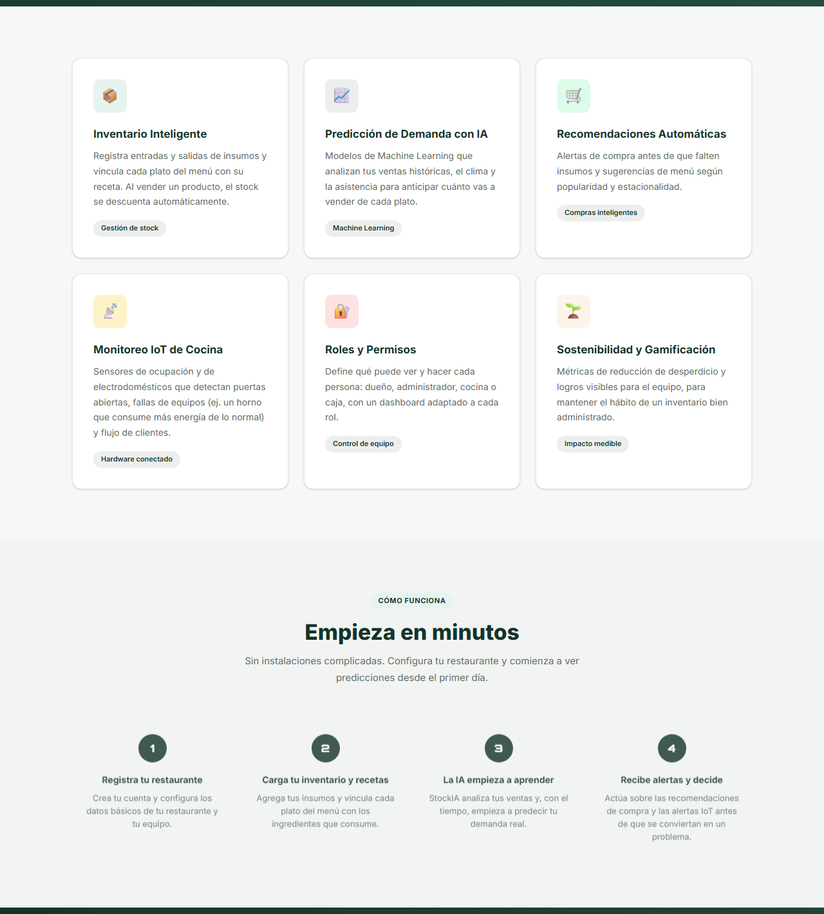
  <br/><i>features.html — grid completo — StockIA</i>
</p>
<br/>

11. **pricing.html — planes y FAQ:** Las tarjetas de los planes Esencial, Profesional e IoT Completo, el toggle mensual/anual y el acordeón de preguntas frecuentes.

<br/>
<p align="center">
  
  <br/><i>pricing.html — planes y FAQ — StockIA</i>
</p>
<br/>

12. **about.html — misión, visión, equipo y formulario:** Sección de misión/visión/valores, las fichas de equipo (placeholder) y el formulario de solicitud de demo.

<br/>
<p align="center">
  
  <br/><i>about.html — misión, visión, equipo y formulario — StockIA</i>
</p>
<br/>

13. **Sección footer:** Parte final del sitio, compartida entre las 4 páginas.

<br/>
<p align="center">
  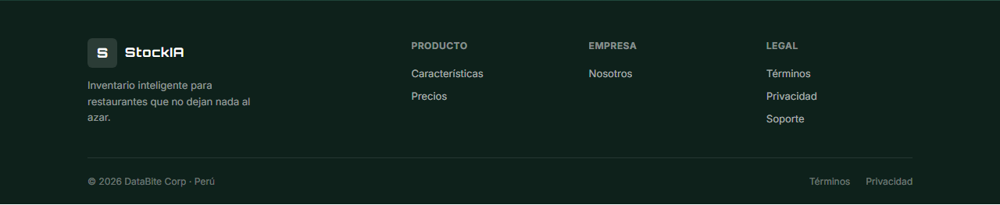
  <br/><i>Sección footer — StockIA</i>
</p>
<br/>

Para finalizar, se mostrará una demostración del avance sobre la Landing Page dentro de GitHub, para la publicación de la página web:
<p align="center">
  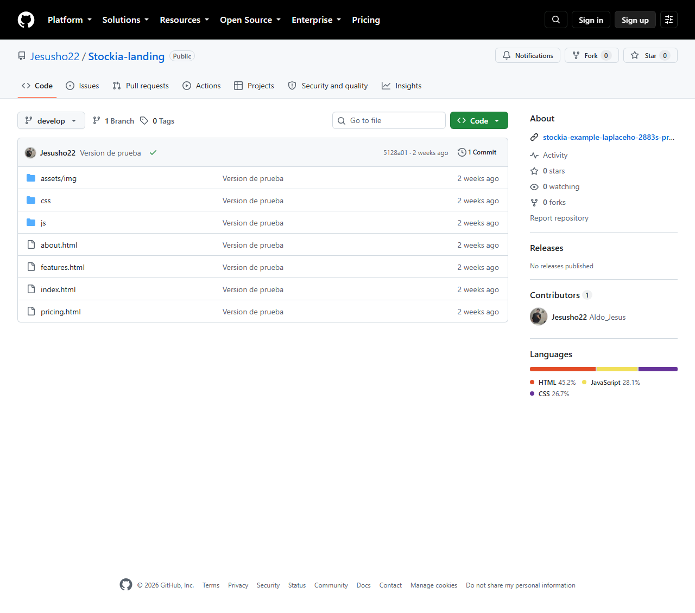
  <br/><i>Repositorio de GitHub sobre la Landing Page de StockIA — https://github.com/upc-pre-202620-1asi0730-16127-databit/stockia-website</i>
</p>

#### **5.2.1.6. Services Documentation Evidence for Sprint Review**
Para este Sprint, se han implementado y documentado los puntos de interacción de la Landing Page. Aunque el almacenamiento persistente será parte de un Sprint posterior, se ha programado la lógica de captura, validación y respuesta visual en el frontend para el siguiente servicio simulado:

| Endpoint / Interacción | Acción (HTTP) | Campos del formulario | Descripción del Response |
| :--- | :---: | :--- | :--- |
| `about.html#contactForm` | **POST (Mock)** | Nombre*, Restaurante, Correo*, Mensaje (`*` obligatorios vía `required`) | **202 Accepted (simulado)**: `preventDefault()` bloquea el envío real, el botón cambia a "✓ Enviado" (fondo de éxito) y se deshabilita 3 segundos; luego el formulario se resetea (`form.reset()`) automáticamente. |

* **URL del Repositorio de Landing Page:** https://github.com/upc-pre-202620-1asi0730-16127-databit/stockia-website
* **URL de la Landing Page desplegada:** https://stockia-landing-giag.vercel.app/about.html#contacto

#### **5.2.1.7. Software Deployment Evidence for Sprint Review**
El proceso de despliegue para el Sprint 1 priorizó una infraestructura de hosting estático en **Vercel**, aprovechando su infraestructura global (CDN) para garantizar tiempos de carga óptimos para la Landing Page. Se priorizó la automatización para permitir iteraciones rápidas sobre el diseño y el contenido informativo orientado a los segmentos objetivo.

**Actividades de Despliegue Realizadas**
* Configuración del proyecto en Vercel, vinculado al repositorio `upc-pre-202620-1asi0730-16127-databit/stockia-website` para despliegues automáticos.
* Despliegue continuo activado en cada push a la rama `develop`, publicado en: **[pendiente de confirmar URL de Vercel del repositorio de la organización]**
* Verificación de las 4 páginas del sitio (`index.html`, `features.html`, `pricing.html`, `about.html`) en el dominio de Vercel.

**Evidencia Deploy: Landing Page - Responsive**
<p align="center">
  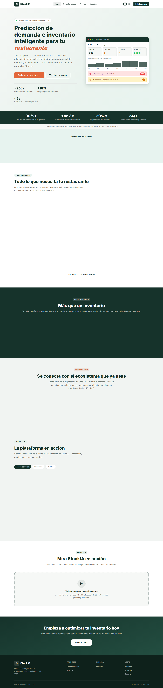
  <br/><i>Landing Page Desplegada</i>
</p>

**Evidencia Deploy: Landing Page Mobile - Responsive**
<p align="center">
  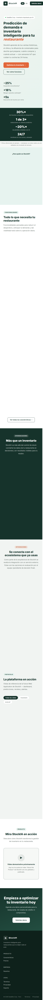
  <br/><i>Landing Page Desplegada (vista móvil, 390px)</i>
</p>

#### **5.2.1.8. Team Collaboration Insights during Sprint**
**Dinámica de Implementación**
<p align="center">
Durante este ciclo, el equipo DataBit (Martín, Alonso Higa Kohatsu, Aldo Jesús, Kiara Tuesta y Leyla Ortiz) concentró sus esfuerzos en el desarrollo Frontend y la Documentación Técnica de la Landing Page. El equipo trabajó de forma remota, distribuyendo tareas mediante un tablero Kanban (ver evidencia en 5.2.1.3) y centralizando el control de versiones en GitHub, bajo la organización <code>upc-pre-202620-1asi0730-16127-databit</code>.
</p>

**Analíticos de Colaboración**
<p align="center">
La carga de trabajo se distribuyó para asegurar que todos los integrantes participaran en la construcción de los artefactos visuales y técnicos:

* Desarrollo Frontend: Aldo Jesús implementó la página `pricing.html` completa (navbar, hero, tarjetas de planes, FAQ, CTA y footer); Alonso Higa Kohatsu implementó `about.html`; Kiara Tuesta implementó `index.html`. Martín y Leyla Ortiz aportaron a la documentación técnica y artefactos de diseño (diagramas C4, wireframes).

* Documentación y Calidad: Los cinco integrantes redactaron en paralelo los capítulos del informe mediante ramas `feature/chapter-1` a `feature/chapter-5`: Alonso Higa Kohatsu lideró los Capítulos I y II (Startup/Solution Profile, Competidores, Entrevistas, Needfinding); Aldo Jesús los Capítulos III y V (User Stories, Product Backlog, Sprint 1); Kiara Tuesta y Martín aportaron a los Capítulos I, II y IV (arquitectura, diagramas de clase y base de datos); Leyla Ortiz contribuyó a los Capítulos I a III (perfiles, entrevistas, Ubiquitous Language, Impact Mapping).

* Control de Versiones: El equipo aplica **GitFlow** en los repositorios `stockia-report` y `stockia-website`, con `main` y `develop` como ramas estables y una rama `feature/chapter-X` por cada capítulo del informe (`feature/chapter-1` a `feature/chapter-5`) y `feature/pricing` para la Landing Page, integradas mediante Pull Requests revisados antes de cada merge (a la fecha, PR #1 en `stockia-report` y PR #1 en `stockia-website`, ambos mergeados). Se aplica Conventional Commits en ambos repositorios.
</p>

**Evidencia GitFlow: Graph**
<p align="center">
  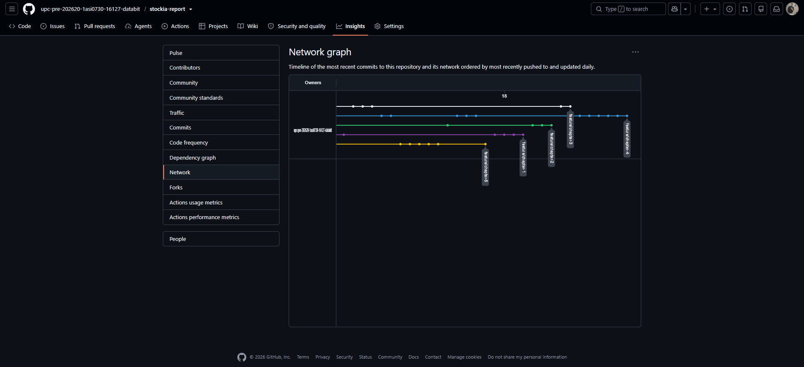
  <br/><i>Grafo de versiones para el gitflow</i>
</p>

**Evidencia GitFlow: Network**
<p align="center">
  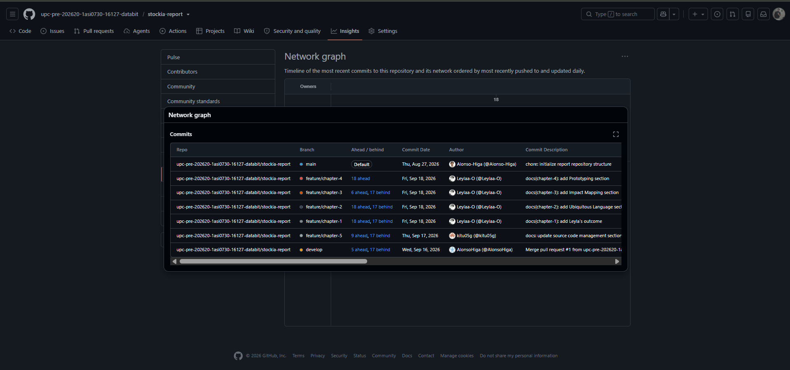
  <br/><i>Grafo de trabajo</i>
</p>

## **5.3. Validation Interviews**
### **5.3.1. Interview Design**
### **5.3.2. Interview Recording**
### **5.3.3. Evaluations Based on Heuristics**
## **5.4. About-the-Product Video**