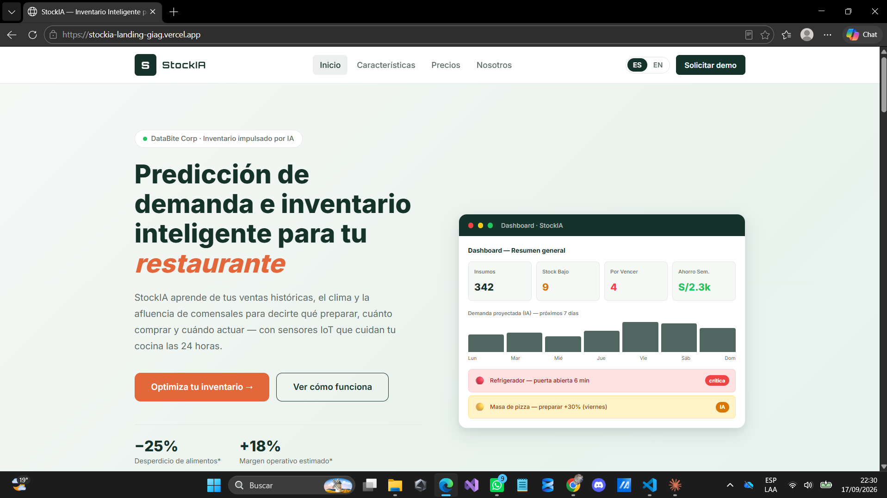
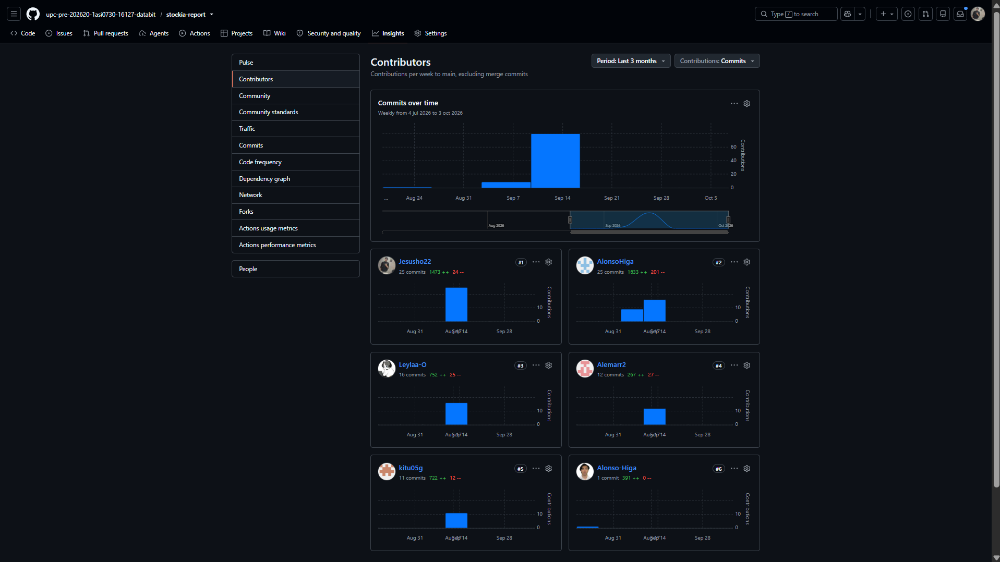
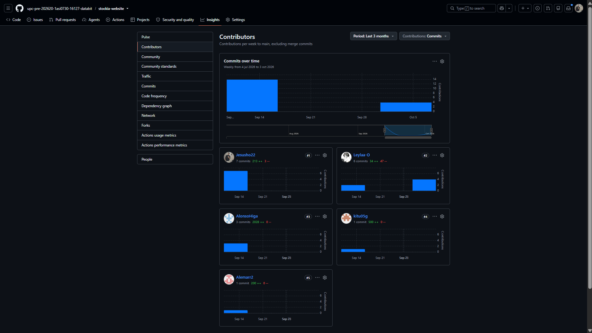

# **Chapter V: Product Implementation, Validation & Deployment**
## **5.1. Configuration Management Software**
### 5.1.1. Software Development Environment Configuration
A continuación se detallan los productos de software utilizados en el proyecto **StockIA**, organizados según las principales actividades del ciclo de vida del producto digital.

### Project Management  
- **WhatsApp**  
  Aplicación de mensajería instantánea que facilita la comunicación rápida y asíncrona entre los miembros del equipo para coordinar tareas operativas.  
  Referencia: [https://web.whatsapp.com/](https://web.whatsapp.com/)  

- **Google Meet**  
  Plataforma de videoconferencias utilizada para ceremonias Scrum, reuniones de sincronización técnica y sesiones de compartición de pantalla en tiempo real.  
  Referencia: [https://meet.google.com/](https://meet.google.com/)  

---

### Product UX/UI Design  
- **UXPressia**  
  Plataforma especializada en mapeo de experiencia de usuario y diseño de servicios. Se usó para elaborar user personas, journey mapping, empathy mapping e impact mapping.  
  Referencia: [https://uxpressia.com/](https://uxpressia.com/)  

- **Miro**  
  Pizarra colaborativa digital para crear diagramas y esquemas en tiempo real. Se utilizó en sesiones de Event Storming para identificar procesos de negocio y definir Bounded Contexts.  
  Referencia: [https://miro.com/](https://miro.com/)  

- **Figma**  
  Editor de gráficos vectoriales y herramienta de prototipado de interfaces. Se empleó para wireframes, mockups y prototipos interactivos del proyecto.  
  Referencia: [https://www.figma.com/](https://www.figma.com/)  

- **Jira**  
  Software de gestión de proyectos ágil (Scrum/Kanban). Se usó para administrar el Product Backlog, priorizar requerimientos y documentar User Stories con criterios de aceptación.  
  Referencia: [https://www.atlassian.com/es/software/jira](https://www.atlassian.com/es/software/jira)  

---

### Software Development  
- **Visual Studio Code**  
  Editor de código fuente ligero y extensible. Se utilizó para el desarrollo de componentes frontend, refactorización de scripts y edición rápida de código.  
  Descargar: [https://code.visualstudio.com/](https://code.visualstudio.com/)  

- **Extensión .rd para Visual Studio Code**  
  Herramienta integrada en VS Code para diseño y modelado de bases de datos. Se usó para crear y gestionar el esquema relacional de StockIA directamente desde el entorno de desarrollo.  
  Referencia: Marketplace de Visual Studio Code (extensión .rd).  

---

### Software Deployment  
- **GitHub**  
  Plataforma de desarrollo colaborativo basada en Git. Se empleó para alojar el código fuente y gestionar el despliegue continuo de la aplicación.  
  Referencia: [https://github.com/](https://github.com/)  

---

### Software Documentation  
- **GitHub**  
  Además de control de versiones, se utilizó para redactar, organizar y dar seguimiento al informe completo del proyecto.  
  Referencia: [https://github.com/](https://github.com/)  

- **Structurizr**  
  Herramienta para modelado de arquitectura de software mediante el enfoque C4. Se usó para construir los diagramas de arquitectura del proyecto.  
  Referencia: [https://structurizr.com/](https://structurizr.com/)  

---

El equipo adopta un enfoque basado en herramientas que permiten la colaboración en tiempo real y el acceso remoto a los recursos del proyecto. **GitHub** actúa como eje central para la gestión del código fuente y la documentación, mientras que las reuniones por **Google Meet** y **WhatsApp** aseguran una comunicación fluida y constante entre los miembros del equipo.  

Por otro lado, herramientas como **Figma**, **UXPressia** y **Miro** facilitan la construcción de artefactos de diseño centrados en el usuario, mientras que **Jira** permite organizar el trabajo en Sprints siguiendo principios ágiles. En el ámbito del desarrollo, **Visual Studio Code** junto con la extensión **.rd** proporcionan un entorno flexible para programar y modelar la base de datos de StockIA.  

Finalmente, **Structurizr** contribuye al modelado arquitectónico y la documentación técnica, garantizando que diseño, desarrollo, pruebas y despliegue se mantengan alineados. Esta configuración asegura una entrega continua de valor en cada iteración del proyecto **StockIA**.  

### **5.1.2. Source Code Management**
El equipo **DataBite Corp** utiliza **GitHub** como plataforma y sistema de control de versiones para todos los productos digitales de StockIA, lo que permite mantener un registro histórico de cambios, colaborar de forma estructurada y garantizar la trazabilidad durante todo el ciclo de desarrollo.

Para ello, se creó una organización pública que contiene los siguientes repositorios independientes:

| Solución | Nombre del repositorio | Enlace |
|---|---|---|
| Report (documentación en Markdown) | `stockia-report` | https://github.com/upc-pre-202620-1asi0730-16127-stockia/stockia-report.git |
| Website (Landing Page) | `stockia-website` | https://github.com/upc-pre-202620-1asi0730-16127-databit/stockia-website.git |
| WebApp (Frontend Web Application) | `stockia-webapp` | https://github.com/upc-pre-202620-1asi0730-16127-databit/stockia-webapp.git |
| Platform (RESTful Web Services) | `stockia-platform` | https://github.com/upc-pre-202620-1asi0730-16127-databit/stockia-platform-api.git |

En el caso del repositorio **`stockia-platform`**, este incluye tanto el proyecto principal del API como los archivos de pruebas, tanto unitarias como de integración / aceptación.

 <br>

---

## Implementación de GitFlow

El equipo adopta **GitFlow** como workflow de control de versiones, siguiendo el modelo propuesto por Vincent Driessen en *“A successful Git branching model”*.

Las ramas que se manejan en todos los repositorios son:

### `main`

Rama principal de producción. Solo recibe merges desde `release` o `hotfix`, y representa siempre el código estable y desplegado.

### `develop`

Rama de integración continua. Todas las features completadas se integran aquí antes de pasar a un release, y es la rama base para crear nuevos feature branches.

### `feature/<módulo>-<descripción-corta>`

Una rama por cada funcionalidad nueva.

Se crea desde `develop` y se integra nuevamente a `develop` mediante **Pull Request**, con revisión de al menos un miembro del equipo.

Ejemplos:

```text
feature/inventory-stock-management
feature/recipe-ingredient-linking
feature/demand-prediction
```

### `release/v<MAJOR>.<MINOR>.<PATCH>`
Rama para preparar una nueva versión de producción. Se crea desde `develop` cuando las features del Sprint están completas, permitiendo únicamente correcciones menores y actualización de versión. Se integra tanto a `main` como a `develop`.

**Ejemplo:**

```text
release/v1.2.0
```
### `hotfix/<descripción-corta>`
Rama para correcciones urgentes sobre producción. Se crea desde main y se integra gtanto a main como a develop.
**Ejemplo:**

```text
hotfix/stock-discount-error
```
Todas las ramas se nombran en inglés y aplicando kebab-case.

 <br>


## Semantic Versioning

El equipo aplica **Semantic Versioning 2.0.0** para el nombrado de releases, bajo el esquema `MAJOR.MINOR.PATCH`, donde **MAJOR** corresponde a cambios incompatibles con versiones anteriores del API, **MINOR** a nuevas funcionalidades compatibles con versiones anteriores, y **PATCH** a correcciones de errores compatibles. La primera versión funcional del producto será `v1.0.0`, correspondiente al entregable del Sprint 1.

## Conventional Commits

El equipo aplica la especificación **Conventional Commits** para todos los mensajes de commit, bajo la estructura `<tipo>(<alcance>): <descripción corta en inglés>`. Los tipos permitidos son:

| Tipo | Uso |
|---|---|
| `feat` | Nueva funcionalidad |
| `fix` | Corrección de error |
| `docs` | Cambios en documentación |
| `style` | Cambios de formato que no afectan la lógica |
| `refactor` | Refactorización sin nueva funcionalidad ni corrección |
| `test` | Adición o modificación de pruebas |
| `chore` | Tareas de mantenimiento, dependencias o configuración |

**Ejemplos aplicados al proyecto:**

```text
feat(inventory): add automatic ingredient deduction by recipe
fix(auth): correct expired token validation
docs(chapter-iv): add information architecture section
```
Este enfoque facilita la generación de historiales de cambios y mantiene un registro organizado y semántico del desarrollo.

 <br>


### **5.1.3. Source Code Style Guide & Conventions**
Como norma general, todo el código desarrollado en StockIA se redacta completamente en inglés, incluyendo nombres de variables, funciones, clases, archivos y comentarios, garantizando consistencia, mantenibilidad y alineación con estándares internacionales. Los nombres deben ser descriptivos y alineados al Ubiquitous Language del dominio (por ejemplo: `ingredient`, `recipe`, `stockLevel`, `demandForecast`, `expirationDate`), evitando ambigüedad.

## HTML

Se siguen el **HTML Style Guide and Coding Conventions (W3Schools)** y el **Google HTML/CSS Style Guide**:

- Etiquetas y atributos en minúsculas, con comillas dobles: `<section id="inventory-summary"></section>`
- Cierre correcto de todos los elementos.
- Inclusión de atributos de accesibilidad: ``
- Sangría de 2 espacios.

## CSS

Se sigue el **Google HTML/CSS Style Guide**:

- Clases e IDs en kebab-case: `.inventory-card`, `.alert-banner`
- Omitir unidades en valores cero: `margin: 0;`
- Uso de custom properties para colores y espaciado, evitando valores hardcodeados: `color: var(--primary);`
- Uso de unidades relativas (`rem`, `%`, `vh`) para responsive design.
- Evitar estilos inline; mantener la presentación en archivos `.css` separados.

## JavaScript

Se siguen el **Google JavaScript Style Guide**, las **MDN JavaScript Guidelines** y el **W3C JavaScript Style Guide**:

- camelCase para variables y funciones: `function calculateStockLevel() {}`
- Declaración con `const` y `let`, evitando `var`: `const stockThreshold = 10;`
- Uso de ES6+ (arrow functions, destructuring, template literals).
- Manejo de errores con `try/catch`.
- Evitar funciones excesivamente largas (máximo 20–30 líneas).

## Vue (Frontend Web Application)

Se sigue el **Vue Style Guide oficial**:

- Nombres de componentes en PascalCase: `InventoryDashboard`, `RecipeForm`
- Nombres de archivos de componente en PascalCase o kebab-case de forma consistente: `InventoryDashboard.vue`
- Uso de componentes en templates en kebab-case: `<inventory-dashboard />`
- Orden de bloques dentro de cada Single File Component: `<template>`, `<script>`, `<style>`
- Un componente por archivo, organizados por dominio funcional (`inventory`, `recipes`, `alerts`, `auth`).
- Props siempre con tipo definido y valor por defecto cuando aplique.

## C# (RESTful API con ASP.NET Core)

Se siguen las **C# Coding Conventions** y las **Microsoft ASP.NET Core Coding Guidelines**:

- PascalCase para clases, métodos y propiedades públicas: `public class InventoryService { public void DeductIngredients() { } }`
- camelCase para variables locales y parámetros: `int stockQuantity;`
- UPPER_SNAKE_CASE para constantes: `const int MAX_INGREDIENTS = 500;`
- Sangría de 4 espacios, sin tabulaciones.
- Aplicación de los principios de responsabilidad única y código modular, organizado por bounded context.
- Documentación de endpoints con OpenAPI mediante Swagger.

## Gherkin (criterios de aceptación y pruebas de aceptación)

Se siguen las **Gherkin Conventions for Readable Specifications**:

- Estructura obligatoria Given – When – Then.
- Escenarios en inglés, descriptivos, cortos y sin ambigüedad.
- Un escenario por comportamiento específico.
- Uso de Scenario Outline cuando corresponda.
- Archivos `.feature` nombrados por módulo: `inventory_management.feature`, `demand_prediction.feature`

### Ejemplo

```gherkin
Feature: Automatic ingredient deduction

Scenario: Stock is reduced when a dish is sold
    Given a recipe registered with its linked ingredients
    When a sale of that dish is recorded
    Then the system deducts the corresponding ingredient quantities from stock
```

### **5.1.4. Software Deployment Configuration**
A continuación se describe la configuración de despliegue de cada producto digital de StockIA, partiendo desde los repositorios de código fuente hasta su publicación.
#### Landing Page → Vercel

1. El código fuente del Landing Page (HTML, CSS y JavaScript estático) reside en el repositorio `stockia-website`, rama `main`.

2. Crear una cuenta en Vercel e iniciar sesión con la cuenta de GitHub de la organización del equipo, autorizando el acceso a los repositorios.

3. Importar el repositorio desde el panel de Vercel mediante **"Add New Project" → "Import Git Repository"**.

4. Configurar el proyecto con Framework Preset **"Other"**, al tratarse de un sitio estático sin proceso de build.

 <br>

5. Establecer `develop` como rama de producción. Cada push a `main` desencadena un redespliegue automático, y cada Pull Request hacia `develop` genera un preview deployment para revisión previa a la integración.

6. Verificar el despliegue accediendo a la URL pública asignada por Vercel y registrarla en la documentación del proyecto.


##### Evidencia del despliegue en Vercel

La siguiente imagen muestra el panel de Vercel con el **Production Deployment** del Landing Page, donde se observa el estado `Ready`, la rama utilizada y el dominio público asignado.

 <br>

##### Landing Page desplegada

La siguiente imagen muestra la **Landing Page de StockIA desplegada y disponible mediante el dominio público proporcionado por Vercel**.

 <br>

#### RESTful Web Services (ASP.NET Core + MySQL)

El RESTful API requiere un entorno de ejecución de servidor para aplicaciones .NET, por lo que se despliega en una plataforma compatible junto con su base de datos relacional.

La configuración prevista contempla:

1. Crear el servicio de base de datos MySQL.

2. Registrar las variables de entorno de conexión (host, puerto, nombre de base de datos, usuario y contraseña) en la plataforma de despliegue.

3. Referenciar dichas variables desde el archivo de configuración `appsettings.json` del proyecto en lugar de escribir las credenciales directamente en el código.

4. La documentación de los endpoints quedará disponible públicamente vía Swagger UI.

5. La configuración detallada y las URLs finales se documentarán en el Sprint correspondiente, una vez implementado el servicio.

##### Configuración de variables de entorno

La siguiente imagen muestra el apartado de **Environment Variables** de la plataforma de despliegue, utilizado para gestionar las variables de configuración del proyecto.

 <br>

## **5.2. Landing Page, Services & Applications Implementation**
### **5.2.1. Sprint 1**
Este primer ciclo de desarrollo se centró en establecer los pilares de la identidad digital de **StockIA**, integrando el esfuerzo colaborativo del equipo para entregar un sitio de marketing funcional inicial. Durante este Sprint, el equipo priorizó la captación de visitantes mediante una Landing Page de 4 páginas (`index.html`, `features.html`, `pricing.html`, `about.html`), completamente bilingüe (ES/EN) y responsiva, documentando cada fase desde la planificación hasta el despliegue final para validar la propuesta de valor frente al segmento elegido. Los ítems seleccionados son US01 a US20 y RNF01 a RNF10 del Product Backlog, correspondientes a las épicas EP01 a EP08.

#### **5.2.1.1. Sprint Planning 1**
El Sprint Planning Meeting marcó el inicio formal del desarrollo del código de StockIA. Durante esta sesión, el equipo de desarrollo junto al Product Owner seleccionaron las Historias de Usuario más prioritarias del Product Backlog (correspondientes a los Epics EP01–EP08) para definir el objetivo central de la iteración. A continuación, se presenta el cuadro resumen con los detalles y acuerdos de esta reunión:

| **Sprint #** | Sprint 1 |
| :--- | :--- |
| **Sprint Planning Background** | |
| **Date** | 09/09/2026 |
| **Time** | 10:00 am |
| **Location** | Lima/Lima/Santiago de Surco/UPC |
| **Prepared By** | Huaman Oscco, Aldo Jesus (Jesusho22) |
| **Attendees (to planning meeting)** | Higa Kohatsu, Alonso Enrique / Asmat Alminco, Martin Alejandro / Huaman Oscco, Aldo Jesus / Ortiz Laura, Leyla Alisson / Tuesta Girón, Kiara Lucia |
| **Sprint Review Summary** | No aplica: es el primer Sprint. Antes de él, el equipo cerró la fase de ideación (segmentos objetivo, propuesta de valor y entrevistas), finalizó la arquitectura C4 y el modelado de la base de datos, y configuró la organización y los repositorios de GitHub para trabajar con GitFlow. |
| **Sprint Retrospective Summary** | No aplica al ser el primer Sprint. Como acuerdo inicial de trabajo, el equipo definió el uso de GitHub y Jira para la colaboración remota y una rama `feature/*` por página o capítulo integrada mediante Pull Request. |
| **Sprint Goal & User Stories** | |
| **Sprint 1 Goal** | **Contexto:** El equipo prioriza establecer la identidad digital de StockIA y comunicar la propuesta de valor al segmento objetivo, publicando un sitio de marketing de 4 páginas totalmente bilingüe (ES/EN), antes de invertir esfuerzo en la Web Application. <br><br> **Sprint Goal:**<br>*"Our focus is on building a trustworthy digital presence that clearly communicates StockIA's value proposition. We believe this will let visitors understand the product's benefits within seconds and request a demo with confidence. This will be confirmed when the four-page site is live, fully bilingual, responsive, and generating demo requests."* |
| **Sprint 1 Velocity** | No aplica: es el primer Sprint y no existe una velocidad histórica. |
| **Sum of Story Points** | 88 Story Points comprometidos en 30 ítems (20 US y 10 RNF) |
 

#### **5.2.1.2. Aspect Leaders and Collaborators**
En esta sección se presenta la **Leadership-and-Collaboration Matrix (LACX)** del Sprint 1. Cada aspecto agrupa las tareas del Sprint Backlog; el líder (L) responde por la integración y la revisión de ese aspecto, y los colaboradores (C) desarrollan o revisan sus tareas.
 
| Team Member | GitHub Username | Estructura, estilos e interacciones (CSS/JS) (L/C) | Maquetación del Home y contenido bilingüe (L/C) | Páginas internas (features, pricing, about) (L/C) | Responsive, accesibilidad y SEO (L/C) | Despliegue y QA (L/C) |
| :--- | :--- | :---: | :---: | :---: | :---: | :---: |
| Higa Kohatsu, Alonso Enrique | AlonsoHiga | C | C | L | C | C |
| Asmat Alminco, Martin Alejandro | Alemarr2 | C | C | C | L | C |
| Huaman Oscco, Aldo Jesus | Jesusho22 | C | C | C | C | L |
| Ortiz Laura, Leyla Alisson | Leylaa-O | L | C | C | C | C |
| Tuesta Girón, Kiara Lucia | kitu05g | C | L | C | C | C |
 
> **Leyenda:** **L:** Líder del aspecto · **C:** Colaborador

#### **5.2.1.3. Sprint Backlog 1**
En esta sección se presenta la **Leadership-and-Collaboration Matrix (LACX)**. Esta matriz detalla los líderes (L) y colaboradores (C) para cada aspecto clave del Sprint, asegurando una comunicación clara y una distribución de responsabilidades eficiente para el proyecto **StockIA**. Dado que este Sprint se concentra únicamente en la Landing Page, se proponen los siguientes aspectos:

| Team Member | GitHub Username | Maquetación & UI/UX (L/C) | Contenido & Traducción (i18n) (L/C) | Responsive & Accesibilidad (L/C) | Despliegue & QA (L/C) |
| :--- | :--- | :---: | :---: | :---: | :---: |
| Higa Kohatsu, Alonso Enrique | AlonsoHiga | L | C | C | C |
| Asmat Alminco, Martin Alejandro | Alemarr2 | C | C | L | C |
| Huaman Oscco, Aldo Jesus | Jesusho22 | C | C | C | L |
| Ortiz Laura, Leyla Alisson | Leylaa-O | L | C | C | C |
| Tuesta Girón, Kiara Lucia | kitu05g | C | L | C | C |

> **Leyenda:** **L:** Líder del aspecto · **C:** Colaborador

#### **5.2.1.3. Sprint Backlog 1**
**Periodo:** 09/09/2026 – 18/09/2026  
**Objetivo del Sprint:** Tener la Landing Page de StockIA (4 páginas) completamente maquetada, traducida ES/EN, responsiva y con el formulario de demo funcional, lista para publicarse.


| **User Story Id** | **Título de la Historia** | **Task Id** | **Título de la Tarea** | **Descripción de la Tarea** | **Est. (Hrs)** | **Asignado** | **Status** |
| :--- | :--- | :--- | :--- | :--- | :---: | :--- | :---: |
| **US01** | Conocer la propuesta de valor | T-01-1 | Maquetado del Hero | Construir el layout del hero con título, descripción y botones CTA. | 5 | Higa Kohatsu, Alonso Enrique | Done |
|  |  | T-01-2 | Redacción y traducción del mensaje principal | Escribir el copy de la propuesta de valor en español e inglés. | 3 | Tuesta Girón, Kiara Lucia | Done |
| **US02** | Ver una vista previa del dashboard | T-02-1 | Mockup ilustrativo del dashboard | Maquetar las tarjetas y el gráfico ilustrativos con CSS. | 6 | Asmat Alminco, Martin Alejandro | Done |
|  |  | T-02-2 | Responsive del mockup | Ocultar el mockup en pantallas menores a 768px. | 2 | Ortiz Laura, Leyla Alisson | Done |
| **US03** | Conocer estadísticas e indicadores | T-03-1 | Barra de estadísticas | Maquetar los cuatro indicadores de impacto del Home. | 4 | Huaman Oscco, Aldo Jesus | Done |
|  |  | T-03-2 | Nota de transparencia | Redactar y traducir la nota de cifras de ejemplo. | 2 | Higa Kohatsu, Alonso Enrique | Done |
| **US04** | Identificar si StockIA es para mi rol | T-04-1 | Sección "¿Para quién es StockIA?" | Maquetar las tarjetas por segmento (dueños/CEOs y administradores). | 4 | Tuesta Girón, Kiara Lucia | Done |
|  |  | T-04-2 | Redacción por segmento | Escribir el contenido diferenciado para cada rol. | 3 | Asmat Alminco, Martin Alejandro | Done |
| **US05** | Conocer las funcionalidades principales | T-05-1 | Grid de seis funcionalidades | Maquetar las tarjetas de funcionalidades en el Home. | 5 | Ortiz Laura, Leyla Alisson | Done |
|  |  | T-05-2 | Enlace a features.html | Implementar el botón "Ver todas las características". | 2 | Huaman Oscco, Aldo Jesus | Done |
| **US06** | Conocer los diferenciadores | T-06-1 | Sección "Más que un inventario" | Maquetar las tres tarjetas de diferenciadores. | 3 | Higa Kohatsu, Alonso Enrique | Done |
|  |  | T-06-2 | Redacción y traducción | Escribir el contenido de cada diferenciador. | 2 | Tuesta Girón, Kiara Lucia | Done |
| **US07** | Conocer las integraciones externas | T-07-1 | Sección de integraciones | Maquetar las cuatro tarjetas con la etiqueta "En evaluación". | 3 | Asmat Alminco, Martin Alejandro | Done |
|  |  | T-07-2 | Nota de transparencia | Redactar el texto que aclara que la decisión está pendiente. | 2 | Ortiz Laura, Leyla Alisson | Done |
| **US08** | Explorar vistas ilustrativas | T-08-1 | Sección de portafolio | Maquetar las cuatro vistas ilustrativas. | 5 | Huaman Oscco, Aldo Jesus | Done |
|  |  | T-08-2 | Tabs de portafolio (JS) | Implementar el cambio de pestaña Inventario / IA & IoT. | 3 | Higa Kohatsu, Alonso Enrique | Done |
| **US09** | Ver el video de presentación | T-09-1 | Placeholder de video | Maquetar el bloque "Video demostrativo próximamente". | 2 | Tuesta Girón, Kiara Lucia | Done |
|  |  | T-09-2 | Estructura para reemplazo futuro | Dejar preparado el iframe de YouTube comentado en el código. | 2 | Asmat Alminco, Martin Alejandro | Done |
| **US10** | Navegar entre las páginas del sitio | T-10-1 | Navbar compartido | Implementar el menú superior en las 4 páginas. | 4 | Ortiz Laura, Leyla Alisson | Done |
|  |  | T-10-2 | Estado activo del enlace | Resaltar visualmente la página actual en el navbar. | 2 | Huaman Oscco, Aldo Jesus | Done |
| **US11** | Ver el detalle completo de funcionalidades | T-11-1 | Grid completo en features.html | Maquetar las seis funcionalidades con descripción extendida. | 5 | Higa Kohatsu, Alonso Enrique | Done |
| **US12** | Entender cómo empezar a usar StockIA | T-12-1 | Sección "Cómo funciona" | Maquetar los cuatro pasos numerados. | 4 | Tuesta Girón, Kiara Lucia | Done |
| **US13** | Cambiar el idioma del sitio | T-13-1 | Selector de idioma (ES/EN) | Implementar los botones de idioma en el navbar. | 3 | Asmat Alminco, Martin Alejandro | Done |
|  |  | T-13-2 | Motor de traducción (i18n.js) | Programar el reemplazo de textos mediante data-i18n. | 6 | Ortiz Laura, Leyla Alisson | Done |
| **US14** | Mantener mi idioma preferido | T-14-1 | Persistencia en localStorage | Guardar y leer el idioma seleccionado entre páginas. | 3 | Huaman Oscco, Aldo Jesus | Done |
| **US15** | Consultar los planes disponibles | T-15-1 | Maquetado de los 3 planes | Construir las tarjetas de Esencial, Profesional e IoT Completo. | 5 | Higa Kohatsu, Alonso Enrique | Done |
|  |  | T-15-2 | Nota de precios de ejemplo | Redactar la nota de transparencia sobre precios ilustrativos. | 2 | Tuesta Girón, Kiara Lucia | Done |
| **US16** | Comparar precios mensuales y anuales | T-16-1 | Toggle mensual/anual (JS) | Implementar el interruptor y el recálculo de montos. | 4 | Asmat Alminco, Martin Alejandro | Done |
| **US17** | Resolver dudas frecuentes | T-17-1 | Acordeón de preguntas frecuentes | Implementar la apertura/cierre exclusivo de preguntas. | 4 | Ortiz Laura, Leyla Alisson | Done |
|  |  | T-17-2 | Redacción de preguntas y respuestas | Escribir el contenido del FAQ en español e inglés. | 3 | Huaman Oscco, Aldo Jesus | Done |
| **US18** | Conocer misión, visión y valores | T-18-1 | Sección misión/visión/valores | Maquetar el bloque correspondiente en about.html. | 3 | Higa Kohatsu, Alonso Enrique | Done |
|  |  | T-18-2 | Redacción de contenido | Escribir la misión, visión y los cinco valores. | 2 | Tuesta Girón, Kiara Lucia | Done |
| **US19** | Conocer al equipo detrás de StockIA | T-19-1 | Fichas de equipo | Maquetar las cuatro fichas placeholder con nombre, rol y código. | 3 | Asmat Alminco, Martin Alejandro | Done |
|  |  | T-19-2 | Nota de datos pendientes | Redactar la nota de "fichas de ejemplo". | 1 | Ortiz Laura, Leyla Alisson | Done |
| **US20** | Solicitar una demo mediante formulario | T-20-1 | Formulario de contacto | Maquetar el formulario con validación nativa de campos obligatorios. | 4 | Huaman Oscco, Aldo Jesus | Done |
|  |  | T-20-2 | Confirmación visual de envío | Implementar el mensaje "✓ Enviado" y el reseteo del formulario. | 3 | Higa Kohatsu, Alonso Enrique | Done |
|  |  | T-20-3 | Accesos al formulario | Enlazar los botones "Solicitar demo" del navbar, banner y footer. | 2 | Tuesta Girón, Kiara Lucia | Done |
| **RNF01** | Experiencia responsiva | T-R1-1 | Breakpoints de 1024px y 768px | Definir media queries para tablets y móviles. | 4 | Asmat Alminco, Martin Alejandro | Done |
|  |  | T-R1-2 | Ajuste de cuadrículas | Reorganizar columnas y ocultar elementos no esenciales en móvil. | 4 | Ortiz Laura, Leyla Alisson | Done |
| **RNF02** | Contraste y legibilidad accesible | T-R2-1 | Paleta de contraste | Definir colores de texto con contraste adecuado sobre fondos claros y oscuros. | 3 | Huaman Oscco, Aldo Jesus | Done |
| **RNF03** | Navegación consistente | T-R3-1 | Navbar y footer compartidos | Reutilizar los mismos componentes en las 4 páginas. | 3 | Higa Kohatsu, Alonso Enrique | Done |
| **RNF04** | Carga rápida | T-R4-1 | Optimización de assets | Evitar frameworks y librerías pesadas innecesarias. | 3 | Tuesta Girón, Kiara Lucia | Done |
| **RNF05** | Buen posicionamiento en buscadores | T-R5-1 | Metadatos por página | Agregar title y meta description a cada página. | 2 | Asmat Alminco, Martin Alejandro | Done |
|  |  | T-R5-2 | Metadatos adicionales del Home | Agregar meta keywords, author y copyright en index.html. | 2 | Ortiz Laura, Leyla Alisson | Done |
| **RNF06** | Compatibilidad con navegadores | T-R6-1 | CSS estándar (Flexbox/Grid) | Verificar compatibilidad en navegadores modernos. | 3 | Huaman Oscco, Aldo Jesus | Done |
|  |  | T-R6-2 | Degradación de animaciones | Manejar el caso sin soporte de IntersectionObserver. | 2 | Higa Kohatsu, Alonso Enrique | Done |
| **RNF07** | Animaciones de entrada | T-R7-1 | Scroll reveal (JS) | Implementar la animación de aparición progresiva de tarjetas. | 4 | Tuesta Girón, Kiara Lucia | Done |
| **RNF08** | Contenido pendiente señalizado | T-R8-1 | Notas visibles de contenido de ejemplo | Agregar notas junto a las secciones con datos ilustrativos. | 2 | Asmat Alminco, Martin Alejandro | Done |
|  |  | T-R8-2 | Comentarios en el código | Documentar en HTML qué elementos deben reemplazarse. | 1 | Ortiz Laura, Leyla Alisson | Done |
| **RNF09** | Sistema de diseño centralizado | T-R9-1 | Variables CSS en :root | Centralizar colores, tipografías y espaciados. | 4 | Huaman Oscco, Aldo Jesus | Done |
| **RNF10** | Textos centralizados (i18n) | T-R10-1 | Diccionario único de traducciones | Concentrar todos los textos ES/EN en i18n.js. | 4 | Higa Kohatsu, Alonso Enrique | Done |
| **TOTAL** | | | | **Esfuerzo total estimado para el Sprint** | **162** | | |

**Capacidad del Sprint 1**

| Integrante | Disponibilidad declarada (h) | Horas asignadas | N.° de tareas | Uso de la capacidad |
| :--- | :---: | :---: | :---: | :---: |
| Higa Kohatsu, Alonso Enrique | 40 | 38 | 11 | 95 % |
| Asmat Alminco, Martin Alejandro | 40 | 32 | 10 | 80 % |
| Huaman Oscco, Aldo Jesus | 40 | 33 | 10 | 83 % |
| Ortiz Laura, Leyla Alisson | 40 | 31 | 10 | 78 % |
| Tuesta Girón, Kiara Lucia | 40 | 28 | 10 | 70 % |
| **Total** | **200** | **162** | **51** | **81 %** |

<p align="center">
  
  <br/><i>Artefacto: Jira para Sprint 1 Priorizado</i>
</p>
<p align="center">
  
  <br/><i>Artefacto: Jira para demostrar el tablero Kanban - Proceso -</i>
</p>
<p align="center">
  
  <br/><i>Artefacto: Jira para demostrar el tablero Kanban - Finalizado -</i>
</p>

##### Resumen Técnico
- **Total de horas:** 162 horas en 51 tareas.
- **Distribución:** 09/09/2026 – 18/09/2026, con una disponibilidad declarada de 40 horas por integrante (20 h por semana); la capacidad libre cubre revisiones de Pull Request y ceremonias.
- **Story Points:** 88 comprometidos; 88 completados al cierre del Sprint (velocidad del Sprint 1).
- **Entregable principal:** Landing Page de StockIA (4 páginas), bilingüe ES/EN, responsiva, con formulario de solicitud de demo funcional.

#### **5.2.1.4. Development Evidence for Sprint Review**
En esta sección se presentan los avances de implementación del Sprint 1 (Landing Page) mediante los commits que los respaldan. Cada commit se relaciona con el ítem del Sprint Backlog 1 que implementa, de modo que puede rastrearse el trabajo de cada integrante desde la historia hasta el código.
 
**Repositorio del informe (`stockia-report`)**
 
El informe se trabajó con GitFlow: una rama `feature/chapter-N` por capítulo y su integración en `develop` mediante Pull Request (PR #1 al #11 durante el Sprint 1, con la versión `v1.0.0` publicada en `main`). Se presentan los commits más representativos de cada integrante:
 
| **Repository** | **Branch** | **Commit Id** | **Commit Message** | **Commit Message Body** | **Committed on (Date)** |
| :--- | :--- | :--- | :--- | :--- | :---: |
| stockia-report | main | `147c971` | chore: initialize report repository structure | Creación del repositorio del informe con la estructura de `docs/` (Alonso-Higa). | 27/08/2026 |
| stockia-report | feature/chapter-3 | `293996b` | docs: create chapter 3 documentation | Estructura inicial del capítulo III (AlonsoHiga). | 09/09/2026 |
| stockia-report | develop | `3f41c6d` | chore: create develop branch | TS01: rama `develop` como base de integración de GitFlow (AlonsoHiga). | 10/09/2026 |
| stockia-report | feature/chapter-3 | `12b4340` | docs(chapter-3): add User Stories section | User Stories de la Landing Page y de la Web Application (Jesus). | 17/09/2026 |
| stockia-report | feature/chapter-3 | `6570d87` | docs(chapter-3): add Product Backlog section | Product Backlog priorizado con Story Points (Jesus). | 17/09/2026 |
| stockia-report | feature/chapter-4 | `794e63c` | docs(chapter-4): add Landing Page Wireframe section | Wireframes de la Landing Page (Jesus). | 17/09/2026 |
| stockia-report | feature/chapter-2 | `d4d4f38` | docs(chapter-2): update interviews for stockman segment | Entrevistas del segmento de encargados de almacén (Alemarr2). | 17/09/2026 |
| stockia-report | feature/chapter-4 | `53a88d3` | docs(chapter-4): add database diagrams for each bounded context | Diagramas de base de datos por Bounded Context (Alemarr2). | 17/09/2026 |
| stockia-report | feature/chapter-2 | `86d4e66` | docs(chapter-2): add big-picture-event-storming | Big Picture EventStorming del dominio (AlonsoHiga). | 17/09/2026 |
| stockia-report | feature/chapter-2 | `cc654c1` | docs(chapter-ii): add analysis of interview 2 | Análisis de la entrevista 2 (kitu05g). | 17/09/2026 |
| stockia-report | feature/chapter-5 | `ee49203` | docs(chapter-v): add source code management and style guide | Secciones 5.1.2 y 5.1.3 (kitu05g). | 17/09/2026 |
| stockia-report | feature/chapter-5 | `4c938ad` | docs(chapter-v): add software deployment configuration | Sección 5.1.4 (kitu05g). | 17/09/2026 |
| stockia-report | feature/chapter-3 | `c98ce10` | docs(chapter-3): add Impact Mapping section | Impact Map del segmento objetivo (Leylaa-O). | 18/09/2026 |
| stockia-report | feature/chapter-4 | `98d9bf3` | docs(chapter-4): add Web Applications UX/UI Design section | Wireframes, wireflows y mock-ups de la Web Application (Leylaa-O). | 18/09/2026 |
| stockia-report | feature/chapter-5 | `2eb79ae` | docs(chapter-5): add section Configuration Management Software | Sección 5.1.1 (Leylaa-O). | 18/09/2026 |
| stockia-report | feature/chapter-4 | `88cc204` | docs: add all component diagrams for each bounded context. | Diagramas de componentes C4 por Bounded Context (Alemarr2). | 18/09/2026 |
| stockia-report | feature/chapter-4 | `f16e0b4` | docs(chapter-4): add container diagram | Diagrama de contenedores C4 (AlonsoHiga). | 18/09/2026 |
| stockia-report | feature/chapter-5 | `66c56dd` | docs(chapter-5): add Team Collaboration Insights during Sprint section | Sección 5.2.1.8 (Jesus). | 18/09/2026 |
| stockia-report | main | `ae58e7f` | Merge pull request #11 from develop | Publicación de la versión `v1.0.0` del informe para el AV1 (Martin). | 18/09/2026 |
 
<br/>
**Repositorio de la Landing Page (`stockia-website`)**
 
La Landing Page se integró en el repositorio de la organización siguiendo GitFlow: Alonso creó la estructura y los scripts base (TS01, TS03), cada integrante integró su página mediante una rama `feature/*` y su Pull Request, y Leyla ajustó los estilos e interacciones (TS02).
 
| **Repository** | **Branch** | **Commit Id** | **Commit Message** | **Commit Message Body** | **Committed on (Date)** |
| :--- | :--- | :--- | :--- | :--- | :---: |
| stockia-website | develop | `1a58474` | chore: set up project structure | TS01: estructura base con las cuatro páginas y las carpetas `css`, `js` y `assets` (AlonsoHiga). | 17/09/2026 |
| stockia-website | develop | `2efd03a` | feat: add about section | US05 y US06: misión, visión, valores, equipo y formulario de solicitud de demo en `about.html` (AlonsoHiga). | 17/09/2026 |
| stockia-website | develop | `6e0d010` | feat: add index.html code | US01, US02 y US03: hero, estadísticas, segmentos, funcionalidades, diferenciadores, integraciones y portafolio en `index.html` (kitu05g). | 17/09/2026 |
| stockia-website | feature/pricing | `6f5bf63` | feat(pricing): add navbar section | US07: barra de navegación de `pricing.html` (Jesus). | 18/09/2026 |
| stockia-website | feature/pricing | `9f5b940` | feat(pricing): add pricing cards section | US04: planes Esencial, Profesional e IoT Completo con interruptor mensual/anual (Jesus). | 18/09/2026 |
| stockia-website | feature/pricing | `af0e54c` | feat(pricing): add faq section | US04: preguntas frecuentes de `pricing.html` (Jesus). | 18/09/2026 |
| stockia-website | feature/pricing | `9ca1046` | feat(pricing): add footer section | US07: pie de página de `pricing.html` (Jesus). | 18/09/2026 |
| stockia-website | develop | `0e54999` | Merge pull request #1 from feature/pricing | Integración revisada de `pricing.html` en `develop` (Aldo_Jesus). | 18/09/2026 |
| stockia-website | feature/features-page | `4082128` | feat(features): update Landing's features page. | US02: detalle de los seis módulos y la sección "Cómo funciona" en `features.html` (Alemarr2). | 18/09/2026 |
| stockia-website | develop | `be0b019` | Merge pull request #2 from feature/features-page | Integración revisada de `features.html` en `develop` (Martin). | 18/09/2026 |
| stockia-website | develop | `04782c2` | feat: add js files and cs file | TS02, TS03 y US08: hoja de estilos, diccionario ES/EN e interacciones del sitio (AlonsoHiga). | 18/09/2026 |
| stockia-website | main | `d89ab65` | Merge pull request #3 from develop | Publicación de la versión `v1.0.0` de la Landing Page (AlonsoHiga). | 18/09/2026 |
| stockia-website | feature/styles | `9887414` | feat: update styles.css | TS02 y RNF06: ajustes del sistema de diseño (Leylaa-O). | 18/09/2026 |
| stockia-website | feature/js-files | `0897fec` | feat: update js files | TS03: limpieza de `i18n.js` y `main.js` (Leylaa-O). | 18/09/2026 |

#### **5.2.1.5. Execution Evidence for Sprint Review**
En el Sprint 1 se implementaron las cuatro páginas de la Landing Page de StockIA. A continuación se presenta cada sección publicada junto con la User Story o el requisito que la respalda:
 
1. **Barra de navegación (US07, US08):** menú común a las cuatro páginas con los enlaces Inicio, Características, Precios y Nosotros, el selector de idioma ES/EN y el botón "Solicitar demo".
<p align="center">
  
  <br/><i>Barra de navegación — US07 y US08</i>
</p>
2. **Hero con mockup del dashboard (US01):** propuesta de valor, CTA principal y secundario, tres indicadores clave y la vista previa ilustrativa del dashboard.
<p align="center">
  
  <br/><i>Hero con mockup del dashboard — US01</i>
</p>
3. **Barra de estadísticas (US01, RNF07):** los cuatro indicadores de impacto y la nota que identifica las cifras referenciales.
<p align="center">
  
  <br/><i>Barra de estadísticas — US01 y RNF07</i>
</p>
4. **"¿Para quién es StockIA?" (US02):** una tarjeta para dueños y CEOs y otra para administradores y jefes de cocina.
<p align="center">
  
  <br/><i>Sección "¿Para quién es StockIA?" — US02</i>
</p>
5. **Funcionalidades del Home (US02):** seis tarjetas de funcionalidades y el botón "Ver todas las características →".
<p align="center">
  
  <br/><i>Funcionalidades del Home — US02</i>
</p>
6. **"Más que un inventario" (US03):** las tres tarjetas de diferenciadores de StockIA.
<p align="center">
  
  <br/><i>Diferenciadores — US03</i>
</p>
7. **Integraciones en evaluación (US03, RNF07):** cuatro tarjetas con la etiqueta "En evaluación" y la nota de que la integración definitiva aún no se ha elegido.
<p align="center">
  
  <br/><i>Integraciones en evaluación — US03 y RNF07</i>
</p>
8. **Portafolio (US03):** vistas ilustrativas de la plataforma con pestañas que resaltan la categoría activa.
<p align="center">
  
  <br/><i>Portafolio — US03</i>
</p>
9. **Video del producto (US03):** bloque "Video demostrativo próximamente" sin enlaces rotos.
<p align="center">
  
  <br/><i>Bloque del video del producto — US03</i>
</p>
10. **features.html (US02):** detalle de los seis módulos y la sección "Cómo funciona" con cuatro pasos.
<p align="center">
  
  <br/><i>features.html — US02</i>
</p>
11. **pricing.html (US04, RNF07):** planes Esencial, Profesional e IoT Completo con el interruptor mensual/anual, la nota de precios de ejemplo y el acordeón de preguntas frecuentes.
<p align="center">
  
  <br/><i>pricing.html — US04 y RNF07</i>
</p>
12. **about.html (US05, US06):** misión, visión, valores, fichas del equipo y formulario de solicitud de demo.
<p align="center">
  
  <br/><i>about.html — US05 y US06</i>
</p>
13. **Pie de página (US07):** columnas Producto, Empresa y Legal, comunes a las cuatro páginas.
<p align="center">
  
  <br/><i>Pie de página — US07</i>
</p>
**Verificación de los requisitos no funcionales**
 
Los requisitos no funcionales del Sprint 1 se verificaron con el criterio medible definido en el Capítulo III:
 
| **RNF** | **Criterio medible** | **Herramienta de verificación** | **Evidencia** |
| :--- | :--- | :--- | :--- |
| RNF01 | Sin scroll horizontal a 360 px; breakpoints en 1024, 768 y 480 px | DevTools a 360, 768, 1024 y 1440 px | `rnf01-responsive.png` |
| RNF02 | Contraste ≥ 4.5:1 en texto normal y ≥ 3:1 en texto grande | WebAIM Contrast Checker y Lighthouse Accessibility | `rnf02-lighthouse-accessibility.png` |
| RNF03 | Lighthouse Performance móvil ≥ 90; LCP ≤ 2.5 s; CLS ≤ 0.1 | Lighthouse en modo móvil | `rnf03-lighthouse-performance.png` |
| RNF04 | `title` ≤ 60 y `description` ≤ 160 caracteres, únicos por página; Lighthouse SEO ≥ 90 | Inspección del `<head>` y Lighthouse SEO | `rnf04-lighthouse-seo.png` |
| RNF05 | Funcionamiento igual en Chrome, Edge, Firefox, Safari, Chrome Android y Safari iOS; 0 errores de consola | Matriz de pruebas manual | `rnf05-navegadores.png` |
| RNF06 | Animaciones ≤ 500 ms; contenido visible sin IntersectionObserver | Revisión de `main.js` y prueba con el observador deshabilitado | `rnf06-animaciones.png` |
| RNF07 | 100 % de cifras, precios y fichas de ejemplo con nota visible en ES/EN | Revisión de las cuatro páginas en ambos idiomas | Capturas 3, 7 y 11 de esta sección |
 
<p align="center">
  
  <br/><i>Reporte de Lighthouse en modo móvil — RNF02, RNF03 y RNF04</i>
</p>
Para finalizar, se muestra el repositorio de la Landing Page en la organización de GitHub:
 
<p align="center">
  
  <br/><i>Repositorio <code>stockia-website</code> en la organización upc-pre-202620-1asi0730-16127-databit</i>
</p>

#### **5.2.1.6. Services Documentation Evidence for Sprint Review**
La Landing Page es un sitio estático y en este Sprint no consume servicios de backend. Las interacciones que sí ejecutan lógica se resuelven en el navegador y se documentan a continuación, junto con la User Story que cubren. La recepción real de solicitudes de demo se implementará con el RESTful API.
 
| **Endpoint / Interacción** | **Acción** | **Parámetros** | **Descripción del Response** | **User Story** |
| :--- | :---: | :--- | :--- | :---: |
| `about.html#contactForm` | **POST (simulado)** | `nombre`*, `restaurante`, `correo`*, `mensaje` (`*` obligatorios con `required` y `type="email"`) | El navegador bloquea el envío si falta un campo obligatorio o el correo no es válido. Con datos válidos, `preventDefault()` evita el envío real, el botón cambia a "✓ Enviado" y se deshabilita durante 3 segundos, y luego el formulario se limpia. | US06 |
| Selector de idioma (`ES` / `EN`) | Lectura y escritura en `localStorage` | Clave `stockia-lang` con valor `es` o `en` | Aplica las traducciones a todos los elementos con `data-i18n` sin recargar la página y conserva el idioma al navegar entre páginas o volver al sitio. | US08 |
| Interruptor mensual / anual (`pricing.html`) | Cálculo en el cliente | Estado del interruptor | Cambia los precios de S/ 0, 39 y 79 a S/ 0, 27 y 55 y viceversa, sin recargar la página. | US04 |
| Preguntas frecuentes (`pricing.html`) | Interacción en el cliente | Pregunta seleccionada | Despliega la respuesta elegida y cierra la que estaba abierta. | US04 |
 
* **Repositorio de la Landing Page:** https://github.com/upc-pre-202620-1asi0730-16127-databit/stockia-website
* **Landing Page desplegada:** https://stockia-landing-giag.vercel.app/index.html

#### **5.2.1.7. Software Deployment Evidence for Sprint Review**
La Landing Page se publicó en **Vercel** como sitio estático, servido desde su CDN global (TS04).
 
**Actividades de despliegue realizadas**
 
1. Se creó el proyecto en Vercel con el preset "Other", al tratarse de un sitio estático sin proceso de build.
2. Se publicó la versión de producción desde la rama `develop` del repositorio de prototipo de la Landing Page; la vinculación del proyecto con el repositorio `stockia-website` de la organización, para el despliegue continuo, se planificó en TS08 del Sprint 2.
3. Se verificaron las cuatro páginas (`index.html`, `features.html`, `pricing.html` y `about.html`) en el dominio público, incluidos los enlaces entre páginas y el cambio de idioma (T-TS04-2).
4. Se verificó la visualización en escritorio y en móvil (RNF01).
* **URL de la Landing Page desplegada:** https://stockia-landing-giag.vercel.app
**Evidencia: proyecto y despliegues en Vercel**
<p align="center">
  
  <br/><i>Proyecto de la Landing Page en Vercel con el historial de despliegues</i>
</p>
**Evidencia: Landing Page desplegada en escritorio**
<p align="center">
  
  <br/><i>Landing Page desplegada — stockia-landing-giag.vercel.app</i>
</p>
**Evidencia: Landing Page desplegada en móvil**
<p align="center">
  
  <br/><i>Landing Page desplegada en móvil (390 px) — stockia-landing-giag.vercel.app</i>
</p>

#### **5.2.1.8. Team Collaboration Insights during Sprint**
**Dinámica de trabajo**
 
Durante el Sprint 1 el equipo trabajó en dos frentes: la Landing Page y la documentación del informe. Las tareas se organizaron en Jira, en el proyecto SCRUM, con un responsable por tarea (ver 5.2.1.3). El código y el informe se versionaron en GitHub siguiendo GitFlow: `main` para versiones entregables, `develop` para integración y una rama `feature/*` por capítulo o página, integrada por Pull Request. La comunicación diaria se mantuvo por WhatsApp y las reuniones de coordinación por Google Meet.
 
**Aporte por integrante**
 
| **Integrante** | **GitHub** | **Aporte principal en el Sprint 1** | **Commits en `stockia-report` (al 18/09/2026)** | **Commits en `stockia-website`** |
| :--- | :--- | :--- | :---: | :---: |
| Higa Kohatsu, Alonso Enrique | AlonsoHiga (Alonso-Higa) | Estructura del repositorio y GitFlow (TS01), `about.html` (US05, US06) e `i18n.js` (TS03, US08); capítulos II y IV, conclusiones y bibliografía del informe | 26 | 3 |
| Asmat Alminco, Martin Alejandro | Alemarr2 (Martin) | `features.html` (US02), responsive, contraste y SEO (RNF01, RNF02, RNF04); entrevistas, diagramas de clases, base de datos y componentes del informe | 12 | 1 |
| Huaman Oscco, Aldo Jesus | Jesusho22 (Jesus / Aldo_Jesus) | `pricing.html` (US04, US07), despliegue en Vercel (TS04) y QA (RNF03, RNF05); capítulos III y V y wireframes y mock-up de la Landing Page en el informe | 25 | 7 |
| Ortiz Laura, Leyla Alisson | Leylaa-O (Leyla Ortiz) | Sistema de diseño (TS02) e interacciones en `main.js` (US03, US04, US06, US07, RNF06); Impact Map, diseño UX/UI de la Web Application y sección 5.1.1 del informe | 16 | 2 |
| Tuesta Girón, Kiara Lucia | kitu05g | `index.html` (US01, US02, US03) y contenido bilingüe; perfil, entrevistas y secciones 5.1.2 a 5.1.4 del informe | 11 | 1 |
 
**Evidencia: contribuciones por integrante en `stockia-report`**
<p align="center">
  
  <br/><i>Contributors del repositorio stockia-report</i>
</p>
**Evidencia: contribuciones por integrante en `stockia-website`**
<p align="center">
  
  <br/><i>Contributors del repositorio stockia-website</i>
</p>
**Evidencia: grafo de GitFlow**
<p align="center">
  
  <br/><i>Insights → Network: ramas feature integradas mediante Pull Request</i>
</p>

### **5.2.2. Sprint 2**
 
El Sprint 2 se dedicó a la primera versión de la Frontend Web Application de StockIA, organizada por Bounded Context y conectada a una API REST simulada y desplegada. Incluye además la corrección de los hallazgos del Sprint 1 en la Landing Page y su enlace con la Web Application (TS08), y los requisitos de internacionalización (RNF10) y accesibilidad (RNF11) de la Web Application. El RESTful API en ASP.NET Core no forma parte de este Sprint y se mantiene en el Product Backlog (TS09 a TS16).
 
#### **5.2.2.1. Sprint Planning 2**
 
| **Sprint #** | Sprint 2 |
| :--- | :--- |
| **Sprint Planning Background** | |
| **Date** | 22/09/2026 |
| **Time** | 10:00 am |
| **Location** | Lima/Lima/Santiago de Surco/UPC (presencial) y Google Meet |
| **Prepared By** | Huaman Oscco, Aldo Jesus (Jesusho22) |
| **Attendees (to planning meeting)** | Higa Kohatsu, Alonso Enrique / Asmat Alminco, Martin Alejandro / Huaman Oscco, Aldo Jesus / Ortiz Laura, Leyla Alisson / Tuesta Girón, Kiara Lucia |
| **Sprint 1 Review Summary** | Se presentó la Landing Page de cuatro páginas, bilingüe y con el formulario de demo simulado, integrada en `main` del repositorio `stockia-website` con la versión `v1.0.0`. Al revisar el incremento publicado se identificaron como pendientes: el botón "Solicitar demo" de la barra de navegación y el enlace "Términos" sin destino, las fichas de equipo y las cifras con notas internas de edición, el español como idioma inicial (la rúbrica exige inglés por defecto), la ausencia de enlaces hacia la Web Application y un despliegue en Vercel vinculado a un repositorio personal. Estos pendientes se planifican en TS08. |
| **Sprint 1 Retrospective Summary** | Funcionó: la división del trabajo por integrante y la integración por Pull Request en la organización (11 Pull Requests en `stockia-report` y 3 en `stockia-website`). A mejorar: (1) los merges se concentraron el 17 y 18 de setiembre, por lo que se acordó integrar cada tarea a `develop` apenas se termina; (2) usar una rama `feature/*` por tarea con su ID en el mensaje de commit, para que cada tarea tenga su evidencia; y (3) estimar por esfuerzo real y registrar la disponibilidad de cada integrante. |
| **Sprint Goal & User Stories** | |
| **Sprint 2 Goal** | **Contexto:** Con la Landing Page publicada, el equipo construye el núcleo del producto: que cada venta descuente insumos por receta y que el administrador vea a tiempo lo que debe reponer.<br><br>**Sprint Goal:**<br>*"Our focus is on delivering the first working version of the StockIA web application, organised by bounded context and connected to a deployed mock REST API. We believe it delivers to restaurant administrators the ability to keep their inventory in sync with every sale, manage their team and act on stock alerts from a single dashboard. This will be confirmed when, in the deployed application, an administrator can register, load ingredients and recipes, record a sale that automatically deducts stock, and see the resulting critical items and alerts on the dashboard."* |
| **Sprint 2 Velocity** | 40 Story Points (completados en el Sprint 1; es la única referencia histórica disponible). |
| **Sum of Story Points** | 57 Story Points comprometidos en 19 ítems (11 US, 4 TS y 4 RNF) |
 
El compromiso del Sprint 2 (57 SP) se calculó a partir de la velocidad del Sprint 1 ajustada a la nueva disponibilidad: en el Sprint 1 el equipo completó 40 SP con 28 horas por integrante; para el Sprint 2 cada integrante declaró 40 horas, por lo que la capacidad proyectada es 40 × 40 / 28 ≈ 57 SP. Las 153 horas planificadas equivalen al 77 % de la capacidad disponible (200 horas) y ningún integrante supera las 34 horas de sus 40 disponibles; el margen restante cubre revisiones de Pull Request y ceremonias. Si el avance se retrasa, RNF10 y RNF11 (5 SP) pasan al Sprint 3, porque no bloquean el Sprint Goal.

#### **5.2.2.2. Aspect Leaders and Collaborators**
 
En esta sección se presenta la **Leadership-and-Collaboration Matrix (LACX)** del Sprint 2. Los aspectos corresponden a los Bounded Contexts definidos en el Capítulo IV, más la arquitectura transversal, la Landing Page y los requisitos de internacionalización y accesibilidad. Cada integrante lidera un Bounded Context y responde por su integración en el repositorio de la organización en sus cuatro capas (domain, infrastructure, application y presentation). El líder (L) responde por la integración y la revisión de ese aspecto, y los colaboradores (C) desarrollan o revisan sus tareas.
 
| Team Member | GitHub Username | Restaurant Registration (IAM y equipo) (L/C) | Stock Management & Recipes Management (L/C) | ML and Recommendations (L/C) | Subscription and Payment Management (L/C) | Analytics and Dashboard (alertas e historial de ventas) (L/C) | Arquitectura, API simulada y despliegue (L/C) | Landing Page (nueva versión y enlace con la Web App) (L/C) | Internacionalización y accesibilidad (L/C) |
| :--- | :--- | :---: | :---: | :---: | :---: | :---: | :---: | :---: | :---: |
| Higa Kohatsu, Alonso Enrique | AlonsoHiga | L | C | C | C | C | C | C | C |
| Asmat Alminco, Martin Alejandro | Alemarr2 | C | L | C | C | C | C | C | C |
| Huaman Oscco, Aldo Jesus | Jesusho22 | C | C | L | C | C | L | C | C |
| Ortiz Laura, Leyla Alisson | Leylaa-O | C | C | C | C | L | C | C | L |
| Tuesta Girón, Kiara Lucia | kitu05g | C | C | C | L | C | C | L | C |
 
> **Leyenda:** **L:** Líder del aspecto · **C:** Colaborador

**Periodo:** 22/09/2026 – 06/10/2026 (2 semanas)  
**Objetivo del Sprint:** Entregar el frontend de la Web Application con autenticación, equipo y roles, inventario, recetas, ventas con descuento automático, dashboard, alertas, proyección de demanda, recomendaciones y planes, conectado a la API simulada desplegada; corregir los hallazgos del Sprint 1 en la Landing Page y enlazarla con la Web Application.
 
| **User Story Id** | **Título de la Historia** | **Task Id** | **Título de la Tarea** | **Descripción de la Tarea** | **Est. (Hrs)** | **Asignado** | **Status** |
| :--- | :--- | :--- | :--- | :--- | :---: | :--- | :---: |
| **US12** | Registrar y monitorear los insumos del inventario | T-US12-1 | Modelar InventoryItem y su servicio de API | Crear la entidad del dominio e InventoryApiService en infrastructure. | 2.5 | Asmat Alminco, Martin Alejandro | Done |
|  |  | T-US12-2 | Construir la tabla de inventario | Listar insumos con estados de carga y de inventario vacío. | 3 | Asmat Alminco, Martin Alejandro | Done |
|  |  | T-US12-3 | Construir el formulario de alta y edición | Validar campos y calcular la fecha de vencimiento a partir de la vida útil. | 4 | Asmat Alminco, Martin Alejandro | Done |
|  |  | T-US12-4 | Implementar la eliminación con confirmación | Pedir confirmación antes de eliminar un insumo. | 1 | Asmat Alminco, Martin Alejandro | Done |
|  |  | T-US12-5 | Implementar la regla de estado en el dominio | Calcular Vencido, Crítico, Stock bajo o Disponible en InventoryItem. | 2 | Asmat Alminco, Martin Alejandro | Done |
|  |  | T-US12-6 | Mostrar el distintivo de estado | Pintar el badge de color correspondiente en la tabla de inventario. | 1.5 | Asmat Alminco, Martin Alejandro | Done |
| **US10** | Iniciar sesión y mantener actualizada mi cuenta | T-US10-1 | Construir el formulario de inicio de sesión | Crear sign-in con validaciones y mensaje de error. | 3 | Higa Kohatsu, Alonso Enrique | Done |
|  |  | T-US10-2 | Implementar sesión persistente y cierre de sesión | Guardar y restaurar la sesión en localStorage y limpiarla al salir. | 2 | Higa Kohatsu, Alonso Enrique | Done |
|  |  | T-US10-3 | Implementar los guards de autenticación y rol | Proteger /app con authGuard y las rutas administrativas con adminGuard. | 2 | Higa Kohatsu, Alonso Enrique | Done |
|  |  | T-US10-4 | Construir la pantalla de perfil | Crear el formulario precargado con validaciones por campo. | 3 | Higa Kohatsu, Alonso Enrique | Done |
|  |  | T-US10-5 | Implementar la actualización del perfil | Guardar los cambios, actualizar la sesión y mostrar la confirmación o el error. | 2 | Higa Kohatsu, Alonso Enrique | Done |
|  |  | T-US10-6 | Construir el shell de la aplicación | Crear el layout con barra superior, menú lateral y cierre de sesión, que depende de la sesión de IAM. | 2 | Higa Kohatsu, Alonso Enrique | Done |
| **US17** | Gestionar y entregar las alertas operativas | T-US17-1 | Modelar Alert y su servicio de API | Crear la entidad con tipo, severidad y canal, y AlertsApiService. | 2 | Ortiz Laura, Leyla Alisson | Done |
|  |  | T-US17-2 | Construir la lista de alertas con contador | Mostrar alertas, pendientes y estado vacío. | 2.5 | Ortiz Laura, Leyla Alisson | Done |
|  |  | T-US17-3 | Construir el formulario de creación y edición | Validar tipo, severidad, canal y mensaje. | 3 | Ortiz Laura, Leyla Alisson | Done |
|  |  | T-US17-4 | Implementar atender y eliminar | Marcar atendida con su regla y eliminar con confirmación. | 2 | Ortiz Laura, Leyla Alisson | Done |
|  |  | T-US17-5 | Implementar la regla de canales requeridos | Calcular requiredChannels, pendingChannel y delivered en Alert. | 2.5 | Ortiz Laura, Leyla Alisson | Done |
|  |  | T-US17-6 | Mostrar entrega y reintento por canal | Indicar el estado de entrega y permitir reintentar el canal pendiente. | 2.5 | Ortiz Laura, Leyla Alisson | Done |
| **US18** | Anticipar la demanda y aplicar recomendaciones | T-US18-1 | Modelar DemandForecast y su servicio | Crear la entidad con puntos por día y el servicio de carga y generación. | 2 | Huaman Oscco, Aldo Jesus | Done |
|  |  | T-US18-2 | Implementar la generación de siete días | Generar la proyección simulada y manejar el estado de generación. | 2.5 | Huaman Oscco, Aldo Jesus | Done |
|  |  | T-US18-3 | Construir la visualización por día | Mostrar barras por día, plato, confianza, clima y fecha. | 3 | Huaman Oscco, Aldo Jesus | Done |
|  |  | T-US18-4 | Etiquetar la proyección como simulada | Agregar el aviso de valores simulados en la pantalla. | 0.5 | Huaman Oscco, Aldo Jesus | To-do |
|  |  | T-US18-5 | Modelar Recommendation y su lista | Crear la entidad y mostrar tipo, mensaje e impacto esperado. | 2 | Huaman Oscco, Aldo Jesus | Done |
|  |  | T-US18-6 | Implementar "Aplicar" | Marcar la recomendación como aplicada y actualizar la lista. | 1.5 | Huaman Oscco, Aldo Jesus | Done |
| **TS05** | Estructurar la Web Application en Angular por Bounded Context | T-TS05-1 | Crear el proyecto y la estructura por contexto | Inicializar Angular 18 standalone y crear las capas de cada contexto. | 3 | Huaman Oscco, Aldo Jesus | Done |
|  |  | T-TS05-2 | Implementar el enrutamiento por contexto | Definir las rutas diferidas de cada contexto con sus redirecciones; cada contexto agrega sus rutas al subir su capa de presentación. | 2 | Huaman Oscco, Aldo Jesus | Done |
| **TS06** | Implementar y desplegar la API simulada de la Web Application | T-TS06-1 | Modelar db.json con las colecciones del dominio | Definir users, inventoryItems, recipes, sales, alerts, recommendations, demandForecasts, plans y subscriptions. | 3 | Huaman Oscco, Aldo Jesus | Done |
|  |  | T-TS06-2 | Configurar json-server y desplegarlo en Render | Servir bajo /api/v1 con CORS y health check y publicarlo en Render. | 3 | Huaman Oscco, Aldo Jesus | Done |
|  |  | T-TS06-3 | Implementar BaseApiService y environments | Centralizar la URL base, el modo useFakeApi y la API en memoria. | 2 | Huaman Oscco, Aldo Jesus | Done |
| **US13** | Vincular recetas a los insumos del inventario | T-US13-1 | Modelar Recipe y sus operaciones | Crear la entidad con líneas de ingredientes y las operaciones CRUD del servicio. | 2.5 | Asmat Alminco, Martin Alejandro | Done |
|  |  | T-US13-2 | Construir el formulario de receta | Seleccionar insumos, agregar y quitar líneas y validar la receta. | 4 | Asmat Alminco, Martin Alejandro | Done |
|  |  | T-US13-3 | Construir la lista de recetas | Mostrar recetas con ingredientes y opciones de editar y eliminar. | 2.5 | Asmat Alminco, Martin Alejandro | Done |
| **US14** | Registrar una venta con descuento automático de insumos | T-US14-1 | Modelar Sale y su servicio de API | Crear la entidad con líneas, canal, estado y total, y SalesApiService. | 2 | Asmat Alminco, Martin Alejandro | Done |
|  |  | T-US14-2 | Validar stock antes de registrar la venta | Rechazar la venta y listar los insumos faltantes cuando no alcanzan. | 3 | Asmat Alminco, Martin Alejandro | Done |
|  |  | T-US14-3 | Descontar insumos al confirmar la venta | Aplicar el descuento por receta después de persistir la venta. | 3 | Asmat Alminco, Martin Alejandro | Done |
|  |  | T-US14-4 | Agregar la acción "Simular venta" con confirmación visual | Disparar el registro desde Recetas y resaltar el plato vendido. | 1.5 | Asmat Alminco, Martin Alejandro | Done |
| **US09** | Registrar mi restaurante y crear mi cuenta de administrador | T-US09-1 | Construir el formulario de registro | Crear sign-up con validaciones reactivas y mensajes por campo. | 3 | Higa Kohatsu, Alonso Enrique | Done |
|  |  | T-US09-2 | Implementar el registro en AuthService | Crear el usuario con rol ADMIN, iniciar la sesión y redirigir al dashboard. | 2 | Higa Kohatsu, Alonso Enrique | Done |
|  |  | T-US09-3 | Validar correo duplicado | Consultar el correo antes de crear la cuenta y mostrar el mensaje de duplicado. | 2 | Higa Kohatsu, Alonso Enrique | To-do |
| **US16** | Visualizar el resumen operativo en el dashboard | T-US16-1 | Calcular los indicadores del inventario | Exponer conteos y valor del inventario como computed signals. | 3 | Ortiz Laura, Leyla Alisson | Done |
|  |  | T-US16-2 | Construir las tablas de críticos y alertas recientes | Mostrar insumos críticos y las cinco alertas más recientes con sus estados vacíos. | 2.5 | Ortiz Laura, Leyla Alisson | Done |
|  |  | T-US16-3 | Agregar el resumen de la última proyección | Mostrar la proyección más reciente cuando exista. | 1.5 | Ortiz Laura, Leyla Alisson | Done |
| **TS08** | Corregir los hallazgos de la revisión del AV1 en la Landing Page | T-TS08-1 | Enlazar "Solicitar demo" del menú | Apuntar el botón del navbar de las cuatro páginas a about.html#contacto. | 0.5 | Tuesta Girón, Kiara Lucia | To-do |
|  |  | T-TS08-2 | Agregar el menú desplegable en móvil | Mostrar un botón de menú bajo 768 px que despliegue los enlaces. | 2.5 | Tuesta Girón, Kiara Lucia | To-do |
|  |  | T-TS08-3 | Publicar las fichas reales del equipo | Reemplazar las fichas de ejemplo por los cinco integrantes de DataBit y retirar las notas internas de cifras y equipo. | 1.5 | Tuesta Girón, Kiara Lucia | To-do |
|  |  | T-TS08-4 | Filtrar el portafolio por pestaña | Mostrar solo las vistas de la categoría elegida. | 1.5 | Tuesta Girón, Kiara Lucia | To-do |
|  |  | T-TS08-5 | Crear la página de términos y enlazarla | Publicar términos y condiciones y enlazarlos desde el footer. | 2 | Tuesta Girón, Kiara Lucia | To-do |
|  |  | T-TS08-6 | Cambiar el idioma por defecto a inglés | Iniciar la Landing Page en inglés (en_US) cuando el visitante no tiene un idioma guardado, conservando el selector ES/EN. | 1 | Asmat Alminco, Martin Alejandro | To-do |
|  |  | T-TS08-7 | Enlazar la Landing Page con la Web Application por segmento | Llevar el CTA del segmento dueños a /auth/sign-up y el del segmento jefes de cocina e "Iniciar sesión" a /auth/sign-in; agregar en la Web Application el enlace de regreso a la Landing Page. | 2 | Tuesta Girón, Kiara Lucia | To-do |
| **US11** | Gestionar el equipo y sus roles | T-US11-1 | Construir el formulario de invitación | Crear el formulario con nombre, correo y rol y registrar al integrante. | 3 | Higa Kohatsu, Alonso Enrique | Done |
|  |  | T-US11-2 | Implementar la baja con reglas de negocio | Confirmar la baja e impedir eliminar la propia cuenta o al último administrador. | 2.5 | Higa Kohatsu, Alonso Enrique | Done |
|  |  | T-US11-3 | Construir la lista del equipo con selector de rol | Mostrar integrantes, marcar la propia cuenta y guardar el cambio de rol con la regla del último administrador. | 3 | Higa Kohatsu, Alonso Enrique | Done |
|  |  | T-US11-4 | Restringir menú y ruta por rol | Ocultar "Roles y permisos" al Empleado y aplicar adminGuard a /app/roles. | 1.5 | Higa Kohatsu, Alonso Enrique | Done |
| **US19** | Elegir o cambiar el plan de suscripción | T-US19-1 | Modelar Plan y Subscription y su servicio | Crear las entidades y cargar planes y suscripción actual. | 2 | Tuesta Girón, Kiara Lucia | Done |
|  |  | T-US19-2 | Construir las tarjetas de planes | Mostrar precio, características, plan popular y plan activo. | 2.5 | Tuesta Girón, Kiara Lucia | Done |
|  |  | T-US19-3 | Implementar el checkout simulado | Activar o cambiar la suscripción con Stripe o PayPal simulados. | 2.5 | Tuesta Girón, Kiara Lucia | Done |
| **US15** | Consultar el historial de ventas y anular ventas erróneas | T-US15-1 | Construir el historial de ventas | Listar ventas con totales en S/, estado y resumen de ingresos confirmados. | 3 | Ortiz Laura, Leyla Alisson | Done |
|  |  | T-US15-2 | Implementar la anulación de ventas | Confirmar y cambiar el estado de la venta a Anulada. | 2 | Ortiz Laura, Leyla Alisson | Done |
| **RNF08** | Control de acceso por sesión y por rol en la Web Application | T-RNF08-1 | Probar el acceso a todas las rutas | Recorrer cada ruta sin sesión, como Empleado y como Administrador. | 1.5 | Higa Kohatsu, Alonso Enrique | To-do |
| **TS07** | Desplegar la Web Application en Vercel | T-TS07-1 | Configurar Vercel para la Web Application | Definir build, carpeta de salida y reescritura SPA en vercel.json. | 1.5 | Huaman Oscco, Aldo Jesus | Done |
|  |  | T-TS07-2 | Probar rutas protegidas en producción | Verificar inicio de sesión, recarga de rutas internas y redirecciones. | 1 | Tuesta Girón, Kiara Lucia | To-do |
| **RNF09** | Retroalimentación de estado y confirmaciones en la Web Application | T-RNF09-1 | Revisar estados y confirmaciones por pantalla | Verificar estados de carga, vacío, éxito, error y confirmación en cada vista. | 2 | Tuesta Girón, Kiara Lucia | To-do |
| **RNF10** | Internacionalización de la Web Application | T-RNF10-1 | Crear los archivos de traducción | Definir en_US (por defecto) y es_419 con los textos de navegación, formularios, validaciones y mensajes. | 4 | Tuesta Girón, Kiara Lucia | To-do |
|  |  | T-RNF10-2 | Agregar el selector de idioma | Cambiar el idioma desde la barra superior sin recargar y conservar la elección. | 2 | Tuesta Girón, Kiara Lucia | To-do |
|  |  | T-RNF10-3 | Reemplazar los textos fijos por claves | Sustituir los textos de las 12 pantallas por claves de traducción. | 4 | Tuesta Girón, Kiara Lucia | To-do |
| **RNF11** | Accesibilidad de la Web Application con atributos ARIA | T-RNF11-1 | Agregar etiquetas y atributos ARIA | Asociar etiquetas a todos los campos y agregar aria-label a los botones sin texto visible. | 2 | Ortiz Laura, Leyla Alisson | To-do |
|  |  | T-RNF11-2 | Asegurar foco visible y orden de tabulación | Mostrar el foco en todos los elementos interactivos y ordenar la tabulación según el orden visual. | 1.5 | Ortiz Laura, Leyla Alisson | To-do |
|  |  | T-RNF11-3 | Medir la accesibilidad por pantalla | Ejecutar Lighthouse Accessibility en cada pantalla y corregir los hallazgos hasta alcanzar 90 o más. | 1 | Ortiz Laura, Leyla Alisson | To-do |
| | **TOTAL** | | | **Esfuerzo total estimado para el Sprint** | **153** | | |
 
**Capacidad del Sprint 2**
 
| Integrante | Disponibilidad declarada (h) | Horas asignadas | N.° de tareas | Uso de la capacidad |
| :--- | :---: | :---: | :---: | :---: |
| Higa Kohatsu, Alonso Enrique | 40 | 32.5 | 14 | 81 % |
| Asmat Alminco, Martin Alejandro | 40 | 33.5 | 14 | 84 % |
| Huaman Oscco, Aldo Jesus | 40 | 26 | 12 | 65 % |
| Ortiz Laura, Leyla Alisson | 40 | 31 | 14 | 78 % |
| Tuesta Girón, Kiara Lucia | 40 | 30 | 14 | 75 % |
| **Total** | **200** | **153** | **68** | **77 %** |
 
<p align="center">
  
  <br/><i>Artefacto: Jira para Sprint 2 Priorizado</i>
</p>
<p align="center">
  
  <br/><i>Artefacto: Jira para demostrar el tablero Kanban del Sprint 2 - Proceso -</i>
</p>
<p align="center">
  
  <br/><i>Artefacto: Jira para demostrar el tablero Kanban del Sprint 2 - Finalizado -</i>
</p>
URL del tablero: https://laplaceho-22.atlassian.net/jira/software/projects/SCRUM/boards/1
 
##### Resumen Técnico
- **Total de horas:** 153 horas en 68 tareas.
- **Distribución:** dos semanas (22/09/2026 – 06/10/2026), con una disponibilidad declarada de 40 horas por integrante (20 h por semana); la capacidad libre cubre revisiones de Pull Request y ceremonias.
- **Story Points:** 57 comprometidos; 38 completados (US10 a US17, US19, TS05 y TS06) y 19 en curso al 05/10/2026 (US09, US18, TS07, TS08, RNF08, RNF09, RNF10 y RNF11).
- **Entregable principal:** Web Application de StockIA conectada a la API simulada desplegada en Render, y Landing Page sin los hallazgos del Sprint 1 y enlazada con la Web Application.

#### **5.2.2.4. Development Evidence for Sprint Review**
 
En esta sección se presentan los avances de implementación del Sprint 2 (Web Application y correcciones de la Landing Page) mediante los commits que los respaldan, relacionados con el ítem del Sprint Backlog 2 que implementan.
 
**Distribución del código por Bounded Context**
 
La subida de la Web Application al repositorio de la organización se repartió por Bounded Context: cada integrante sube su contexto completo en sus cuatro capas (domain, infrastructure, application y presentation), con un commit por capa en su rama `feature/*` y un Pull Request hacia `develop`.
 
| **Bounded Context (Cap. IV)** | **Responsable** | **Archivos en la Web Application** | **Ítems del Sprint Backlog 2** |
| :--- | :--- | :--- | :--- |
| Restaurant Registration (IAM y equipo) | Higa Kohatsu, Alonso Enrique | `iam/` y el shell `shared/presentation/shell/` (barra superior y menú por rol) | US09, US10, US11, RNF08 |
| ML and Recommendations | Huaman Oscco, Aldo Jesus | `demand-forecasting/`, `alerts/domain/recommendation.entity.ts` y `alerts/presentation/recommendations-list/` | US18 |
| Subscription and Payment Management | Tuesta Girón, Kiara Lucia | `subscription/` | US19 |
| Stock Management & Recipes Management | Asmat Alminco, Martin Alejandro | `product-inventory/` y `sales-order/` (domain, infrastructure y application: registro de venta) | US12, US13, US14 |
| Analytics and Dashboard | Ortiz Laura, Leyla Alisson | `dashboard/`, `alerts/` (salvo los archivos de recomendaciones) y `sales-order/presentation/sales-history/` | US15, US16, US17 |
| Arquitectura transversal | Huaman Oscco, Aldo Jesus | `shared/infrastructure/`, `environments/`, `fake-api/`, `app.config.ts`, `app.routes.ts` base, configuración de Angular y Vercel, y `mock-api/` | TS05, TS06, TS07 |
| Internacionalización y accesibilidad | Tuesta Girón, Kiara Lucia / Ortiz Laura, Leyla Alisson | archivos de traducción y plantillas de todas las pantallas | RNF10, RNF11 |
| Landing Page | Tuesta Girón, Kiara Lucia | repositorio `stockia-website` | TS08 |
 
**Avance de la subida por Bounded Context y capa**
 
| **#** | **Integrante** | **Bounded Context** | **Domain** | **Infrastructure** | **Application** | **Presentation** |
| :---: | :--- | :--- | :---: | :---: | :---: | :---: |
| 1 | Ortiz Laura, Leyla Alisson | Analytics and Dashboard | Pendiente | Pendiente | Pendiente | Pendiente |
| 2 | Asmat Alminco, Martin Alejandro | Stock Management & Recipes Management | Pendiente | Pendiente | Pendiente | Pendiente |
| 3 | Higa Kohatsu, Alonso Enrique | Restaurant Registration | Pendiente | Pendiente | Pendiente | Pendiente |
| 4 | Huaman Oscco, Aldo Jesus | ML and Recommendations | Pendiente | Pendiente | Pendiente | Pendiente |
| 5 | Tuesta Girón, Kiara Lucia | Subscription and Payment Management | Pendiente | Pendiente | Pendiente | Pendiente |
 
> Actualizar cada celda a "En proceso" o "Terminado" según el estado de la capa en `stockia-webapp`.
 
**Orden de integración.** Los contextos dependen entre sí, así que se integran en este orden para que `develop` compile después de cada merge: (1) arquitectura transversal; (2) Restaurant Registration, porque el shell y los guards usan la sesión; (3) Stock Management & Recipes Management, porque recetas y ventas se referencian entre sí; (4) ML and Recommendations, primera parte (`demand-forecasting/` y la entidad Recommendation); (5) Analytics and Dashboard, que consume inventario, alertas, proyección y sesión; (6) ML and Recommendations, segunda parte (vista de recomendaciones, que usa el servicio de alertas); y (7) Subscription and Payment Management, que no depende de otros contextos y puede integrarse desde el paso 2. Cada contexto agrega sus rutas a `app.routes.ts` al subir su capa de presentación.
 
**Repositorio de la Web Application (`stockia-webapp`)**
 
| **Repository** | **Branch** | **Commit Id** | **Commit Message** | **Commit Message Body** | **Committed on (Date)** |
| :--- | :--- | :--- | :--- | :--- | :---: |
 
<!-- ACTUALIZAR: una fila por cada commit de cada Bounded Context, por ejemplo:
| stockia-webapp | feature/restaurant-registration | `xxxxxxx` | feat(iam): add sign-up, sign-in, profile, team views and app shell (US09, US10, US11) | Capa de presentación de Restaurant Registration (AlonsoHiga). | dd/10/2026 |
| stockia-webapp | feature/stock-recipes-management | `xxxxxxx` | feat(inventory): add inventory and recipes views with simulated sale (US12, US13, US14) | Capa de presentación de Stock & Recipes Management (Alemarr2). | dd/10/2026 |
| stockia-webapp | feature/ml-recommendations | `xxxxxxx` | feat(forecast): add seven-day forecast view labeled as simulated (US18) | Capa de presentación de ML and Recommendations (Jesusho22). | dd/10/2026 |
| stockia-webapp | feature/subscription-payment | `xxxxxxx` | feat(subscription): add plans view with simulated checkout (US19) | Capa de presentación de Subscription and Payment Management (kitu05g). | dd/10/2026 |
| stockia-webapp | feature/analytics-dashboard | `xxxxxxx` | feat(analytics): add dashboard, alerts and sales history views (US15, US16, US17) | Capa de presentación de Analytics and Dashboard (Leylaa-O). | dd/10/2026 |
-->
 
**Repositorio de integración del prototipo (`Jesusho22/stockia-platform`)**
 
| **Repository** | **Branch** | **Commit Id** | **Commit Message** | **Commit Message Body** | **Committed on (Date)** |
| :--- | :--- | :--- | :--- | :--- | :---: |
| stockia-platform | main | `4f712ae` | feat: StockIA Web Application (Angular DDD) + mock API (json-server) | TS05 y TS06: Web Application en Angular 18 organizada por Bounded Context (iam, product-inventory, sales-order, alerts, demand-forecasting, subscription, dashboard) y API simulada con json-server; incluye las pantallas de US09 a US19, los guards de RNF08 y la configuración de Vercel de TS07. | 01/10/2026 |
| stockia-platform | main | `084801e` | feat: apuntar el frontend a la mock API desplegada en Render | TS06 y TS07: conexión de los entornos de desarrollo y producción a la API simulada en Render. | 01/10/2026 |
| stockia-mock-api | main | `7565174` | feat: mock API de StockIA (json-server) | TS06: servidor json-server con prefijo `/api/v1`, CORS, endpoint de salud y colecciones del dominio. | 01/10/2026 |
 
> **Nota:** la versión integrada de la Web Application se encuentra hoy en el repositorio de integración `Jesusho22/stockia-platform`. Siguiendo la mejora acordada en la retrospectiva del Sprint 1, cada integrante sube al repositorio de la organización el Bounded Context a su cargo (ver la tabla de distribución) mediante una rama `feature/*` y su Pull Request, de modo que la autoría de cada tarea quede registrada.
 
**Repositorio de la Landing Page (`stockia-website`) — TS08**
 
| **Repository** | **Branch** | **Commit Id** | **Commit Message** | **Commit Message Body** | **Committed on (Date)** |
| :--- | :--- | :--- | :--- | :--- | :---: |
| stockia-website | feature/styles | `9887414` | feat: update styles.css | Ajustes a la hoja de estilos posteriores a la versión `v1.0.0`. | 18/09/2026 |
| stockia-website | develop | `ab9e52c` | Merge pull request #4 from feature/styles | Integra a `develop` los ajustes de estilos tras revisión vía Pull Request. | 18/09/2026 |
| stockia-website | develop | `0897fec` | feat: update js files | Limpieza de `i18n.js` y `main.js`. | 18/09/2026 |
| stockia-website | develop | `eb76e33` | Merge pull request #5 from feature/js-files | Integra a `develop` la limpieza de los scripts tras revisión vía Pull Request. | 18/09/2026 |
 
<!-- ACTUALIZAR: commits de TS08 (Kiara: botón "Solicitar demo", menú móvil, fichas reales, filtro del portafolio, términos y enlaces con la Web Application; Martin: inglés por defecto). -->
 
**Repositorio del informe (`stockia-report`)**
 
| **Repository** | **Branch** | **Commit Id** | **Commit Message** | **Commit Message Body** | **Committed on (Date)** |
| :--- | :--- | :--- | :--- | :--- | :---: |
 
<!-- ACTUALIZAR: commits del Capítulo III y del Capítulo V del TB1, con su autor. -->

#### **5.2.2.5. Execution Evidence for Sprint Review**

En el Sprint 2 se implementó la primera versión de la Web Application de StockIA. A continuación se presenta cada pantalla junto con la User Story o el requisito que la respalda:
 
1. **Registro de restaurante (US09):** formulario de creación de cuenta con validaciones por campo; la cuenta se crea con el rol Administrador.
<p align="center">
  
  <br/><i>Registro de restaurante — US09</i>
</p>
2. **Inicio de sesión y perfil (US10, RNF08):** inicio de sesión con mensaje de credenciales incorrectas, sesión conservada al recargar y edición del perfil.
<p align="center">
  
  <br/><i>Inicio de sesión y perfil — US10 y RNF08</i>
</p>
3. **Dashboard operativo (US16):** indicadores del inventario, insumos críticos, alertas recientes y resumen de la última proyección.
<p align="center">
  
  <br/><i>Dashboard operativo — US16</i>
</p>
4. **Inventario de insumos (US12):** tabla con los estados Vencido, Crítico, Stock bajo y Disponible, y formulario de alta y edición con la fecha de vencimiento calculada a partir de la vida útil.
<p align="center">
  
  <br/><i>Inventario de insumos — US12</i>
</p>
5. **Recetas y venta con descuento automático (US13, US14):** recetas vinculadas a los insumos y acción "Simular venta" que valida y descuenta el stock.
<p align="center">
  
  <br/><i>Recetas y venta con descuento automático — US13 y US14</i>
</p>
6. **Historial de ventas (US15):** ventas con total en S/, estado e ingresos del período, con anulación confirmada.
<p align="center">
  
  <br/><i>Historial de ventas — US15</i>
</p>
7. **Alertas operativas (US17):** registro, atención y eliminación de alertas, con el estado de entrega por canal y el reintento del canal pendiente.
<p align="center">
  
  <br/><i>Alertas operativas — US17</i>
</p>
8. **Proyección de demanda y recomendaciones (US18):** proyección de siete días y recomendaciones con la acción "Aplicar".
<p align="center">
  
  <br/><i>Proyección de demanda y recomendaciones — US18</i>
</p>
9. **Equipo y roles (US11, RNF08):** invitación de integrantes, cambio de rol y baja, con la regla del último administrador.
<p align="center">
  
  <br/><i>Equipo y roles — US11 y RNF08</i>
</p>
10. **Planes de suscripción (US19):** planes con su precio y el pago simulado con Stripe o PayPal.
<p align="center">
  
  <br/><i>Planes de suscripción — US19</i>
</p>
11. **Landing Page enlazada con la Web Application (TS08):** botón "Solicitar demo" enlazado al formulario, menú en móvil, fichas reales del equipo, inglés por defecto y accesos por segmento hacia el registro y el inicio de sesión.
<p align="center">
  
  <br/><i>Landing Page enlazada con la Web Application — TS08</i>
</p>
**Verificación de los requisitos no funcionales**
 
| **RNF** | **Criterio medible** | **Verificación** | **Resultado** |
| :--- | :--- | :--- | :--- |
| RNF08 | 100 % de las rutas bajo `/app` protegidas por `authGuard`; 100 % de las rutas administrativas protegidas por `adminGuard`; 0 accesos sin sesión | Prueba de cada ruta sin sesión, con rol Empleado y con rol Administrador | Las 10 pantallas bajo `/app` están protegidas por `authGuard` y `/app/roles` usa `adminGuard`. <!-- ACTUALIZAR: resultado de la prueba manual T-RNF08-1. --> |
| RNF09 | 100 % de las listas con estado vacío; 100 % de las eliminaciones y anulaciones con confirmación; mensaje de éxito o error en cada formulario | Lista de verificación por pantalla | Las eliminaciones de insumos, recetas, alertas e integrantes y la anulación de ventas piden confirmación. <!-- ACTUALIZAR: resultado de T-RNF09-1. --> |
| RNF10 | 100 % de los textos en en_US y es_419; inglés al primer ingreso | Recorrido de las 12 pantallas en ambos idiomas | En curso (T-RNF10-1 a T-RNF10-3). <!-- ACTUALIZAR: resultado al cerrar RNF10. --> |
| RNF11 | Lighthouse Accessibility ≥ 90; 100 % de campos con etiqueta y de botones sin texto con aria-label | Lighthouse y recorrido con teclado | En curso (T-RNF11-1 a T-RNF11-3). <!-- ACTUALIZAR: resultado al cerrar RNF11. --> |

#### **5.2.2.6. Services Documentation Evidence for Sprint Review**
 
En el Sprint 2 la Web Application consume una API REST simulada con **json-server**, desplegada en Render bajo el prefijo `/api/v1`. Cada colección del dominio expone las operaciones REST estándar (`GET`, `POST`, `PUT`, `PATCH`, `DELETE`) y acepta los filtros de json-server (`?campo=valor`, `?_sort=campo&_order=asc`, `?_page=1&_limit=10`). El frontend accede a ellas desde la capa `infrastructure` de cada Bounded Context; al reemplazar `apiBaseUrl` por la URL del RESTful API (TS10), ningún componente de presentación cambia. La documentación con OpenAPI (Swagger) se publicará con el RESTful API en ASP.NET Core (TS09).
 
| **Endpoint** | **Acción (HTTP)** | **Parámetros** | **Descripción del Response** | **User Story** |
| :--- | :---: | :--- | :--- | :---: |
| `/api/v1/health` | GET | — | `200 OK` con `{ "status": "ok", "time": ... }`; permite verificar que el servicio está activo. | TS06 |
| `/api/v1/users` | POST | `fullName`, `restaurantName`, `email`, `password`, `role` | `201 Created` con el usuario creado; se usa al registrar el restaurante y al invitar integrantes. | US09, US11 |
| `/api/v1/users?email={email}&password={password}` | GET | `email`, `password` | `200 OK` con la lista de usuarios que coinciden; una lista vacía equivale a credenciales incorrectas. | US10 |
| `/api/v1/users/{id}` | PUT / DELETE | `id` y datos del usuario | `200 OK` con el usuario actualizado (perfil o rol) o eliminado (baja del equipo). | US10, US11 |
| `/api/v1/inventoryItems` | GET / POST | `name`, `unit`, `quantity`, `minThreshold`, `storageType`, `shelfLifeDays`, `expirationDate`, `unitCost` | `200 OK` con la lista de insumos o `201 Created` con el insumo registrado. | US12 |
| `/api/v1/inventoryItems/{id}` | PUT / DELETE | `id` y datos del insumo | `200 OK` con el insumo actualizado (edición o descuento por venta) o eliminado. | US12, US14 |
| `/api/v1/recipes` y `/api/v1/recipes/{id}` | GET / POST / PUT / DELETE | `dishName` y líneas de ingrediente (`inventoryItemId`, `quantityRequired`, `unit`) | `200 OK` o `201 Created` con la receta y sus ingredientes. | US13 |
| `/api/v1/sales` | GET / POST | `saleDate`, `channel`, `status`, `lineItems` | `201 Created` con la venta confirmada; el frontend descuenta los insumos solo después de esta respuesta. | US14, US15 |
| `/api/v1/sales/{id}` | PUT | `status: "VOIDED"` | `200 OK` con la venta anulada. | US15 |
| `/api/v1/alerts` y `/api/v1/alerts/{id}` | GET / POST / PUT / DELETE | `type`, `severity`, `channel`, `message`, `acknowledged`, `deliveredChannels` | `200 OK` o `201 Created` con la alerta registrada, atendida o con su entrega actualizada. | US17 |
| `/api/v1/demandForecasts` | GET / POST | `generatedAt`, `confidenceScore`, `weatherCondition`, `dataPoints` | `201 Created` con la proyección simulada de siete días. | US18 |
| `/api/v1/recommendations` y `/api/v1/recommendations/{id}` | GET / PUT | `applied: true` | `200 OK` con la recomendación aplicada. | US18 |
| `/api/v1/plans` | GET | — | `200 OK` con los planes, su precio y sus características. | US19 |
| `/api/v1/subscriptions` | GET / POST | `planId`, `paymentMethod`, `status`, `renewalDate` | `201 Created` o `200 OK` con la suscripción activada o cambiada. | US19 |
 
**Ejemplo de interacción — consulta de insumos (US12)**
 
Request:
 
```http
GET https://stockia-mock-api.onrender.com/api/v1/inventoryItems?_limit=1
```
 
Response `200 OK`:
 
```json
[
  {
    "id": 1,
    "name": "Pechuga de pollo",
    "unit": "kg",
    "quantity": 18,
    "minThreshold": 10,
    "storageType": "REFRIGERATED",
    "shelfLifeDays": 4,
    "expirationDate": "2026-10-04",
    "unitCost": 14.5
  }
]
```
 
El insumo tiene 18 kg frente a un stock mínimo de 10 kg, por lo que la Web Application lo muestra como "Disponible"; al bajar a 10 kg o menos pasaría a "Stock bajo" (US12, Scenario 7).
 
**Ejemplo de interacción — registro de una venta (US14)**
 
Request:
 
```http
POST https://stockia-mock-api.onrender.com/api/v1/sales
Content-Type: application/json
 
{
  "saleDate": "2026-10-01T19:30:00.000Z",
  "channel": "POS",
  "status": "CONFIRMED",
  "lineItems": [
    { "recipeId": 1, "dishName": "Pizza Margarita", "unitPrice": 28, "quantity": 1 }
  ]
}
```
 
Response `201 Created`: devuelve la venta con el `id` asignado. Después, la Web Application envía un `PUT /api/v1/inventoryItems/{id}` por cada ingrediente de la receta para descontar 0.30 kg de harina de trigo, 0.20 kg de queso mozzarella y 0.15 kg de tomate.
 
**Limitaciones de la API simulada (se resuelven con TS09 a TS16):** el inicio de sesión envía la contraseña como parámetro de consulta y la compara en texto plano; el descuento de insumos no es atómico; y la proyección de demanda usa valores generados en el cliente.
 
* **Repositorio de la API simulada:** https://github.com/Jesusho22/stockia-mock-api
* **URL de la API simulada desplegada:** https://stockia-mock-api.onrender.com/api/v1
* **Commit relacionado con la documentación de servicios:** `7565174` (servidor, datos de ejemplo y `README.md` con la tabla de endpoints).
<p align="center">
  
  <br/><i>Respuesta de /api/v1/health en la API simulada desplegada en Render — TS06</i>
</p>

#### **5.2.2.7. Software Deployment Evidence for Sprint Review**
 
En el Sprint 2 se desplegaron dos componentes: la API simulada en **Render** (TS06) y la Web Application en **Vercel** (TS07). Además, se planificó vincular el despliegue de la Landing Page al repositorio `stockia-website` de la organización (TS08).
 
**Actividades de despliegue realizadas**
 
1. Se publicó la API simulada en Render como servicio Node.js (`server.js` con json-server), con CORS habilitado, el prefijo `/api/v1` y el endpoint de salud `/api/v1/health`.
2. Se configuraron los entornos de Angular (`environment.ts` y `environment.prod.ts`) para que `apiBaseUrl` apunte a la API desplegada (commit `084801e`).
3. Se preparó `vercel.json` para la Web Application: `npm run build` como comando de build, `dist/stockia-webapp/browser` como carpeta de salida y una regla de reescritura a `index.html` para que las rutas internas no respondan con error 404.
4. El despliegue de producción quedó en estado **Ready** el 01/10/2026 desde la rama `main` (commit `084801e`).
5. Se verificó el inicio de sesión y la gestión de alertas contra la API desplegada (commit `084801e`); la prueba de recarga de rutas internas y redirecciones de los guards en producción corresponde a T-TS07-2.
6. La vinculación del proyecto de Vercel de la Landing Page con `stockia-website` de la organización se realiza en TS08.
* **URL de la API simulada:** https://stockia-mock-api.onrender.com/api/v1
* **URL de la Web Application desplegada:** https://stockia-platform.vercel.app
**Evidencia: API simulada en Render**
<p align="center">
  
  <br/><i>Servicio stockia-mock-api desplegado en Render</i>
</p>
**Evidencia: Web Application en Vercel**
<p align="center">
  
  <br/><i>Proyecto de la Web Application en Vercel con el historial de despliegues</i>
</p>
<p align="center">
  
  <br/><i>Web Application desplegada</i>
</p>

#### **5.2.2.8. Team Collaboration Insights during Sprint**
 
**Dinámica de trabajo**
 
En el Sprint 2 el equipo trabajó por Bounded Context: cada integrante es responsable de un contexto completo del Capítulo IV en sus cuatro capas (domain, infrastructure, application y presentation) y de su integración en la Web Application (ver 5.2.2.2 y la tabla de distribución de 5.2.2.4). Cada responsable revisa también el diagrama de clases y el diagrama C4 de su contexto para que reflejen lo implementado. Las tareas se gestionaron en Jira, en el proyecto SCRUM, con un responsable por tarea y su estado actualizado. La comunicación diaria se mantuvo por WhatsApp y las reuniones de sincronización por Google Meet. Aplicando la mejora de la retrospectiva del Sprint 1, el trabajo se integra con una rama `feature/*` por contexto o tarea, con el ID de la tarea en el mensaje de commit y con revisión por Pull Request antes de llegar a `develop`.
 
**Aporte por integrante**
 
| **Integrante** | **GitHub** | **Aporte principal en el Sprint 2** | **Horas asignadas** | **Commits en el Sprint 2** |
| :--- | :--- | :--- | :---: | :---: |
| Higa Kohatsu, Alonso Enrique | AlonsoHiga | Restaurant Registration: registro, inicio de sesión, perfil, shell con menú por rol, equipo y roles (US09, US10, US11) y control de acceso (RNF08) | 32.5 | <!-- ACTUALIZAR --> |
| Asmat Alminco, Martin Alejandro | Alemarr2 | Stock Management & Recipes Management (US12, US13, US14); inglés por defecto en la Landing Page (TS08) | 33.5 | <!-- ACTUALIZAR --> |
| Huaman Oscco, Aldo Jesus | Jesusho22 | ML and Recommendations (US18); arquitectura por Bounded Context (TS05), API simulada (TS06) y despliegue en Vercel (TS07) | 26 | <!-- ACTUALIZAR --> |
| Ortiz Laura, Leyla Alisson | Leylaa-O | Analytics and Dashboard (US16), alertas operativas (US17), historial de ventas (US15) y accesibilidad de la Web Application (RNF11) | 31 | <!-- ACTUALIZAR --> |
| Tuesta Girón, Kiara Lucia | kitu05g | Subscription and Payment Management (US19); nueva versión de la Landing Page y enlace con la Web Application (TS08); internacionalización de la Web Application (RNF10); verificación de estados y pruebas en producción (RNF09, TS07) | 30 | <!-- ACTUALIZAR --> |
 
**Evidencia: tablero del Sprint 2 en Jira**
<p align="center">
  
  <br/><i>Tablero del Sprint 2 en Jira (SCRUM)</i>
</p>
**Evidencia: contribuciones por integrante en `stockia-webapp`**
<p align="center">
  
  <br/><i>Insights → Contributors del repositorio stockia-webapp</i>
</p>
**Evidencia: grafo de GitFlow**
<p align="center">
  
  <br/><i>Insights → Network: ramas feature integradas mediante Pull Request</i>
</p>


## **5.3. Validation Interviews**
### **5.3.1. Interview Design**
### **5.3.2. Interview Recording**
### **5.3.3. Evaluations Based on Heuristics**
## **5.4. About-the-Product Video**