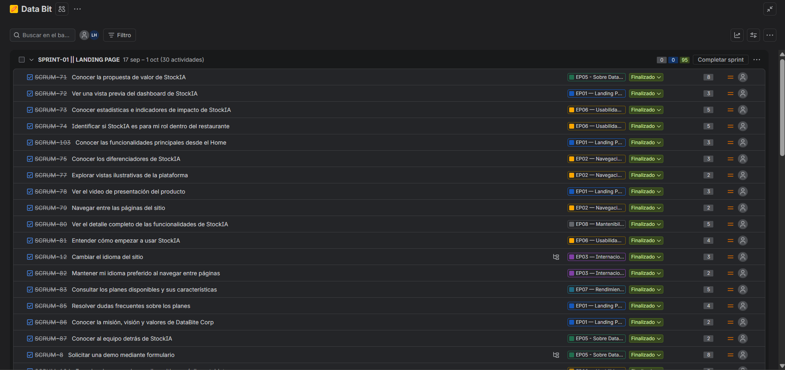
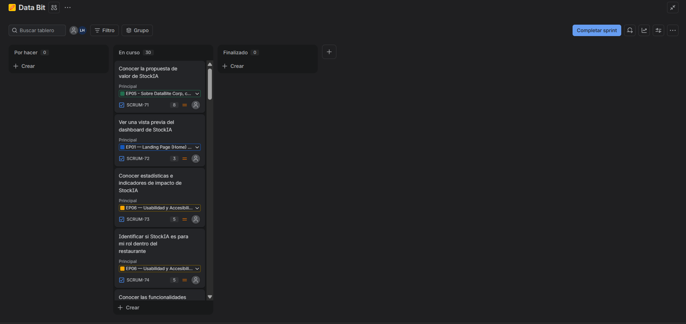
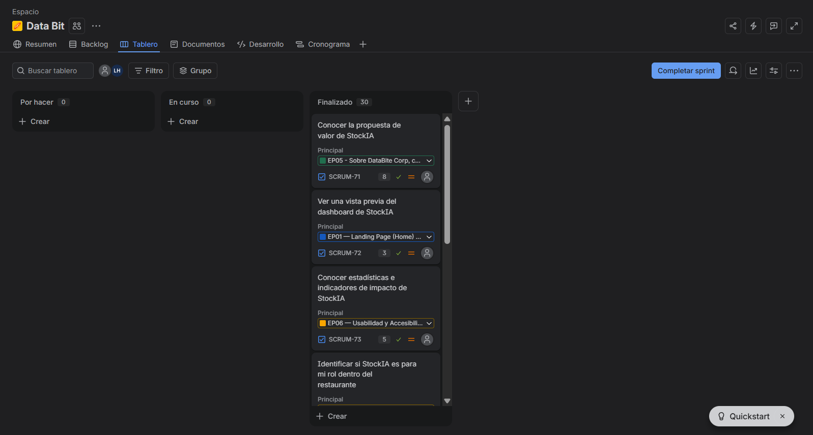
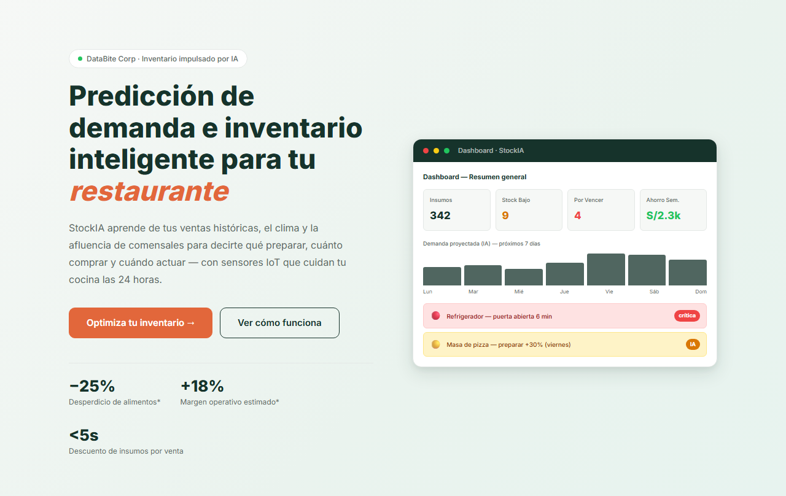
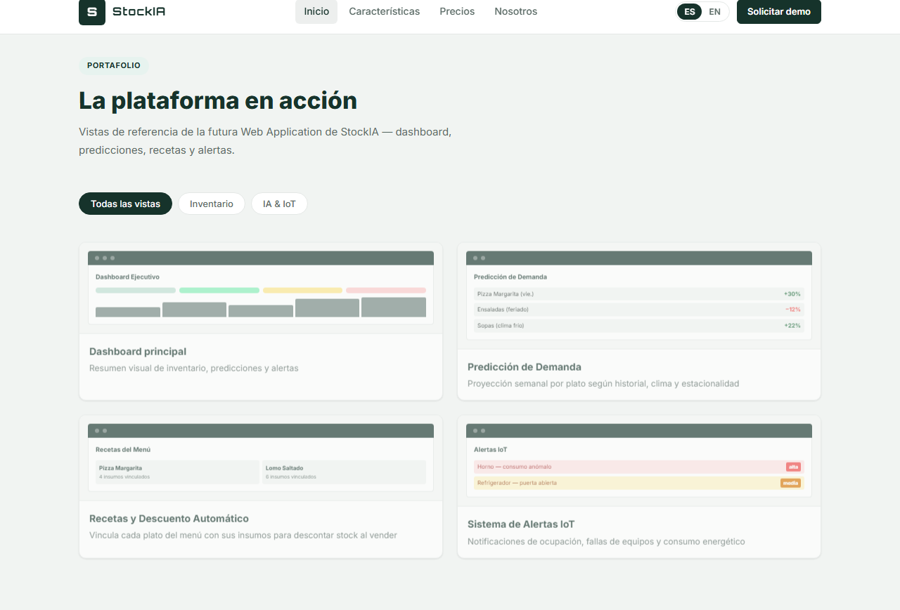
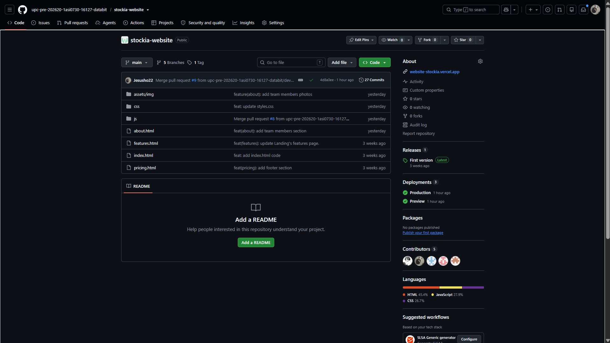
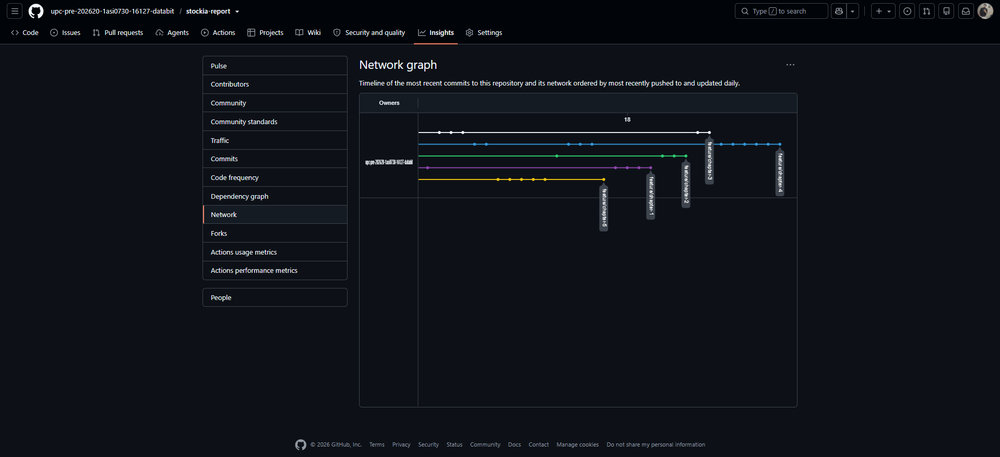
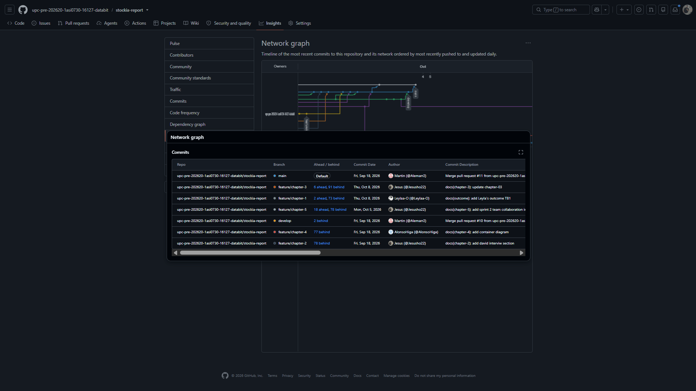

# **Chapter V: Product Implementation, Validation & Deployment**
## **5.1. Configuration Management Software**
### 5.1.1. Software Development Environment Configuration
A continuación se detallan los productos de software utilizados en el proyecto **StockIA**, organizados según las principales actividades del ciclo de vida del producto digital.

### Project Management  
- **WhatsApp**  
  Aplicación de mensajería instantánea que facilita la comunicación rápida y asíncrona entre los miembros del equipo para coordinar tareas operativas.  
  Referencia: [https://web.whatsapp.com/](https://web.whatsapp.com/)  

- **Google Meet**  
  Plataforma de videoconferencias utilizada para ceremonias Scrum, reuniones de sincronización técnica y sesiones de compartición de pantalla en tiempo real.  
  Referencia: [https://meet.google.com/](https://meet.google.com/)  

---

### Product UX/UI Design  
- **UXPressia**  
  Plataforma especializada en mapeo de experiencia de usuario y diseño de servicios. Se usó para elaborar user personas, journey mapping, empathy mapping e impact mapping.  
  Referencia: [https://uxpressia.com/](https://uxpressia.com/)  

- **Miro**  
  Pizarra colaborativa digital para crear diagramas y esquemas en tiempo real. Se utilizó en sesiones de Event Storming para identificar procesos de negocio y definir Bounded Contexts.  
  Referencia: [https://miro.com/](https://miro.com/)  

- **Figma**  
  Editor de gráficos vectoriales y herramienta de prototipado de interfaces. Se empleó para wireframes, mockups y prototipos interactivos del proyecto.  
  Referencia: [https://www.figma.com/](https://www.figma.com/)  

- **Jira**  
  Software de gestión de proyectos ágil (Scrum/Kanban). Se usó para administrar el Product Backlog, priorizar requerimientos y documentar User Stories con criterios de aceptación.  
  Referencia: [https://www.atlassian.com/es/software/jira](https://www.atlassian.com/es/software/jira)  

---

### Software Development  
- **Visual Studio Code**  
  Editor de código fuente ligero y extensible. Se utilizó para el desarrollo de componentes frontend, refactorización de scripts y edición rápida de código.  
  Descargar: [https://code.visualstudio.com/](https://code.visualstudio.com/)  

- **Extensión .rd para Visual Studio Code**  
  Herramienta integrada en VS Code para diseño y modelado de bases de datos. Se usó para crear y gestionar el esquema relacional de StockIA directamente desde el entorno de desarrollo.  
  Referencia: Marketplace de Visual Studio Code (extensión .rd).  

---

### Software Deployment  
- **GitHub**  
  Plataforma de desarrollo colaborativo basada en Git. Se empleó para alojar el código fuente y gestionar el despliegue continuo de la aplicación.  
  Referencia: [https://github.com/](https://github.com/)  

---

### Software Documentation  
- **GitHub**  
  Además de control de versiones, se utilizó para redactar, organizar y dar seguimiento al informe completo del proyecto.  
  Referencia: [https://github.com/](https://github.com/)  

- **Structurizr**  
  Herramienta para modelado de arquitectura de software mediante el enfoque C4. Se usó para construir los diagramas de arquitectura del proyecto.  
  Referencia: [https://structurizr.com/](https://structurizr.com/)  

---

El equipo adopta un enfoque basado en herramientas que permiten la colaboración en tiempo real y el acceso remoto a los recursos del proyecto. **GitHub** actúa como eje central para la gestión del código fuente y la documentación, mientras que las reuniones por **Google Meet** y **WhatsApp** aseguran una comunicación fluida y constante entre los miembros del equipo.  

Por otro lado, herramientas como **Figma**, **UXPressia** y **Miro** facilitan la construcción de artefactos de diseño centrados en el usuario, mientras que **Jira** permite organizar el trabajo en Sprints siguiendo principios ágiles. En el ámbito del desarrollo, **Visual Studio Code** junto con la extensión **.rd** proporcionan un entorno flexible para programar y modelar la base de datos de StockIA.  

Finalmente, **Structurizr** contribuye al modelado arquitectónico y la documentación técnica, garantizando que diseño, desarrollo, pruebas y despliegue se mantengan alineados. Esta configuración asegura una entrega continua de valor en cada iteración del proyecto **StockIA**.  

### **5.1.2. Source Code Management**
El equipo **DataBite Corp** utiliza **GitHub** como plataforma y sistema de control de versiones para todos los productos digitales de StockIA, lo que permite mantener un registro histórico de cambios, colaborar de forma estructurada y garantizar la trazabilidad durante todo el ciclo de desarrollo.

Para ello, se creó una organización pública que contiene los siguientes repositorios independientes:

| Solución | Nombre del repositorio | Enlace |
|---|---|---|
| Report (documentación en Markdown) | `stockia-report` | https://github.com/upc-pre-202620-1asi0730-16127-stockia/stockia-report.git |
| Website (Landing Page) | `stockia-website` | https://github.com/upc-pre-202620-1asi0730-16127-databit/stockia-website.git |
| WebApp (Frontend Web Application) | `stockia-webapp` | https://github.com/upc-pre-202620-1asi0730-16127-databit/stockia-webapp.git |
| Platform (RESTful Web Services) | `stockia-platform` | https://github.com/upc-pre-202620-1asi0730-16127-databit/stockia-platform-api.git |

En el caso del repositorio **`stockia-platform`**, este incluye tanto el proyecto principal del API como los archivos de pruebas, tanto unitarias como de integración / aceptación.

 <br>

---

## Implementación de GitFlow

El equipo adopta **GitFlow** como workflow de control de versiones, siguiendo el modelo propuesto por Vincent Driessen en *“A successful Git branching model”*.

Las ramas que se manejan en todos los repositorios son:

### `main`

Rama principal de producción. Solo recibe merges desde `release` o `hotfix`, y representa siempre el código estable y desplegado.

### `develop`

Rama de integración continua. Todas las features completadas se integran aquí antes de pasar a un release, y es la rama base para crear nuevos feature branches.

### `feature/<módulo>-<descripción-corta>`

Una rama por cada funcionalidad nueva.

Se crea desde `develop` y se integra nuevamente a `develop` mediante **Pull Request**, con revisión de al menos un miembro del equipo.

Ejemplos:

```text
feature/inventory-stock-management
feature/recipe-ingredient-linking
feature/demand-prediction
```

### `release/v<MAJOR>.<MINOR>.<PATCH>`
Rama para preparar una nueva versión de producción. Se crea desde `develop` cuando las features del Sprint están completas, permitiendo únicamente correcciones menores y actualización de versión. Se integra tanto a `main` como a `develop`.

**Ejemplo:**

```text
release/v1.2.0
```
### `hotfix/<descripción-corta>`
Rama para correcciones urgentes sobre producción. Se crea desde main y se integra gtanto a main como a develop.
**Ejemplo:**

```text
hotfix/stock-discount-error
```
Todas las ramas se nombran en inglés y aplicando kebab-case.

 <br>


## Semantic Versioning

El equipo aplica **Semantic Versioning 2.0.0** para el nombrado de releases, bajo el esquema `MAJOR.MINOR.PATCH`, donde **MAJOR** corresponde a cambios incompatibles con versiones anteriores del API, **MINOR** a nuevas funcionalidades compatibles con versiones anteriores, y **PATCH** a correcciones de errores compatibles. La primera versión funcional del producto será `v1.0.0`, correspondiente al entregable del Sprint 1.

## Conventional Commits

El equipo aplica la especificación **Conventional Commits** para todos los mensajes de commit, bajo la estructura `<tipo>(<alcance>): <descripción corta en inglés>`. Los tipos permitidos son:

| Tipo | Uso |
|---|---|
| `feat` | Nueva funcionalidad |
| `fix` | Corrección de error |
| `docs` | Cambios en documentación |
| `style` | Cambios de formato que no afectan la lógica |
| `refactor` | Refactorización sin nueva funcionalidad ni corrección |
| `test` | Adición o modificación de pruebas |
| `chore` | Tareas de mantenimiento, dependencias o configuración |

**Ejemplos aplicados al proyecto:**

```text
feat(inventory): add automatic ingredient deduction by recipe
fix(auth): correct expired token validation
docs(chapter-iv): add information architecture section
```
Este enfoque facilita la generación de historiales de cambios y mantiene un registro organizado y semántico del desarrollo.

 <br>


### **5.1.3. Source Code Style Guide & Conventions**
Como norma general, todo el código desarrollado en StockIA se redacta completamente en inglés, incluyendo nombres de variables, funciones, clases, archivos y comentarios, garantizando consistencia, mantenibilidad y alineación con estándares internacionales. Los nombres deben ser descriptivos y alineados al Ubiquitous Language del dominio (por ejemplo: `ingredient`, `recipe`, `stockLevel`, `demandForecast`, `expirationDate`), evitando ambigüedad.

## HTML

Se siguen el **HTML Style Guide and Coding Conventions (W3Schools)** y el **Google HTML/CSS Style Guide**:

- Etiquetas y atributos en minúsculas, con comillas dobles: `<section id="inventory-summary"></section>`
- Cierre correcto de todos los elementos.
- Inclusión de atributos de accesibilidad: ``
- Sangría de 2 espacios.

## CSS

Se sigue el **Google HTML/CSS Style Guide**:

- Clases e IDs en kebab-case: `.inventory-card`, `.alert-banner`
- Omitir unidades en valores cero: `margin: 0;`
- Uso de custom properties para colores y espaciado, evitando valores hardcodeados: `color: var(--primary);`
- Uso de unidades relativas (`rem`, `%`, `vh`) para responsive design.
- Evitar estilos inline; mantener la presentación en archivos `.css` separados.

## JavaScript

Se siguen el **Google JavaScript Style Guide**, las **MDN JavaScript Guidelines** y el **W3C JavaScript Style Guide**:

- camelCase para variables y funciones: `function calculateStockLevel() {}`
- Declaración con `const` y `let`, evitando `var`: `const stockThreshold = 10;`
- Uso de ES6+ (arrow functions, destructuring, template literals).
- Manejo de errores con `try/catch`.
- Evitar funciones excesivamente largas (máximo 20–30 líneas).

## Vue (Frontend Web Application)

Se sigue el **Vue Style Guide oficial**:

- Nombres de componentes en PascalCase: `InventoryDashboard`, `RecipeForm`
- Nombres de archivos de componente en PascalCase o kebab-case de forma consistente: `InventoryDashboard.vue`
- Uso de componentes en templates en kebab-case: `<inventory-dashboard />`
- Orden de bloques dentro de cada Single File Component: `<template>`, `<script>`, `<style>`
- Un componente por archivo, organizados por dominio funcional (`inventory`, `recipes`, `alerts`, `auth`).
- Props siempre con tipo definido y valor por defecto cuando aplique.

## C# (RESTful API con ASP.NET Core)

Se siguen las **C# Coding Conventions** y las **Microsoft ASP.NET Core Coding Guidelines**:

- PascalCase para clases, métodos y propiedades públicas: `public class InventoryService { public void DeductIngredients() { } }`
- camelCase para variables locales y parámetros: `int stockQuantity;`
- UPPER_SNAKE_CASE para constantes: `const int MAX_INGREDIENTS = 500;`
- Sangría de 4 espacios, sin tabulaciones.
- Aplicación de los principios de responsabilidad única y código modular, organizado por bounded context.
- Documentación de endpoints con OpenAPI mediante Swagger.

## Gherkin (criterios de aceptación y pruebas de aceptación)

Se siguen las **Gherkin Conventions for Readable Specifications**:

- Estructura obligatoria Given – When – Then.
- Escenarios en inglés, descriptivos, cortos y sin ambigüedad.
- Un escenario por comportamiento específico.
- Uso de Scenario Outline cuando corresponda.
- Archivos `.feature` nombrados por módulo: `inventory_management.feature`, `demand_prediction.feature`

### Ejemplo

```gherkin
Feature: Automatic ingredient deduction

Scenario: Stock is reduced when a dish is sold
    Given a recipe registered with its linked ingredients
    When a sale of that dish is recorded
    Then the system deducts the corresponding ingredient quantities from stock
```

### **5.1.4. Software Deployment Configuration**
A continuación se describe la configuración de despliegue de cada producto digital de StockIA, partiendo desde los repositorios de código fuente hasta su publicación.
#### Landing Page → Vercel

1. El código fuente del Landing Page (HTML, CSS y JavaScript estático) reside en el repositorio `stockia-website`, rama `main`.

2. Crear una cuenta en Vercel e iniciar sesión con la cuenta de GitHub de la organización del equipo, autorizando el acceso a los repositorios.

3. Importar el repositorio desde el panel de Vercel mediante **"Add New Project" → "Import Git Repository"**.

4. Configurar el proyecto con Framework Preset **"Other"**, al tratarse de un sitio estático sin proceso de build.

 <br>

5. Establecer `develop` como rama de producción. Cada push a `main` desencadena un redespliegue automático, y cada Pull Request hacia `develop` genera un preview deployment para revisión previa a la integración.

6. Verificar el despliegue accediendo a la URL pública asignada por Vercel y registrarla en la documentación del proyecto.


##### Evidencia del despliegue en Vercel

La siguiente imagen muestra el panel de Vercel con el **Production Deployment** del Landing Page, donde se observa el estado `Ready`, la rama utilizada y el dominio público asignado.

 <br>

##### Landing Page desplegada

La siguiente imagen muestra la **Landing Page de StockIA desplegada y disponible mediante el dominio público proporcionado por Vercel**.

 <br>

#### RESTful Web Services (ASP.NET Core + MySQL)

El RESTful API requiere un entorno de ejecución de servidor para aplicaciones .NET, por lo que se despliega en una plataforma compatible junto con su base de datos relacional.

La configuración prevista contempla:

1. Crear el servicio de base de datos MySQL.

2. Registrar las variables de entorno de conexión (host, puerto, nombre de base de datos, usuario y contraseña) en la plataforma de despliegue.

3. Referenciar dichas variables desde el archivo de configuración `appsettings.json` del proyecto en lugar de escribir las credenciales directamente en el código.

4. La documentación de los endpoints quedará disponible públicamente vía Swagger UI.

5. La configuración detallada y las URLs finales se documentarán en el Sprint correspondiente, una vez implementado el servicio.

##### Configuración de variables de entorno

La siguiente imagen muestra el apartado de **Environment Variables** de la plataforma de despliegue, utilizado para gestionar las variables de configuración del proyecto.

 <br>

## **5.2. Landing Page, Services & Applications Implementation**
### **5.2.1. Sprint 1**
El Sprint 1 se dedicó a la Landing Page de StockIA: cuatro páginas estáticas, bilingües y responsivas, publicadas en Vercel, con el formulario de solicitud de demo como punto de conversión. Los ítems seleccionados son los del Product Backlog que pertenecen a EP01, EP02 y EP03, y los habilitadores TS01 a TS04 de EP12.

#### **5.2.1.1. Sprint Planning 1**
El Sprint Planning Meeting marcó el inicio formal del desarrollo del código de StockIA. Durante esta sesión, el equipo de desarrollo junto al Product Owner seleccionaron las Historias de Usuario más prioritarias del Product Backlog (correspondientes a los Epics EP01–EP08) para definir el objetivo central de la iteración. A continuación, se presenta el cuadro resumen con los detalles y acuerdos de esta reunión:

| **Sprint #** | Sprint 1 |
| :--- | :--- |
| **Sprint Planning Background** | |
| **Date** | 09/09/2026 |
| **Time** | 10:00 am |
| **Location** | Lima/Lima/Santiago de Surco/UPC |
| **Prepared By** | Huaman Oscco, Aldo Jesus (Jesusho22) |
| **Attendees (to planning meeting)** | Higa Kohatsu, Alonso Enrique / Asmat Alminco, Martin Alejandro / Huaman Oscco, Aldo Jesus / Ortiz Laura, Leyla Alisson / Tuesta Girón, Kiara Lucia |
| **Sprint Review Summary** | No aplica: es el primer Sprint. Antes de él, el equipo cerró la fase de ideación (segmento, propuesta de valor y entrevistas) y configuró la organización y los repositorios en GitHub. |
| **Sprint Retrospective Summary** | No aplica al ser el primer Sprint. |
| **Sprint Goal & User Stories** | |
| **Sprint 1 Goal** | **Contexto:** El equipo prioriza comunicar la propuesta de valor al segmento objetivo y habilitar el primer canal de captación de restaurantes antes de construir la Web Application.<br><br>**Sprint Goal:**<br>*"Our focus is on publishing StockIA's bilingual four-page landing page. We believe it delivers a clear understanding of how StockIA connects sales, recipes and inventory to restaurant owners and managers. This will be confirmed when the site is live on Vercel, meets the responsive, accessibility, performance and SEO criteria of RNF01–RNF07, and a visitor can reach the demo request form in no more than two clicks from any page."* |
| **Sprint 1 Velocity** | No aplica: es el primer Sprint y no existe una velocidad histórica. |
| **Sum of Story Points** | 40 Story Points comprometidos en 19 ítems (8 US, 4 TS y 7 RNF) |
 

#### **5.2.1.2. Aspect Leaders and Collaborators**
En esta sección se presenta la **Leadership-and-Collaboration Matrix (LACX)** del Sprint 1. Cada aspecto agrupa las tareas del Sprint Backlog; el líder (L) responde por la integración y la revisión de ese aspecto, y los colaboradores (C) desarrollan o revisan sus tareas.
 
| Team Member | GitHub Username | Estructura, estilos e interacciones (CSS/JS) (L/C) | Maquetación del Home y contenido bilingüe (L/C) | Páginas internas (features, pricing, about) (L/C) | Responsive, accesibilidad y SEO (L/C) | Despliegue y QA (L/C) |
| :--- | :--- | :---: | :---: | :---: | :---: | :---: |
| Higa Kohatsu, Alonso Enrique | AlonsoHiga | C | C | L | C | C |
| Asmat Alminco, Martin Alejandro | Alemarr2 | C | C | C | L | C |
| Huaman Oscco, Aldo Jesus | Jesusho22 | C | C | C | C | L |
| Ortiz Laura, Leyla Alisson | Leylaa-O | L | C | C | C | C |
| Tuesta Girón, Kiara Lucia | kitu05g | C | L | C | C | C |
 
> **Leyenda:** **L:** Líder del aspecto · **C:** Colaborador

#### **5.2.1.3. Sprint Backlog 1**
**Periodo:** 09/09/2026 – 18/09/2026  
**Objetivo del Sprint:** Publicar en Vercel la Landing Page de StockIA (index, features, pricing y about), bilingüe ES/EN, responsiva y con el formulario de solicitud de demo operativo en modo simulado.
 
| **User Story Id** | **Título de la Historia** | **Task Id** | **Título de la Tarea** | **Descripción de la Tarea** | **Est. (Hrs)** | **Asignado** | **Status** |
| :--- | :--- | :--- | :--- | :--- | :---: | :--- | :---: |
| **US01** | Comprender la propuesta de valor y el impacto de StockIA desde el Home | T-US01-1 | Maquetar el hero | Estructurar título, descripción y los dos CTA del hero en index.html. | 3 | Tuesta Girón, Kiara Lucia | Done |
|  |  | T-US01-2 | Maquetar el mockup ilustrativo del dashboard | Construir con HTML/CSS las tarjetas y el gráfico del mockup del hero. | 4 | Tuesta Girón, Kiara Lucia | Done |
|  |  | T-US01-3 | Redactar y traducir el copy del hero | Escribir la propuesta de valor e indicadores en ES/EN y registrar sus claves en i18n.js. | 2.5 | Tuesta Girón, Kiara Lucia | Done |
|  |  | T-US01-4 | Maquetar la barra de estadísticas | Construir la barra de cuatro indicadores y su versión responsive. | 2 | Tuesta Girón, Kiara Lucia | Done |
|  |  | T-US01-5 | Redactar la nota de cifras referenciales | Escribir y traducir la nota que identifica las cifras como referenciales. | 1 | Tuesta Girón, Kiara Lucia | Done |
| **US02** | Identificar si StockIA es para mi rol y explorar sus funcionalidades | T-US02-1 | Maquetar el grid de funcionalidades del Home | Construir las seis tarjetas y el enlace a features.html. | 2.5 | Tuesta Girón, Kiara Lucia | Done |
|  |  | T-US02-2 | Maquetar features.html | Construir el hero y el grid detallado de los seis módulos. | 4 | Asmat Alminco, Martin Alejandro | Done |
|  |  | T-US02-3 | Maquetar la sección "Cómo funciona" | Construir los cuatro pasos numerados en features.html. | 2 | Asmat Alminco, Martin Alejandro | Done |
|  |  | T-US02-4 | Traducir el contenido de features.html | Registrar en i18n.js las claves ES/EN de la página. | 2 | Asmat Alminco, Martin Alejandro | Done |
|  |  | T-US02-5 | Maquetar la sección de segmentos | Construir las dos tarjetas de "¿Para quién es StockIA?" en index.html. | 2 | Tuesta Girón, Kiara Lucia | Done |
|  |  | T-US02-6 | Redactar el contenido por segmento | Escribir y traducir el mensaje de cada tarjeta según el rol. | 1.5 | Huaman Oscco, Aldo Jesus | Done |
| **TS02** | Implementar el sistema de diseño centralizado en CSS | T-TS02-1 | Definir los tokens de diseño | Declarar colores, tipografías, espaciados y radios en :root. | 3 | Ortiz Laura, Leyla Alisson | Done |
|  |  | T-TS02-2 | Construir los componentes CSS | Crear botones, tarjetas, badges, formularios, toggle y grids responsive. | 5 | Ortiz Laura, Leyla Alisson | Done |
| **US04** | Comparar planes y resolver dudas antes de contratar | T-US04-1 | Maquetar pricing.html | Construir el hero y las tres tarjetas de plan con la etiqueta de plan popular. | 4 | Huaman Oscco, Aldo Jesus | Done |
|  |  | T-US04-2 | Programar el interruptor mensual/anual | Recalcular los precios en main.js al cambiar el interruptor. | 2 | Ortiz Laura, Leyla Alisson | Done |
|  |  | T-US04-3 | Maquetar las preguntas frecuentes | Construir el bloque FAQ con sus tres preguntas. | 1.5 | Huaman Oscco, Aldo Jesus | Done |
|  |  | T-US04-4 | Programar el acordeón del FAQ | Abrir una pregunta y cerrar la anterior en main.js. | 1 | Ortiz Laura, Leyla Alisson | Done |
|  |  | T-US04-5 | Traducir el contenido de pricing.html | Registrar en i18n.js las claves ES/EN de planes y preguntas. | 1.5 | Huaman Oscco, Aldo Jesus | Done |
| **US03** | Evaluar diferenciadores, integraciones y vistas del producto | T-US03-1 | Maquetar diferenciadores e integraciones | Construir las tres tarjetas de diferenciadores y las cuatro de integraciones con su etiqueta. | 3 | Tuesta Girón, Kiara Lucia | Done |
|  |  | T-US03-2 | Maquetar portafolio y bloque de video | Construir las vistas ilustrativas con pestañas y el placeholder de video. | 2.5 | Tuesta Girón, Kiara Lucia | Done |
|  |  | T-US03-3 | Programar el cambio de pestaña del portafolio | Resaltar la pestaña activa con JavaScript en main.js. | 1 | Ortiz Laura, Leyla Alisson | Done |
| **US05** | Conocer a DataBite Corp y a su equipo | T-US05-1 | Maquetar el hero, misión y visión | Construir el encabezado de about.html y las tarjetas de misión y visión. | 2.5 | Higa Kohatsu, Alonso Enrique | Done |
|  |  | T-US05-2 | Maquetar la sección "Sobre DataBite Corp" | Construir la descripción de la startup y sus valores. | 1.5 | Higa Kohatsu, Alonso Enrique | Done |
|  |  | T-US05-3 | Maquetar las fichas del equipo y el bloque de video | Construir las fichas de los integrantes y el placeholder del video del equipo. | 2 | Higa Kohatsu, Alonso Enrique | Done |
|  |  | T-US05-4 | Traducir el contenido de about.html | Registrar en i18n.js las claves ES/EN de la página. | 1.5 | Higa Kohatsu, Alonso Enrique | Done |
| **TS03** | Implementar el motor de internacionalización de la Landing Page | T-TS03-1 | Implementar i18n.js | Programar el diccionario ES/EN, la función t() y la aplicación por data-i18n. | 4 | Higa Kohatsu, Alonso Enrique | Done |
| **US06** | Solicitar una demo desde el formulario de contacto | T-US06-1 | Maquetar la sección de contacto y el formulario | Construir datos de contacto y formulario con validación nativa (required y type=email). | 2.5 | Higa Kohatsu, Alonso Enrique | Done |
|  |  | T-US06-2 | Programar la confirmación simulada del envío | Mostrar "✓ Enviado", deshabilitar el botón y limpiar el formulario en main.js. | 1.5 | Ortiz Laura, Leyla Alisson | Done |
|  |  | T-US06-3 | Enlazar el banner CTA de las cuatro páginas | Apuntar el botón del banner final a about.html#contacto. | 1 | Higa Kohatsu, Alonso Enrique | Done |
| **RNF01** | Adaptabilidad de la Landing Page a móvil, tablet y escritorio | T-RNF01-1 | Definir media queries de 1024, 768 y 480 px | Reorganizar grids y ocultar elementos no esenciales por breakpoint. | 3 | Asmat Alminco, Martin Alejandro | Done |
|  |  | T-RNF01-2 | Probar la Landing Page por breakpoint | Verificar las cuatro páginas a 360, 768, 1024 y 1440 px y registrar capturas. | 1.5 | Asmat Alminco, Martin Alejandro | Done |
| **US07** | Navegar entre las páginas del sitio | T-US07-1 | Maquetar la barra de navegación y el pie de página | Construir el navbar y el footer y replicarlos en las cuatro páginas. | 3 | Asmat Alminco, Martin Alejandro | Done |
|  |  | T-US07-2 | Programar el resaltado del enlace activo | Marcar en main.js el enlace de la página actual. | 1 | Ortiz Laura, Leyla Alisson | Done |
| **US08** | Leer el sitio en español o en inglés | T-US08-1 | Implementar el selector ES/EN con persistencia | Guardar y leer el idioma en localStorage y marcar el botón activo. | 1.5 | Higa Kohatsu, Alonso Enrique | Done |
|  |  | T-US08-2 | Revisar claves de traducción faltantes | Recorrer las cuatro páginas en EN y completar las claves sin traducir. | 1.5 | Tuesta Girón, Kiara Lucia | Done |
|  |  | T-US08-3 | Revisión editorial ES/EN | Unificar terminología y corregir el estilo de los textos en ambos idiomas. | 2 | Huaman Oscco, Aldo Jesus | Done |
| **TS01** | Configurar el repositorio de la Landing Page con GitFlow | T-TS01-1 | Crear la estructura base del proyecto | Crear carpetas y archivos vacíos de las cuatro páginas, css, js y assets. | 1 | Higa Kohatsu, Alonso Enrique | Done |
|  |  | T-TS01-2 | Configurar ramas y reglas de Pull Request | Crear develop y exigir revisión antes de integrar en develop y main. | 1 | Higa Kohatsu, Alonso Enrique | Done |
| **TS04** | Desplegar la Landing Page en Vercel con despliegue continuo | T-TS04-1 | Configurar el proyecto en Vercel | Vincular el repositorio y definir la rama de producción. | 1.5 | Huaman Oscco, Aldo Jesus | Done |
|  |  | T-TS04-2 | Verificar el sitio publicado | Probar las cuatro páginas, enlaces e idioma en el dominio público. | 1 | Huaman Oscco, Aldo Jesus | Done |
| **RNF02** | Contraste legible según WCAG 2.1 AA | T-RNF02-1 | Validar y ajustar el contraste de la paleta | Medir cada par texto/fondo y ajustar los que no cumplen AA. | 1.5 | Asmat Alminco, Martin Alejandro | Done |
| **RNF03** | Carga rápida de la Landing Page | T-RNF03-1 | Medir y optimizar el rendimiento | Ejecutar Lighthouse móvil y optimizar fuentes y recursos que bloquean la carga. | 1.5 | Huaman Oscco, Aldo Jesus | Done |
| **RNF04** | Metadatos para posicionamiento en buscadores | T-RNF04-1 | Agregar metadatos por página | Definir title y description en las cuatro páginas, y keywords, author y copyright en index.html. | 1.5 | Asmat Alminco, Martin Alejandro | Done |
| **RNF05** | Compatibilidad con navegadores modernos | T-RNF05-1 | Probar la matriz de navegadores | Verificar las interacciones del sitio en cada navegador y registrar resultados. | 1.5 | Huaman Oscco, Aldo Jesus | Done |
| **RNF06** | Animaciones de aparición que no bloquean el contenido | T-RNF06-1 | Implementar el scroll reveal con respaldo | Animar tarjetas con IntersectionObserver y omitirlo cuando no hay soporte. | 1.5 | Ortiz Laura, Leyla Alisson | Done |
| **RNF07** | Identificación del contenido ilustrativo | T-RNF07-1 | Agregar notas de contenido ilustrativo | Señalar cifras, precios y fichas de ejemplo en ES/EN. | 1 | Huaman Oscco, Aldo Jesus | Done |
| | **TOTAL** | | | **Esfuerzo total estimado para el Sprint** | **94** | | |
 
**Capacidad del Sprint 1**
 
| Integrante | Disponibilidad declarada (h) | Horas asignadas | N.° de tareas | Uso de la capacidad |
| :--- | :---: | :---: | :---: | :---: |
| Higa Kohatsu, Alonso Enrique | 28 | 18.5 | 10 | 66 % |
| Asmat Alminco, Martin Alejandro | 28 | 18.5 | 8 | 66 % |
| Huaman Oscco, Aldo Jesus | 28 | 17 | 10 | 61 % |
| Ortiz Laura, Leyla Alisson | 28 | 16 | 8 | 57 % |
| Tuesta Girón, Kiara Lucia | 28 | 24 | 10 | 86 % |
| **Total** | **140** | **94** | **46** | **67 %** |
 
##### Resumen Técnico
- **Total de horas:** 94 horas en 46 tareas.
- **Distribución:** 09/09/2026 – 18/09/2026, con una disponibilidad declarada de 28 horas por integrante (14 h por semana); la capacidad libre cubre revisiones de Pull Request y ceremonias.
- **Story Points:** 40 comprometidos; 40 completados al cierre registrado en este informe.
- **Entregable principal:** Landing Page de StockIA (4 páginas) publicada en Vercel, bilingüe ES/EN, responsiva y con el formulario de solicitud de demo en modo simulado.

<p align="center">
  
  <br/><i>Artefacto: Jira para Sprint 1 Priorizado</i>
</p>
<p align="center">
  
  <br/><i>Artefacto: Jira para demostrar el tablero Kanban - Proceso -</i>
</p>
<p align="center">
  
  <br/><i>Artefacto: Jira para demostrar el tablero Kanban - Finalizado -</i>
</p>

#### **5.2.1.4. Development Evidence for Sprint Review**
En esta sección se explica y presenta los avances en implementación con relación a los productos de la solución según el alcance del Sprint: Landing Page.

Primero, se mostrarán los commits más importantes para el Reporte, los cuales muestran el ciclo de vida del proyecto, y toda la información que se usó, usa y usará para el desarrollo del proyecto:

| **Repository** | **Branch** | **Commit Id** | **Commit Message** | **Commit Message Body** | **Committed on (Date)** |
| :--- | :--- | :--- | :--- | :--- | :---: |
| stockia-report | develop | `147c971` | chore: initialize report repository structure | Creación del repositorio del informe con la estructura inicial de carpetas (`docs/`). | 27/08/2026 |
| stockia-report | develop | `3f41c6d` | chore: create develop branch | Se crea la rama `develop` como base de integración de GitFlow para el equipo. | 10/09/2026 |
| stockia-report | feature/chapter-1 | `5715eee` | docs: add picture for team member profiles | Se agregan las fotografías de los integrantes para la sección de Startup Profile. | 10/09/2026 |
| stockia-report | develop | `043c2d6` | Merge pull request #1 from feature/chapter-1 | Integra a `develop` el Capítulo I completo (Startup Profile, Solution Profile, Segmentos objetivo) tras revisión vía Pull Request. | 16/09/2026 |
| stockia-report | feature/chapter-5 | `d4e06cc` | docs(chapter-5): add Aspect Leaders and Collaborators section | Se agrega la matriz de Líderes y Colaboradores (LACX) para el Sprint 1. | 18/09/2026 |
| stockia-report | feature/chapter-5 | `4d7211e` | docs: update source code management section | Se actualiza la sección de Source Code Management con las convenciones de GitFlow y Conventional Commits aplicadas. | 18/09/2026 |

<br/>

A continuación se presentan los commits más importantes para la Landing Page, los cuales muestran todo el contenido visual y las funcionalidades implementadas en el Sprint 1:

| **Repository** | **Branch** | **Commit Id** | **Commit Message** | **Commit Message Body** | **Committed on (Date)** |
| :--- | :--- | :--- | :--- | :--- | :---: |
| stockia-website | develop | `1a58474` | chore: set up project structure | Se sube la estructura base del sitio: `index.html`, `features.html`, `pricing.html`, `about.html`, hojas de estilo (`css/`) y scripts (`js/`). | 18/09/2026 |
| stockia-website | develop | `2efd03a` | feat: add about section | Se implementa el contenido de `about.html` (misión, visión, equipo y formulario de contacto). | 18/09/2026 |
| stockia-website | develop | `6e0d010` | feat: add index.html code | Se implementa el Home (`index.html`) con header, hero, estadísticas, segmentos, funcionalidades y footer. | 18/09/2026 |
| stockia-website | feature/pricing | `9ca1046` | feat(pricing): add footer section | Última sección de `pricing.html` (planes, toggle mensual/anual, FAQ y footer), cierre de la feature. | 18/09/2026 |
| stockia-website | develop | `0e54999` | Merge pull request #1 from feature/pricing | Integra a `develop` la página `pricing.html` completa tras revisión vía Pull Request. | 18/09/2026 |

*Nota: se listan los commits más representativos de cada rama; el detalle completo puede revisarse en el historial de GitHub de cada repositorio de la organización [upc-pre-202620-1asi0730-16127-databit](https://github.com/upc-pre-202620-1asi0730-16127-databit).*

<br/>

#### **5.2.1.5. Execution Evidence for Sprint Review**
En el Sprint 1 se busca implementar todas las secciones de las 4 páginas de la Landing Page de StockIA. A continuación, se explorarán los avances a través de imágenes que muestren el resultado obtenido *(capturas pendientes de reemplazo, tomadas ahora desde el repositorio `stockia-website` de la organización)*:
<br/>

1. **Sección header / navbar:** Barra de navegación compartida entre las 4 páginas del sitio, con selector de idioma (ES/EN).

<br/>
<p align="center">
  
  <br/><i>Sección header / navbar — StockIA</i>
</p>
<br/>

2. **Sección hero + mockup de dashboard:** Título con la propuesta de valor, descripción, botones CTA y un mockup ilustrativo del dashboard de StockIA.

<br/>
<p align="center">
  
  <br/><i>Sección hero + mockup de dashboard — StockIA</i>
</p>
<br/>

3. **Barra de estadísticas:** Los cuatro indicadores de impacto mostrados en el Home, con nota de transparencia sobre cifras de ejemplo.

<br/>
<p align="center">
  
  <br/><i>Barra de estadísticas — StockIA</i>
</p>
<br/>

4. **Sección "¿Para quién es StockIA?":** Tarjetas diferenciadas para los segmentos dueños/CEOs de restaurantes y administradores/jefes de cocina.

<br/>
<p align="center">
  
  <br/><i>Sección "¿Para quién es StockIA?" — StockIA</i>
</p>
<br/>

5. **Grid de funcionalidades:** Seis tarjetas de funcionalidades principales en el Home, con enlace al detalle completo en features.html.

<br/>
<p align="center">
  
  <br/><i>Grid de funcionalidades — StockIA</i>
</p>
<br/>

6. **Sección "Más que un inventario" (diferenciadores):** Las tres tarjetas de diferenciadores de StockIA frente a otras soluciones.

<br/>
<p align="center">
  
  <br/><i>Sección "Más que un inventario" (diferenciadores) — StockIA</i>
</p>
<br/>

7. **Sección de integraciones externas:** Las cuatro tarjetas de integraciones en evaluación (Google Maps, OpenWeather, Stripe/PayPal, Twilio/SendGrid), con nota de decisión pendiente.

<br/>
<p align="center">
  
  <br/><i>Sección de integraciones externas — StockIA</i>
</p>
<br/>

8. **Sección de portafolio:** Vistas ilustrativas con tabs para alternar entre Inventario e IA & IoT.

<br/>
<p align="center">
  
  <br/><i>Sección de portafolio — StockIA</i>
</p>
<br/>

9. **Placeholder de video demostrativo:** Bloque "Video demostrativo próximamente", con el iframe de YouTube ya preparado en el código para su reemplazo futuro.

<br/>
<p align="center">
  
  <br/><i>Placeholder de video demostrativo — StockIA</i>
</p>
<br/>

10. **features.html — grid completo:** Detalle extendido de las seis funcionalidades y la sección "Cómo funciona" (4 pasos).

<br/>
<p align="center">
  
  <br/><i>features.html — grid completo — StockIA</i>
</p>
<br/>

11. **pricing.html — planes y FAQ:** Las tarjetas de los planes Esencial, Profesional e IoT Completo, el toggle mensual/anual y el acordeón de preguntas frecuentes.

<br/>
<p align="center">
  
  <br/><i>pricing.html — planes y FAQ — StockIA</i>
</p>
<br/>

12. **about.html — misión, visión, equipo y formulario:** Sección de misión/visión/valores, las fichas de equipo (placeholder) y el formulario de solicitud de demo.

<br/>
<p align="center">
  
  <br/><i>about.html — misión, visión, equipo y formulario — StockIA</i>
</p>
<br/>

13. **Sección footer:** Parte final del sitio, compartida entre las 4 páginas.

<br/>
<p align="center">
  
  <br/><i>Sección footer — StockIA</i>
</p>
<br/>

Para finalizar, se mostrará una demostración del avance sobre la Landing Page dentro de GitHub, para la publicación de la página web:
<p align="center">
  
  <br/><i>Repositorio de GitHub sobre la Landing Page de StockIA — https://github.com/upc-pre-202620-1asi0730-16127-databit/stockia-website</i>
</p>

#### **5.2.1.6. Services Documentation Evidence for Sprint Review**
Para este Sprint, se han implementado y documentado los puntos de interacción de la Landing Page. Aunque el almacenamiento persistente será parte de un Sprint posterior, se ha programado la lógica de captura, validación y respuesta visual en el frontend para el siguiente servicio simulado:

| Endpoint / Interacción | Acción (HTTP) | Campos del formulario | Descripción del Response |
| :--- | :---: | :--- | :--- |
| `about.html#contactForm` | **POST (Mock)** | Nombre*, Restaurante, Correo*, Mensaje (`*` obligatorios vía `required`) | **202 Accepted (simulado)**: `preventDefault()` bloquea el envío real, el botón cambia a "✓ Enviado" (fondo de éxito) y se deshabilita 3 segundos; luego el formulario se resetea (`form.reset()`) automáticamente. |

* **URL del Repositorio de Landing Page:** https://github.com/upc-pre-202620-1asi0730-16127-databit/stockia-website
* **URL de la Landing Page desplegada:** https://stockia-landing-giag.vercel.app/about.html#contacto

#### **5.2.1.7. Software Deployment Evidence for Sprint Review**
El proceso de despliegue para el Sprint 1 priorizó una infraestructura de hosting estático en **Vercel**, aprovechando su infraestructura global (CDN) para garantizar tiempos de carga óptimos para la Landing Page. Se priorizó la automatización para permitir iteraciones rápidas sobre el diseño y el contenido informativo orientado a los segmentos objetivo.

**Actividades de Despliegue Realizadas**
* Configuración del proyecto en Vercel, vinculado al repositorio `upc-pre-202620-1asi0730-16127-databit/stockia-website` para despliegues automáticos.
* Despliegue continuo activado en cada push a la rama `develop`, publicado en: **[pendiente de confirmar URL de Vercel del repositorio de la organización]**
* Verificación de las 4 páginas del sitio (`index.html`, `features.html`, `pricing.html`, `about.html`) en el dominio de Vercel.

**Evidencia Deploy: Landing Page - Responsive**
<p align="center">
  
  <br/><i>Landing Page Desplegada</i>
</p>

**Evidencia Deploy: Landing Page Mobile - Responsive**
<p align="center">
  
  <br/><i>Landing Page Desplegada (vista móvil, 390px)</i>
</p>

#### **5.2.1.8. Team Collaboration Insights during Sprint**
**Dinámica de Implementación**
<p align="center">
Durante este ciclo, el equipo DataBit (Martín, Alonso Higa Kohatsu, Aldo Jesús, Kiara Tuesta y Leyla Ortiz) concentró sus esfuerzos en el desarrollo Frontend y la Documentación Técnica de la Landing Page. El equipo trabajó de forma remota, distribuyendo tareas mediante un tablero Kanban (ver evidencia en 5.2.1.3) y centralizando el control de versiones en GitHub, bajo la organización <code>upc-pre-202620-1asi0730-16127-databit</code>.
</p>

**Analíticos de Colaboración**
<p align="center">
La carga de trabajo se distribuyó para asegurar que todos los integrantes participaran en la construcción de los artefactos visuales y técnicos:

* Desarrollo Frontend: Aldo Jesús implementó la página `pricing.html` completa (navbar, hero, tarjetas de planes, FAQ, CTA y footer); Alonso Higa Kohatsu implementó `about.html`; Kiara Tuesta implementó `index.html`. Martín y Leyla Ortiz aportaron a la documentación técnica y artefactos de diseño (diagramas C4, wireframes).

* Documentación y Calidad: Los cinco integrantes redactaron en paralelo los capítulos del informe mediante ramas `feature/chapter-1` a `feature/chapter-5`: Alonso Higa Kohatsu lideró los Capítulos I y II (Startup/Solution Profile, Competidores, Entrevistas, Needfinding); Aldo Jesús los Capítulos III y V (User Stories, Product Backlog, Sprint 1); Kiara Tuesta y Martín aportaron a los Capítulos I, II y IV (arquitectura, diagramas de clase y base de datos); Leyla Ortiz contribuyó a los Capítulos I a III (perfiles, entrevistas, Ubiquitous Language, Impact Mapping).

* Control de Versiones: El equipo aplica **GitFlow** en los repositorios `stockia-report` y `stockia-website`, con `main` y `develop` como ramas estables y una rama `feature/chapter-X` por cada capítulo del informe (`feature/chapter-1` a `feature/chapter-5`) y `feature/pricing` para la Landing Page, integradas mediante Pull Requests revisados antes de cada merge (a la fecha, PR #1 en `stockia-report` y PR #1 en `stockia-website`, ambos mergeados). Se aplica Conventional Commits en ambos repositorios.
</p>

**Evidencia GitFlow: Graph**
<p align="center">
  
  <br/><i>Grafo de versiones para el gitflow</i>
</p>

**Evidencia GitFlow: Network**
<p align="center">
  
  <br/><i>Grafo de trabajo</i>
</p>

## **5.3. Validation Interviews**
### **5.3.1. Interview Design**
### **5.3.2. Interview Recording**
### **5.3.3. Evaluations Based on Heuristics**
## **5.4. About-the-Product Video**