# **Chapter V: Product Implementation, Validation & Deployment**
## **5.1. Configuration Management Software**
### 5.1.1. Software Development Environment Configuration
A continuación se detallan los productos de software utilizados en el proyecto **StockIA**, organizados según las principales actividades del ciclo de vida del producto digital.

### Project Management  
- **WhatsApp**  
  Aplicación de mensajería instantánea que facilita la comunicación rápida y asíncrona entre los miembros del equipo para coordinar tareas operativas.  
  Referencia: [https://web.whatsapp.com/](https://web.whatsapp.com/)  

- **Google Meet**  
  Plataforma de videoconferencias utilizada para ceremonias Scrum, reuniones de sincronización técnica y sesiones de compartición de pantalla en tiempo real.  
  Referencia: [https://meet.google.com/](https://meet.google.com/)  

---

### Product UX/UI Design  
- **UXPressia**  
  Plataforma especializada en mapeo de experiencia de usuario y diseño de servicios. Se usó para elaborar user personas, journey mapping, empathy mapping e impact mapping.  
  Referencia: [https://uxpressia.com/](https://uxpressia.com/)  

- **Miro**  
  Pizarra colaborativa digital para crear diagramas y esquemas en tiempo real. Se utilizó en sesiones de Event Storming para identificar procesos de negocio y definir Bounded Contexts.  
  Referencia: [https://miro.com/](https://miro.com/)  

- **Figma**  
  Editor de gráficos vectoriales y herramienta de prototipado de interfaces. Se empleó para wireframes, mockups y prototipos interactivos del proyecto.  
  Referencia: [https://www.figma.com/](https://www.figma.com/)  

- **Jira**  
  Software de gestión de proyectos ágil (Scrum/Kanban). Se usó para administrar el Product Backlog, priorizar requerimientos y documentar User Stories con criterios de aceptación.  
  Referencia: [https://www.atlassian.com/es/software/jira](https://www.atlassian.com/es/software/jira)  

---

### Software Development  
- **Visual Studio Code**  
  Editor de código fuente ligero y extensible. Se utilizó para el desarrollo de componentes frontend, refactorización de scripts y edición rápida de código.  
  Descargar: [https://code.visualstudio.com/](https://code.visualstudio.com/)  

- **Extensión .rd para Visual Studio Code**  
  Herramienta integrada en VS Code para diseño y modelado de bases de datos. Se usó para crear y gestionar el esquema relacional de StockIA directamente desde el entorno de desarrollo.  
  Referencia: Marketplace de Visual Studio Code (extensión .rd).  

---

### Software Deployment  
- **GitHub**  
  Plataforma de desarrollo colaborativo basada en Git. Se empleó para alojar el código fuente y gestionar el despliegue continuo de la aplicación.  
  Referencia: [https://github.com/](https://github.com/)  

---

### Software Documentation  
- **GitHub**  
  Además de control de versiones, se utilizó para redactar, organizar y dar seguimiento al informe completo del proyecto.  
  Referencia: [https://github.com/](https://github.com/)  

- **Structurizr**  
  Herramienta para modelado de arquitectura de software mediante el enfoque C4. Se usó para construir los diagramas de arquitectura del proyecto.  
  Referencia: [https://structurizr.com/](https://structurizr.com/)  

---

El equipo adopta un enfoque basado en herramientas que permiten la colaboración en tiempo real y el acceso remoto a los recursos del proyecto. **GitHub** actúa como eje central para la gestión del código fuente y la documentación, mientras que las reuniones por **Google Meet** y **WhatsApp** aseguran una comunicación fluida y constante entre los miembros del equipo.  

Por otro lado, herramientas como **Figma**, **UXPressia** y **Miro** facilitan la construcción de artefactos de diseño centrados en el usuario, mientras que **Jira** permite organizar el trabajo en Sprints siguiendo principios ágiles. En el ámbito del desarrollo, **Visual Studio Code** junto con la extensión **.rd** proporcionan un entorno flexible para programar y modelar la base de datos de StockIA.  

Finalmente, **Structurizr** contribuye al modelado arquitectónico y la documentación técnica, garantizando que diseño, desarrollo, pruebas y despliegue se mantengan alineados. Esta configuración asegura una entrega continua de valor en cada iteración del proyecto **StockIA**.  

### **5.1.2. Source Code Management**
El equipo **DataBite Corp** utiliza **GitHub** como plataforma y sistema de control de versiones para todos los productos digitales de StockIA, lo que permite mantener un registro histórico de cambios, colaborar de forma estructurada y garantizar la trazabilidad durante todo el ciclo de desarrollo.

Para ello, se creó una organización pública que contiene los siguientes repositorios independientes:

| Solución | Nombre del repositorio | Enlace |
|---|---|---|
| Report (documentación en Markdown) | `stockia-report` | https://github.com/upc-pre-202620-1asi0730-16127-stockia/stockia-report.git |
| Website (Landing Page) | `stockia-website` | https://github.com/upc-pre-202620-1asi0730-16127-databit/stockia-website.git |
| WebApp (Frontend Web Application) | `stockia-webapp` | https://github.com/upc-pre-202620-1asi0730-16127-databit/stockia-webapp.git |
| Platform (RESTful Web Services) | `stockia-platform` | https://github.com/upc-pre-202620-1asi0730-16127-databit/stockia-platform-api.git |

En el caso del repositorio **`stockia-platform`**, este incluye tanto el proyecto principal del API como los archivos de pruebas, tanto unitarias como de integración / aceptación.

 <br>

---

## Implementación de GitFlow

El equipo adopta **GitFlow** como workflow de control de versiones, siguiendo el modelo propuesto por Vincent Driessen en *“A successful Git branching model”*.

Las ramas que se manejan en todos los repositorios son:

### `main`

Rama principal de producción. Solo recibe merges desde `release` o `hotfix`, y representa siempre el código estable y desplegado.

### `develop`

Rama de integración continua. Todas las features completadas se integran aquí antes de pasar a un release, y es la rama base para crear nuevos feature branches.

### `feature/<módulo>-<descripción-corta>`

Una rama por cada funcionalidad nueva.

Se crea desde `develop` y se integra nuevamente a `develop` mediante **Pull Request**, con revisión de al menos un miembro del equipo.

Ejemplos:

```text
feature/inventory-stock-management
feature/recipe-ingredient-linking
feature/demand-prediction
```

### `release/v<MAJOR>.<MINOR>.<PATCH>`
Rama para preparar una nueva versión de producción. Se crea desde `develop` cuando las features del Sprint están completas, permitiendo únicamente correcciones menores y actualización de versión. Se integra tanto a `main` como a `develop`.

**Ejemplo:**

```text
release/v1.2.0
```
### `hotfix/<descripción-corta>`
Rama para correcciones urgentes sobre producción. Se crea desde main y se integra gtanto a main como a develop.
**Ejemplo:**

```text
hotfix/stock-discount-error
```
Todas las ramas se nombran en inglés y aplicando kebab-case.

 <br>


## Semantic Versioning

El equipo aplica **Semantic Versioning 2.0.0** para el nombrado de releases, bajo el esquema `MAJOR.MINOR.PATCH`, donde **MAJOR** corresponde a cambios incompatibles con versiones anteriores del API, **MINOR** a nuevas funcionalidades compatibles con versiones anteriores, y **PATCH** a correcciones de errores compatibles. La primera versión funcional del producto será `v1.0.0`, correspondiente al entregable del Sprint 1.

## Conventional Commits

El equipo aplica la especificación **Conventional Commits** para todos los mensajes de commit, bajo la estructura `<tipo>(<alcance>): <descripción corta en inglés>`. Los tipos permitidos son:

| Tipo | Uso |
|---|---|
| `feat` | Nueva funcionalidad |
| `fix` | Corrección de error |
| `docs` | Cambios en documentación |
| `style` | Cambios de formato que no afectan la lógica |
| `refactor` | Refactorización sin nueva funcionalidad ni corrección |
| `test` | Adición o modificación de pruebas |
| `chore` | Tareas de mantenimiento, dependencias o configuración |

**Ejemplos aplicados al proyecto:**

```text
feat(inventory): add automatic ingredient deduction by recipe
fix(auth): correct expired token validation
docs(chapter-iv): add information architecture section
```
Este enfoque facilita la generación de historiales de cambios y mantiene un registro organizado y semántico del desarrollo.

 <br>


### **5.1.3. Source Code Style Guide & Conventions**
Como norma general, todo el código desarrollado en StockIA se redacta completamente en inglés, incluyendo nombres de variables, funciones, clases, archivos y comentarios, garantizando consistencia, mantenibilidad y alineación con estándares internacionales. Los nombres deben ser descriptivos y alineados al Ubiquitous Language del dominio (por ejemplo: `ingredient`, `recipe`, `stockLevel`, `demandForecast`, `expirationDate`), evitando ambigüedad.

## HTML

Se siguen el **HTML Style Guide and Coding Conventions (W3Schools)** y el **Google HTML/CSS Style Guide**:

- Etiquetas y atributos en minúsculas, con comillas dobles: `<section id="inventory-summary"></section>`
- Cierre correcto de todos los elementos.
- Inclusión de atributos de accesibilidad: ``
- Sangría de 2 espacios.

## CSS

Se sigue el **Google HTML/CSS Style Guide**:

- Clases e IDs en kebab-case: `.inventory-card`, `.alert-banner`
- Omitir unidades en valores cero: `margin: 0;`
- Uso de custom properties para colores y espaciado, evitando valores hardcodeados: `color: var(--primary);`
- Uso de unidades relativas (`rem`, `%`, `vh`) para responsive design.
- Evitar estilos inline; mantener la presentación en archivos `.css` separados.

## JavaScript

Se siguen el **Google JavaScript Style Guide**, las **MDN JavaScript Guidelines** y el **W3C JavaScript Style Guide**:

- camelCase para variables y funciones: `function calculateStockLevel() {}`
- Declaración con `const` y `let`, evitando `var`: `const stockThreshold = 10;`
- Uso de ES6+ (arrow functions, destructuring, template literals).
- Manejo de errores con `try/catch`.
- Evitar funciones excesivamente largas (máximo 20–30 líneas).

## Vue (Frontend Web Application)

Se sigue el **Vue Style Guide oficial**:

- Nombres de componentes en PascalCase: `InventoryDashboard`, `RecipeForm`
- Nombres de archivos de componente en PascalCase o kebab-case de forma consistente: `InventoryDashboard.vue`
- Uso de componentes en templates en kebab-case: `<inventory-dashboard />`
- Orden de bloques dentro de cada Single File Component: `<template>`, `<script>`, `<style>`
- Un componente por archivo, organizados por dominio funcional (`inventory`, `recipes`, `alerts`, `auth`).
- Props siempre con tipo definido y valor por defecto cuando aplique.

## C# (RESTful API con ASP.NET Core)

Se siguen las **C# Coding Conventions** y las **Microsoft ASP.NET Core Coding Guidelines**:

- PascalCase para clases, métodos y propiedades públicas: `public class InventoryService { public void DeductIngredients() { } }`
- camelCase para variables locales y parámetros: `int stockQuantity;`
- UPPER_SNAKE_CASE para constantes: `const int MAX_INGREDIENTS = 500;`
- Sangría de 4 espacios, sin tabulaciones.
- Aplicación de los principios de responsabilidad única y código modular, organizado por bounded context.
- Documentación de endpoints con OpenAPI mediante Swagger.

## Gherkin (criterios de aceptación y pruebas de aceptación)

Se siguen las **Gherkin Conventions for Readable Specifications**:

- Estructura obligatoria Given – When – Then.
- Escenarios en inglés, descriptivos, cortos y sin ambigüedad.
- Un escenario por comportamiento específico.
- Uso de Scenario Outline cuando corresponda.
- Archivos `.feature` nombrados por módulo: `inventory_management.feature`, `demand_prediction.feature`

### Ejemplo

```gherkin
Feature: Automatic ingredient deduction

Scenario: Stock is reduced when a dish is sold
    Given a recipe registered with its linked ingredients
    When a sale of that dish is recorded
    Then the system deducts the corresponding ingredient quantities from stock
```

### **5.1.4. Software Deployment Configuration**
A continuación se describe la configuración de despliegue de cada producto digital de StockIA, partiendo desde los repositorios de código fuente hasta su publicación.
#### Landing Page → Vercel

1. El código fuente del Landing Page (HTML, CSS y JavaScript estático) reside en el repositorio `stockia-website`, rama `main`.

2. Crear una cuenta en Vercel e iniciar sesión con la cuenta de GitHub de la organización del equipo, autorizando el acceso a los repositorios.

3. Importar el repositorio desde el panel de Vercel mediante **"Add New Project" → "Import Git Repository"**.

4. Configurar el proyecto con Framework Preset **"Other"**, al tratarse de un sitio estático sin proceso de build.

 <br>

5. Establecer `develop` como rama de producción. Cada push a `main` desencadena un redespliegue automático, y cada Pull Request hacia `develop` genera un preview deployment para revisión previa a la integración.

6. Verificar el despliegue accediendo a la URL pública asignada por Vercel y registrarla en la documentación del proyecto.


##### Evidencia del despliegue en Vercel

La siguiente imagen muestra el panel de Vercel con el **Production Deployment** del Landing Page, donde se observa el estado `Ready`, la rama utilizada y el dominio público asignado.

 <br>

##### Landing Page desplegada

La siguiente imagen muestra la **Landing Page de StockIA desplegada y disponible mediante el dominio público proporcionado por Vercel**.

 <br>

#### RESTful Web Services (ASP.NET Core + MySQL)

El RESTful API requiere un entorno de ejecución de servidor para aplicaciones .NET, por lo que se despliega en una plataforma compatible junto con su base de datos relacional.

La configuración prevista contempla:

1. Crear el servicio de base de datos MySQL.

2. Registrar las variables de entorno de conexión (host, puerto, nombre de base de datos, usuario y contraseña) en la plataforma de despliegue.

3. Referenciar dichas variables desde el archivo de configuración `appsettings.json` del proyecto en lugar de escribir las credenciales directamente en el código.

4. La documentación de los endpoints quedará disponible públicamente vía Swagger UI.

5. La configuración detallada y las URLs finales se documentarán en el Sprint correspondiente, una vez implementado el servicio.

##### Configuración de variables de entorno

La siguiente imagen muestra el apartado de **Environment Variables** de la plataforma de despliegue, utilizado para gestionar las variables de configuración del proyecto.

 <br>

## **5.2. Landing Page, Services & Applications Implementation**
### **5.2.1. Sprint 1**
Este primer ciclo de desarrollo se centró en establecer los pilares de la identidad digital de **StockIA**, integrando el esfuerzo colaborativo del equipo para entregar un sitio de marketing funcional inicial. Durante este Sprint, el equipo priorizó la captación de visitantes mediante una Landing Page de 4 páginas (`index.html`, `features.html`, `pricing.html`, `about.html`), completamente bilingüe (ES/EN) y responsiva, documentando cada fase desde la planificación hasta el despliegue final para validar la propuesta de valor frente al segmento elegido. Los ítems seleccionados son US01 a US20 y RNF01 a RNF10 del Product Backlog, correspondientes a las épicas EP01 a EP08.

#### **5.2.1.1. Sprint Planning 1**
El Sprint Planning Meeting marcó el inicio formal del desarrollo del código de StockIA. Durante esta sesión, el equipo de desarrollo junto al Product Owner seleccionaron las Historias de Usuario más prioritarias del Product Backlog (correspondientes a los Epics EP01–EP08) para definir el objetivo central de la iteración. A continuación, se presenta el cuadro resumen con los detalles y acuerdos de esta reunión:

| **Sprint #** | Sprint 1 |
| :--- | :--- |
| **Sprint Planning Background** | |
| **Date** | 09/09/2026 |
| **Time** | 10:00 am |
| **Location** | Lima/Lima/Santiago de Surco/UPC |
| **Prepared By** | Huaman Oscco, Aldo Jesus (Jesusho22) |
| **Attendees (to planning meeting)** | Higa Kohatsu, Alonso Enrique / Asmat Alminco, Martin Alejandro / Huaman Oscco, Aldo Jesus / Ortiz Laura, Leyla Alisson / Tuesta Girón, Kiara Lucia |
| **Sprint Review Summary** | No aplica: es el primer Sprint. Antes de él, el equipo cerró la fase de ideación (segmentos objetivo, propuesta de valor y entrevistas), finalizó la arquitectura C4 y el modelado de la base de datos, y configuró la organización y los repositorios de GitHub para trabajar con GitFlow. |
| **Sprint Retrospective Summary** | No aplica al ser el primer Sprint. Como acuerdo inicial de trabajo, el equipo definió el uso de GitHub y Jira para la colaboración remota y una rama `feature/*` por página o capítulo integrada mediante Pull Request. |
| **Sprint Goal & User Stories** | |
| **Sprint 1 Goal** | **Contexto:** El equipo prioriza establecer la identidad digital de StockIA y comunicar la propuesta de valor al segmento objetivo, publicando un sitio de marketing de 4 páginas totalmente bilingüe (ES/EN), antes de invertir esfuerzo en la Web Application. <br><br> **Sprint Goal:**<br>*"Our focus is on building a trustworthy digital presence that clearly communicates StockIA's value proposition. We believe this will let visitors understand the product's benefits within seconds and request a demo with confidence. This will be confirmed when the four-page site is live, fully bilingual, responsive, and generating demo requests."* |
| **Sprint 1 Velocity** | No aplica: es el primer Sprint y no existe una velocidad histórica. |
| **Sum of Story Points** | 88 Story Points comprometidos en 30 ítems (20 US y 10 RNF) |
 

#### **5.2.1.2. Aspect Leaders and Collaborators**
En esta sección se presenta la **Leadership-and-Collaboration Matrix (LACX)** del Sprint 1. Cada aspecto agrupa las tareas del Sprint Backlog; el líder (L) responde por la integración y la revisión de ese aspecto, y los colaboradores (C) desarrollan o revisan sus tareas.
 
| Team Member | GitHub Username | Estructura, estilos e interacciones (CSS/JS) (L/C) | Maquetación del Home y contenido bilingüe (L/C) | Páginas internas (features, pricing, about) (L/C) | Responsive, accesibilidad y SEO (L/C) | Despliegue y QA (L/C) |
| :--- | :--- | :---: | :---: | :---: | :---: | :---: |
| Higa Kohatsu, Alonso Enrique | AlonsoHiga | C | C | L | C | C |
| Asmat Alminco, Martin Alejandro | Alemarr2 | C | C | C | L | C |
| Huaman Oscco, Aldo Jesus | Jesusho22 | C | C | C | C | L |
| Ortiz Laura, Leyla Alisson | Leylaa-O | L | C | C | C | C |
| Tuesta Girón, Kiara Lucia | kitu05g | C | L | C | C | C |
 
> **Leyenda:** **L:** Líder del aspecto · **C:** Colaborador

#### **5.2.1.3. Sprint Backlog 1**
**Periodo:** 09/09/2026 – 18/09/2026  
**Objetivo del Sprint:** Tener la Landing Page de StockIA (4 páginas) completamente maquetada, traducida ES/EN, responsiva y con el formulario de demo funcional, lista para publicarse.


| **User Story Id** | **Título de la Historia** | **Task Id** | **Título de la Tarea** | **Descripción de la Tarea** | **Est. (Hrs)** | **Asignado** | **Status** |
| :--- | :--- | :--- | :--- | :--- | :---: | :--- | :---: |
| **US01** | Conocer la propuesta de valor | T-01-1 | Maquetado del Hero | Construir el layout del hero con título, descripción y botones CTA. | 5 | Higa Kohatsu, Alonso Enrique | Done |
|  |  | T-01-2 | Redacción y traducción del mensaje principal | Escribir el copy de la propuesta de valor en español e inglés. | 3 | Tuesta Girón, Kiara Lucia | Done |
| **US02** | Ver una vista previa del dashboard | T-02-1 | Mockup ilustrativo del dashboard | Maquetar las tarjetas y el gráfico ilustrativos con CSS. | 6 | Asmat Alminco, Martin Alejandro | Done |
|  |  | T-02-2 | Responsive del mockup | Ocultar el mockup en pantallas menores a 768px. | 2 | Ortiz Laura, Leyla Alisson | Done |
| **US03** | Conocer estadísticas e indicadores | T-03-1 | Barra de estadísticas | Maquetar los cuatro indicadores de impacto del Home. | 4 | Huaman Oscco, Aldo Jesus | Done |
|  |  | T-03-2 | Nota de transparencia | Redactar y traducir la nota de cifras de ejemplo. | 2 | Higa Kohatsu, Alonso Enrique | Done |
| **US04** | Identificar si StockIA es para mi rol | T-04-1 | Sección "¿Para quién es StockIA?" | Maquetar las tarjetas por segmento (dueños/CEOs y administradores). | 4 | Tuesta Girón, Kiara Lucia | Done |
|  |  | T-04-2 | Redacción por segmento | Escribir el contenido diferenciado para cada rol. | 3 | Asmat Alminco, Martin Alejandro | Done |
| **US05** | Conocer las funcionalidades principales | T-05-1 | Grid de seis funcionalidades | Maquetar las tarjetas de funcionalidades en el Home. | 5 | Ortiz Laura, Leyla Alisson | Done |
|  |  | T-05-2 | Enlace a features.html | Implementar el botón "Ver todas las características". | 2 | Huaman Oscco, Aldo Jesus | Done |
| **US06** | Conocer los diferenciadores | T-06-1 | Sección "Más que un inventario" | Maquetar las tres tarjetas de diferenciadores. | 3 | Higa Kohatsu, Alonso Enrique | Done |
|  |  | T-06-2 | Redacción y traducción | Escribir el contenido de cada diferenciador. | 2 | Tuesta Girón, Kiara Lucia | Done |
| **US07** | Conocer las integraciones externas | T-07-1 | Sección de integraciones | Maquetar las cuatro tarjetas con la etiqueta "En evaluación". | 3 | Asmat Alminco, Martin Alejandro | Done |
|  |  | T-07-2 | Nota de transparencia | Redactar el texto que aclara que la decisión está pendiente. | 2 | Ortiz Laura, Leyla Alisson | Done |
| **US08** | Explorar vistas ilustrativas | T-08-1 | Sección de portafolio | Maquetar las cuatro vistas ilustrativas. | 5 | Huaman Oscco, Aldo Jesus | Done |
|  |  | T-08-2 | Tabs de portafolio (JS) | Implementar el cambio de pestaña Inventario / IA & IoT. | 3 | Higa Kohatsu, Alonso Enrique | Done |
| **US09** | Ver el video de presentación | T-09-1 | Placeholder de video | Maquetar el bloque "Video demostrativo próximamente". | 2 | Tuesta Girón, Kiara Lucia | Done |
|  |  | T-09-2 | Estructura para reemplazo futuro | Dejar preparado el iframe de YouTube comentado en el código. | 2 | Asmat Alminco, Martin Alejandro | Done |
| **US10** | Navegar entre las páginas del sitio | T-10-1 | Navbar compartido | Implementar el menú superior en las 4 páginas. | 4 | Ortiz Laura, Leyla Alisson | Done |
|  |  | T-10-2 | Estado activo del enlace | Resaltar visualmente la página actual en el navbar. | 2 | Huaman Oscco, Aldo Jesus | Done |
| **US11** | Ver el detalle completo de funcionalidades | T-11-1 | Grid completo en features.html | Maquetar las seis funcionalidades con descripción extendida. | 5 | Higa Kohatsu, Alonso Enrique | Done |
| **US12** | Entender cómo empezar a usar StockIA | T-12-1 | Sección "Cómo funciona" | Maquetar los cuatro pasos numerados. | 4 | Tuesta Girón, Kiara Lucia | Done |
| **US13** | Cambiar el idioma del sitio | T-13-1 | Selector de idioma (ES/EN) | Implementar los botones de idioma en el navbar. | 3 | Asmat Alminco, Martin Alejandro | Done |
|  |  | T-13-2 | Motor de traducción (i18n.js) | Programar el reemplazo de textos mediante data-i18n. | 6 | Ortiz Laura, Leyla Alisson | Done |
| **US14** | Mantener mi idioma preferido | T-14-1 | Persistencia en localStorage | Guardar y leer el idioma seleccionado entre páginas. | 3 | Huaman Oscco, Aldo Jesus | Done |
| **US15** | Consultar los planes disponibles | T-15-1 | Maquetado de los 3 planes | Construir las tarjetas de Esencial, Profesional e IoT Completo. | 5 | Higa Kohatsu, Alonso Enrique | Done |
|  |  | T-15-2 | Nota de precios de ejemplo | Redactar la nota de transparencia sobre precios ilustrativos. | 2 | Tuesta Girón, Kiara Lucia | Done |
| **US16** | Comparar precios mensuales y anuales | T-16-1 | Toggle mensual/anual (JS) | Implementar el interruptor y el recálculo de montos. | 4 | Asmat Alminco, Martin Alejandro | Done |
| **US17** | Resolver dudas frecuentes | T-17-1 | Acordeón de preguntas frecuentes | Implementar la apertura/cierre exclusivo de preguntas. | 4 | Ortiz Laura, Leyla Alisson | Done |
|  |  | T-17-2 | Redacción de preguntas y respuestas | Escribir el contenido del FAQ en español e inglés. | 3 | Huaman Oscco, Aldo Jesus | Done |
| **US18** | Conocer misión, visión y valores | T-18-1 | Sección misión/visión/valores | Maquetar el bloque correspondiente en about.html. | 3 | Higa Kohatsu, Alonso Enrique | Done |
|  |  | T-18-2 | Redacción de contenido | Escribir la misión, visión y los cinco valores. | 2 | Tuesta Girón, Kiara Lucia | Done |
| **US19** | Conocer al equipo detrás de StockIA | T-19-1 | Fichas de equipo | Maquetar las cuatro fichas placeholder con nombre, rol y código. | 3 | Asmat Alminco, Martin Alejandro | Done |
|  |  | T-19-2 | Nota de datos pendientes | Redactar la nota de "fichas de ejemplo". | 1 | Ortiz Laura, Leyla Alisson | Done |
| **US20** | Solicitar una demo mediante formulario | T-20-1 | Formulario de contacto | Maquetar el formulario con validación nativa de campos obligatorios. | 4 | Huaman Oscco, Aldo Jesus | Done |
|  |  | T-20-2 | Confirmación visual de envío | Implementar el mensaje "✓ Enviado" y el reseteo del formulario. | 3 | Higa Kohatsu, Alonso Enrique | Done |
|  |  | T-20-3 | Accesos al formulario | Enlazar los botones "Solicitar demo" del navbar, banner y footer. | 2 | Tuesta Girón, Kiara Lucia | Done |
| **RNF01** | Experiencia responsiva | T-R1-1 | Breakpoints de 1024px y 768px | Definir media queries para tablets y móviles. | 4 | Asmat Alminco, Martin Alejandro | Done |
|  |  | T-R1-2 | Ajuste de cuadrículas | Reorganizar columnas y ocultar elementos no esenciales en móvil. | 4 | Ortiz Laura, Leyla Alisson | Done |
| **RNF02** | Contraste y legibilidad accesible | T-R2-1 | Paleta de contraste | Definir colores de texto con contraste adecuado sobre fondos claros y oscuros. | 3 | Huaman Oscco, Aldo Jesus | Done |
| **RNF03** | Navegación consistente | T-R3-1 | Navbar y footer compartidos | Reutilizar los mismos componentes en las 4 páginas. | 3 | Higa Kohatsu, Alonso Enrique | Done |
| **RNF04** | Carga rápida | T-R4-1 | Optimización de assets | Evitar frameworks y librerías pesadas innecesarias. | 3 | Tuesta Girón, Kiara Lucia | Done |
| **RNF05** | Buen posicionamiento en buscadores | T-R5-1 | Metadatos por página | Agregar title y meta description a cada página. | 2 | Asmat Alminco, Martin Alejandro | Done |
|  |  | T-R5-2 | Metadatos adicionales del Home | Agregar meta keywords, author y copyright en index.html. | 2 | Ortiz Laura, Leyla Alisson | Done |
| **RNF06** | Compatibilidad con navegadores | T-R6-1 | CSS estándar (Flexbox/Grid) | Verificar compatibilidad en navegadores modernos. | 3 | Huaman Oscco, Aldo Jesus | Done |
|  |  | T-R6-2 | Degradación de animaciones | Manejar el caso sin soporte de IntersectionObserver. | 2 | Higa Kohatsu, Alonso Enrique | Done |
| **RNF07** | Animaciones de entrada | T-R7-1 | Scroll reveal (JS) | Implementar la animación de aparición progresiva de tarjetas. | 4 | Tuesta Girón, Kiara Lucia | Done |
| **RNF08** | Contenido pendiente señalizado | T-R8-1 | Notas visibles de contenido de ejemplo | Agregar notas junto a las secciones con datos ilustrativos. | 2 | Asmat Alminco, Martin Alejandro | Done |
|  |  | T-R8-2 | Comentarios en el código | Documentar en HTML qué elementos deben reemplazarse. | 1 | Ortiz Laura, Leyla Alisson | Done |
| **RNF09** | Sistema de diseño centralizado | T-R9-1 | Variables CSS en :root | Centralizar colores, tipografías y espaciados. | 4 | Huaman Oscco, Aldo Jesus | Done |
| **RNF10** | Textos centralizados (i18n) | T-R10-1 | Diccionario único de traducciones | Concentrar todos los textos ES/EN en i18n.js. | 4 | Higa Kohatsu, Alonso Enrique | Done |
| **TOTAL** | | | | **Esfuerzo total estimado para el Sprint** | **162** | | |

**Capacidad del Sprint 1**

| Integrante | Disponibilidad declarada (h) | Horas asignadas | N.° de tareas | Uso de la capacidad |
| :--- | :---: | :---: | :---: | :---: |
| Higa Kohatsu, Alonso Enrique | 40 | 38 | 11 | 95 % |
| Asmat Alminco, Martin Alejandro | 40 | 32 | 10 | 80 % |
| Huaman Oscco, Aldo Jesus | 40 | 33 | 10 | 83 % |
| Ortiz Laura, Leyla Alisson | 40 | 31 | 10 | 78 % |
| Tuesta Girón, Kiara Lucia | 40 | 28 | 10 | 70 % |
| **Total** | **200** | **162** | **51** | **81 %** |

<p align="center">
  
  <br/><i>Artefacto: Jira para Sprint 1 Priorizado</i>
</p>
<p align="center">
  
  <br/><i>Artefacto: Jira para demostrar el tablero Kanban - Proceso -</i>
</p>
<p align="center">
  
  <br/><i>Artefacto: Jira para demostrar el tablero Kanban - Finalizado -</i>
</p>

##### Resumen Técnico
- **Total de horas:** 162 horas en 51 tareas.
- **Distribución:** 09/09/2026 – 18/09/2026, con una disponibilidad declarada de 40 horas por integrante (20 h por semana); la capacidad libre cubre revisiones de Pull Request y ceremonias.
- **Story Points:** 88 comprometidos; 88 completados al cierre del Sprint (velocidad del Sprint 1).
- **Entregable principal:** Landing Page de StockIA (4 páginas), bilingüe ES/EN, responsiva, con formulario de solicitud de demo funcional.

#### **5.2.1.4. Development Evidence for Sprint Review**
En esta sección se presentan los avances de implementación del Sprint 1 (Landing Page) mediante los commits que los respaldan. Cada commit se relaciona con el ítem del Sprint Backlog 1 que implementa, de modo que puede rastrearse el trabajo de cada integrante desde la historia hasta el código.

**Repositorio del informe (`stockia-report`)**

El informe se trabajó con GitFlow: una rama `feature/chapter-N` por capítulo y su integración en `develop` mediante Pull Request (PR #1 al #11 durante el Sprint 1, con la versión `v1.0.0` publicada en `main`). Se presentan los commits más representativos de cada integrante:

| **Repository** | **Branch** | **Commit Id** | **Commit Message** | **Commit Message Body** | **Committed on (Date)** |
| :--- | :--- | :--- | :--- | :--- | :---: |
| stockia-report | main | `147c971` | chore: initialize report repository structure | Creación del repositorio del informe con la estructura de `docs/` (Alonso-Higa). | 27/08/2026 |
| stockia-report | feature/chapter-3 | `293996b` | docs: create chapter 3 documentation | Estructura inicial del capítulo III (AlonsoHiga). | 09/09/2026 |
| stockia-report | develop | `3f41c6d` | chore: create develop branch | Rama `develop` como base de integración de GitFlow (AlonsoHiga). | 10/09/2026 |
| stockia-report | feature/chapter-3 | `12b4340` | docs(chapter-3): add User Stories section | User Stories de la Landing Page y de la Web Application (Jesus). | 17/09/2026 |
| stockia-report | feature/chapter-3 | `6570d87` | docs(chapter-3): add Product Backlog section | Product Backlog priorizado con Story Points (Jesus). | 17/09/2026 |
| stockia-report | feature/chapter-4 | `794e63c` | docs(chapter-4): add Landing Page Wireframe section | Wireframes de la Landing Page (Jesus). | 17/09/2026 |
| stockia-report | feature/chapter-2 | `d4d4f38` | docs(chapter-2): update interviews for stockman segment | Entrevistas del segmento de encargados de almacén (Alemarr2). | 17/09/2026 |
| stockia-report | feature/chapter-4 | `53a88d3` | docs(chapter-4): add database diagrams for each bounded context | Diagramas de base de datos por Bounded Context (Alemarr2). | 17/09/2026 |
| stockia-report | feature/chapter-2 | `86d4e66` | docs(chapter-2): add big-picture-event-storming | Big Picture EventStorming del dominio (AlonsoHiga). | 17/09/2026 |
| stockia-report | feature/chapter-2 | `cc654c1` | docs(chapter-ii): add analysis of interview 2 | Análisis de la entrevista 2 (kitu05g). | 17/09/2026 |
| stockia-report | feature/chapter-5 | `ee49203` | docs(chapter-v): add source code management and style guide | Secciones 5.1.2 y 5.1.3 (kitu05g). | 17/09/2026 |
| stockia-report | feature/chapter-5 | `4c938ad` | docs(chapter-v): add software deployment configuration | Sección 5.1.4 (kitu05g). | 17/09/2026 |
| stockia-report | feature/chapter-3 | `c98ce10` | docs(chapter-3): add Impact Mapping section | Impact Map del segmento objetivo (Leylaa-O). | 18/09/2026 |
| stockia-report | feature/chapter-4 | `98d9bf3` | docs(chapter-4): add Web Applications UX/UI Design section | Wireframes, wireflows y mock-ups de la Web Application (Leylaa-O). | 18/09/2026 |
| stockia-report | feature/chapter-5 | `2eb79ae` | docs(chapter-5): add section Configuration Management Software | Sección 5.1.1 (Leylaa-O). | 18/09/2026 |
| stockia-report | feature/chapter-4 | `88cc204` | docs: add all component diagrams for each bounded context. | Diagramas de componentes C4 por Bounded Context (Alemarr2). | 18/09/2026 |
| stockia-report | feature/chapter-4 | `f16e0b4` | docs(chapter-4): add container diagram | Diagrama de contenedores C4 (AlonsoHiga). | 18/09/2026 |
| stockia-report | feature/chapter-5 | `66c56dd` | docs(chapter-5): add Team Collaboration Insights during Sprint section | Sección 5.2.1.8 (Jesus). | 18/09/2026 |
| stockia-report | main | `ae58e7f` | Merge pull request #11 from develop | Publicación de la versión `v1.0.0` del informe para el AV1 (Martin). | 18/09/2026 |

<br/>

**Repositorio de la Landing Page (`stockia-website`)**

La Landing Page se integró en el repositorio de la organización siguiendo GitFlow: Alonso creó la estructura y los scripts base, cada integrante integró su página mediante una rama `feature/*` y su Pull Request, y Leyla ajustó los estilos y las interacciones.

| **Repository** | **Branch** | **Commit Id** | **Commit Message** | **Commit Message Body** | **Committed on (Date)** |
| :--- | :--- | :--- | :--- | :--- | :---: |
| stockia-website | develop | `1a58474` | chore: set up project structure | Estructura base con las cuatro páginas y las carpetas `css`, `js` y `assets` (AlonsoHiga). | 17/09/2026 |
| stockia-website | develop | `2efd03a` | feat: add about section | US18, US19 y US20: misión, visión, valores, equipo y formulario de solicitud de demo en `about.html` (AlonsoHiga). | 17/09/2026 |
| stockia-website | develop | `6e0d010` | feat: add index.html code | US01 a US09: hero, mockup del dashboard, estadísticas, segmentos, funcionalidades, diferenciadores, integraciones, portafolio y video en `index.html` (kitu05g). | 17/09/2026 |
| stockia-website | feature/pricing | `6f5bf63` | feat(pricing): add navbar section | US10: barra de navegación de `pricing.html` (Jesus). | 18/09/2026 |
| stockia-website | feature/pricing | `9f5b940` | feat(pricing): add pricing cards section | US15 y US16: planes Esencial, Profesional e IoT Completo con interruptor mensual/anual (Jesus). | 18/09/2026 |
| stockia-website | feature/pricing | `af0e54c` | feat(pricing): add faq section | US17: preguntas frecuentes de `pricing.html` (Jesus). | 18/09/2026 |
| stockia-website | feature/pricing | `9ca1046` | feat(pricing): add footer section | US10 y RNF03: pie de página de `pricing.html` (Jesus). | 18/09/2026 |
| stockia-website | develop | `0e54999` | Merge pull request #1 from feature/pricing | Integración revisada de `pricing.html` en `develop` (Aldo_Jesus). | 18/09/2026 |
| stockia-website | feature/features-page | `4082128` | feat(features): update Landing's features page. | US11 y US12: detalle de las seis funcionalidades y la sección "Cómo funciona" en `features.html` (Alemarr2). | 18/09/2026 |
| stockia-website | develop | `be0b019` | Merge pull request #2 from feature/features-page | Integración revisada de `features.html` en `develop` (Martin). | 18/09/2026 |
| stockia-website | develop | `04782c2` | feat: add js files and cs file | RNF09, RNF10, US13 y US14: hoja de estilos, diccionario ES/EN e interacciones del sitio (AlonsoHiga). | 18/09/2026 |
| stockia-website | main | `d89ab65` | Merge pull request #3 from develop | Publicación de la versión `v1.0.0` de la Landing Page (AlonsoHiga). | 18/09/2026 |
| stockia-website | feature/styles | `9887414` | feat: update styles.css | RNF07 y RNF09: ajustes del sistema de diseño (Leylaa-O). | 18/09/2026 |
| stockia-website | feature/js-files | `0897fec` | feat: update js files | RNF10: limpieza de `i18n.js` y `main.js` (Leylaa-O). | 18/09/2026 |

#### **5.2.1.5. Execution Evidence for Sprint Review**
En el Sprint 1 se implementaron las cuatro páginas de la Landing Page de StockIA. A continuación se presenta cada sección publicada junto con la User Story o el requisito que la respalda:

1. **Barra de navegación (US10, US13, US14):** menú común a las cuatro páginas con los enlaces Inicio, Características, Precios y Nosotros, el selector de idioma ES/EN y el botón "Solicitar demo".
<p align="center">
  
  <br/><i>Barra de navegación — US10, US13 y US14</i>
</p>

2. **Hero con mockup del dashboard (US01, US02):** propuesta de valor, CTA principal y secundario y la vista previa ilustrativa del dashboard.
<p align="center">
  
  <br/><i>Hero con mockup del dashboard — US01 y US02</i>
</p>

3. **Barra de estadísticas (US03, RNF08):** los cuatro indicadores de impacto y la nota que identifica las cifras referenciales.
<p align="center">
  
  <br/><i>Barra de estadísticas — US03 y RNF08</i>
</p>

4. **"¿Para quién es StockIA?" (US04):** una tarjeta para dueños y CEOs y otra para administradores y jefes de cocina.
<p align="center">
  
  <br/><i>Sección "¿Para quién es StockIA?" — US04</i>
</p>

5. **Funcionalidades del Home (US05):** seis tarjetas de funcionalidades y el botón "Ver todas las características".
<p align="center">
  
  <br/><i>Funcionalidades del Home — US05</i>
</p>

6. **"Más que un inventario" (US06):** las tres tarjetas de diferenciadores de StockIA.
<p align="center">
  
  <br/><i>Diferenciadores — US06</i>
</p>

7. **Integraciones en evaluación (US07, RNF08):** cuatro tarjetas con la etiqueta "En evaluación" y la nota de que la integración definitiva aún no se ha elegido.
<p align="center">
  
  <br/><i>Integraciones en evaluación — US07 y RNF08</i>
</p>

8. **Portafolio (US08):** vistas ilustrativas de la plataforma con pestañas Inventario e IA & IoT.
<p align="center">
  
  <br/><i>Portafolio — US08</i>
</p>

9. **Video del producto (US09):** bloque "Video demostrativo próximamente", con el iframe de YouTube preparado para su reemplazo.
<p align="center">
  
  <br/><i>Bloque del video del producto — US09</i>
</p>

10. **features.html (US11, US12):** detalle de las seis funcionalidades y la sección "Cómo funciona" con cuatro pasos.
<p align="center">
  
  <br/><i>features.html — US11 y US12</i>
</p>

11. **pricing.html (US15, US16, US17, RNF08):** planes Esencial, Profesional e IoT Completo con el interruptor mensual/anual, la nota de precios de ejemplo y el acordeón de preguntas frecuentes.
<p align="center">
  
  <br/><i>pricing.html — US15, US16, US17 y RNF08</i>
</p>

12. **about.html (US18, US19, US20):** misión, visión, valores, fichas del equipo y formulario de solicitud de demo.
<p align="center">
  
  <br/><i>about.html — US18, US19 y US20</i>
</p>

13. **Pie de página (US10, RNF03):** columnas Producto, Empresa y Legal, comunes a las cuatro páginas.
<p align="center">
  
  <br/><i>Pie de página — US10 y RNF03</i>
</p>

**Verificación de los requisitos no funcionales**

| **RNF** | **Requisito** | **Herramienta de verificación** | **Evidencia** |
| :--- | :--- | :--- | :--- |
| RNF01 | Experiencia responsiva en móviles y tablets | DevTools a 390, 768, 1024 y 1440 px | `rnf01-responsive.png` |
| RNF02 | Contraste y legibilidad accesible | WebAIM Contrast Checker y Lighthouse Accessibility | `rnf02-lighthouse-accessibility.png` |
| RNF04 | Carga rápida del sitio estático | Lighthouse Performance en modo móvil | `rnf04-lighthouse-performance.png` |
| RNF05 | Metadatos para buscadores | Inspección del `<head>` y Lighthouse SEO | `rnf05-lighthouse-seo.png` |
| RNF06 | Compatibilidad con navegadores modernos | Matriz de pruebas en Chrome, Edge, Firefox y Safari | `rnf06-navegadores.png` |
| RNF07 | Animaciones de entrada que no bloquean la interacción | Revisión de `main.js` y prueba sin IntersectionObserver | `rnf07-animaciones.png` |
| RNF08 | Identificación del contenido pendiente | Revisión de las cuatro páginas en ES y EN | Capturas 3, 7 y 11 de esta sección |

<p align="center">
  
  <br/><i>Reporte de Lighthouse en modo móvil — RNF02, RNF04 y RNF05</i>
</p>

Para finalizar, se muestra el repositorio de la Landing Page en la organización de GitHub:
<p align="center">
  
  <br/><i>Repositorio <code>stockia-website</code> en la organización upc-pre-202620-1asi0730-16127-databit</i>
</p>

#### **5.2.1.6. Services Documentation Evidence for Sprint Review**
La Landing Page es un sitio estático y en este Sprint no consume servicios de backend. Las interacciones que sí ejecutan lógica se resuelven en el navegador y se documentan a continuación, junto con la User Story que cubren.

| **Endpoint / Interacción** | **Acción** | **Parámetros** | **Descripción del Response** | **User Story** |
| :--- | :---: | :--- | :--- | :---: |
| `about.html#contactForm` | **POST (simulado)** | `nombre`*, `restaurante`, `correo`*, `mensaje` (`*` obligatorios con `required` y `type="email"`) | El navegador bloquea el envío si falta un campo obligatorio o el correo no es válido. Con datos válidos, `preventDefault()` evita el envío real, el botón cambia a "✓ Enviado" y se deshabilita durante 3 segundos, y luego el formulario se limpia. | US20 |
| Selector de idioma (`ES` / `EN`) | Lectura y escritura en `localStorage` | Clave `stockia-lang` con valor `es` o `en` | Aplica las traducciones a todos los elementos con `data-i18n` sin recargar la página y conserva el idioma al navegar entre páginas. | US13, US14 |
| Interruptor mensual / anual (`pricing.html`) | Cálculo en el cliente | Estado del interruptor | Cambia los precios mensuales a los anuales y viceversa, sin recargar la página. | US16 |
| Preguntas frecuentes (`pricing.html`) | Interacción en el cliente | Pregunta seleccionada | Despliega la respuesta elegida y cierra la que estaba abierta. | US17 |

* **Repositorio de la Landing Page:** https://github.com/upc-pre-202620-1asi0730-16127-databit/stockia-website
* **Landing Page desplegada:** https://website-stockia.vercel.app/

#### **5.2.1.7. Software Deployment Evidence for Sprint Review**
La Landing Page se publicó en **Vercel** como sitio estático, servido desde su CDN global, a partir del repositorio `stockia-website` de la organización.

**Actividades de despliegue realizadas**

1. Se creó el proyecto en Vercel con el preset "Other", al tratarse de un sitio estático sin proceso de build, y se vinculó al repositorio `upc-pre-202620-1asi0730-16127-databit/stockia-website`.
2. Se activó el despliegue automático: cada cambio integrado en la rama de producción se publica sin pasos manuales, y cada Pull Request genera una URL de vista previa.
3. Se verificaron las cuatro páginas (`index.html`, `features.html`, `pricing.html` y `about.html`) en el dominio público, incluidos los enlaces entre páginas y el cambio de idioma.
4. Se verificó la visualización en escritorio y en móvil (RNF01).

* **URL de la Landing Page desplegada:** https://website-stockia.vercel.app/

**Evidencia: proyecto y despliegues en Vercel**
<p align="center">
  
  <br/><i>Proyecto de la Landing Page en Vercel con el historial de despliegues</i>
</p>

**Evidencia: Landing Page desplegada en escritorio**
<p align="center">
  
  <br/><i>Landing Page desplegada — website-stockia.vercel.app</i>
</p>

**Evidencia: Landing Page desplegada en móvil**
<p align="center">
  
  <br/><i>Landing Page desplegada en móvil (390 px) — website-stockia.vercel.app</i>
</p>

#### **5.2.1.8. Team Collaboration Insights during Sprint**
**Dinámica de trabajo**

Durante el Sprint 1 el equipo trabajó en dos frentes: la Landing Page y la documentación del informe. Las tareas se organizaron en Jira, en el proyecto SCRUM, con un responsable por tarea (ver 5.2.1.3). El código y el informe se versionaron en GitHub siguiendo GitFlow: `main` para versiones entregables, `develop` para integración y una rama `feature/*` por capítulo o página, integrada por Pull Request. La comunicación diaria se mantuvo por WhatsApp y las reuniones de coordinación por Google Meet.

**Aporte por integrante**

| **Integrante** | **GitHub** | **Aporte principal en el Sprint 1** | **Commits en `stockia-report` (al 18/09/2026)** | **Commits en `stockia-website`** |
| :--- | :--- | :--- | :---: | :---: |
| Higa Kohatsu, Alonso Enrique | AlonsoHiga (Alonso-Higa) | Estructura del repositorio, `about.html` (US18, US19, US20) y scripts base (RNF10, US13, US14); capítulos II y IV, conclusiones y bibliografía del informe | 26 | 3 |
| Asmat Alminco, Martin Alejandro | Alemarr2 (Martin) | `features.html` (US11, US12); entrevistas, diagramas de clases, base de datos y componentes del informe | 12 | 1 |
| Huaman Oscco, Aldo Jesus | Jesusho22 (Jesus / Aldo_Jesus) | `pricing.html` (US15, US16, US17) y despliegue en Vercel; capítulos III y V, wireframes y mock-up de la Landing Page en el informe | 25 | 7 |
| Ortiz Laura, Leyla Alisson | Leylaa-O (Leyla Ortiz) | Sistema de diseño (RNF09) e interacciones (RNF07, RNF10); Impact Map, diseño UX/UI de la Web Application y sección 5.1.1 del informe | 16 | 2 |
| Tuesta Girón, Kiara Lucia | kitu05g | `index.html` (US01 a US09); perfil, entrevistas y secciones 5.1.2 a 5.1.4 del informe | 11 | 1 |

**Evidencia: contribuciones por integrante en `stockia-report`**
<p align="center">
  
  <br/><i>Contributors del repositorio stockia-report</i>
</p>

**Evidencia: contribuciones por integrante en `stockia-website`**
<p align="center">
  
  <br/><i>Contributors del repositorio stockia-website</i>
</p>

**Evidencia: grafo de GitFlow**
<p align="center">
  
  <br/><i>Network: ramas feature integradas mediante Pull Request</i>
</p>

### **5.2.2. Sprint 2**
 
El Sprint 2 se dedicó a la primera versión de la Frontend Web Application de StockIA, desarrollada en Vue 3 con PrimeVue, Pinia, vue-router y vue-i18n, organizada por Bounded Context y conectada a una API REST simulada y desplegada. Cada integrante implementó su Bounded Context en el repositorio de la organización (`stockia-webapp`) con una rama `feature/*` y su Pull Request. El Sprint incluye además la nueva versión de la Landing Page (TS04). El RESTful API en ASP.NET Core no forma parte de este Sprint y se mantiene en el Product Backlog.
 
#### **5.2.2.1. Sprint Planning 2**
 
| **Sprint #** | Sprint 2 |
| :--- | :--- |
| **Sprint Planning Background** | |
| **Date** | 25/09/2026 |
| **Time** | 10:00 am |
| **Location** | Lima/Lima/Santiago de Surco/UPC (presencial) y Google Meet |
| **Prepared By** | Huaman Oscco, Aldo Jesus (Jesusho22) |
| **Attendees (to planning meeting)** | Higa Kohatsu, Alonso Enrique / Asmat Alminco, Martin Alejandro / Huaman Oscco, Aldo Jesus / Ortiz Laura, Leyla Alisson / Tuesta Girón, Kiara Lucia |
| **Sprint 1 Review Summary** | Se presentó la Landing Page de cuatro páginas, bilingüe y con el formulario de demo simulado, publicada en `main` del repositorio `stockia-website` con la versión `v1.0.0`; se completaron los 88 Story Points comprometidos. Al revisar el incremento se identificaron como pendientes: las fichas del equipo con datos de ejemplo, el botón "Solicitar demo" de la barra de navegación sin destino, el español como idioma inicial (la rúbrica exige inglés por defecto) y la ausencia de enlaces hacia la Web Application. Estos pendientes se planifican en TS04. |
| **Sprint 1 Retrospective Summary** | Funcionó: la división del trabajo por página y la integración por Pull Request en la organización (11 Pull Requests en `stockia-report` y 3 en `stockia-website`). A mejorar: (1) los merges se concentraron el 17 y 18 de setiembre, por lo que se acordó integrar cada contexto a `develop` apenas se termina; (2) usar una rama `feature/*` por Bounded Context con mensajes de commit en Conventional Commits; y (3) estimar por esfuerzo real y registrar la disponibilidad de cada integrante. |
| **Sprint Goal & User Stories** | |
| **Sprint 2 Goal** | **Contexto:** Con la Landing Page publicada, el equipo construye el núcleo del producto: que cada venta descuente insumos por receta y que el administrador vea a tiempo lo que debe reponer.<br><br>**Sprint Goal:**<br>*"Our focus is on delivering the first working version of the StockIA web application, organised by bounded context and connected to a deployed mock REST API. We believe it delivers to restaurant administrators the ability to keep their inventory in sync with every sale, manage their team and act on stock alerts from a single dashboard. This will be confirmed when, in the deployed application, an administrator can register, load ingredients and recipes, record a sale that automatically deducts stock, and see the resulting critical items and alerts on the dashboard."* |
| **Sprint 2 Velocity** | 88 Story Points (completados en el Sprint 1; es la única referencia histórica disponible). |
| **Sum of Story Points** | 90 Story Points comprometidos en 22 ítems (14 US, 4 TS y 4 RNF) |

El compromiso del Sprint 2 (90 SP) se calculó a partir de la velocidad del Sprint 1 ajustada a la nueva disponibilidad: en el Sprint 1 el equipo completó 88 SP con 40 horas declaradas por integrante; para el Sprint 2 cada integrante declaró 45 horas, por lo que la capacidad proyectada es 88 × 45 / 40 ≈ 99 SP. El equipo comprometió 90 SP para dejar margen a la curva de aprendizaje de Vue y PrimeVue. Las 142.5 horas planificadas equivalen al 63 % de la capacidad disponible (225 horas); el margen restante cubre revisiones de Pull Request, ceremonias y la documentación del informe.

#### **5.2.2.2. Aspect Leaders and Collaborators**
 
En esta sección se presenta la **Leadership-and-Collaboration Matrix (LACX)** del Sprint 2. Los aspectos corresponden a los Bounded Contexts definidos en el Capítulo IV, más la arquitectura transversal, la Landing Page y la internacionalización; cada integrante lidera un Bounded Context y lo implementa en sus cuatro capas (domain, infrastructure, application y presentation). El líder (L) responde por la integración y la revisión de ese aspecto, y los colaboradores (C) desarrollan o revisan sus tareas.

| Team Member | GitHub Username | IAM y Restaurant Registration (L/C) | Stock Management & Recipes Management (L/C) | ML and Recommendations (L/C) | Subscription and Payments Management (L/C) | Analytics and Dashboard y Notifications (L/C) | Arquitectura, API simulada y despliegue (L/C) | Landing Page (L/C) | Internacionalización y accesibilidad (L/C) |
| :--- | :--- | :---: | :---: | :---: | :---: | :---: | :---: | :---: | :---: |
| Higa Kohatsu, Alonso Enrique | AlonsoHiga | L | C | C | C | C | C | C | L |
| Asmat Alminco, Martin Alejandro | Alemarr2 | C | L | C | C | C | C | C | C |
| Huaman Oscco, Aldo Jesus | Jesusho22 | C | C | L | C | C | L | C | C |
| Ortiz Laura, Leyla Alisson | Leylaa-O | C | C | C | C | L | C | L | C |
| Tuesta Girón, Kiara Lucia | kitu05g | C | C | C | L | C | C | C | C |

> **Leyenda:** **L:** Líder del aspecto · **C:** Colaborador

#### **5.2.2.3. Sprint Backlog 2**
**Periodo:** 25/09/2026 – 08/10/2026 (2 semanas)  
**Objetivo del Sprint:** Entregar la Frontend Web Application con autenticación, equipo y roles, configuración de la cuenta, inventario, recetas, ventas con descuento automático, historial de ventas, dashboard, alertas, recomendaciones, proyección de demanda y planes, conectada a la API simulada desplegada, y publicar la nueva versión de la Landing Page.

| **User Story Id** | **Título de la Historia** | **Task Id** | **Título de la Tarea** | **Descripción de la Tarea** | **Est. (Hrs)** | **Asignado** | **Status** |
| :--- | :--- | :--- | :--- | :--- | :---: | :--- | :---: |
| **TS01** | Estructurar la Web Application en Vue por Bounded Context | T-TS01-1 | Inicializar el proyecto Vue 3 | Crear el proyecto con Vite, PrimeVue, Pinia, vue-router y vue-i18n y la estructura de carpetas por Bounded Context. | 3 | Higa Kohatsu, Alonso Enrique | Done |
|  |  | T-TS01-2 | Construir el layout de la aplicación | Implementar el layout con menú lateral, barra superior y vistas anidadas bajo /app. | 3 | Higa Kohatsu, Alonso Enrique | Done |
|  |  | T-TS01-3 | Implementar el dominio y la infraestructura compartidos | Crear BaseApi, BaseEndpoint, BusinessRuleError y DecimalQuantity en la carpeta shared. | 3 | Asmat Alminco, Martin Alejandro | Done |
|  |  | T-TS01-4 | Construir los componentes compartidos de presentación | Crear page-header, form-field, quantity-input, password-input, el tema de PrimeVue y los composables de formato. | 3 | Asmat Alminco, Martin Alejandro | Done |
|  |  | T-TS01-5 | Configurar el enrutamiento por contexto | Registrar las rutas diferidas de cada contexto en router.js y su inicialización en main.js. | 2 | Ortiz Laura, Leyla Alisson | Done |
| **TS02** | Implementar y desplegar la API simulada de la Web Application | T-TS02-1 | Configurar json-server para la Web Application | Definir el prefijo /api/v1 en routes.json y el script de arranque de la API simulada. | 1.5 | Higa Kohatsu, Alonso Enrique | Done |
|  |  | T-TS02-2 | Configurar las variables de entorno | Leer la URL base y las rutas de cada recurso desde VITE_STOCKIA_API_URL y VITE_*_ENDPOINT_PATH. | 1.5 | Higa Kohatsu, Alonso Enrique | Done |
|  |  | T-TS02-3 | Modelar las colecciones del dominio | Poblar usuarios, insumos, recetas, ventas, alertas, recomendaciones, proyecciones, planes y suscripciones. | 3 | Huaman Oscco, Aldo Jesus | Done |
|  |  | T-TS02-4 | Desplegar la API simulada en Render | Publicar json-server como servicio web con CORS y verificar cada recurso. | 2 | Huaman Oscco, Aldo Jesus | Done |
| **TS03** | Desplegar la Web Application en Vercel | T-TS03-1 | Configurar el proyecto de Vercel | Importar stockia-webapp de la organización con el preset de Vite y las variables de entorno de producción. | 1.5 | Huaman Oscco, Aldo Jesus | Done |
|  |  | T-TS03-2 | Probar la versión publicada | Verificar inicio de sesión, recarga de rutas internas y redirecciones de los guards en webapp-stockia.vercel.app. | 1 | Tuesta Girón, Kiara Lucia | To-do |
| **TS04** | Publicar la nueva versión de la Landing Page enlazada con la Web Application | T-TS04-1 | Publicar las fichas reales del equipo | Agregar las fotos y los datos de los 5 integrantes en about.html. | 2 | Ortiz Laura, Leyla Alisson | Done |
|  |  | T-TS04-2 | Ajustar estilos y traducciones de la Landing Page | Actualizar styles.css e i18n.js después de la revisión del AV1. | 1.5 | Ortiz Laura, Leyla Alisson | Done |
|  |  | T-TS04-3 | Enlazar los call-to-action con la Web Application | Llevar el CTA de cada segmento a /auth/sign-up y /auth/sign-in y enlazar "Solicitar demo" de la barra a about.html#contacto. | 2 | Tuesta Girón, Kiara Lucia | To-do |
|  |  | T-TS04-4 | Cambiar el idioma por defecto a inglés | Iniciar la Landing Page en inglés cuando el visitante no tiene un idioma guardado. | 0.5 | Tuesta Girón, Kiara Lucia | To-do |
| **US29** | Registrarme como nuevo usuario en StockIA | T-US29-1 | Modelar el usuario y su rol | Crear la entidad User y el enumerador de roles Administrador y Empleado. | 1.5 | Higa Kohatsu, Alonso Enrique | Done |
|  |  | T-US29-2 | Implementar la API y el assembler de IAM | Crear IamApi y UserAssembler para registrar y consultar usuarios. | 2 | Higa Kohatsu, Alonso Enrique | Done |
|  |  | T-US29-3 | Implementar el registro en el store de IAM | Validar el correo duplicado, crear la cuenta con rol Administrador e iniciar la sesión. | 2 | Higa Kohatsu, Alonso Enrique | Done |
|  |  | T-US29-4 | Construir la vista de registro | Crear sign-up con validaciones por campo dentro de auth-layout. | 2.5 | Higa Kohatsu, Alonso Enrique | Done |
| **US30** | Iniciar sesión con mis credenciales | T-US30-1 | Implementar el inicio y el cierre de sesión | Validar credenciales, guardar la sesión y restaurarla al recargar; limpiarla al salir. | 2.5 | Higa Kohatsu, Alonso Enrique | Done |
|  |  | T-US30-2 | Construir la vista de inicio de sesión | Crear sign-in con el mensaje de credenciales incorrectas. | 2.5 | Higa Kohatsu, Alonso Enrique | Done |
| **US40** | Actualizar mi perfil, los datos de mi restaurante y mi contraseña | T-US40-1 | Construir los formularios de la cuenta | Crear profile-form, restaurant-form y change-password-form con sus validaciones. | 3.5 | Higa Kohatsu, Alonso Enrique | Done |
|  |  | T-US40-2 | Construir las vistas de configuración | Crear settings-hub, account-settings y help-center en el contexto settings. | 3 | Higa Kohatsu, Alonso Enrique | Done |
| **US24** | Configurar roles y permisos de los empleados | T-US24-1 | Construir la gestión del equipo | Crear team-roles para invitar integrantes, cambiar su rol y darlos de baja. | 3 | Higa Kohatsu, Alonso Enrique | Done |
|  |  | T-US24-2 | Aplicar las reglas de roles | Impedir la baja de la propia cuenta y mantener al menos un Administrador. | 1.5 | Higa Kohatsu, Alonso Enrique | Done |
| **RNF13** | Control de acceso por sesión y por rol en la Web Application | T-RNF13-1 | Implementar el guard de navegación | Aplicar requiresAuth, adminOnly y guestOnly en router.js con un aviso en cada bloqueo. | 2 | Higa Kohatsu, Alonso Enrique | Done |
| **RNF14** | Internacionalización de la Web Application | T-RNF14-1 | Crear los archivos de traducción | Definir en.json (por defecto) y es.json con los textos de navegación y de cada vista. | 2.5 | Higa Kohatsu, Alonso Enrique | Done |
|  |  | T-RNF14-2 | Construir el selector de idioma | Agregar el language-switcher en la barra superior sin recargar la página. | 1.5 | Higa Kohatsu, Alonso Enrique | Done |
|  |  | T-RNF14-3 | Completar las claves de cada contexto | Agregar las claves de inventario, recetas, alertas y dashboard y los formatos de fecha y moneda. | 2 | Ortiz Laura, Leyla Alisson | Done |
| **US21** | Gestionar el inventario de insumos (alta, baja y modificación) | T-US21-1 | Modelar el insumo y su estado | Crear InventoryItem con el estado Disponible, Stock bajo, Crítico o Vencido. | 2 | Asmat Alminco, Martin Alejandro | Done |
|  |  | T-US21-2 | Implementar la API y los assemblers de inventario | Crear el servicio de API de stock-management y los assemblers de insumo y receta. | 2.5 | Asmat Alminco, Martin Alejandro | Done |
|  |  | T-US21-3 | Implementar el store de inventario | Cargar, guardar y eliminar insumos y calcular los indicadores del inventario. | 2.5 | Asmat Alminco, Martin Alejandro | Done |
|  |  | T-US21-4 | Construir la vista de inventario | Crear inventory-list con alta, edición, eliminación confirmada y stock-status-tag. | 4 | Asmat Alminco, Martin Alejandro | Done |
| **US36** | Calcular automáticamente la fecha límite de consumo de un insumo | T-US36-1 | Calcular la fecha límite de consumo | Calcular la fecha límite a partir de la vida útil al guardar el insumo y marcar los que vencen en 3 días o menos. | 1.5 | Asmat Alminco, Martin Alejandro | Done |
| **US22** | Vincular recetas al inventario con descuento automático de insumos | T-US22-1 | Modelar la receta y la asignación de stock | Crear Recipe y el servicio de dominio stock-allocation que verifica y descuenta los insumos. | 3 | Asmat Alminco, Martin Alejandro | Done |
|  |  | T-US22-2 | Construir la vista de recetas | Crear recipe-list con alta, edición y eliminación de recetas y sus ingredientes. | 4 | Asmat Alminco, Martin Alejandro | Done |
|  |  | T-US22-3 | Registrar la venta con descuento automático | Validar el stock, registrar la venta y descontar los insumos de la receta; listar los faltantes si no alcanzan. | 3 | Asmat Alminco, Martin Alejandro | Done |
| **US39** | Consultar el historial de ventas y anular ventas registradas por error | T-US39-1 | Implementar la API y el store de ventas | Crear la entidad Receipt, su assembler, el servicio de API y el store de receipts-management. | 2.5 | Asmat Alminco, Martin Alejandro | Done |
|  |  | T-US39-2 | Construir el historial de ventas | Crear receipts-history con total por venta e ingresos de las ventas confirmadas. | 2.5 | Asmat Alminco, Martin Alejandro | Done |
|  |  | T-US39-3 | Implementar la anulación de ventas | Confirmar y cambiar la venta a Anulada sin eliminarla del historial. | 1.5 | Asmat Alminco, Martin Alejandro | Done |
| **RNF15** | Retroalimentación de estado y confirmaciones en la Web Application | T-RNF15-1 | Implementar el servicio de notificaciones | Crear la cola de notificaciones de éxito y error usada por las vistas y el enrutador. | 1.5 | Asmat Alminco, Martin Alejandro | Done |
|  |  | T-RNF15-2 | Verificar confirmaciones y estados vacíos | Recorrer cada vista y comprobar confirmaciones, notificaciones y mensajes de lista vacía. | 1.5 | Tuesta Girón, Kiara Lucia | To-do |
| **US27** | Recibir alertas de insumos por stock bajo o vencimiento próximo | T-US27-1 | Modelar la alerta y su assembler | Crear Alert con tipo, severidad, canal y canales entregados, y su assembler. | 2 | Ortiz Laura, Leyla Alisson | Done |
|  |  | T-US27-2 | Implementar la API y el store de alertas | Crear alerts-api y el store que carga, crea, actualiza y elimina alertas. | 2.5 | Ortiz Laura, Leyla Alisson | Done |
|  |  | T-US27-3 | Construir la vista de alertas | Crear alerts-list con alert-severity-tag y el contador de pendientes. | 3 | Ortiz Laura, Leyla Alisson | Done |
| **US41** | Atender las alertas operativas y asegurar su entrega por canal | T-US41-1 | Implementar la regla de canales requeridos | Exigir WhatsApp y correo en alertas críticas y el canal principal en las demás. | 2 | Ortiz Laura, Leyla Alisson | Done |
|  |  | T-US41-2 | Implementar atención y reintento | Marcar la alerta como atendida solo si fue entregada y reintentar el canal pendiente. | 2.5 | Ortiz Laura, Leyla Alisson | Done |
| **US26** | Recibir recomendaciones automáticas de ajuste de menú | T-US26-1 | Modelar la recomendación y su assembler | Crear Recommendation con tipo, mensaje, impacto esperado y estado aplicado. | 1.5 | Ortiz Laura, Leyla Alisson | Done |
|  |  | T-US26-2 | Construir la vista de recomendaciones | Crear recommendations-list con la acción "Aplicar". | 2.5 | Ortiz Laura, Leyla Alisson | Done |
| **US23** | Visualizar un dashboard operativo con alertas y métricas clave | T-US23-1 | Construir los indicadores del dashboard | Mostrar insumos registrados, en estado bajo o crítico, por vencer en 3 días o menos y valor del inventario. | 3 | Ortiz Laura, Leyla Alisson | Done |
|  |  | T-US23-2 | Construir las secciones del dashboard | Mostrar los insumos críticos, las 5 alertas más recientes, la última proyección y los datos del restaurante. | 3 | Ortiz Laura, Leyla Alisson | Done |
| **RNF16** | Accesibilidad y adaptabilidad de la Web Application | T-RNF16-1 | Construir la navegación móvil | Reemplazar el menú lateral por un menú móvil en pantallas pequeñas. | 2 | Higa Kohatsu, Alonso Enrique | Done |
|  |  | T-RNF16-2 | Agregar etiquetas accesibles | Agregar aria-label a los botones de solo ícono y etiquetas a los campos de cada vista. | 2 | Ortiz Laura, Leyla Alisson | Done |
|  |  | T-RNF16-3 | Medir la accesibilidad | Ejecutar Lighthouse en inicio de sesión, dashboard e inventario y corregir hasta alcanzar 90 o más. | 1 | Tuesta Girón, Kiara Lucia | To-do |
| **US25** | Recibir predicción de demanda según históricos y clima | T-US25-1 | Modelar la proyección de demanda | Crear DemandForecast con unidades proyectadas por plato y día. | 1.5 | Huaman Oscco, Aldo Jesus | Done |
|  |  | T-US25-2 | Implementar la API y el assembler de proyecciones | Crear ForecastApi y DemandForecastAssembler. | 2 | Huaman Oscco, Aldo Jesus | Done |
|  |  | T-US25-3 | Implementar el store de proyecciones | Cargar las proyecciones y generar la proyección de 7 días. | 2 | Huaman Oscco, Aldo Jesus | Done |
|  |  | T-US25-4 | Construir el gráfico de demanda | Crear forecast-chart con las unidades proyectadas por día. | 3 | Huaman Oscco, Aldo Jesus | Done |
|  |  | T-US25-5 | Construir la vista de proyección | Crear forecast-dashboard con el nivel de confianza y la condición climática. | 2 | Huaman Oscco, Aldo Jesus | Done |
| **US31** | Pagar o renovar mi suscripción con Stripe o PayPal | T-US31-1 | Modelar el plan y la suscripción | Crear las entidades Plan y Subscription. | 2 | Tuesta Girón, Kiara Lucia | Done |
|  |  | T-US31-2 | Implementar la API y los assemblers de suscripción | Crear subscription-api y los assemblers de plan y suscripción. | 2.5 | Tuesta Girón, Kiara Lucia | Done |
|  |  | T-US31-3 | Implementar el store de suscripción | Cargar los planes y la suscripción actual y elegir o cambiar de plan. | 2 | Tuesta Girón, Kiara Lucia | Done |
|  |  | T-US31-4 | Construir la vista de planes | Crear plans-page y subscription-summary con el pago simulado con Stripe o PayPal. | 4 | Tuesta Girón, Kiara Lucia | Done |
| **TOTAL** | | | | **Esfuerzo total estimado para el Sprint** | **142.5** | | |

**Capacidad del Sprint 2**

| Integrante | Disponibilidad declarada (h) | Horas asignadas | N.° de tareas | Uso de la capacidad |
| :--- | :---: | :---: | :---: | :---: |
| Higa Kohatsu, Alonso Enrique | 45 | 41 | 18 | 91 % |
| Asmat Alminco, Martin Alejandro | 45 | 36.5 | 14 | 81 % |
| Huaman Oscco, Aldo Jesus | 45 | 17 | 8 | 38 % |
| Ortiz Laura, Leyla Alisson | 45 | 31.5 | 14 | 70 % |
| Tuesta Girón, Kiara Lucia | 45 | 16.5 | 9 | 37 % |
| **Total** | **225** | **142.5** | **63** | **63 %** |

<p align="center">
  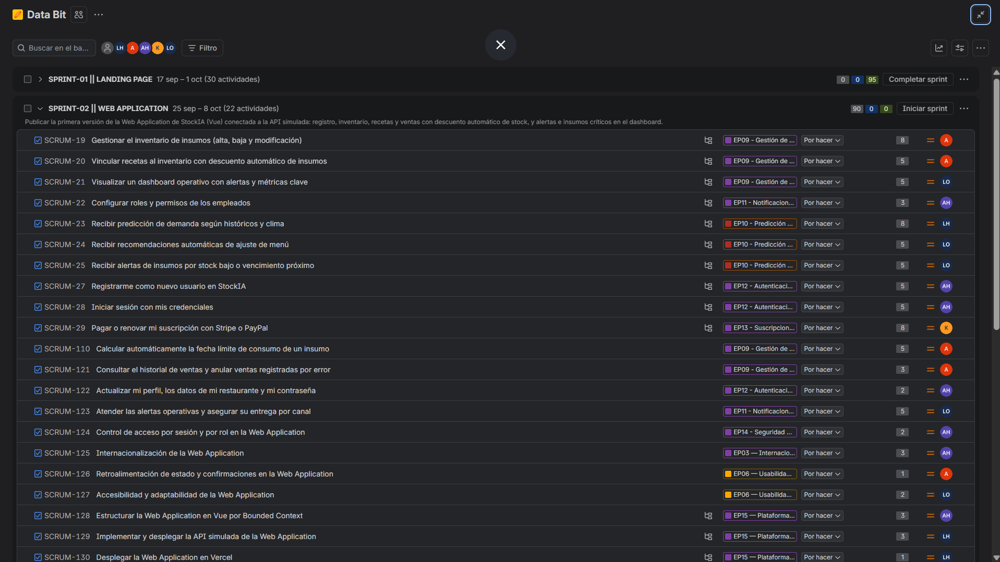
  <br/><i>Artefacto: Jira para Sprint 2 Priorizado</i>
</p>
<p align="center">
  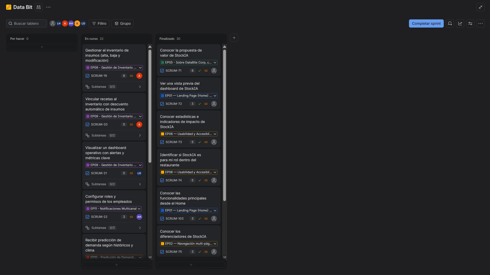
  <br/><i>Artefacto: Jira para demostrar el tablero Kanban del Sprint 2 - Proceso -</i>
</p>
<p align="center">
  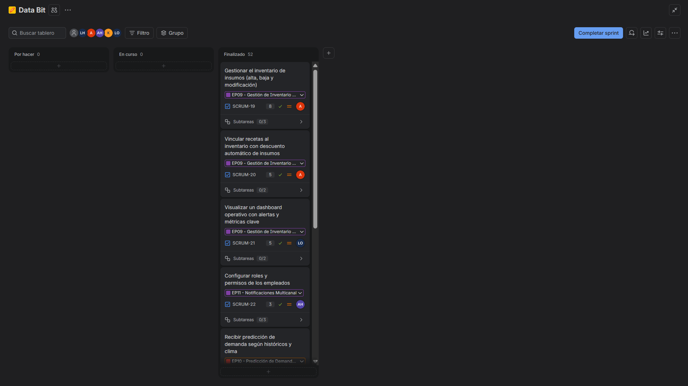
  <br/><i>Artefacto: Jira para demostrar el tablero Kanban del Sprint 2 - Finalizado -</i>
</p>

URL del tablero: https://laplaceho-22.atlassian.net/jira/software/projects/SCRUM/boards/1

##### Resumen Técnico
- **Total de horas:** 142.5 horas en 63 tareas.
- **Distribución:** dos semanas (25/09/2026 – 08/10/2026), con una disponibilidad declarada de 45 horas por integrante; la capacidad libre cubre revisiones de Pull Request, ceremonias y la documentación del informe.
- **Story Points:** 90 comprometidos; 83 completados al 08/10/2026. Quedan en curso TS03 (prueba en producción), TS04 (enlaces e idioma de la Landing Page), RNF15 (verificación por vista) y RNF16 (medición con Lighthouse), que suman 7 SP.
- **Entregable principal:** Frontend Web Application de StockIA en Vue 3 conectada a la API simulada desplegada en Render y publicada en Vercel desde el repositorio de la organización.

#### **5.2.2.4. Development Evidence for Sprint Review**
 
En esta sección se presentan los avances de implementación del Sprint 2 (Web Application y nueva versión de la Landing Page) mediante los commits que los respaldan, relacionados con el ítem del Sprint Backlog 2 que implementan.

**Distribución del código por Bounded Context**

Cada integrante implementó y subió al repositorio de la organización su Bounded Context completo, en sus cuatro capas, mediante su rama `feature/*` y su Pull Request:

| **Bounded Context (Cap. IV)** | **Responsable** | **Carpetas en la Web Application** | **Rama y Pull Request** | **Ítems del Sprint Backlog 2** |
| :--- | :--- | :--- | :--- | :--- |
| IAM y Restaurant Registration | Higa Kohatsu, Alonso Enrique | `iam`, `settings` | `feature/iam` (PR #4 y #9) | US29, US30, US40, US24, RNF13 |
| Stock Management & Recipes Management | Asmat Alminco, Martin Alejandro | `stock-management`, `receipts-management` | `feature/recipes-management` (PR #5) y `feature/stock-management` (PR #7) | US21, US36, US22, US39 |
| ML and Recommendations | Huaman Oscco, Aldo Jesus | `demand-forecasting` | `feature/demand-forecasting` (PR #6) | US25 |
| Notifications and Messaging (alertas y recomendaciones) | Ortiz Laura, Leyla Alisson | `alerts` | `feature/alerts` (PR #1 y #2) | US27, US41, US26 |
| Analytics and Dashboard | Ortiz Laura, Leyla Alisson | `dashboard` | `feature/dashboard` (PR #8) | US23 |
| Subscription and Payments Management | Tuesta Girón, Kiara Lucia | `subscription` | `feature/subscription` (PR #3) | US31 |
| Arquitectura transversal | Higa Kohatsu, Alonso Enrique / Asmat Alminco, Martin Alejandro / Ortiz Laura, Leyla Alisson | `shared`, `router.js`, `main.js`, `i18n.js`, `locales`, `server` | `develop` y `feature/main-config` (PR #10) | TS01, TS02, RNF14, RNF15, RNF16 |
| Despliegue | Huaman Oscco, Aldo Jesus | API simulada en Render y proyecto de Vercel | — | TS02, TS03 |
| Landing Page | Ortiz Laura, Leyla Alisson | repositorio `stockia-website` | `feature/about` (PR #6 y #7) y `feature/styles` (PR #8) | TS04 |

**Repositorio de la Web Application (`stockia-webapp`)**

| **Repository** | **Branch** | **Commit Id** | **Commit Message** | **Commit Message Body** | **Committed on (Date)** |
| :--- | :--- | :--- | :--- | :--- | :---: |
| stockia-webapp | main | `c6b77aa` | chore: initialize project structure | TS01: proyecto Vue 3 con Vite, PrimeVue, Pinia, vue-router, vue-i18n y la configuración de json-server (AlonsoHiga). | 28/09/2026 |
| stockia-webapp | develop | `54b5fba` | feat(develop): add json files for i18n | RNF14: archivos de traducción en inglés y español (AlonsoHiga). | 29/09/2026 |
| stockia-webapp | develop | `aa6d654` | feat(develop): add sidebar and topbar components | TS01: menú lateral y barra superior (AlonsoHiga). | 29/09/2026 |
| stockia-webapp | feature/alerts | `31551c1` | feat(alerts): add alert entity | US27 y US41: entidad `Alert` con severidad, canal y canales entregados (Leylaa-O). | 08/10/2026 |
| stockia-webapp | feature/alerts | `6c38994` | feat(alerts): add recommendation entity | US26: entidad `Recommendation` (Leylaa-O). | 08/10/2026 |
| stockia-webapp | feature/alerts | `dbb01aa` | feat(alert): add alerts store | US27 y US41: store de alertas (Leylaa-O). | 08/10/2026 |
| stockia-webapp | feature/subscription | `c7ea7e3` | feat(subscription): add plan domain entity | US31: entidad `Plan` (kitu05g). | 08/10/2026 |
| stockia-webapp | develop | `1e6998c` | Merge pull request #3 from feature/subscription | Integración revisada del contexto de suscripción en `develop` (Kiara Tuesta). | 08/10/2026 |
| stockia-webapp | feature/iam | `dd0fca1` | feat(iam): add user entity and role | US29 y US24: entidad `User` y roles Administrador y Empleado (AlonsoHiga). | 08/10/2026 |
| stockia-webapp | feature/recipes-management | `ba1ab46` | refactor(shared-domain): update business rule errors and decimal quantity value object | TS01: errores de regla de negocio y value object de cantidades (Alemarr2). | 08/10/2026 |
| stockia-webapp | feature/recipes-management | `128a0b2` | feat(receipts): initialize receipts-management bounded context | US22 y US39: contexto de ventas con su entidad, API y store (Alemarr2). | 08/10/2026 |
| stockia-webapp | feature/demand-forecasting | `b850fb0` | feat(demand-forecasting): add ForecastApi for the demand forecasts endpoint | US25: servicio de API de proyecciones (Jesus). | 08/10/2026 |
| stockia-webapp | feature/stock-management | `469be92` | feat(stock-domain): define inventory item and recipe entities with stock allocation service | US21, US36 y US22: entidades `InventoryItem` y `Recipe` y servicio de asignación de stock (Alemarr2). | 08/10/2026 |
| stockia-webapp | feature/stock-management | `d7ecf31` | feat(stock-application): implement inventory store for state management | US21: store de inventario y recetas (Alemarr2). | 08/10/2026 |
| stockia-webapp | feature/stock-management | `085cb49` | feat(stock-infra): add inventory api client and entity assemblers | US21 y US22: servicio de API y assemblers (Alemarr2). | 08/10/2026 |
| stockia-webapp | feature/stock-management | `80664e7` | feat(stock-presentation): implement inventory and recipe list views with status tag component | US21, US22 y US36: vistas de inventario y recetas con el estado de stock (Alemarr2). | 08/10/2026 |
| stockia-webapp | feature/stock-management | `b90bda6` | feat(receipts,i18n): update receipts store and add localization keys for stock management | US39 y RNF14: historial de ventas y claves de traducción (Alemarr2). | 08/10/2026 |
| stockia-webapp | feature/dashboard | `e0fa6ef` | feat(dashboard): add dashboard component | US23: dashboard con indicadores, insumos críticos, alertas recientes y última proyección (Leylaa-O). | 08/10/2026 |
| stockia-webapp | develop | `05b7726` | Merge pull request #8 from feature/dashboard | Integración revisada del dashboard en `develop` (Leyla Ortiz). | 08/10/2026 |
| stockia-webapp | feature/iam | `d404407` | feat(iam): add settings | US40: configuración de la cuenta, del restaurante y de la contraseña (AlonsoHiga). | 08/10/2026 |
| stockia-webapp | feature/main-config | `51d54bd` | feat(router): update router.js | TS01 y RNF13: rutas de todos los contextos y guard de sesión y rol (Leylaa-O). | 08/10/2026 |
| stockia-webapp | feature/main-config | `e75abed` | feat(i18n): update i18n and its locals files | RNF14: inglés por defecto y formatos de fecha y moneda (Leylaa-O). | 08/10/2026 |
| stockia-webapp | develop | `1cf756f` | Merge pull request #10 from feature/main-config | Integración revisada de la configuración principal en `develop` (Leyla Ortiz). | 08/10/2026 |

**Repositorio de la Landing Page (`stockia-website`) — TS04**

| **Repository** | **Branch** | **Commit Id** | **Commit Message** | **Commit Message Body** | **Committed on (Date)** |
| :--- | :--- | :--- | :--- | :--- | :---: |
| stockia-website | feature/about | `3e670bd` | feature(about): add team members photos | TS04: fotos de los cinco integrantes (Leylaa-O). | 07/10/2026 |
| stockia-website | feature/about | `61b1af1` | feat(about): add team members section | TS04: fichas reales del equipo en `about.html` (Leylaa-O). | 07/10/2026 |
| stockia-website | feature/styles | `7019704` | feat: update styles.css | TS04: ajustes de estilos de la Landing Page (Leylaa-O). | 07/10/2026 |
| stockia-website | feature/styles | `6ddfed8` | feat: update i18n.js | TS04: actualización de traducciones (Leylaa-O). | 07/10/2026 |
| stockia-website | develop | `1566c60` | Merge pull request #8 from feature/styles | Integración revisada de estilos y traducciones en `develop` (Leyla Ortiz). | 07/10/2026 |
| stockia-website | main | `4d8a0ee` | Merge pull request #9 from develop | Publicación de la nueva versión de la Landing Page en `main` (Aldo_Jesus). | 08/10/2026 |

**Repositorio del informe (`stockia-report`)**

| **Repository** | **Branch** | **Commit Id** | **Commit Message** | **Commit Message Body** | **Committed on (Date)** |
| :--- | :--- | :--- | :--- | :--- | :---: |
| stockia-report | feature/chapter-1 | `c494586` | docs(logs): add TB1 log section | Registro de versiones del TB1 (Leylaa-O). | 08/10/2026 |
| stockia-report | feature/chapter-1 | `d602f34` | docs(outcome): add Leyla's outcome TB1 | Student Outcome del TB1 (Leylaa-O). | 08/10/2026 |
| stockia-report | feature/chapter-3 | `a3f91c2` | revert(chapter-3): restore AV1 user stories and product backlog | Restauración de las User Stories US01–US38 y RNF01–RNF12 del AV1 (Jesusho22). | 08/10/2026 |
| stockia-report | feature/chapter-3 | `5be07d4` | docs(chapter-3): add sprint 2 user stories, technical stories and backlog | US39–US41, RNF13–RNF16, TS01–TS04 y Product Backlog ordenado por Story Points (Jesusho22). | 08/10/2026 |
| stockia-report | feature/chapter-5 | `e8c2a6f` | docs(chapter-5): add sprint 2 and align sprint 1 for TB1 | Sprint Planning, Sprint Backlog, evidencias y Team Collaboration del Sprint 2 (Jesusho22). | 08/10/2026 |

#### **5.2.2.5. Execution Evidence for Sprint Review**

En el Sprint 2 se implementó la primera versión de la Web Application de StockIA. Las capturas corresponden a la versión desplegada en [webapp-stockia.vercel.app](https://webapp-stockia.vercel.app/) (TS03), que consume la API simulada en Render (TS02). A continuación se presenta cada vista junto con la User Story o el requisito que la respalda:

1. **Registro (US29):** creación de la cuenta del restaurante con validaciones por campo y rechazo de correos duplicados; la cuenta se crea con el rol Administrador.
<p align="center">
  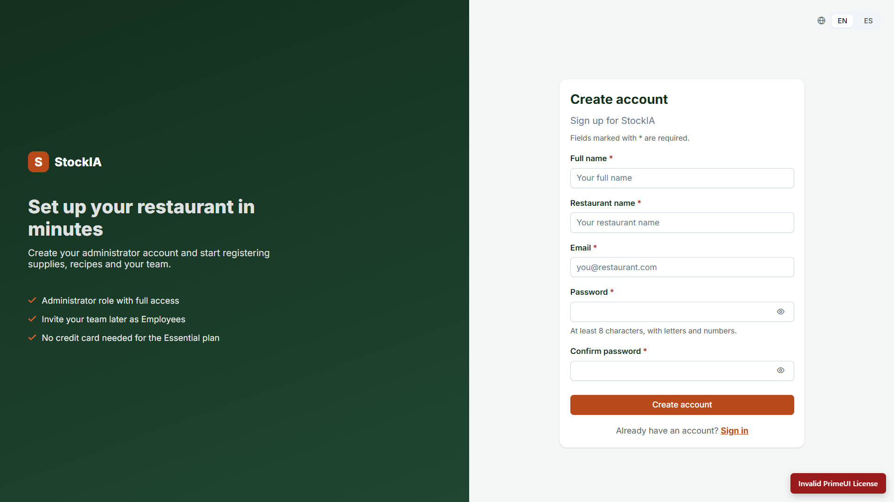
  <br/><i>Registro — US29</i>
</p>

2. **Inicio de sesión (US30, RNF13):** inicio de sesión con mensaje de credenciales incorrectas y redirección a `/auth/sign-in` al abrir una ruta interna sin sesión.
<p align="center">
  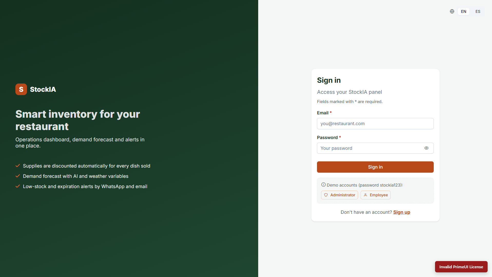
  <br/><i>Inicio de sesión — US30 y RNF13</i>
</p>

3. **Dashboard operativo (US23):** insumos registrados, en estado bajo o crítico y por vencer en 3 días o menos, valor del inventario, insumos críticos, las 5 alertas más recientes y la última proyección.
<p align="center">
  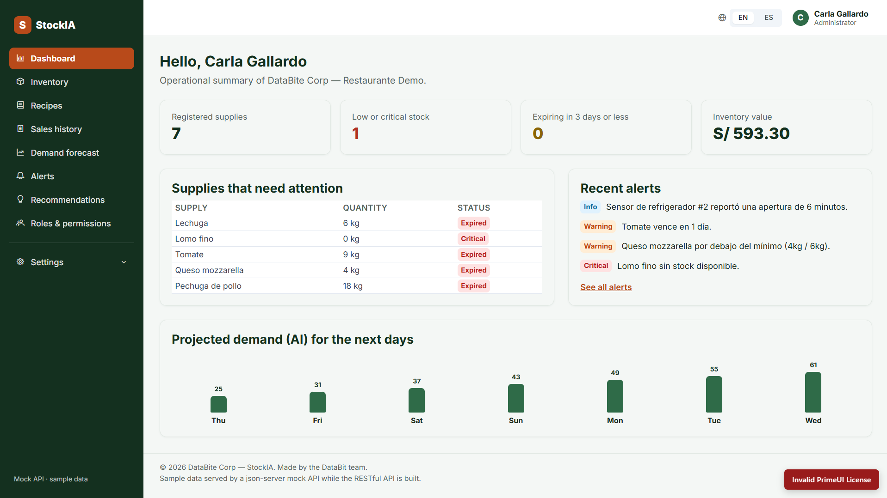
  <br/><i>Dashboard operativo — US23</i>
</p>

4. **Inventario de insumos (US21, US36):** alta, edición y eliminación confirmada de insumos, con su fecha límite de consumo y su estado Disponible, Stock bajo, Crítico o Vencido.
<p align="center">
  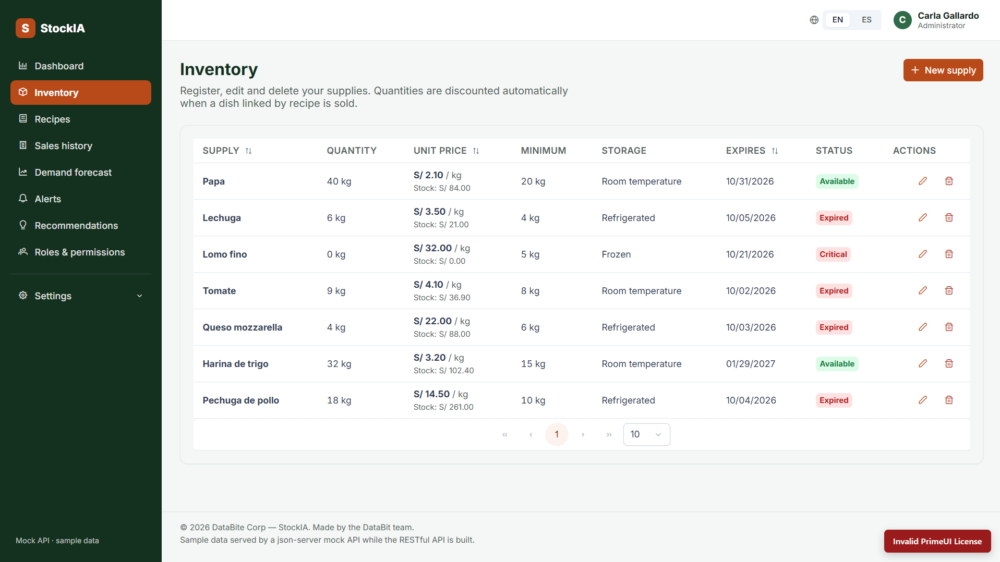
  <br/><i>Inventario de insumos — US21 y US36</i>
</p>

5. **Recetas y venta con descuento automático (US22):** recetas vinculadas a los insumos y registro de la venta de un plato que valida y descuenta el stock.
<p align="center">
  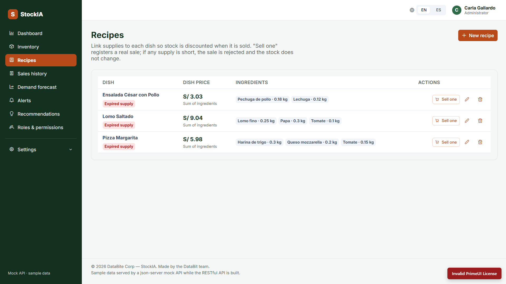
  <br/><i>Recetas y venta con descuento automático — US22</i>
</p>

6. **Historial de ventas (US39):** ventas con total en S/, estado e ingresos del período, con anulación confirmada.
<p align="center">
  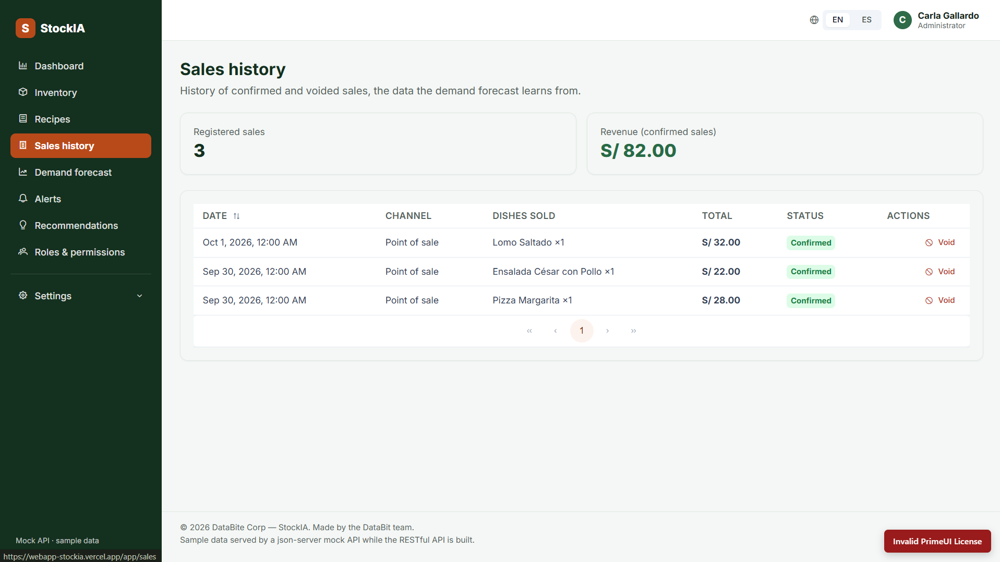
  <br/><i>Historial de ventas — US39</i>
</p>

7. **Alertas operativas (US27, US41):** alertas por severidad, contador de pendientes, entrega por canal, reintento del canal pendiente y atención.
<p align="center">
  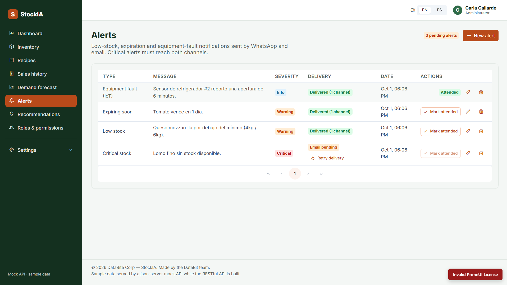
  <br/><i>Alertas operativas — US27 y US41</i>
</p>

8. **Recomendaciones (US26):** recomendaciones de compra y de menú con su impacto esperado y la acción "Aplicar".
<p align="center">
  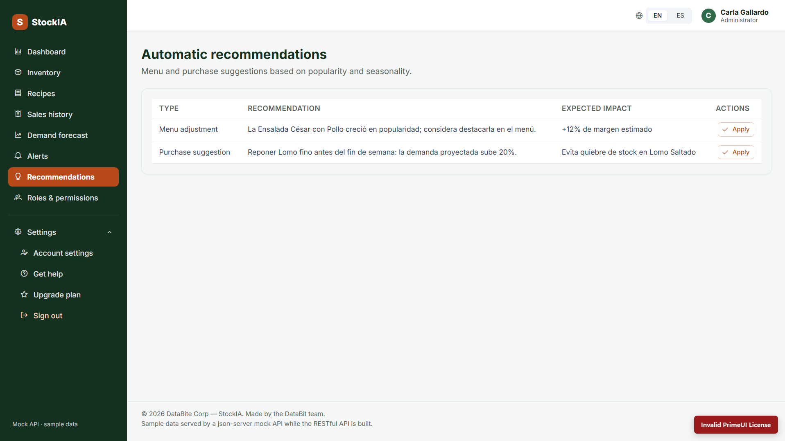
  <br/><i>Recomendaciones — US26</i>
</p>

9. **Proyección de demanda (US25):** proyección de 7 días por plato con su nivel de confianza y la condición climática.
<p align="center">
  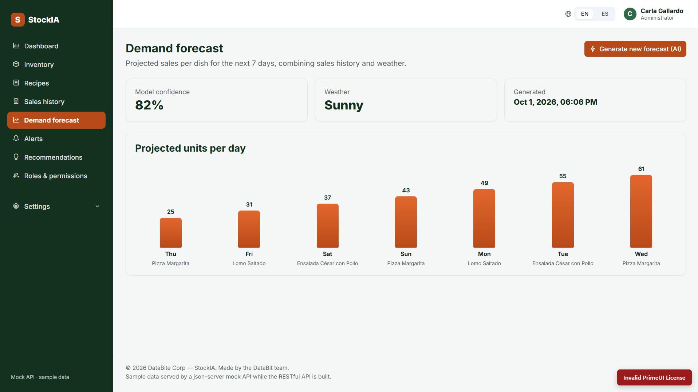
  <br/><i>Proyección de demanda — US25</i>
</p>

10. **Equipo y roles (US24, RNF13):** invitación de integrantes, cambio de rol y baja, con la regla del último administrador; vista disponible solo para el rol Administrador.
<p align="center">
  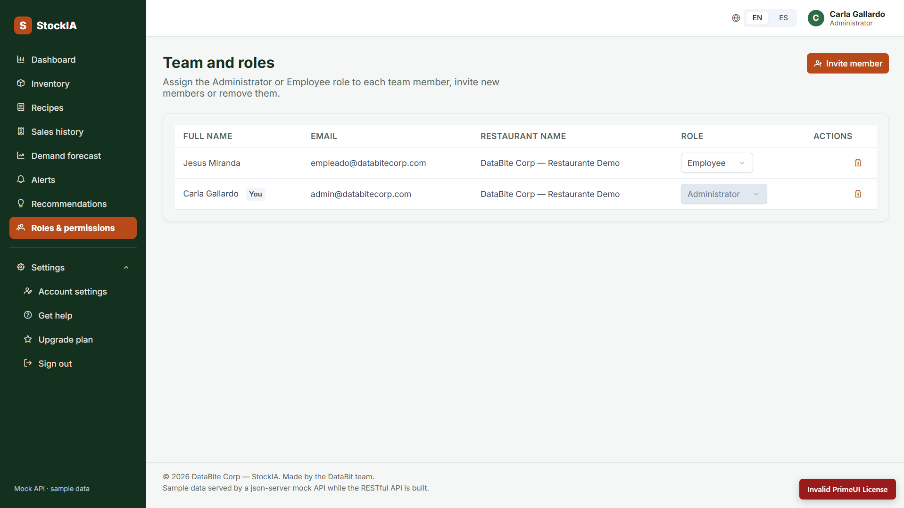
  <br/><i>Equipo y roles — US24 y RNF13</i>
</p>

11. **Configuración de la cuenta (US40):** datos personales, datos del restaurante y cambio de contraseña.
<p align="center">
  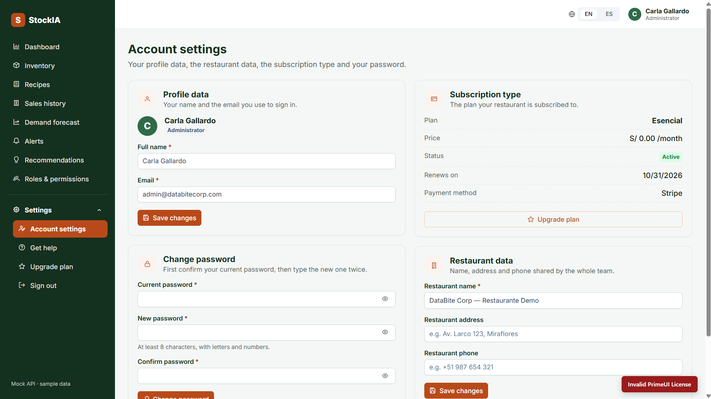
  <br/><i>Configuración de la cuenta — US40</i>
</p>

12. **Planes de suscripción (US31):** planes con su precio, plan actual y pago simulado con Stripe o PayPal.
<p align="center">
  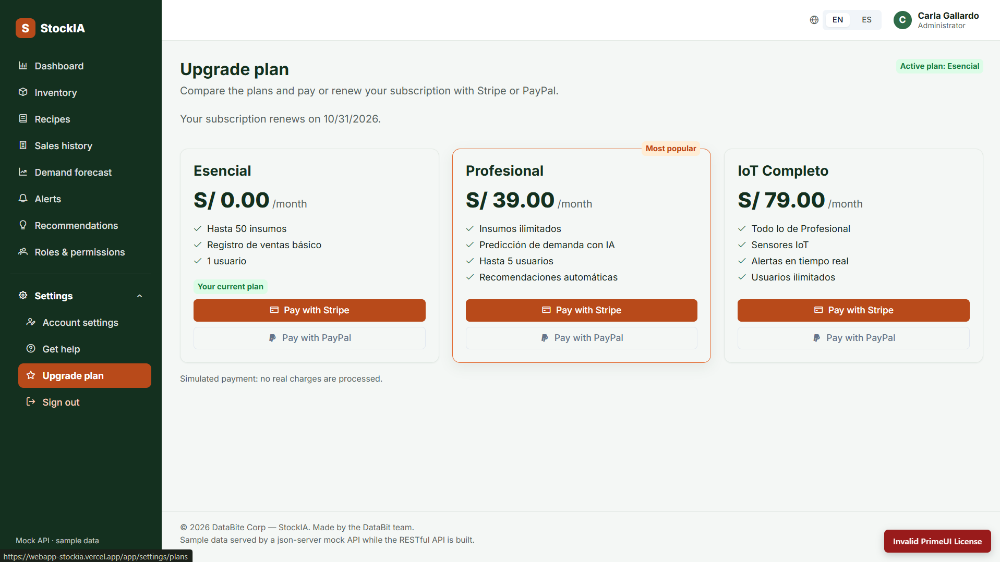
  <br/><i>Planes de suscripción — US31</i>
</p>

13. **Web Application en español y en móvil (RNF14, RNF16):** la misma vista con el idioma cambiado a español y en una pantalla de 390 px.
<p align="center">
  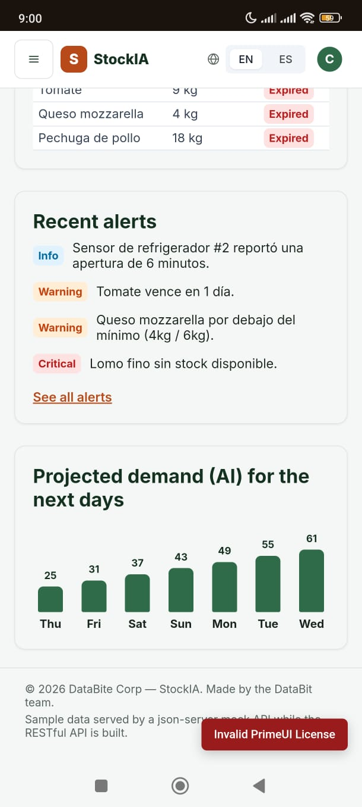
  <br/><i>Idioma y vista móvil — RNF14 y RNF16</i>
</p>

14. **Nueva versión de la Landing Page (TS04):** sección del equipo con las fichas reales de los cinco integrantes.
<p align="center">
  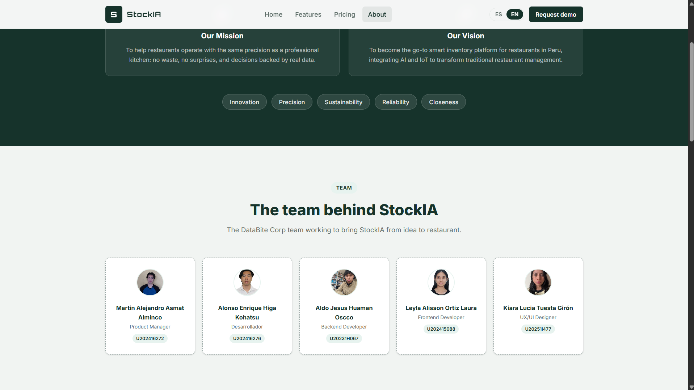
  <br/><i>Nueva versión de la Landing Page — TS04</i>
</p>

**Alcance implementado por escenario**

La Web Application consume una API simulada, por lo que los escenarios que dependen del RESTful API, del modelo de Machine Learning o de servicios externos quedan para los Sprints siguientes:

| **Ítem** | **Escenarios implementados en el Sprint 2** | **Escenarios que dependen del backend** |
| :--- | :--- | :--- |
| US25 | Visualización de la proyección de 7 días con confianza y clima (valores simulados) | Escenarios 1 a 3: cálculo a partir de históricos, feriados y aprendizaje del modelo (US37 y US38) |
| US26 | Lista de recomendaciones y acción "Aplicar" | Escenario 3: logro de gamificación |
| US24 | Escenarios 1 y 2: roles Empleado y Administrador | Escenario 3: rol especializado |
| US30 | Escenarios 1 y 2: inicio de sesión exitoso y con error | Escenario 3: recuperación de contraseña por correo |
| US31 | Escenario 1: elección del plan con pago simulado | Escenarios 2 y 3: renovación y error de transacción con la pasarela real |

**Verificación de los requisitos no funcionales**

| **RNF** | **Criterio medible** | **Verificación** | **Resultado** |
| :--- | :--- | :--- | :--- |
| RNF13 | 100 % de las rutas bajo `/app` con sesión requerida; vistas de equipo, recomendaciones y planes solo para el rol Administrador | Revisión de `router.js` y prueba de cada ruta sin sesión y con rol Empleado | El guard aplica `requiresAuth`, `adminOnly` y `guestOnly` y muestra un aviso en cada bloqueo. |
| RNF14 | 100 % de los textos en inglés al primer ingreso y cambio a español sin recargar | Recorrido de las vistas en ambos idiomas | `DEFAULT_LOCALE` es `en`; los textos viven en `en.json` y `es.json`. |
| RNF15 | 100 % de las eliminaciones y anulaciones con confirmación | Lista de verificación por vista | Inventario, recetas, alertas, equipo e historial de ventas piden confirmación. <!-- ACTUALIZAR: resultado de T-RNF15-2. --> |
| RNF16 | Botones de solo ícono con `aria-label`; sin desborde a 390 px; Lighthouse Accessibility ≥ 90 |


#### **5.2.2.6. Services Documentation Evidence for Sprint Review**
 
En el Sprint 2 la Web Application consume una API REST simulada con **json-server**, desplegada en Render bajo el prefijo `/api/v1`. Cada recurso expone las operaciones REST estándar (`GET`, `POST`, `PUT` y `DELETE`) y acepta los filtros de json-server (`?campo=valor`, `?_sort=campo&_order=asc`). La Web Application accede a ellos desde la capa `infrastructure` de cada Bounded Context mediante `BaseApi` y `BaseEndpoint`; la URL base se define en `VITE_STOCKIA_API_URL` y la ruta de cada recurso en su variable `VITE_*_ENDPOINT_PATH`, por lo que al reemplazar la API simulada por el RESTful API no cambia ningún componente de presentación.

| **Endpoint** | **Acción (HTTP)** | **Parámetros** | **Descripción del Response** | **User Story** |
| :--- | :---: | :--- | :--- | :---: |
| `/api/v1/users?email={email}` | GET | `email` | `200 OK` con los usuarios que coinciden; se usa para validar el correo duplicado y el inicio de sesión. | US29, US30, US40 |
| `/api/v1/users` | POST | `fullName`, `restaurantName`, `email`, `password`, `role` | `201 Created` con el usuario creado al registrar el restaurante o invitar a un integrante. | US29, US24 |
| `/api/v1/users/{id}` | PUT / DELETE | `id` y datos del usuario | `200 OK` con el perfil, el restaurante, la contraseña o el rol actualizados, o con la baja del integrante. | US40, US24 |
| `/api/v1/inventoryItems` y `/api/v1/inventoryItems/{id}` | GET / POST / PUT / DELETE | `name`, `unit`, `quantity`, `minThreshold`, `storageType`, `shelfLifeDays`, `expirationDate`, `unitCost` | `200 OK` o `201 Created` con el insumo; el `PUT` también registra el descuento por venta. | US21, US36, US22 |
| `/api/v1/recipes` y `/api/v1/recipes/{id}` | GET / POST / PUT / DELETE | `dishName` e ingredientes (`inventoryItemId`, `quantityRequired`, `unit`) | `200 OK` o `201 Created` con la receta y sus ingredientes. | US22 |
| `/api/v1/sales` y `/api/v1/sales/{id}` | GET / POST / PUT | `saleDate`, `channel`, `status`, `lineItems` | `201 Created` con la venta confirmada; el `PUT` con `status: "VOIDED"` la anula. | US22, US39 |
| `/api/v1/alerts` y `/api/v1/alerts/{id}` | GET / POST / PUT / DELETE | `type`, `severity`, `message`, `channel`, `acknowledged`, `deliveredChannels` | `200 OK` o `201 Created` con la alerta registrada, atendida o con su entrega actualizada. | US27, US41 |
| `/api/v1/recommendations/{id}` | GET / PUT | `applied: true` | `200 OK` con la recomendación aplicada. | US26 |
| `/api/v1/demandForecasts` | GET / POST | `generatedAt`, `confidenceScore`, `weatherCondition`, `dataPoints` | `201 Created` con la proyección de 7 días. | US25 |
| `/api/v1/plans` | GET | — | `200 OK` con los planes, su precio y sus características. | US31 |
| `/api/v1/subscriptions` y `/api/v1/subscriptions/{id}` | GET / POST / PUT | `planId`, `paymentMethod`, `status`, `renewalDate` | `201 Created` o `200 OK` con la suscripción activada o cambiada. | US31 |

**Ejemplo de interacción — consulta de insumos (US21)**

Request:

```http
GET https://stockia-mock-api.onrender.com/api/v1/inventoryItems?_limit=1
```

Response `200 OK`:

```json
[
  {
    "id": 1,
    "name": "Pechuga de pollo",
    "unit": "kg",
    "quantity": 18,
    "minThreshold": 10,
    "storageType": "REFRIGERATED",
    "shelfLifeDays": 4,
    "expirationDate": "2026-10-04",
    "unitCost": 14.5
  }
]
```

* **Repositorio de la Web Application (configuración de json-server en `src/server`):** https://github.com/upc-pre-202620-1asi0730-16127-databit/stockia-webapp
* **URL de la API simulada desplegada:** https://stockia-mock-api.onrender.com/api/v1

<p align="center">
  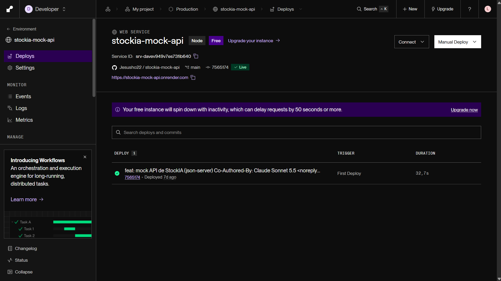
  <br/><i>Respuesta de la API simulada desplegada en Render — TS02</i>
</p>

#### **5.2.2.7. Software Deployment Evidence for Sprint Review**
 
En el Sprint 2 se desplegaron dos componentes: la API simulada en **Render** (TS06) y la Web Application en **Vercel** (TS07). Además, se planificó vincular el despliegue de la Landing Page al repositorio `stockia-website` de la organización (TS08).
 
**Actividades de despliegue realizadas**
 
1. Se publicó la API simulada en Render como servicio Node.js (`server.js` con json-server), con CORS habilitado, el prefijo `/api/v1` y el endpoint de salud `/api/v1/health`.
2. Se configuraron los entornos de Angular (`environment.ts` y `environment.prod.ts`) para que `apiBaseUrl` apunte a la API desplegada (commit `084801e`).
3. Se preparó `vercel.json` para la Web Application: `npm run build` como comando de build, `dist/stockia-webapp/browser` como carpeta de salida y una regla de reescritura a `index.html` para que las rutas internas no respondan con error 404.
4. El despliegue de producción quedó en estado **Ready** el 01/10/2026 desde la rama `main` (commit `084801e`).
5. Se verificó el inicio de sesión y la gestión de alertas contra la API desplegada (commit `084801e`); la prueba de recarga de rutas internas y redirecciones de los guards en producción corresponde a T-TS07-2.
6. La vinculación del proyecto de Vercel de la Landing Page con `stockia-website` de la organización se realiza en TS08.
* **URL de la API simulada:** https://stockia-mock-api.onrender.com/api/v1
* **URL de la Web Application desplegada:** https://stockia-platform.vercel.app
**Evidencia: API simulada en Render**
<p align="center">
  
  <br/><i>Servicio stockia-mock-api desplegado en Render</i>
</p>
**Evidencia: Web Application en Vercel**
<p align="center">
  
  <br/><i>Proyecto de la Web Application en Vercel con el historial de despliegues</i>
</p>
<p align="center">
  
  <br/><i>Web Application desplegada</i>
</p>

#### **5.2.2.8. Team Collaboration Insights during Sprint**
 
**Dinámica de trabajo**
 
En el Sprint 2 el equipo trabajó por Bounded Context: cada integrante es responsable de un contexto completo del Capítulo IV en sus cuatro capas (domain, infrastructure, application y presentation) y de su integración en la Web Application (ver 5.2.2.2 y la tabla de distribución de 5.2.2.4). Cada responsable revisa también el diagrama de clases y el diagrama C4 de su contexto para que reflejen lo implementado. Las tareas se gestionaron en Jira, en el proyecto SCRUM, con un responsable por tarea y su estado actualizado. La comunicación diaria se mantuvo por WhatsApp y las reuniones de sincronización por Google Meet. Aplicando la mejora de la retrospectiva del Sprint 1, el trabajo se integra con una rama `feature/*` por contexto o tarea, con el ID de la tarea en el mensaje de commit y con revisión por Pull Request antes de llegar a `develop`.
 
**Aporte por integrante**
 
| **Integrante** | **GitHub** | **Aporte principal en el Sprint 2** | **Horas asignadas** | **Commits en el Sprint 2** |
| :--- | :--- | :--- | :---: | :---: |
| Higa Kohatsu, Alonso Enrique | AlonsoHiga | Restaurant Registration: registro, inicio de sesión, perfil, shell con menú por rol, equipo y roles (US09, US10, US11) y control de acceso (RNF08) | 32.5 | <!-- ACTUALIZAR --> |
| Asmat Alminco, Martin Alejandro | Alemarr2 | Stock Management & Recipes Management (US12, US13, US14); inglés por defecto en la Landing Page (TS08) | 33.5 | <!-- ACTUALIZAR --> |
| Huaman Oscco, Aldo Jesus | Jesusho22 | ML and Recommendations (US18); arquitectura por Bounded Context (TS05), API simulada (TS06) y despliegue en Vercel (TS07) | 26 | <!-- ACTUALIZAR --> |
| Ortiz Laura, Leyla Alisson | Leylaa-O | Analytics and Dashboard (US16), alertas operativas (US17), historial de ventas (US15) y accesibilidad de la Web Application (RNF11) | 31 | <!-- ACTUALIZAR --> |
| Tuesta Girón, Kiara Lucia | kitu05g | Subscription and Payment Management (US19); nueva versión de la Landing Page y enlace con la Web Application (TS08); internacionalización de la Web Application (RNF10); verificación de estados y pruebas en producción (RNF09, TS07) | 30 | <!-- ACTUALIZAR --> |
 
**Evidencia: tablero del Sprint 2 en Jira**
<p align="center">
  
  <br/><i>Tablero del Sprint 2 en Jira (SCRUM)</i>
</p>
**Evidencia: contribuciones por integrante en `stockia-webapp`**
<p align="center">
  
  <br/><i>Insights → Contributors del repositorio stockia-webapp</i>
</p>
**Evidencia: grafo de GitFlow**
<p align="center">
  
  <br/><i>Insights → Network: ramas feature integradas mediante Pull Request</i>
</p>


## **5.3. Validation Interviews**
### **5.3.1. Interview Design**
### **5.3.2. Interview Recording**
### **5.3.3. Evaluations Based on Heuristics**
## **5.4. About-the-Product Video**